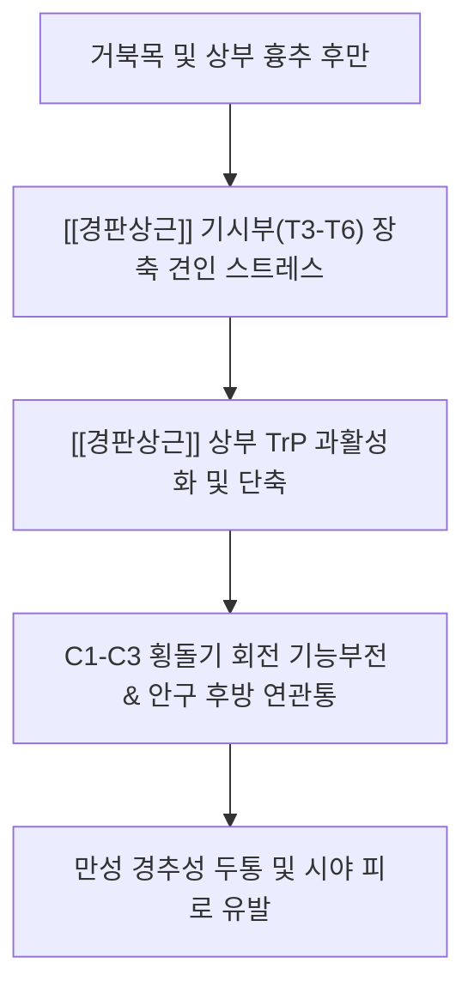
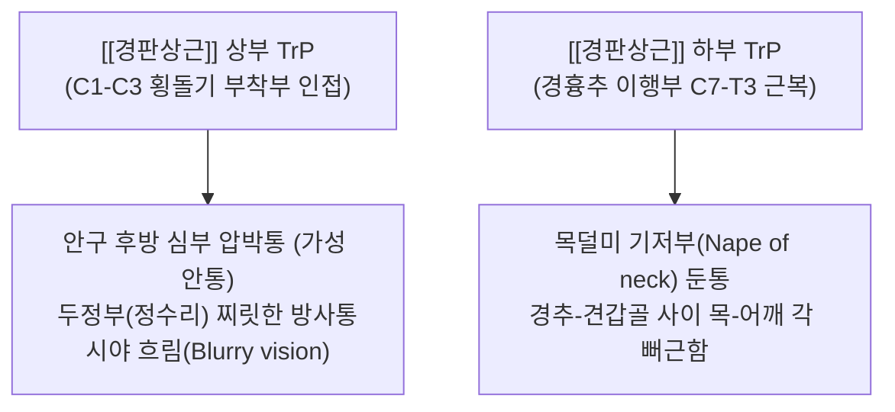

---
aliases:
  - 경판상근
  - 목판상근
  - Splenius cervicis
  - Splenius colli
---
# [[경판상근]](Splenius cervicis)

> **핵심 요약 (Key Summary)**:
> 제3~6흉추 극돌기에서 기원하여 제1~3경추 횡돌기 후결절에 사선으로 정지하는 경부 후외측의 핵심 심부 근육입니다.
> 중·하위 경신경 후지 외측가지의 지배를 받으며, 경추의 신전, 측굴 및 동측 회전을 유도하고 나선선 회전 토크를 전달합니다.
> [[경추성 두통]], 안구 심부 쑤심, 시야 흐림, 견비통, 상부교차증후군의 핵심 병변근이며, 천주·풍지·천유 및 횡돌기 부착부 침구가 표적입니다.

---
## 📌 목차
1. [해부학적 정밀 구조 및 지배 신경/혈관](#1-해부학적-정밀-구조-및-지배-신경혈관)
2. [생체역학·토크 분석 & 근막 사슬 (Biomechanical Synergy)](#2-생체역학토크-분석--근막-사슬-biomechanical-synergy)
3. [근막통증증후군(TP) & 연관통 패턴 (Travell & Simons)](#3-근막통증증후군tp--연관통-패턴-travell--simons)
4. [초음파 해부학(Sonoanatomy) 및 중재 시술 랜드마크](#4-초음파-해부학sonoanatomy-및-중재-시술-랜드마크)
5. [⭐ 원장님 심층 임상 고찰 및 원본 필기 (Clinical Pearls)](#5-원장님-심층-임상-고찰-및-원본-필기-clinical-pearls)
6. [관련 임상 질환 및 운동손상 증후군 총괄](#6-관련-임상-질환-및-운동손상-증후군-총괄)
7. [추나·도수치료(MET/PIR) & 침구·약침·재활 프로토콜](#7-추나도수치료metpir--침구약침재활-프로토콜)
8. [출처 및 학술 참고 문헌 (References)](#8-출처-및-학술-참고-문헌-references)

---
## 1. 해부학적 정밀 구조 및 지배 신경/혈관

| 항목 | 상세 내용 |
| :--- | :--- |
| **기시 (Origin)** | 제3~6흉추(T3~T6) 극돌기(Spinous processes) 및 극간인대 |
| **정지 (Insertion)** | 제1~3경추(C1~C3, 환추·축추·C3) 횡돌기 후결절(Posterior tubercles of transverse processes) |
| **신경 지배** | 경신경 후지 외측가지 ([[경신경후지]], C3~C5 dorsal rami, lateral branches) |
| **혈관 공급** | 후두동맥(Occipital A.) 하행지, 경횡동맥(Transverse cervical A.) 심지, 심경동맥(Deep cervical A.) |

### 🔬 해부학 도해 및 단면도
![[Splenius_cervicis_muscle_back.png|450]]
> [Wikipedia 공중도메인 해부학 도해]: 흉추 극돌기에서 시작하여 상위 경추 횡돌기 후결절로 비스듬히 상외측 주행하는 [[경판상근]]의 정밀 주행 경로.

---
## 2. 생체역학·토크 분석 & 근막 사슬 (Biomechanical Synergy)

* **양측 수축 (Bilateral Action)**:
  * 경추의 신전(Extension)을 보조하고, 두경부 굴곡 시 편심성 감속(Eccentric braking)을 담당하여 경추 전만 커브를 보존.
* **일측 수축 (Unilateral Action)**:
  * 경추의 동측 회전(Ipsilateral rotation) 및 동측 측굴(Ipsilateral lateral flexion)을 주도.
  * 대측 [[흉쇄유돌근]](SCM) 및 동측 [[두판상근]], [[견갑거근]]과 협력하여 경부 회전의 강력한 짝힘(Force couple) 생성.
* **근막 사슬 연계 (Anatomy Trains)**:
  * **나선선(Spiral Line, SL)**: 후두골/경추부 → [[두판상근]] & [[경판상근]] → 대측 [[능형근]] → 대측 [[전거근]] → 외복사근으로 교차 전달되는 흉경부 회전 근막 슬링의 중추.
  * **표재후방선(Superficial Back Line, SBL)**: 척추기립근 상단부와 항인대 심층에서 두경부 후방 시상면 텐던 장력을 조율.

---
## 3. 근막통증증후군(TP) & 연관통 패턴 (Travell & Simons)

![[Splenius_cervicis_TriggerPoints.jpg|450]]
> [Travell & Simons 발통점 지도]: [[경판상근]] 상부 TrP의 안구 후방(눈골 속) 쑤심과 두정부 통증, 하부 TrP의 목덜미 기저부 및 어깨 방사통 패턴.

* **상부 발통점 (Upper TrP, C1~C3 횡돌기 부착부 직하방)**:
  * **안구 후방 통증 (Retro-orbital Pain)**: "눈알 뒤가 빠질 것처럼 쑤신다", "눈골 속이 아프다"고 호소하는 심부 안와 통증의 최다 원인.
  * **두정부 방사통**: 두개골 내부를 꿰뚫듯이 정수리(두정부)로 방사되는 욱신거리는 통증.
  * **자율신경계 연관 증상**: 동측 시야 흐림(Blurry vision), 결막 충혈, 눈 피로감 동반.
* **하부 발통점 (Lower TrP, 목덜미 기저부 및 C7~T3 근복)**:
  * 목과 어깨가 만나는 각 부위(Nape of neck)와 견갑거근 주행선 안쪽으로 지속적인 결림과 무거운 둔통 방사.

---
## 4. 초음파 해부학(Sonoanatomy) 및 중재 시술 랜드마크

* **초음파 스캔 프로토콜**:
  * **프로브 위치**: C2-C4 레벨 후경부에서 횡단면(Transverse view) 또는 사선 시상면(Oblique sagittal view)으로 거치.
  * **층별 구조 확인 (Superficial → Deep)**:
    1. 최표층: [[승모근]](Trapezius)의 얇은 근막층.
    2. 제2층: [[두판상근]](Splenius capitis) 및 [[견갑거근]](Levator scapulae).
    3. 제3층: [[경판상근]] (Splenius cervicis) → 횡돌기 후결절을 향해 전외측으로 주행하는 방추형 에코 근복 동정.
    4. 제4층(심층): [[두반극근]](Semispinalis capitis) 및 경반극근/경최장근.
* **안전 마진 및 시술 랜드마크**:
  * [[추골동맥]](Vertebral artery) 및 경신경근 보호: C1~C3 횡돌기 부착부 자침 또는 도침 시술 시, 반드시 횡돌기 후결절 골면(Posterior tubercle)에 접촉(Bone touch)시켜 횡돌기간 사이(Intertransverse space) 및 전방으로 침향이 전위되지 않도록 안전 각도 유지.

---
## 5. ⭐ 원장님 심층 임상 고찰 및 원본 필기 (Clinical Pearls)

### 1) 견갑거근 및 상부승모근과의 협동과 감별 (원장님 필기 100% 보존)
* 목을 돌리며 뒤로 젖힐 때 [[견갑거근]], [[상부승모근]], [[경판상근]]의 동반 과사용이 호발합니다.
* **임상 감별 포인트**:
  * [[견갑거근]] 단축은 목을 **반대측으로 회전**할 때 견갑골 상각(Superior angle) 부위의 찢어지는 듯한 제한이 나타납니다.
  * 반면 [[경판상근]] 손상은 목을 **동측으로 회전하거나 신전**할 때 경추 측면 깊은 곳의 뻐근함과 함께 **눈 뒤쪽으로 찌릿한 방사통**이 유발됩니다.

### 2) 눈 뒤쪽 연관통과 편두통 감별 (원장님 필기 100% 보존)
* [[편두통]] 또는 [[군발두통]] 환자 진료 시 [[경판상근]] TrP 감별은 필수입니다.
* 안과 검사상 안압이나 각막에 이상이 없는데도 "눈알이 빠질 듯이 아프고 침침하다"고 호소하는 환자의 80% 이상은 C1-C3 횡돌기 부착부 [[경판상근]] 상부 TrP의 방사통입니다.
* **신경학적 수렴 기전**: C2/C3 경신경 후지의 유해 자극이 뇌간의 [[삼차신경]]-경수복합체(Trigeminocervical complex, TCC)에 수렴되어, 삼차신경 안신경(V1 branch) 지배 영역인 안구 심부로 통증이 착각 투사되는 현상입니다.

### 3) 흉추 기시부(T3-T6) 엔테소파시(Enthesopathy) 관리
* 컴퓨터 작업이나 스마트폰 사용으로 인한 흉추 후만(Thoracic kyphosis) 환자는 T3-T6 극돌기 부착부에서 만성 견인성 손상이 누적됩니다.
* 목 치료 시 경추부만 볼 것이 아니라, 흉추 극돌기 외측연 기시부에 도침 박리술 및 심부 약침을 시술해야 재발성 두통의 고리가 끊어집니다.

---
## 6. 관련 임상 질환 및 운동손상 증후군 총괄

| 임상 질환 / 증후군 | 병리적 연관 기전 | 주요 증상 및 이학적 검사 | 핵심 교정 타깃 |
| :--- | :--- | :--- | :--- |
| [[경추성 두통]] | 상부 TrP 과활성화로 인한 TCC 자극 | 동측 두정부 욱신거림, 안구 후방 통증 | 횡돌기 후결절 및 풍지 도침 |
| [[경추성 안정피로]] | [[경판상근]] 긴장으로 인한 안구 연관통 | 침침함, 눈부심, 독서 시 집중력 저하 | 상부 [[경판상근]] 발통점 소염약침 |
| [[경부 회전 장애]] | [[경판상근]] 일측 경축 및 섬유화 | 고개 동측 회전 시 극심한 통증과 가동 제한 | [[경판상근]] PIR 및 C-spine MET |
| [[상부교차증후군]] | 흉추 후만으로 인한 기시부 견인 손상 | 거북목, 어깨 말림, 목덜미 기저부 둔통 | T3-T6 기시부 이완 및 흉추 신전 추나 |
| [[편타 손상]] | 급격한 가감속으로 인한 사선 근막 파열 | 후경부 전반의 압통, 경부 회전 가동역 소실 | 중성어혈약침 및 경추부 안정화 추나 |

---
## 7. 추나·도수치료(MET/PIR) & 침구·약침·재활 프로토콜

* **한의학 경혈 매핑**:
  * 천주, 풍지, 천유, 견외유, 대저, 신주
* **침구 및 침도(도침) 프로토콜**:
  * **C1~C3 횡돌기 후결절 부착부**: 0.40x40mm 침도를 사용하여 후결절 골면에 Bone touch 후, 인접 신경혈관을 회피하며 근막 유착을 1~2회 가볍게 절개 박리.
  * **T3~T6 극돌기 기시부**: 흉추 극돌기 외측 1~1.5cm 부위에서 늑골 골막 방향으로 사자하여 기시부 긴장 탕전 박리.
* **약침 처방**:
  * **중성어혈약침**: 급성 경항통, 외상성 경부 염좌, 국소 어혈성 압통 시 C1-C3 횡돌기 및 기시부에 0.5~1.0cc 주입.
  * **소염약침 / 황련해독탕약침**: 안구 충혈, 찌르는 듯한 두정부 열감성 두통 동반 시 상부 TrP 주입.
  * **자하거약침 / 녹용약침**: 만성 퇴행성 경추증, 거북목 환자의 허혈성 근건 복합체 영양 공급.
* **근에너지기법 (MET / PIR) 프로토콜**:
  * **자세**: 환자 앙와위(Supine), 시술자는 환자의 경추를 부드럽게 반대측 굴곡, 반대측 측굴, 반대측 회전하여 경판상근을 예비 신장.
  * **수축**: 환자에게 "고개를 제 손 저항 방향(동측 회전 및 신전)으로 약 20%의 힘으로 부드럽게 미세요" 지시 후 5~7초간 등척성 수축 유지.
  * **이완**: 호기(Exhalation)와 함께 완전히 힘을 빼게 한 후, 새로운 장벽(New barrier)까지 부드럽게 10~15초간 신장 유지 (3~5회 반복).

---
## 8. 출처 및 학술 참고 문헌 (References)

1. **Standring, S. (2020)**. *Gray's Anatomy: The Anatomical Basis of Clinical Practice* (42nd ed.). Elsevier, pp. 784-786.
   - **[연구 요약]**: 경판상근의 흉추 극돌기 기시 및 C1~C3 횡돌기 후결절 정지 구조, 경신경 후지 외측가지 주행 분석.
2. **Travell, J. G., & Simons, D. G. (1999)**. *Myofascial Pain and Dysfunction: The Trigger Point Manual*, Vol. 1 (2nd ed.). Williams & Wilkins, pp. 432-446.
   - **[연구 요약]**: [[경판상근]] 상부 TrP의 안구 후방 연관통 및 시야 흐림, 하부 TrP의 목-어깨 각 방사통 패턴 규명.
3. **Bogduk, N., & Govind, J. (2009)**. Cervicogenic headache: an assessment of the evidence on clinical diagnosis, invasive tests, and treatment. *Lancet Neurol*, 8(10), 959-968. [PMID: 19747657](https://pubmed.ncbi.nlm.nih.gov/19747657/)
   - **[연구 요약]**:  C1~C3 구심성 신호의 삼차신경경추핵(TCC) 수렴 등 경추성 두통의 신경해부학적 기전과 진단·치료 근거를 평가.
4. **Myers, T. W. (2020)**. *Anatomy Trains: Myofascial Meridians for Manual and Movement Therapists* (4th ed.). Elsevier.
   - **[연구 요약]**: 나선선(Spiral Line) 내 [[판상근]]-능형근-전거근 회전 근막 슬링의 장력 전달 체계 분석.