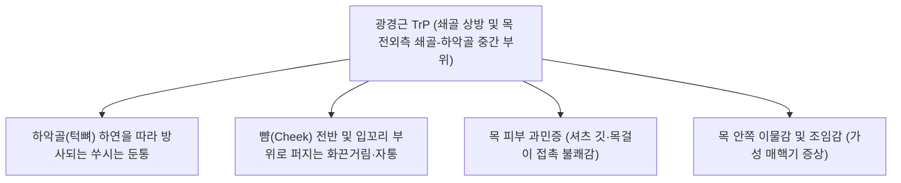

---
aliases:
  - 광경근
  - 넓은목근
  - Platysma
  - Platysma muscle
tags:
  - 근육
  - 경부
  - 안면부
  - 표정근
  - 안면신경
  - 근막통증증후군
---

# [[광경근]](Platysma)

> **핵심 요약 (Key Summary)**:
> 쇄골 하방 대흉근 및 삼각근 상부 근막에서 기원하여 경부 전면을 넓게 덮고 하악골 하연과 안면 표재근건막계(SMAS)에 정지하는 가장 얕은 층의 판상 표재성 근육입니다.
> [[안면신경]](Facial nerve, CN VII) 경부가지의 지배를 받으며, 하악골 하강 보조, 구각 하인(우울·공포 표정) 및 경부 피부 긴장과 표재 정맥 환류를 보조합니다.
> 목 이물감([[매핵기]]), 피부 과민증, 칠면조 목 변형(Platysmal band), 거북목에 따른 이중턱 하수의 핵심 표적근이며, 인영·수돌·결분혈 표재 자침 및 근막 이완 추나가 적용됩니다.

---

## 📌 목차
1. [해부학적 정밀 구조 및 지배 신경/혈관](#1-해부학적-정밀-구조-및-지배-신경혈관)
2. [생체역학·토크 분석 & 근막 사슬 (Biomechanical Synergy)](#2-생체역학토크-분석--근막-사슬-biomechanical-synergy)
3. [근막통증증후군(TP) & 연관통 패턴 (Travell & Simons)](#3-근막통증증후군tp--연관통-패턴-travell--simons)
4. [초음파 해부학(Sonoanatomy) 및 중재 시술 랜드마크](#4-초음파-해부학sonoanatomy-및-중재-시술-랜드마크)
5. [⭐ 원장님 심층 임상 고찰 및 원본 필기 (Clinical Pearls)](#5-원장님-심층-임상-고찰-및-원본-필기-clinical-pearls)
6. [관련 임상 질환 및 운동손상 증후군 총괄](#6-관련-임상-질환-및-운동손상-증후군-총괄)
7. [추나·도수치료(MET/PIR) & 침구·약침·재활 프로토콜](#7-추나도수치료metpir--침구약침재활-프로토콜)
8. [출처 및 학술 참고 문헌 (References)](#8-출처-및-학술-참고-문헌-references)

---

## 1. 해부학적 정밀 구조 및 지배 신경/혈관

| 항목 | 상세 내용 |
| :--- | :--- |
| **기시 (Origin)** | 쇄골(Clavicle) 및 제2늑골 수준의 [[대흉근]](Pectoralis major)과 [[삼각근]](Deltoid) 상부를 덮는 심부근막(Pectoral & Deltoid fascia) |
| **정지 (Insertion)** | • 하악골(Mandible) 하연 전방부 • 구각부(Corner of mouth) 피부 및 피하조직 • 하안면 표정근([[구각하체근]], [[소근]], [[구륜근]]) 및 안면 표재근건막계(SMAS)와 융합 |
| **신경 지배** | [[안면신경]](Facial nerve, CN VII)의 경부가지(Cervical branch) |
| **감각 신경** | [[경신경총]](Cervical plexus)의 횡경신경(Transverse cervical nerve, C2-C3)이 광경근 심층을 관통하여 상하 피부 감각을 지배 |
| **혈관 공급** | 안면동맥(Facial artery)의 턱밑가지(Submental artery) 및 쇄골상동맥(Suprascapular artery) |

### 🔬 해부학 도해 및 주행 경로

> [Sobotta 해부도]: 쇄골 하방 흉부 근막에서 시작하여 목 전체를 얇은 앞치마처럼 둘러싸고 턱과 입꼬리로 이어지는 광경근(Platysma)의 광범위한 표재성 주행 구조.

---

## 2. 생체역학·토크 분석 & 근막 사슬 (Biomechanical Synergy)

### 2.1 주요 운동 기능 (Motor Function)
* **하악골 하강 및 개구 보조 (Depression of Mandible)**:
  * 머리가 고정된 상태에서 수축 시 턱을 아래로 당겨 입을 벌리는 동작을 보조.
* **구각 하인 및 외측 견인 (Depression of Angle of Mouth)**:
  * 입꼬리를 아래와 바깥쪽으로 끌어내려 놀람(Surprise), 공포(Horror), 고통, 혐오의 표정을 형성.
* **경부 표재 피부 긴장 (Tensing Neck Skin)**:
  * 강하게 수축할 때 목 앞쪽 피부를 들어 올리며 수직 주름(Platysmal bands)을 형성하고, 심부의 외경정맥(External jugular vein)이 외부 압박을 받지 않도록 보호하여 뇌와 두경부 정맥 환류를 보조.

### 2.2 근막 사슬 (Anatomy Trains)
* **표재전방선 (Superficial Front Line, SFL)의 경부 종착부**:
  * 전경골근 $\rightarrow$ 대퇴직근 $\rightarrow$ 복직근 $\rightarrow$ 흉골근/대흉근막 $\rightarrow$ **광경근** $\rightarrow$ 두개골/안면 SMAS 근막으로 이어짐.
* **라운드숄더와 광경근의 연쇄 단축**:
  * [[거북목 증후군]] 및 흉추 후만(Round shoulder) 체형에서는 대흉근막이 아래로 처지며 광경근을 지속적으로 하방 견인함.
  * 이로 인해 턱밑 연부조직이 아래로 당겨져 이중턱(Double chin)이 형성되고 목 앞쪽 근막의 만성 긴장이 유발됨.

---

## 3. 근막통증증후군(TP) & 연관통 패턴 (Travell & Simons)

> [Travell & Simons 발통점 지도]: 쇄골 상방 및 흉쇄유돌근 전연의 광경근 압통점(X)에서 방사되는 하악골 하연, 턱 끝 및 뺨 전반의 쑤시는 듯한 연관통 패턴.

### 3.1 발통점(TrP) 위치 및 촉진 기법
* **촉진법 (Pincer Palpation)**:
  * 광경근은 매우 얇고 피하지방 바로 아래 위치하므로, 평면 압박(Flat palpation)으로는 심층의 [[흉쇄유돌근]]이나 설골하근군과 구별하기 어려움.
  * 엄지와 검지로 목 피부를 얕게 집어 올리는 **핀치 촉진(집기 촉진)**을 통해 얇은 근섬유 띠 내의 결절(Taut band)을 확인해야 함.

### 3.2 임상 증상 및 자율신경 이상 반응
* **피부 지각 과민 (Cutaneous Hyperesthesia)**:
  * 환자가 넥타이, 와이셔츠 깃, 터틀넥 스웨터, 목걸이가 목에 닿는 것을 극도로 견디지 못하고 답답해함.
* **가성 [[매핵기]](목 이물감)**:
  * 광경근의 국소 연축 및 긴장은 심부 경부 근막을 압박하여 침을 삼킬 때 목 안에 가시가 걸린 듯한 이물감과 인후부 긴박감을 유발.

---

## 4. 초음파 해부학(Sonoanatomy) 및 중재 시술 랜드마크

* **초음파 영상 소견**:
  * 피하지방층 바로 아래에 0.5~1.5mm 두께의 얇은 저에코 띠(Hypoechoic band)로 관찰됨.
  * 광경근의 바로 아래 층에는 고에코의 심경근막(Deep cervical fascia) 천층과 [[흉쇄유돌근]](SCM)의 두꺼운 근복, 그리고 외경정맥(EJV)의 단면이 확인됨.
* **중재 시술 안전 랜드마크**:
  * **외경정맥(External Jugular Vein, EJV)**: 광경근 심층을 비스듬히 교차 주행하므로 도플러 초음파로 혈관 주행을 확인하고 혈관 천자를 회피해야 함.
  * **자침 깊이 제한 (Strict Depth Control)**: 광경근 시술은 2~3mm 이내의 극히 얕은 사자(Oblique needling) 또는 횡자(Subcutaneous skimming)로 진행해야 심층의 경동맥초(Carotid sheath)나 횡경신경 손상을 원천 예방할 수 있음.

---

## 5. ⭐ 원장님 심층 임상 고찰 및 원본 필기 (Clinical Pearls)

### 1) 역류성 식도염으로 오진되는 '근막성 매핵기' 감별
* 내시경 상 식도염이나 인후두염 소견이 전혀 없는데도 만성적인 목 조임감과 이물감을 호소하는 환자의 상당수는 광경근과 [[흉쇄유돌근]] 표층 근막 유착이 원인임.
* 인영(ST9), 기사(ST11), 천돌(CV22) 부위에서 광경근을 피부와 함께 가볍게 집어 올려 롤링(Skin rolling) 마사지를 해주면 목구멍이 뻥 뚫리는 즉각적인 감압 효과를 보임.

### 2) 거북목 증후군과 칠면조 목(Turkey Neck)·이중턱 리프팅
* 노화와 함께 광경근의 안쪽 경계가 벌어지거나 과긴장되면 목 중앙에 세로로 2개의 굵은 띠가 튀어나오는 칠면조 목 밴드(Platysmal band)가 형성됨.
* 이는 턱을 앞으로 내미는 [[거북목 증후군]] 및 흉곽 하강 체형에서 광경근에 지속적인 편심성 인장 스트레스가 가해진 결과임.
* 쇄골부 부착부(대흉근 상연)와 하악골 하연의 근막 부착부를 도침이나 매선으로 자극하여 장력을 리셋하면 칠면조 목 밴드와 이중턱이 획기적으로 개선됨.

### 3) 안면마비(구안와사) 후유증 연합운동(Synkinesis)의 감별
* [[안면신경마비]] 회복기에 신경의 미세 축삭이 오작동하여 입을 움직이거나 눈을 깜빡일 때 목 피부가 함께 움찔거리는 광경근 연합운동이 다발함.
* 이때 광경근의 운동점(Motor point)인 하악각 하방 2cm 지점에 미세 침 치료 및 매선/보톡스 타깃 이완을 시행하여 이상 연합 반응을 차단함.

---

## 6. 관련 임상 질환 및 운동손상 증후군 총괄

| 임상 질환 / 증후군 | 병리적 연관 기전 | 주요 증상 및 임상 양상 | 핵심 치료 타깃 |
| :--- | :--- | :--- | :--- |
| **[[매핵기]] (목 이물감 증후군)** | 광경근 및 경부 표재근막 과긴장 | 침 삼킴 곤란, 목 조임, 가슴 답답함 | 인영·기사·수돌 표재 침구 및 근막 이완 |
| **칠면조 목 밴드 (Platysmal Band)** | 광경근 내측 섬유 이개 및 비후 연축 | 목 전면에 세로로 굵은 두 줄기 주름 돌출 | 하악 하연 및 쇄골 부착부 도침술, 매선 |
| **[[근막통증증후군]] (경부 MPS)** | 만성 스트레스, 목 과신전 긴장 | 턱뼈 하연 둔통, 뺨 화끈거림, 셔츠 깃 불쾌감 | 광경근 핀치 발통점 소침술 |
| **안면 연합운동 (Synkinesis)** | 안면신경 손상 후 비정상적 신경 재지배 | 눈 깜빡일 때 목 밴드 수축, 개구 시 목 당김 | 안면신경 경부가지 운동점 약침 이완 |
| **이중턱 및 안면 하수** | 대흉근막 단축에 따른 광경근 하방 견인 | 턱밑 연부조직 처짐, 안면 윤곽 무너짐 | 흉곽-쇄골-광경근 근막 사슬 신장 추나 |

---

## 7. 추나·도수치료(MET/PIR) & 침구·약침·재활 프로토콜

### 7.1 한의학 경혈 매핑
* **주요 치료 혈자리**: 인영(ST9), 수돌(ST10), 기사(ST11), 결분(ST12), 천돌(CV22), 염천(CV23), 예풍(TE17) 하방.

### 7.2 침구 및 약침 시술 프로토콜
* **표재 횡자 자침 (Superficial Subcutaneous Needling)**:
  * 0.20×30mm 또는 0.25×30mm 호침을 사용하여 피부를 15~20도 각도로 비스듬히 진입(횡자/사자).
  * 피부 바로 아래 피하조직과 광경근 사이 결합조직을 따라 5~10mm 진침하여 득기감을 유도함.
* **약침 주입**:
  * 신바로약침 또는 중성어혈약침 0.2~0.3cc를 쇄골 상방 광경근 부착부 3~4개 포인트에 피내(Intradermal) 및 피하(Subcutaneous) 팽진(Wheal) 형태로 얕게 주입하여 만성 무균성 근막 유착을 분리.
* **매선요법 (Polydioxanone Thread)**:
  * 하악골 하연에서 쇄골 방향으로 모노 매선(29G 38mm)을 피하층에 자입하여 느슨해진 광경근의 장력을 회복시키고 경부 주름 및 안면 하수를 리프팅.

### 7.3 추나 도수치료 (MET & 근막 이완)
* **광경근 근막 신장 테크닉 (Fascial Release Technique)**:
  1. 환자는 앙와위로 눕고, 치료사는 한 손으로 환자의 쇄골 및 흉골 상부를 아래 방향으로 단단히 고정(Pinning).
  2. 치료사의 다른 손으로 환자의 하악골을 받쳐 목을 부드럽게 신전(Extension)시키고, 머리를 반대쪽으로 회전(Rotation) 및 측굴(Lateral Flexion)시킴.
  3. 환자에게 "턱을 아래로 살짝 당겨 입술을 삐죽 내밀어보세요"라며 20%의 약한 힘으로 5초간 등척성 수축을 유도한 뒤, 숨을 내쉴 때 쇄골을 더 아래로 밀고 턱을 들어 올려 근막을 최대로 신장(PIR/MET)시킴.

---

## 8. 출처 및 학술 참고 문헌 (References)

* **Travell JG, Simons DG.** (1999). *Myofascial Pain and Dysfunction: The Trigger Point Manual. Vol 1. Upper Half of Body.* **Williams & Wilkins**, Baltimore: 432-440.
  * `[연구 요약]`: 광경근의 해부학적 특성과 쇄골 상방 발통점에서 기원하는 하악골 하연 및 뺨 부위의 전형적 연관통 패턴, 촉진 시 집기(Pincer) 기법의 임상적 표준을 확립한 원전.
* **Standring S.** (2020). *Gray's Anatomy: The Anatomical Basis of Clinical Practice.* 42nd ed. **Elsevier**, London: 541-543.
  * `[연구 요약]`: 광경근의 발생학적 기원(제2인두궁), 안면신경 경부가지 지배, 안면 표재근건막계(SMAS)와의 유기적 해부학적 연속성을 상세히 규명.
* **de Almeida ART, et al.** (2017). *The Platysma Muscle: Anatomic Review and Clinical Implications in Aesthetic Medicine.* **Dermatol Surg**, 43(8): 1007-1014.
  * DOI: [10.1097/DSS.0000000000001150](https://doi.org/10.1097/DSS.0000000000001150) | PubMed: [PMID: 28437322](https://pubmed.ncbi.nlm.nih.gov/28437322/)
  * `[연구 요약]`: 광경근의 해부학적 변이(내측 섬유의 교차 형태)와 칠면조 목 밴드 발생 기전을 분석하고, 비수술적 표재 이완 시술의 임상적 효과를 입증.
