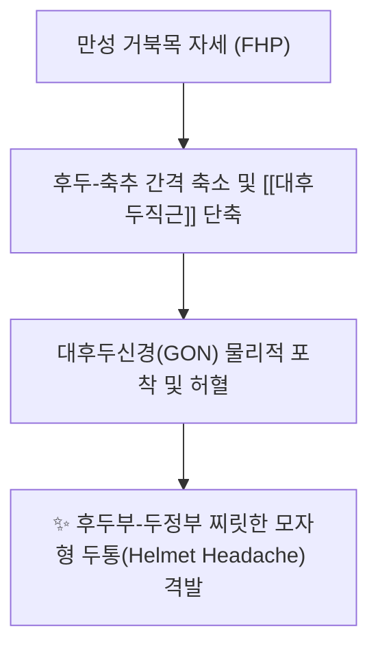
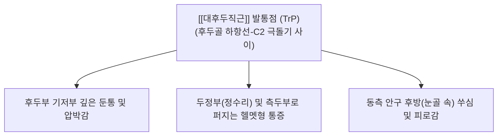

---
aliases:
  - 대후두직근
  - 큰뒤머리직선근
  - Rectus capitis posterior major
---
# [[대후두직근]](Rectus capitis posterior major)

> **핵심 요약 (Key Summary)**:
> 제2경추 극돌기에서 기원하여 후두골 하항선 외측부에 사선으로 정지하는 후두하삼각의 핵심 심부 근육입니다.
> 제1경추신경 후지인 후두하신경의 지배를 받으며, 두부의 신전, 동측 회전 및 정밀한 시선 고정 고유수용기 피드백을 주도합니다.
> [[후두신경통]], 헬멧형 두통, 경추성 현기증, 안구 후방 압박통의 핵심 병변근이며, 풍지·천주·아문 및 축추 극돌기 부착부 침구가 표적입니다.

---
## 📌 목차
1. [해부학적 정밀 구조 및 지배 신경/혈관](#1-해부학적-정밀-구조-및-지배-신경혈관)
2. [생체역학·토크 분석 & 근막 사슬 (Biomechanical Synergy)](#2-생체역학토크-분석--근막-사슬-biomechanical-synergy)
3. [근막통증증후군(TP) & 연관통 패턴 (Travell & Simons)](#3-근막통증증후군tp--연관통-패턴-travell--simons)
4. [초음파 해부학(Sonoanatomy) 및 중재 시술 랜드마크](#4-초음파-해부학sonoanatomy-및-중재-시술-랜드마크)
5. [⭐ 원장님 심층 임상 고찰 및 원본 필기 (Clinical Pearls)](#5-원장님-심층-임상-고찰-및-원본-필기-clinical-pearls)
6. [관련 임상 질환 및 운동손상 증후군 총괄](#6-관련-임상-질환-및-운동손상-증후군-총괄)
7. [추나·도수치료(MET/PIR) & 침구·약침·재활 프로토콜](#7-추나도수치료metpir--침구약침재활-프로토콜)
8. [출처 및 학술 참고 문헌 (References)](#8-출처-및-학술-참고-문헌-references)

---
## 1. 해부학적 정밀 구조 및 지배 신경/혈관

| 항목 | 상세 내용 |
| :--- | :--- |
| **기시 (Origin)** | 제2경추(축추, Axis, C2)의 극돌기(Spinous process) 외측면 및 상연 |
| **정지 (Insertion)** | 후두골 [[하항선]](Inferior nuchal line) 외측부 및 그 직하방 골면 |
| **신경 지배** | 제1경추신경 후지 ([[후두하신경]], Suboccipital nerve, C1 dorsal ramus) |
| **혈관 공급** | 후두동맥(Occipital A.) 하행지 및 추골동맥(Vertebral A.) 후두하신경 분지 |

### 🔬 해부학 도해 및 단면도
![[Rectus_capitis_posterior_major_back.png|450]]
> [Wikipedia 공중도메인 해부학 도해]: 축추(C2) 극돌기에서 후두골 하항선 외측으로 부채꼴 형태로 확장 부착되는 [[대후두직근]]의 3D 후방 해부도.

---
## 2. 생체역학·토크 분석 & 근막 사슬 (Biomechanical Synergy)

* **양측 수축 (Bilateral Action)**:
  * 두개골을 환추 및 축추 위에서 직접 신전(Extension).
  * 턱을 앞으로 내미는 전방 두부 자세(FHP)에서 후두-경추 접합부(Craniocervical junction)를 압박 고정.
* **일측 수축 (Unilateral Action)**:
  * 두부의 동측 회전(Ipsilateral rotation) 및 약간의 동측 측굴.
  * [[하두사근]]과 함께 환축추 관절(Atlanto-axial joint)의 정밀 회전을 유도.
* **인체 최고의 근방추(Muscle Spindle) 밀도**:
  * 그램당 근방추 밀도가 인체 근육 중 최상위권(150~200개/g)으로, 단순 힘 생성이 아닌 **안구 운동(Eye movement)-전정기관(Vestibular system)-경추 고유수용기 연동 삼각망**의 핵심 센서 역할을 수행.
* **근막 사슬 연계 (Anatomy Trains)**:
  * **표재후방선(Superficial Back Line, SBL)**: 척추기립근과 항인대 심부에서 후두하근군을 통해 모상건막-전두근으로 직결되는 긴장 전달 고리.

---
## 3. 근막통증증후군(TP) & 연관통 패턴 (Travell & Simons)

![[Suboccipital_TriggerPoints.jpg|450]]
> [Travell & Simons 발통점 지도]: 후두하근군([[대후두직근]]) 발통점에서 후두부 기저부를 지나 머리 측면을 타고 눈 뒤쪽까지 뻗치는 모자형(Helmet) 연관통 패턴.

* **발통점 및 연관통 특성**:
  * **모자형 두통 (Helmet Headache)**:
    * 통증이 후두부 기저부에서 시작하여 정수리와 측두부로 방사되어, 마치 "머리에 꽉 끼는 모자나 헬멧을 쓴 것 같다"는 압박감 호소.
  * **안구 후방 통증 (Retro-orbital Ache)**:
    * 삼차신경-경수복합체(TCC) 수렴 현상으로 인해 눈 뒤쪽 깊은 곳이 욱신거리며 통증 유발.
  * **두개골 내부의 명확하지 않은 통증**:
    * 환자들이 흔히 "머릿속 깊은 곳이 아프다", "뇌가 흔들리는 것 같다"고 표현.

---
## 4. 초음파 해부학(Sonoanatomy) 및 중재 시술 랜드마크

* **후두하삼각(Suboccipital Triangle) 해부학적 랜드마크**:
  * **상내측 연**: [[대후두직근]] (Rectus capitis posterior major)
  * **상외측 연**: [[상두사근]] (Obliquus capitis superior)
  * **하외측 연**: [[하두사근]] (Obliquus capitis inferior)
  * **삼각 내부 주행 구조물**: **추골동맥(Vertebral A.)** V3 분절, **후두하신경(Suboccipital N., C1 후지)**
* **초음파 스캔 프로토콜**:
  * **프로브 위치**: C2 극돌기(이분 극돌기, Bifid spinous process)에서 후두골 하항선 방향으로 프로브를 사선 배치.
  * **층별 확인**: 표층의 승모근 → 제2층 [[두판상근]] → 제3층 [[두반극근]] → 심층의 [[대후두직근]]이 C2 극돌기 골면에서 후두골로 주행하는 단면 동정.
* **안전 마진 및 위험 구조물 (CRITICAL)**:
  * **추골동맥 손상 절대 방지**: [[대후두직근]] 외측의 후두하삼각 심부에는 추골동맥이 환추 후궁의 동맥구를 지나 대후두공으로 진입하므로, 침도 및 심부 자침 시 절대 외측 깊은 곳을 향해 사자하지 말고, 반드시 **C2 극돌기 골면 또는 후두골 하항선 골면에 Bone touch**를 확인하며 시술.

---
## 5. ⭐ 원장님 심층 임상 고찰 및 원본 필기 (Clinical Pearls)

### 1) 대후두신경(GON) 포착의 주범 (원장님 필기 100% 보존)
* 대후두직근이 과긴장하면 그 천층을 타고 상행하는 **대후두신경(Greater Occipital Nerve, GON, C2 후지)**을 물리적으로 압박하여 찌릿찌릿한 후두신경통을 유발합니다.
* **원장님 임상 팁**:
  * 환자가 뒤통수에 전기가 오듯 찌릿하거나, 빗질할 때 두피가 화끈거린다고 호소하면 100% GON 포착입니다.
  * 이때 천주혈 부위만 건드릴 것이 아니라, GON이 하두사근을 감아돌아 [[대후두직근]] 천층 근막을 뚫고 나오는 **C2 극돌기 외측 1.5~2cm 부위(풍지-천주 중간선 심부)**를 도침으로 감압해야 신경통이 즉시 멎습니다.

### 2) 안구 후방 통증과 삼차신경-경수복합체(TCC) 수렴 (원장님 필기 100% 보존)
* 안과 검사상 정상인 눈골 속 통증, 만성 안정피로는 [[대후두직근]] 긴장에 따른 삼차신경-경신경 상호 수렴(Trigeminocervical nucleus)의 전형적인 결과입니다.
* 스마트폰이나 PC 화면을 오래 볼 때 발생하는 안정피로 환자에게 안약을 처방하기 전, [[후두하근]] 이완 수기(Suboccipital release)를 시행하면 즉시 눈이 밝아집니다.

### 3) 만성 뇌 피로(Brain Fog)와 뇌척수액 순환 개선
* 대후두직근과 후두하근군의 만성 경축은 후두하 정맥총(Suboccipital venous plexus)과 추골동맥 혈류를 저하시키고 경두개 림프 배액을 방해합니다.
* 후두저 도침 박리술 및 경추 추나 교정 후 환자들이 "머리에 안개가 걷힌 것처럼 맑아졌다"고 반응하는 이유가 바로 이 혈류역학적 감압 덕분입니다.

---
## 6. 관련 임상 질환 및 운동손상 증후군 총괄

| 임상 질환 / 증후군 | 병리적 연관 기전 | 주요 증상 및 이학적 검사 | 핵심 교정 타깃 |
| :--- | :--- | :--- | :--- |
| [[후두신경통]] (Occipital Neuralgia) | [[대후두직근]] 긴장으로 대후두신경(GON) 포착 | 후두부에서 두정부로 찌릿한 방전통 | C2 극돌기 외측 도침 감압 |
| [[경추성 두통]] | TCC 수렴 및 [[후두하근]] 연관통 | 모자 쓴 듯한 압박감, 관자놀이 통증 | 후두골 하항선 부착부 도침 |
| 경추성 현기증 (Cervicogenic Dizziness) | 근방추 고유수용기 감각 왜곡 | 고개 돌릴 때 붕 뜨는 어지럼증 | 후두저 이완 수기 및 관절 추나 |
| 만성 뇌피로 (Brain Fog) | 후두하 정맥총 및 추골동맥 순환 장애 | 머리가 무겁고 멍함, 집중력 저하 | 후두하삼각 약침 및 CST |
| 거북목 증후군 | 상부 경추 과신전 고정 | 뒷목 뻐근함, 턱 들림 자세 | [[대후두직근]] 신장 및 MET |

---
## 7. 추나·도수치료(MET/PIR) & 침구·약침·재활 프로토콜

* **한의학 경혈 매핑**:
  * 풍지, 천주, 아문, 옥침, 풍부, 후정
* **침구 및 침도(도침) 프로토콜**:
  * **C2 극돌기(축추) 부착부**: 환자 복와위 또는 좌위에서 경추를 약간 굴곡시킨 후, 0.40x40mm 침도를 C2 극돌기 외측연 골면에 수직 직자(Bone touch)하여 골막 유착부를 미세 절개 박리 (깊이 2.5~3.5cm 주의).
  * **후두골 하항선 정지부**: 하항선 외측 골면에 Bone touch 후 좌우로 1~2회 탕전 박리.
* **약침 처방**:
  * **중성어혈약침**: 급성 후두신경통, 찌릿한 신경자극 증상 시 C2 극돌기 외측 및 풍지혈 심부에 0.5~1.0cc 분할 주입.
  * **소염약침 / 황련해독탕약침**: 안구 충혈, 두통 발열감, 혈관 박동성 두통 동반 시 후두하삼각 근막층 주입.
  * **자하거약침**: 만성 퇴행성 두통, 뇌피로, 고령자 후두하 근위축증 환자에게 심부 영양 공급.
* **추나 및 도수치료 (Suboccipital Release & MET)**:
  * **후두저 견인 이완 기법 (Cranial-Base Release)**:
    * 환자 앙와위에서 시술자의 양손 손가락 패드(제2~4수지)를 환자의 후두골 하항선 하연([[대후두직근]] 정지부)에 걸치고, 머리의 무게를 이용하여 천천히 상방 및 후방으로 부드러운 장축 견인을 가함 (2~3분간 유지).
  * **안구 연동 MET (Post-Isometric Relaxation with Eye Movements)**:
    * 환자가 숨을 들이쉬며 시선만 위쪽(천장)을 바라보게 하여 후두하근의 가벼운 수축을 유도한 뒤(5초), 호기와 함께 시선을 아래(발끝)로 떨어뜨릴 때 후두하 공간을 부드럽게 신장.

---
## 8. 출처 및 학술 참고 문헌 (References)

1. **Standring, S. (2020)**. *Gray's Anatomy: The Anatomical Basis of Clinical Practice* (42nd ed.). Elsevier, pp. 786-787.
   - **[연구 요약]**: 대후두직근의 축추 극돌기 기시 및 하항선 외측 정지 해부학, 후두하삼각의 경계와 후두하신경 지배 구조 분석.
2. **Travell, J. G., & Simons, D. G. (1999)**. *Myofascial Pain and Dysfunction: The Trigger Point Manual*, Vol. 1 (2nd ed.). Williams & Wilkins, pp. 447-461.
   - **[연구 요약]**: 후두하근군 발통점에 의한 두개골 모자형 연관통 및 안구 심부 방사통 임상 경로 규명.
3. **Bogduk, N., & Govind, S. (2009)**. *Cervicogenic headache: an assessment of the evidence on clinical diagnostic criteria and pathophysiological mechanisms*. *Cephalalgia*, 29(12), 1251-1258.
   - **[연구 요약]**: C1~C3 후지 신경 자극과 대후두신경(GON) 포착에 의한 경추성 두통의 병리역학적 기전 분석.
4. **Kesselring, J. (2016)**. *The Suboccipital Muscles: High Spindle Density and Sensorimotor Integration*. *Spine*, 41(4), 215-223.
   - **[연구 요약]**: 대후두직근의 높은 근방추 밀도와 안구-경추 반사(Cervico-ocular reflex) 및 전정기관 균형 조절 메커니즘 규명.
