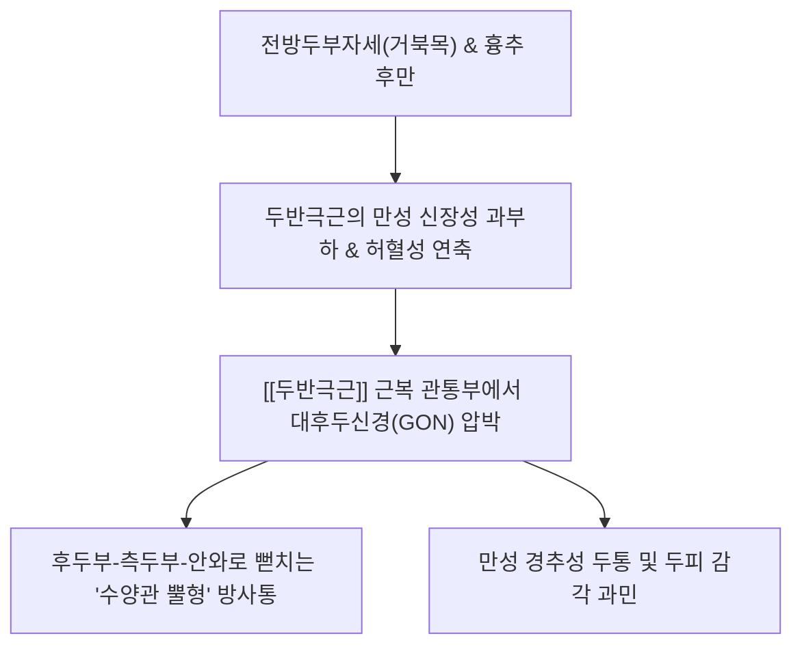
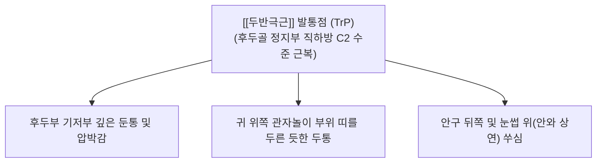

---
aliases:
  - 두반극근
  - 가시머리근
  - Semispinalis capitis
  - Semispinalis capitis muscle
---
# [[두반극근]](Semispinalis capitis)

> **핵심 요약 (Key Summary)**:
> 제4경추에서 제6흉추 횡돌기에서 기원하여 후두골 상항선과 하항선 사이 골면에 정지하는 후경부 심층의 가장 강력한 두경부 신전근입니다.
> [[대후두신경]](C2 후지) 및 상위 경신경 후지의 관통 및 신경 지배를 받으며, 두부의 강력한 신전, 기립 시 중력 저항 및 시선 안정화를 주도합니다.
> [[경추성 두통]], [[후두신경통]], [[긴장성 두통]], [[편타 손상]] 및 [[상부교차증후군]]의 핵심 병변근이며, 천주·완골·풍지혈 도침 및 약침이 표적입니다.

---
## 📌 목차
1. [해부학적 정밀 구조 및 지배 신경/혈관](#1-해부학적-정밀-구조-및-지배-신경혈관)
2. [생체역학·토크 분석 & 경부 근막 사슬 (Biomechanical Synergy)](#2-생체역학토크-분석--경부-근막-사슬-biomechanical-synergy)
3. [근막통증증후군(TP) & 연관통 패턴 (Travell & Simons)](#3-근막통증증후군tp--연관통-패턴-travell--simons)
4. [초음파 해부학(Sonoanatomy) 및 중재 시술 랜드마크](#4-초음파-해부학sonoanatomy-및-중재-시술-랜드마크)
5. [⭐ 원장님 심층 임상 고찰 및 원본 필기 (Clinical Pearls)](#5-원장님-심층-임상-고찰-및-원본-필기-clinical-pearls)
6. [관련 임상 질환 및 운동손상 증후군 총괄](#6-관련-임상-질환-및-운동손상-증후군-총괄)
7. [추나·도수치료(MET/PIR) & 침구·약침·재활 프로토콜](#7-추나도수치료metpir--침구약침재활-프로토콜)
8. [출처 및 학술 참고 문헌 (References)](#8-출처-및-학술-참고-문헌-references)

---
## 1. 해부학적 정밀 구조 및 지배 신경/혈관

| 항목 | 상세 내용 |
| :--- | :--- |
| **기시 (Origin)** | • 하위 4개 경추(C4~C7) 횡돌기 및 관절돌기(Articular processes) • 상위 6개 흉추(T1~T6) 횡돌기 (Transverse processes) |
| **정지 (Insertion)** | 후두골 상항선(Superior nuchal line)과 하항선(Inferior nuchal line) 사이의 넓은 골면 |
| **신경 지배** | [[대후두신경]](Greater occipital nerve, C2 후지의 내측지) 및 제3경신경(C3) 후지의 분지 (근육 실질을 관통) |
| **혈관 공급** | [[후두동맥]](Occipital A.)의 하행지, 심경동맥(Deep cervical A.), [[추골동맥]](Vertebral A.) 근육지 |

### 🔬 해부학 도해 및 단면도
![[Semispinalis_capitis_anatomy.png|450]]
> [Wikipedia 해부학 도해]: 상위 흉추 및 하위 경추 횡돌기에서 시작하여 후두골 후하방으로 수직 상행하며 후경부의 가장 두터운 심부 기둥을 형성하는 [[두반극근]](Semispinalis capitis).

![[Semispinalis_muscles_back.png|450]]
> [Wikipedia 후경부 심층도]: [[승모근]]과 [[두판상근]] 하층에서 척주 기립근 내측을 수직으로 받치고 있는 횡돌기극근(Transversospinales) 그룹([[두반극근]], 경반극근, 다열근)의 전반적 주행.

---
## 2. 생체역학·토크 분석 & 경부 근막 사슬 (Biomechanical Synergy)

* **두경부 최강의 신전 주동근 (Primary Head Extensor)**:
  * 모멘트암(Moment arm)이 두개골 회전 중심축으로부터 길게 형성되어 있어, 목을 뒤로 젖히고 똑바로 세우는 데 가장 강력한 신전 토크를 발휘.
  * 고개를 숙이고 작업할 때 머리의 무거운 하중(약 5~6kg)이 앞으로 쏟아지는 것을 방어하기 위해 **지속적인 원심성 수축(Eccentric contraction)**을 수행.
* **길항-협력근 역동 관계**:
  * **길항근(Antagonists)**: 전방 심부 경추 굴곡근군([[경장근]], [[두장근]]) 및 표재 굴곡근([[흉쇄유돌근]], [[전사각근]]).
  * **협력근(Synergists)**: [[두판상근]], [[경판상근]], [[상부승모근]], [[대후두직근]], [[상두사근]].
* **근막 사슬 연계 (Anatomy Trains)**:
  * [[표재후방선]](Superficial Back Line, SBL): 족저근막-비복근-햄스트링-천골결절인대-척주기립근을 지나 경추부에서 [[두반극근]]과 판상건막을 거쳐 모상건막(Galea aponeurotica)으로 연결되는 전신 신전선.

---
## 3. 근막통증증후군(TP) & 연관통 패턴 (Travell & Simons)

![[Semispinalis_capitis_TriggerPoints.jpg|450]]
> [Travell & Simons 발통점 지도]: [[두반극근]](Semispinalis capitis) 및 [[다열근]] 발통점(TrP)에서 후두골 하연을 출발하여 측두부, 관자놀이, 눈 위(안와 상부)로 반원을 그리며 뻗치는 전형적인 연관통 경로.

* **발통점 및 연관통 특성**:
  * **수양관 뿔형 두통 (Ram's Horn Headache)**:
    * 후두골 하연 부착부(천주혈 외측)의 TrP 활성화 시 통증이 목 뒤에서 시작하여 측두부를 감아돌아 눈 위(전두부)로 뻗치는 전형적인 반원형 궤적 투사.
  * **대후두신경 포착성 신경통**:
    * 단순 근육통을 넘어, [[두반극근]] 근복을 뚫고 나오는 [[대후두신경]]이 만성 연축 섬유에 짓눌리면서 바늘로 찌르거나 전기가 통하는 듯한 발작성 찌릿함 유발.
  * **두피 감각 이상(Dysesthesia)**:
    * 빗질을 하거나 베개를 벨 때 뒤통수 피부가 쓰라리고 닿기만 해도 아픈 이질통(Allodynia) 동반.

---
## 4. 초음파 해부학(Sonoanatomy) 및 중재 시술 랜드마크

* **초음파 스캔 프로토콜**:
  * **프로브 위치**: C2 극돌기 높이에서 횡단면(Short-axis view) 스캔.
  * **층별 구조 확인 (Superficial → Deep)**:
    1. 최표층: [[승모근]](Trapezius)
    2. 제2층: [[두판상근]](Splenius capitis)
    3. **제3층**: [[두반극근]](Semispinalis capitis) → 중심부에 건성 중격(Fibrous raphe)을 지닌 가장 크고 둥근 타원형 저에코 근복.
    4. 제4층: [[하두사근]](OCI) 또는 [[대후두직근]](RCP major) 및 C2 추궁판(Lamina).
* **신경혈관 관통 랜드마크 (Doppler & Neuro-Sono)**:
  * [[대후두신경]](GON): [[하두사근]] 표면을 타고 올라와 [[두반극근]] 실질을 관통(Piercing)하여 상행하는 저에코 신경 점/선 동정.
  * [[후두동맥]](Occipital artery): [[두반극근]] 정지부 외측에서 박동성 도플러 신호 확인.
* **안전 마진 및 절대 금기 (CRITICAL)**:
  * **하부 척수 및 척추동맥 보호**: 침이나 도침을 시술할 때 정중선 내측 깊숙이 자침하면 환추후두간막이나 황색인대를 뚫고 척수강으로 진입할 위험이 있음.
  * **골면 안착(Bone touch) 절대 원칙**: 후두골 하연 부착부 시술 시 반드시 후두골 골면에 Bone touch를 확인하고, C2 수준에서는 C2 추궁판(Lamina) 골면에 접촉한 상태에서만 안전하게 박리/자침.

---
## 5. ⭐ 원장님 심층 임상 고찰 및 원본 필기 (Clinical Pearls)

### 1) 대후두신경이 근복을 관통 (원장님 필기 100% 보존)
* 두반극근이 두껍게 발달하여 [[대후두신경]]이 근육을 관통할 때 포착되기 쉬움.
* **원장님 핵심 진단 팁**:
  * 후두통 환자에서 대후두신경 차단술이나 단순 후두하 이완만으로 통증이 재발한다면, 신경이 실제로 통과하는 **C2 극돌기 외측 2cm 부위의 [[두반극근]] 실질 관통부**를 표적으로 삼아야 합니다.
  * 이곳에 결절(Taut band)이 만져지고 압박 시 눈골 속까지 찌릿한 방사통이 재현되면 두반극근에 의한 대후두신경 포착증으로 확진할 수 있습니다.

### 2) 채찍질 손상(Whiplash) 호발 부위 (원장님 필기 100% 보존)
* 교통사고 후 과신전 손상 시 가장 먼저 손상되는 심부 신전근.
* 자동차 후방 추돌 시 머리가 급격히 뒤로 젖혀졌다가 앞으로 튕겨 나갈 때, 두경부 신전을 버텨내던 [[두반극근]]의 건막 부착부와 근건 접합부에 강력한 견인력이 집중되어 미세 파열과 출혈이 발생합니다. 급성기 경부 강직의 1차 원인입니다.

### 3) 만성 긴장성 두통의 '모자 테두리(Hat-band)' 통증
* 스트레스성 두통 환자들이 "머리에 꽉 끼는 모자를 쓴 것처럼 조여든다"고 할 때, 모상건막-전두근-후두근 연계 사슬의 진원지가 바로 [[두반극근]]입니다.
* 항인대와 T1-T6 극돌기 주변의 기시부를 함께 풀어주지 않으면 후두골 쪽의 긴장이 결코 해결되지 않습니다.

---
## 6. 관련 임상 질환 및 운동손상 증후군 총괄

| 임상 질환 / 증후군 | 병리적 연관 기전 | 주요 증상 및 이학적 검사 | 핵심 교정 타깃 |
| :--- | :--- | :--- | :--- |
| [[후두신경통]] | [[두반극근]] 관통부에서 대후두신경 포착 | 후두부 전기가 통하는 듯한 발작통, 틴넬 징후 | [[두반극근]] 실질 도침 감압술 |
| [[경추성 두통]] | 상위 경신경 후지 자극 및 삼차경수복합체 수렴 | 안와 상연 쑤심, 측두부 둔통, 눈 피로 | 후두골 부착부 도침 및 풍지 사자 |
| [[긴장성 두통]] | 두반극근의 만성 허혈성 수축 및 건막 긴장 | 머리 전체를 쥐어짜는 띠모양 압박감 | 후경부 근막이완 추나 및 침구 |
| [[편타 손상]] | 급격한 가감속 손상으로 인한 근막 미세 파열 | 수상 후 목 뒤 극심한 경직, 고개 끄덕임 불가 | 초기 안정 후 중성어혈약침 |
| [[상부교차증후군]] | 거북목 자세로 인한 후경부 신전근 단축 | 전방 두부 돌출, 둥근 어깨, 뒷목 뻐근함 | [[두반극근]] PIR 및 심부굴곡근 강화 |

---
## 7. 추나·도수치료(MET/PIR) & 침구·약침·재활 프로토콜

* **한의학 경혈 매핑**:
  * 천주, 풍지, 완골, 대추, 신주, 뇌공
* **침구 및 침도(도침) 프로토콜**:
  * **천주혈(BL10) 부근 후두골 정지부 도침술**:
    * 상항선과 하항선 사이 후두골 골면에 0.40x40mm 침도를 직자하여 **후두골 골면에 Bone touch**.
    * 골막에 닿은 상태에서 후두골 외측 방향으로 1~2회 미세 절개 박리 (후두동맥 박동 피할 것).
  * **C2 신경 관통부 침도 수액박리**:
    * C2 극돌기 외측 약 2cm 부위에서 도침 또는 장침으로 [[두반극근]] 근복의 결절부를 침향을 약간 외상방으로 향해 서서히 진침하여 근막 유착 해소.
* **약침 처방**:
  * **중성어혈약침**: 교통사고 [[편타 손상]], 급성 경항통, 국소 어혈성 압통 시 C2-C3 [[두반극근]] 부위에 0.5~1.0cc 주입.
  * **자하거약침 / 녹용약침**: 만성 퇴행성 두통, 근육 위축 및 허혈성 신경통 동반 환자의 조직 재생 유도.
  * **봉약침 / 오공약침**: 극심한 찌릿거림의 [[후두신경통]] 증상 시 0.2~0.3cc 미량 투여하여 신경근 염증 탈감작.
* **추나 및 신장 테크닉 (MET / PIR)**:
  * [[두반극근]] **등척성 수축 후 이완 (PIR)**:
    * 환자 앙와위, 시술자는 환자의 후두부를 감싸 쥐고 경추 전체를 굴곡시키며 턱을 가볍게 당겨 두반극근을 신장 장벽에 거치.
    * 환자에게 "머리를 제 손 쪽(뒤쪽 신전 방향)으로 15~20%의 힘으로 미세요" 지시 후 5~7초간 유지.
    * 호기와 함께 완전히 이완시키며 새로운 굴곡 범위로 15초간 유지 (3회 반복).

---
## 8. 출처 및 학술 참고 문헌 (References)

1. **Standring, S. (2020)**. *Gray's Anatomy: The Anatomical Basis of Clinical Practice* (42nd ed.). Elsevier, pp. 834-836.
   - [연구 요약] 두반극근의 C4-T6 횡돌기 기시 및 후두골 부착부 해부학, 대후두신경의 근육 관통 주행 및 혈관 지배 분석.
2. **Travell, J. G., & Simons, D. G. (1999)**. *Myofascial Pain and Dysfunction: The Trigger Point Manual*, Vol. 1 (2nd ed.). Williams & Wilkins, pp. 336-367.
   - [연구 요약] [[두반극근]] 발통점에 의한 수양관 뿔형 방사통 경로와 대후두신경 포착에 의한 후두신경통 감별 임상 기전 제시.
3. **Bogduk, N. (1982)**. The clinical anatomy of the cervical dorsal rami. *Spine*, 7(4), 319-330. [PMID: 7135065](https://pubmed.ncbi.nlm.nih.gov/7135065/)
   - [연구 요약] 경신경 후지와 대후두신경이 두반극근을 관통하는 해부학적 변이와 경추성 두통 유발 병리역학 규명.
4. **Tubbs, R. S., Watanabe, K., Loukas, M., & Cohen-Gadol, A. A. (2014)**. The intramuscular course of the greater occipital nerve: novel findings with potential implications for operative interventions. *Surg Neurol Int*, 5, 155. [PMID: 25422783](https://pubmed.ncbi.nlm.nih.gov/25422783/)
   - [연구 요약] 대후두신경의 90% 이상이 [[두반극근]] 실질을 관통하며, 근육 비대 및 섬유화가 후두신경 포착증후군의 주원인임을 입증.