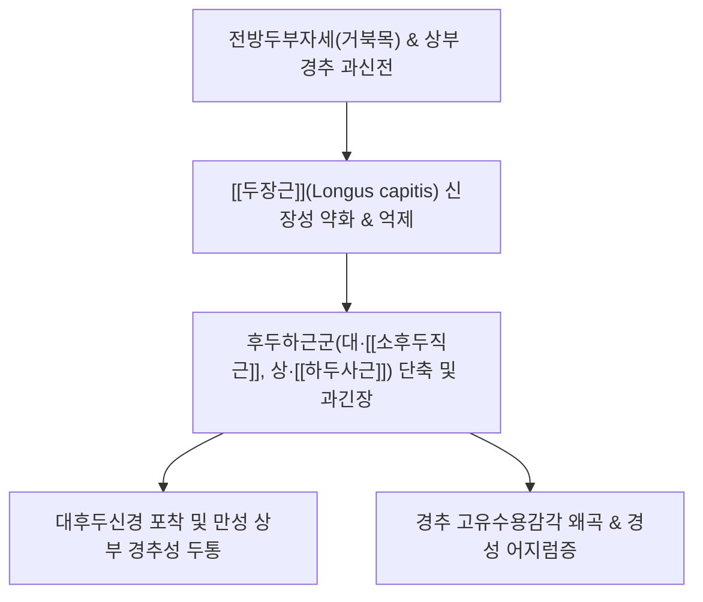
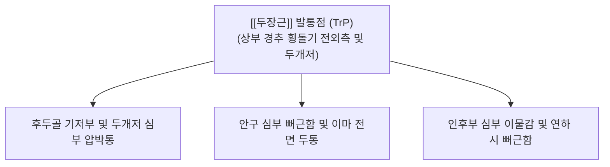

---
aliases:
  - 두장근
  - 긴머리근
  - Longus capitis
  - Longus capitis muscle
---
# [[두장근]](Longus capitis)

> **핵심 요약 (Key Summary)**:
> 제3~6경추 횡돌기 전결절에서 기원하여 후두골 저부(기저부)에 정지하는 두경부 심부 전방 굴곡근입니다.
> 상위 경신경 전지(C1~C3)의 지배를 받으며, 환추후두관절(C0-C1)의 굴곡, 두부의 미세 전방 안정화 및 턱당김(Chin-tuck) 동작을 주도합니다.
> [[경추성 두통]], 거북목 증후군, 두개경추 접합부 불안정성 및 경성 어지럼증의 핵심 병변근이며, 정밀 침구와 심부 경추 굴곡 훈련(CCFT)이 표적입니다.

---
## 📌 목차
1. [해부학적 정밀 구조 및 지배 신경/혈관](#1-해부학적-정밀-구조-및-지배-신경혈관)
2. [생체역학·토크 분석 & 경부 근막 사슬 (Biomechanical Synergy)](#2-생체역학토크-분석--경부-근막-사슬-biomechanical-synergy)
3. [근막통증증후군(TP) & 연관통 패턴 (Travell & Simons)](#3-근막통증증후군tp--연관통-패턴-travell--simons)
4. [초음파 해부학(Sonoanatomy) 및 중재 시술 랜드마크](#4-초음파-해부학sonoanatomy-및-중재-시술-랜드마크)
5. [⭐ 원장님 심층 임상 고찰 및 원본 필기 (Clinical Pearls)](#5-원장님-심층-임상-고찰-및-원본-필기-clinical-pearls)
6. [관련 임상 질환 및 운동손상 증후군 총괄](#6-관련-임상-질환-및-운동손상-증후군-총괄)
7. [추나·도수치료(MET/PIR) & 침구·약침·재활 프로토콜](#7-추나도수치료metpir--침구약침재활-프로토콜)
8. [출처 및 학술 참고 문헌 (References)](#8-출처-및-학술-참고-문헌-references)

---
## 1. 해부학적 정밀 구조 및 지배 신경/혈관

| 항목 | 상세 내용 |
| :--- | :--- |
| **기시 (Origin)** | 제3~6경추(C3~C6) 횡돌기 전결절 (Anterior tubercles of transverse processes) |
| **정지 (Insertion)** | 후두골 저부 하면의 기저부 (Basilar part of occipital bone, 大후두공 전외측 골면) |
| **신경 지배** | 상위 경신경 전지 분지 (C1~C3 anterior rami, 주로 C1-C2 분지) |
| **혈관 공급** | 상행인두동맥(Ascending pharyngeal A.), [[추골동맥]](Vertebral A.) 근육지, 상행경동맥 |

### 🔬 해부학 도해 및 단면도
![[Longus_capitis_anatomy.png|450]]
> [Wikipedia 3D 해부도]: 제3~6경추 횡돌기 전결절에서 기원하여 두개저 후두골 바닥으로 상내측 주행하는 [[두장근]](Longus capitis)의 정밀 부착 구조.

![[Gray_longus_colli.png|450]]
> [Gray's Anatomy 공중도메인 해부학 도해]: [[두장근]](Longus capitis)과 인접 [[경장근]](Longus colli), 전두직근 및 외측두직근의 두개골 기저부(Occipital basilar part) 연결 관계.

---
## 2. 생체역학·토크 분석 & 경부 근막 사슬 (Biomechanical Synergy)

* **환추후두관절(C0-C1)의 일차적 굴곡근 (Primary Cranio-Cervical Flexor)**:
  * 인접한 [[경장근]](Longus colli)이 주로 경추 분절 간의 전만 곡선과 척주를 안정화하는 반면, **두장근은 두개골(후두골)에 직접 부착하여 머리를 앞으로 끄덕이는(Nodding) 굴곡 토크를 발생**시키는 핵심 주동근.
  * 고개를 숙일 때 턱이 앞으로 밀려나가지 않고 목 쪽으로 당겨지도록 유도하는 **진정한 턱당김(Chin-Tuck)의 시발점**.
* **길항-협력근 역동 관계 (Antagonist-Synergist Dynamics)**:
  * **길항근(Antagonists)**: 후두골을 뒤로 젖히는 후두하근군([[대후두직근]], [[소후두직근]], [[상두사근]]) 및 [[두반극근]], [[두판상근]].
  * **협력근(Synergists)**: [[전두직근]](Rectus capitis anterior), [[경장근]](Longus colli), [[설골하근군]].
* **근막 사슬 연계 (Anatomy Trains)**:
  * **심부전방선(Deep Front Line, DFL)**: 경추 전면을 타고 올라와 후두골 기저부에 단단히 닻을 내리는 중심 근막축의 최상위 정지부.

---
## 3. 근막통증증후군(TP) & 연관통 패턴 (Travell & Simons)

* **발통점 및 연관통 특성**:
  * 두장근의 발통점은 두개골 저부와 상부 경추 전외측 심부에 형성되며, **두개저 깊은 곳이 묵직하게 조여오는 통증**을 방사.
  * **안구 뒤쪽 및 전두부 방사통**: [[후두하근]]군이나 [[흉쇄유돌근]]과 마찬가지로 삼차신경-경신경 복합체(Trigeminocervical complex)를 매개하여 **안구 심부의 뻐근한 피로감과 이마 부위의 둔통**을 동반.
  * 환자는 흔히 "머리 속 깊은 곳, 뇌 바닥 쪽이 쑤시고 뻐근하다"고 표현하며 일반적인 두통약에 잘 반응하지 않음.

---
## 4. 초음파 해부학(Sonoanatomy) 및 중재 시술 랜드마크

* **초음파 단면 스캔 소견**:
  * 하악각(Angle of mandible) 바로 하방 및 C3-C4 레벨에서 선형 프로브를 횡단 배치.
  * [[흉쇄유돌근]](SCM)의 심부, [[내경정맥]](IJV)과 [[내경동맥]](ICA)의 심내측, **경추 횡돌기 전결절과 척추체 전외측 사이에 위치한 근육**이 [[두장근]].
  * C3-C4보다 상위 레벨로 올라갈수록 [[경장근]]은 점차 가늘어지고 [[두장근]]이 후두골 바닥을 향해 넓게 확장됨.
* **인접 위험 구조물 (High-Risk Structures)**:
  * **경동맥초(Carotid Sheath)**: [[내경동맥]], [[내경정맥]], [[미주신경]](Vagus nerve, CN X)이 두장근의 전외측을 밀접하게 주행.
  * [[상경신경절]](Superior Cervical Ganglion): [[두장근]] 전면 근막 바로 위에 위치하여 손상 시 [[호너 증후군]] 위험.
  * [[설하신경]](CN XII) 및 [[부신경]](CN XI): 상부 경추 전외측을 교차 주행.
* **안전 마진 및 절대 금기 (CRITICAL)**:
  * **맹목적 전방 깊은 자침 절대 엄금**: [[내경동맥]] 파열이나 경동맥 박리, [[미주신경]] 손상의 치명적 위험이 있으므로 초음파 시각화 없이 전방에서 깊이 찌르는 것은 금기.
  * **도침/침구 우회 자침법**: 하악각 후방 및 유양돌기 전하방에서 후두골 저부를 향해 손가락으로 경동맥을 감지하고 외측으로 견인한 상태에서 경사각을 주어 접근하거나, 후방의 풍지·천주혈을 통한 간접적인 상부 경추 관절 감압 치료를 우선 적용.

---
## 5. ⭐ 원장님 심층 임상 고찰 및 원본 필기 (Clinical Pearls)

### 1) 심부 경추 굴곡근 협동 (원장님 필기 100% 보존)
* [[두장근]]과 [[경장근]]은 [[거북목 증후군|거북목]] 교정 시 반드시 활성화해야 하는 핵심 심부 안정화근.
* 두 근육은 분리된 근육이 아니라 '경추-두개골 굴곡 복합체(Cervicocranial flexor unit)'로 함께 작동합니다. [[두장근]]이 먼저 두개골을 끄덕여 턱을 당겨주면, [[경장근]]이 뒤이어 경추 분절을 단단하게 전방에서 잡아주어야 완벽한 경추 척추 안정성이 확보됩니다.

### 2) 상부 경추 전만 조율 (원장님 필기 100% 보존)
* 두개골 하연과 경추 상부의 정렬 유지.
* [[거북목 증후군|거북목]] 환자들은 고개가 앞으로 빠지면서 시야를 확보하기 위해 상부 경추(C0-C2)를 젖히는 '보상적 과신전'을 취하게 됩니다. 이때 [[두장근]]은 길게 늘어나 힘을 전혀 쓰지 못하고 굳어버리며, 그 결과 후두골과 경추 1번 사이가 압박되어 극심한 [[경추성 두통]]과 뇌 혈류 장애를 초래합니다.

### 3) 진정한 'Chin-Tuck'의 핵심 주동근
* 많은 환자들이 턱당김 운동을 시키면 목 전체를 뒤로 우격다짐으로 밀거나 [[흉쇄유돌근]]에 잔뜩 힘을 주어 목 앞쪽을 뻣뻣하게 만듭니다.
* 진정한 턱당김은 목 앞 표재근에 힘을 완전히 뺀 채, **"뒤통수와 목덜미를 위로 길게 늘이며 코끝을 바닥 쪽으로 1cm만 살짝 끄덕인다"**는 느낌으로 [[두장근]]만을 선택적으로 고립 수축시켜야 합니다.

### 4) [[경추성 어지럼증|경성 어지럼증]](Cervicogenic Dizziness)과의 상관성
* [[두장근]]과 [[후두하근]]군은 인체에서 단위 체적당 근방추(Muscle spindle) 밀도가 가장 높은 고유수용감각 수용체입니다. 두장근이 약화되어 두개골의 미세 정렬 정보가 전정신경핵으로 잘못 전달되면, [[이석증]]이나 [[전정신경염]]이 없음에도 머리를 움직일 때 붕 뜨는 듯한 어지럼증이 유발됩니다.

---
## 6. 관련 임상 질환 및 운동손상 증후군 총괄

| 임상 질환 / 증후군 | 병리적 연관 기전 | 주요 증상 및 이학적 검사 | 핵심 교정 타깃 |
| :--- | :--- | :--- | :--- |
| [[경추성 두통]] | [[두장근]] 억제로 인한 [[후두하근]] 단축 | 후두골 기저부 압박통, 안구 피로, 편두통 유사 | 후두하 감압 & [[두장근]] 활성화 |
| [[거북목 증후군]] | 상부 경추 과신전 및 [[두장근]] 신장성 약화 | 머리가 어깨선보다 전방 돌출, 경추 전만 소실 | [[두개경추 굴곡 검사]] 기반 턱당김 운동 |
| [[두개경추 불안정증]] | C0-C1 관절 지지력 상실 및 미세 동요 | 고개 돌릴 때 불안감, 머리가 무거운 느낌 | 심부 경추 굴곡근 등척성 강화 |
| [[경추성 어지럼증]] | 두경부 고유수용감각 수용체 피로 및 오류 | 목 움직임 시 아찔함, 붕 뜨는 어지러움, 메스꺼움 | [[두장근]] 고유수용감각 재훈련 & 침구 |
| [[편타 손상]] | 급격한 가속-감속 손상 시 [[두장근]] 견인 손상 | 외상 후 지속되는 두통, 집중력 저하, 목 뻣뻣함 | 급성기 침구 이완 후 점진적 CCFT |

---
## 7. 추나·도수치료(MET/PIR) & 침구·약침·재활 프로토콜

* **경혈 배오 및 치료 원칙**:
  * **인영(ST9)**: 전경부 맥박 박동처를 피하여 경동맥초 외측 경계부에서 0.3~0.5촌 완만 자침.
  * **천돌(CV22)**: 흉골병 상연에서 하방 사자하여 전방 근막 장력 완화.
  * **풍지(GB20) 및 천주(BL10)**: 두장근과 대척점에 있는 후두하근군을 후방에서 침도나 장침으로 먼저 충분히 이완시켜 두장근의 상반신경억제(Reciprocal inhibition)를 유도.
  * **완골(GB12) 및 예풍(TE17)**: 유양돌기 주위 림프 순환 및 두개저 근막 긴장 완화.
* **추나 및 도수치료 (MET/PIR)**:
  * **후두하 이완 및 후두골 견인 기법(Suboccipital Release & Occipital Traction)**: 시술자의 손가락 끝으로 후두골 하연을 받치고 두개골을 상방으로 부드럽게 견인하여 C0-C1 관절 간격을 넓힌 후 두장근의 안정적 수축 공간 확보.
  * [[두장근]] **미세 등척성 PIR**: 환자에게 시선만을 아래로 떨구게 하거나 턱을 1도 정도 끄덕이게 한 상태에서 이마에 미세한 저항(새털 같은 저항)을 5초간 가한 후 이완.
* **환자 홈트레이닝 (Craniocervical Nodding Exercise)**:
  * 누운 상태에서 혀를 입천장에 가볍게 붙이고(하악 과긴장 방지), 목 앞쪽 근육이 불거지지 않는 범위에서 코끝으로 작은 호(Arc)를 그리듯 고개를 끄덕인 뒤 5초간 유지. 10회씩 3세트 시행.

---
## 8. 출처 및 학술 참고 문헌 (References)

1. **Jull, G., Kristjansson, E., & Dall'Alba, P. (2004)**. *Impairment in the cervical flexors: a comparison of whiplash and insidious onset neck pain patients*. Manual Therapy, 9(2), 89-94.
   - [연구 요약] 만성 목 통증 및 편타 손상 환자군 모두에서 두장근을 포함한 심부 경추 굴곡근의 동원 지연과 근지구력 저하가 두드러지게 나타남을 입증.
2. **Boyd-Clark, L. C., Briggs, C. A., & Galea, M. P. (2002)**. *Muscle spindle distribution, morphology, and density in longus capitis and cervicis muscles of man*. Journal of Anatomy, 201(3), 269-279.
   - [연구 요약] 두장근과 [[경장근]] 내부의 고유수용성 근방추 밀도를 정밀 계측하여, 두 근육이 단순한 동력 발생근이 아니라 두경부 공간 정위와 전정계 균형 조절의 핵심 센서임을 규명.
3. **Standring, S. (2020)**. *Gray's Anatomy: The Anatomical Basis of Clinical Practice* (42nd ed.). Elsevier.
   - [연구 요약] 두장근의 후두골 기저부 부착부 및 상위 경추신경(C1-C3), 경동맥초 인접 주행에 대한 표준 해부학적 데이터 제공.
4. **Travell, J. G., & Simons, D. G. (1999)**. *Myofascial Pain and Dysfunction: The Trigger Point Manual* (Vol. 1, 2nd ed.). Williams & Wilkins.
   - [연구 요약] 두경부 심부 굴곡근 및 후두하 연관통 기전 수록.
