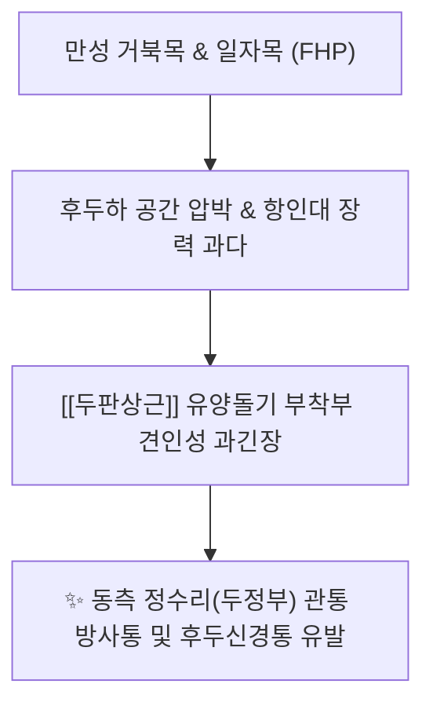
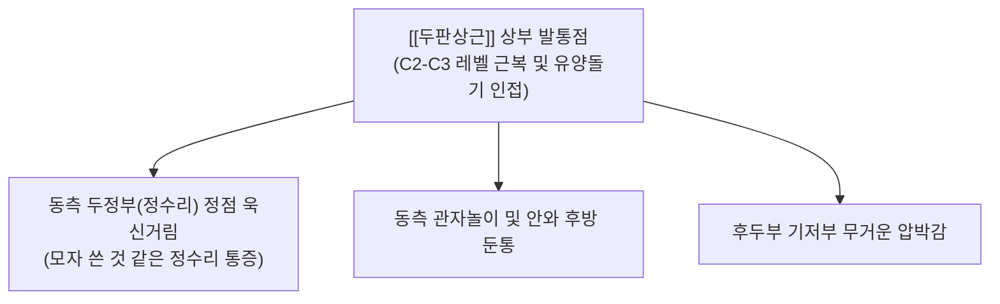

---
aliases:
  - 두판상근
  - 머리판상근
  - Splenius capitis
---
# [[두판상근]](Splenius capitis)

> **핵심 요약 (Key Summary)**:
> 제7경추 및 제1~3흉추 극돌기, 항인대 하부에서 기원하여 측두골 유양돌기 및 후두골 상항선 외측면에 정지하는 후경부 표재-중간층의 핵심 사선 근육입니다.
> 중·하위 경신경 후지 외측가지의 지배를 받으며, 두부의 신전, 측굴 및 동측 회전을 주도하고 대측 흉쇄유돌근과 회전 짝힘을 이룹니다.
> [[긴장성 두통]], 정수리 쑤심, 경추성 편두통, 채찍질 손상의 핵심 병변근이며, 풍지·완골·천주 및 유양돌기 부착부 침구가 표적입니다.

---
## 📌 목차
1. [해부학적 정밀 구조 및 지배 신경/혈관](#1-해부학적-정밀-구조-및-지배-신경혈관)
2. [생체역학·토크 분석 & 근막 사슬 (Biomechanical Synergy)](#2-생체역학토크-분석--근막-사슬-biomechanical-synergy)
3. [근막통증증후군(TP) & 연관통 패턴 (Travell & Simons)](#3-근막통증증후군tp--연관통-패턴-travell--simons)
4. [초음파 해부학(Sonoanatomy) 및 중재 시술 랜드마크](#4-초음파-해부학sonoanatomy-및-중재-시술-랜드마크)
5. [⭐ 원장님 심층 임상 고찰 및 원본 필기 (Clinical Pearls)](#5-원장님-심층-임상-고찰-및-원본-필기-clinical-pearls)
6. [관련 임상 질환 및 운동손상 증후군 총괄](#6-관련-임상-질환-및-운동손상-증후군-총괄)
7. [추나·도수치료(MET/PIR) & 침구·약침·재활 프로토콜](#7-추나도수치료metpir--침구약침재활-프로토콜)
8. [출처 및 학술 참고 문헌 (References)](#8-출처-및-학술-참고-문헌-references)

---
## 1. 해부학적 정밀 구조 및 지배 신경/혈관

| 항목 | 상세 내용 |
| :--- | :--- |
| **기시 (Origin)** | 항인대(Ligamentum nuchae) 하반부, 제7경추(C7) 및 제1~3(또는 4)흉추(T1~T3/T4) 극돌기 |
| **정지 (Insertion)** | 측두골 [[유양돌기]](Mastoid process) 외측면 및 후두골 상항선(Superior nuchal line) 외측 1/3 하방 |
| **신경 지배** | 경신경 후지 외측가지 ([[경신경후지]], C2~C4 dorsal rami, lateral branches) |
| **혈관 공급** | 후두동맥(Occipital A.) 하행지, 심경동맥(Deep cervical A.), 경횡동맥 분지 |

### 🔬 해부학 도해 및 단면도
![[Splenius_capitis_anatomy.png|450]]
> [Wikipedia 공중도메인 해부학 도해]: 상위 흉추 및 하위 경추 극돌기에서 측두골 유양돌기와 후두골 상항선으로 부채꼴 모양으로 펼쳐지는 [[두판상근]]의 정밀 주행 관계.

---
## 2. 생체역학·토크 분석 & 근막 사슬 (Biomechanical Synergy)

* **양측 수축 (Bilateral Action)**:
  * 머리와 목을 강력하게 신전(Extension)시키고 과도한 굴곡을 편심성으로 제동.
  * [[승모근]] 상부섬유 심층에서 두개골의 직립 시상면 안정성을 지지.
* **일측 수축 (Unilateral Action)**:
  * 두부의 동측 회전(Ipsilateral rotation) 및 동측 측굴(Lateral flexion).
  * 대측 [[흉쇄유돌근]](SCM)과 대각선으로 협력하여 강력한 경추 회전 짝힘(Force couple) 형성.
* **근막 사슬 연계 (Anatomy Trains)**:
  * **나선선(Spiral Line, SL)**: 측두골/후두골 → [[두판상근]] → 경추 극돌기 → 대측 [[능형근]] → 대측 [[전거근]]으로 이어지는 회전 사슬의 시발점.
  * **표재후방선(Superficial Back Line, SBL)**: 척추기립근 상부에서 후두골 모상건막(Galea aponeurotica)으로 이어지는 후방 인장 라인의 핵심 매개체.

---
## 3. 근막통증증후군(TP) & 연관통 패턴 (Travell & Simons)

![[Splenius_capitis_TriggerPoints.png|450]]
> [Travell & Simons 발통점 지도]: [[두판상근]] 상부 TrP에 의해 동측 정수리(두정부) 정점으로 솟구치는 전형적인 방사통 패턴 (X: 발통점, 붉은 영역: 정수리 집중 연관통).

* **발통점 위치 및 연관통 특성**:
  * **상부 TrP (후경부 상부, C2-C3 높이 [[판상근]] 중심부)**:
    * **정수리 방사통 (Vertex Pain)**: 트라벨 & 시몬스가 밝힌 "정수리 통증의 가장 흔한 원인근". 두개골 속에서 정수리 꼭대기로 뚫고 나가는 듯한 욱신거림 유발.
    * 환자들이 흔히 "머리 꼭대기에 찬바람이 드는 것 같다", "정수리를 누르면 두피가 얼얼하다"고 호소.
  * **관자놀이 및 안와 연관통**:
    * 통증이 전방으로 퍼져 관자놀이(측두부)와 눈 뒤쪽으로 방사되어 전형적인 편두통 양상 모사.
  * **국소 두피 압통**:
    * 유양돌기 후연 부착부 주위로 심한 압통점이 형성되며, 빗질을 하거나 모자를 쓸 때 두피 과민성(Scalp tenderness) 발생.

---
## 4. 초음파 해부학(Sonoanatomy) 및 중재 시술 랜드마크

* **초음파 스캔 프로토콜**:
  * **프로브 위치**: C2-C3 후경부 횡단 스캔(Transverse view) 거치.
  * **층별 구조 확인 (Superficial → Deep)**:
    1. 최표층: [[승모근]](Trapezius) 상부 근섬유.
    2. 제2층: [[두판상근]] (Splenius capitis) → SCM 후연과 맞닿으며 내측에서 외측 상방으로 주행하는 두터운 근육층.
    3. 제3층: [[두반극근]](Semispinalis capitis)의 크고 둥근 근복.
    4. 제4층: 후두하삼각 근육군([[대후두직근]], [[상두사근]]).
* **안전 마진 및 위험 구조물 회피**:
  * [[후두동맥]](Occipital A.) & [[대후두신경]](GON): 유양돌기 내측 상항선 부착부에서 [[후두동맥]]과 [[대후두신경]]이 [[두판상근]] 및 [[승모근]] 건막을 관통하여 상행하므로, 도침 박리 시 박동성 혈관을 촉지 또는 도플러로 확인 후 신경혈관 다발 외측의 건막 부착부를 타깃팅.

---
## 5. ⭐ 원장님 심층 임상 고찰 및 원본 필기 (Clinical Pearls)

### 1) [[편두통]]과의 깊은 연관성 및 정수리 방사통 (원장님 필기 100% 보존)
* [[두판상근]] 상부 TrP는 관자놀이와 눈 뒤쪽을 관통하는 통증을 유발하여 전형적인 [[편두통]]으로 오진되기 쉽습니다.
* **원장님 핵심 진단 팁**:
  * 환자가 "정수리(백회 부위)가 뻐근하고 시리며 콕콕 쑤신다"고 호소할 때, 두피 자체나 뇌 질환보다 [[두판상근]] 상부 TrP를 1순위로 의심해야 합니다.
  * C2-C3 높이의 유양돌기와 경추 극돌기 사이 근복을 압박했을 때 정수리로 찌릿하게 통증이 재현되면 [[두판상근]] 기원성 [[경추성 두통]]으로 확진할 수 있습니다.

### 2) [[흉쇄유돌근]](SCM) 및 [[승모근]]과의 길항/협동 관계 (원장님 필기 100% 보존)
* 두부 회전 시 [[두판상근]]은 주동근으로 작용하며, 특히 한쪽으로 고개를 돌리고 모니터를 바라보는 비대칭 자세에서 과사용 손상이 빈발합니다.
* 오른쪽으로 고개를 돌릴 때: **우측 [[두판상근]](동측 회전)**과 **좌측 [[흉쇄유돌근]](대측 회전)**이 한 쌍의 짝힘으로 작동하므로, [[두판상근]] 치료 시 반드시 대측 [[흉쇄유돌근]](SCM)의 긴장도를 함께 확인하여 동시 이완해야 치료 효과가 배가됩니다.

### 3) 유양돌기 및 상항선 부착부 엔테소파시(Enthesopathy)
* 유양돌기 후연(완골혈 부근)에 부착하는 건막 부위는 만성적인 회전 견인 스트레스로 인해 미세 석회화 및 섬유화가 호발합니다.
* 단순 침 치료로 호전이 더딘 만성 두통 환자는 완골혈-풍지혈 라인의 [[두판상근]] 정지부 골면에 도침을 직자하여 골막 유착을 뜯어주면 정수리 통증이 즉각 소실됩니다.

---
## 6. 관련 임상 질환 및 운동손상 증후군 총괄

| 임상 질환 / 증후군 | 병리적 연관 기전 | 주요 증상 및 이학적 검사 | 핵심 교정 타깃 |
| :--- | :--- | :--- | :--- |
| [[긴장성 두통]] | [[두판상근]] TrP 과긴장으로 두정부 방사 | 정수리가 조이고 욱신거림, 두피 통증 | 풍지·천주 도침 및 근막이완 |
| [[경추성 두통]] | 사선 회전 장력 비대칭 및 TCC 자극 | 일측성 측두통, 안와 후방 통증 | 유양돌기 부착부 도침 및 MET |
| [[편타 손상]] | 급격한 과신전-과굴곡 손상 시 파열 | 경부 회전 제한, 목덜미 전체 뻣뻣함 | 중성어혈약침 및 경추 추나 |
| [[상부교차증후군]] | 거북목 자세에서 보상적 과신전 | 후경부 단축, 후두하 압박감, 어깨 결림 | [[두판상근]] 신장 및 [[경장근]] 강화 |
| [[두정부 냉감증]] | 혈류 저하 및 두정부 신경 포착 | 머리 꼭대기가 시리고 찬바람 드는 느낌 | [[판상근]] 온침 및 자하거약침 |

---
## 7. 추나·도수치료(MET/PIR) & 침구·약침·재활 프로토콜

* **한의학 경혈 매핑**:
  * 풍지, 천주, 완골, 뇌공, 풍부, 백회
* **침구 및 침도(도침) 프로토콜**:
  * **완골(GB12) 및 유양돌기 정지부**: 유양돌기 후하연 골면에 0.40x40mm 침도를 직자하여 골면에 접촉 후, 골막 유착부를 좌우로 1~2회 탕전 박리.
  * **풍지(GB20) 및 C2-C3 근복**: 유양돌기와 승모근 사이 함요처에서 반대측 안구 방향으로 1.0~1.5촌 사자 자침하여 [[두판상근]] 근복 심부 발통점 탈감작.
* **약침 처방**:
  * **중성어혈약침**: 교통사고 후유증, 급성 경항통 및 회전 가동 제한 시 유양돌기 부착부 및 근복에 0.5~1.0cc 주입.
  * **황련해독탕약침 / 소염약침**: 정수리 열감, 충혈, 욱신거리는 박동성 두통 동반 시 상부 TrP 주입.
  * **자하거약침**: 만성 허혈성 두통, 정수리 시림, 노인성 경추증 환자의 [[판상근]] 건골 복합체에 심부 주입.
* **근에너지기법 (MET / PIR) 프로토콜**:
  * **자세**: 환자 앙와위, 시술자는 환자의 머리를 받치고 경추를 부드럽게 반대측 회전, 반대측 측굴, 굴곡시켜 두판상근을 최대 신장 장벽에 위치시킴.
  * **수축**: 환자에게 "머리를 제 손 저항 방향(동측 회전 및 약간의 신전)으로 약 20% 힘으로 미세요" 지시 후 5~7초 등척성 수축 유도.
  * **이완**: 숨을 내쉬며 힘을 뺀 상태에서 새로운 신장 범위로 10~15초 부드럽게 가동역 증진 (3회 반복).

---
## 8. 출처 및 학술 참고 문헌 (References)

1. **Standring, S. (2020)**. *Gray's Anatomy: The Anatomical Basis of Clinical Practice* (42nd ed.). Elsevier, pp. 784-785.
   - **[연구 요약]**: 두판상근의 항인대 및 C7-T3 극돌기 기시, 유양돌기 외측 정지 해부학 및 경신경 후지 외측지 지배 체계 분석.
2. **Travell, J. G., & Simons, D. G. (1999)**. *Myofascial Pain and Dysfunction: The Trigger Point Manual*, Vol. 1 (2nd ed.). Williams & Wilkins, pp. 432-446.
   - **[연구 요약]**: [[두판상근]] TrP에 의한 정수리(두정부) 관통통 및 편두통성 안와 방사통 기전 확립.
3. **Bogduk, N., & Govind, J. (2009)**. Cervicogenic headache: an assessment of the evidence on clinical diagnosis, invasive tests, and treatment. *Lancet Neurol*, 8(10), 959-968. [PMID: 19747657](https://pubmed.ncbi.nlm.nih.gov/19747657/)
   - **[연구 요약]**:  상부 경추 근육·관절 과긴장이 삼차신경경추복합체(TCC)에 미치는 연관통 전이와 경추성 두통 진단 근거 평가.
4. **Myers, T. W. (2020)**. *Anatomy Trains: Myofascial Meridians for Manual and Movement Therapists* (4th ed.). Elsevier.
   - **[연구 요약]**: 나선선(Spiral Line) 내 두판상근의 체간 회전 토크 시발점으로서의 기능적 근막 연결성 분석.