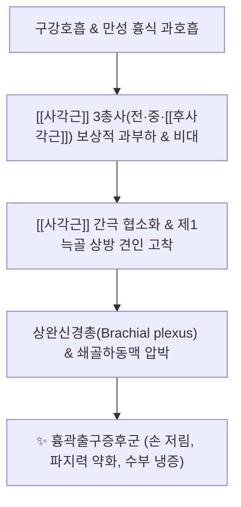
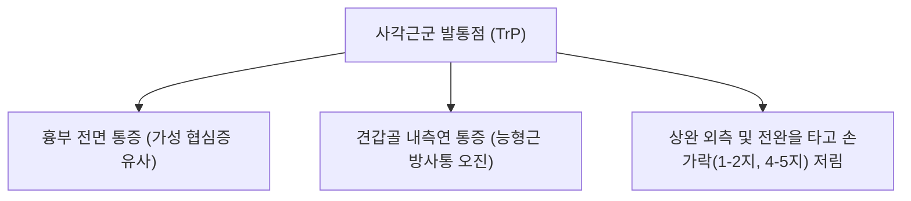

---
aliases:
  - 사각근
  - 목갈비근
  - Scalene muscles
  - Scaleni
---
# [[사각근]](Scalene muscles (Anterior, Middle, Posterior))

> **핵심 요약 (Key Summary)**:
> 제2~7경추 횡돌기에서 기원하여 제1·2늑골에 정지하는 [[전사각근]], [[중사각근]], [[후사각근]]으로 이루어진 경추 외측 삼각 근육군입니다.
> 경신경 전지(C3~C8)의 지배를 받으며, 경추의 굴곡·측굴·회전 및 흡기 시 흉곽 상구 거상(제1·2늑골 리프트)을 주도합니다.
> [[흉곽출구 증후군]](TOS), [[가성 협심증]], 상지 저림, 호흡 장애 및 기흉 위험이 가장 높은 핵심 중재 부위이며, 결분·천정혈 정밀 도침 및 약침이 표적입니다.

---
## 📌 목차
1. [해부학적 정밀 구조 및 지배 신경/혈관](#1-해부학적-정밀-구조-및-지배-신경혈관)
2. [생체역학·토크 분석 & 경부 근막 사슬 (Biomechanical Synergy)](#2-생체역학토크-분석--경부-근막-사슬-biomechanical-synergy)
3. [근막통증증후군(TP) & 연관통 패턴 (Travell & Simons)](#3-근막통증증후군tp--연관통-패턴-travell--simons)
4. [초음파 해부학(Sonoanatomy) 및 중재 시술 랜드마크](#4-초음파-해부학sonoanatomy-및-중재-시술-랜드마크)
5. [⭐ 원장님 심층 임상 고찰 및 원본 필기 (Clinical Pearls)](#5-원장님-심층-임상-고찰-및-원본-필기-clinical-pearls)
6. [관련 임상 질환 및 운동손상 증후군 총괄](#6-관련-임상-질환-및-운동손상-증후군-총괄)
7. [추나·도수치료(MET/PIR) & 침구·약침·재활 프로토콜](#7-추나도수치료metpir--침구약침재활-프로토콜)
8. [출처 및 학술 참고 문헌 (References)](#8-출처-및-학술-참고-문헌-references)

---
## 1. 해부학적 정밀 구조 및 지배 신경/혈관

| 근육 구분 | 기시부 (Origin) | 정지부 (Insertion) | 지배 신경 | 주요 혈관 |
| :--- | :--- | :--- | :--- | :--- |
| [[전사각근]] (Scalenus anterior) | C3~C6 횡돌기 전결절 | 제1늑골 상면 내측연의 [[사각근]] 결절 (Scalene tubercle) | 경신경 전지 (C4~C6) | 상행경동맥, 갑상경동맥 분지 |
| [[중사각근]] (Scalenus medius) | C2~C7 횡돌기 후결절 | 제1늑골 상면 (쇄골하동맥구 후방) | 경신경 전지 (C3~C8) | 경횡동맥, 심경동맥 분지 |
| [[후사각근]] (Scalenus posterior) | C4~C6 횡돌기 후결절 | 제2늑골 외측면 (전거근 부착부 상방) | 경신경 전지 (C6~C8) | 최고늑간동맥, 경횡동맥 |

### 🔬 해부학 도해 및 단면도
![[Scalene_muscles_anatomy.png|450]]
> [Gray's Anatomy 해부학 도해]: 제1늑골과 제2늑골 상면에 각각 정지하며 [[사각근]] 삼각(Scalene triangle)을 형성하는 [[전사각근]], [[중사각근]], [[후사각근]]의 층별 주행도.

![[Scalene_TriggerPoints.jpg|450]]
> [Travell & Simons 발통점 지도]: 사각근군 TrP에서 가슴 전면, 어깨, 상완 외측, 전완 요·척측 및 손가락(1·2지 및 4·5지)으로 방사되는 상지 연관통 패턴.

---
## 2. 생체역학·토크 분석 & 경부 근막 사슬 (Biomechanical Synergy)

* **경추 운동 및 분절 안정성 기전**:
  * **양측 수축 (Bilateral)**: 강력한 경추 전방 굴곡(Flexion) 및 기립 시 경추의 측방 안정성(Lateral stability) 보장.
  * **일측 수축 (Unilateral)**: 동측 측굴(Lateral flexion)을 강력히 유도하며, [[전사각근]]은 반대측 회전, [[후사각근]]은 동측 회전을 조율.
* **호흡 역학의 핵심 보조근 (Accessory Inspiratory Pump)**:
  * 정상 상태에서는 횡격막이 호흡의 80%를 담당하지만, 스트레스나 폐질환으로 흉식호흡이 우세해지면 사각근군이 하루 2만 번 이상 수축하여 제1·2늑골을 들어 올림 → 극심한 만성 피로와 경직 초래.
* **근막 사슬 연계 (Anatomy Trains)**:
  * [[심부전방선]](Deep Front Line, DFL): 발바닥에서 시작하여 [[장요근]], [[횡격막]]을 거쳐 흉곽 상구의 사각근군으로 이어지는 중심 코어 근막선.

---
## 3. 근막통증증후군(TP) & 연관통 패턴 (Travell & Simons)

* **발통점 및 임상 연관통 특징**:
  * **목 디스크 오진 최다 원인군**:
    * 신경근 압박 없이도 [[사각근]] 자체의 TrP 활성화만으로 어깨, 팔, 손가락 끝까지 찌릿한 저림과 시림을 유발.
  * **방사통의 분과적 특성**:
    * [[전사각근]] **TrP**: 대흉근(가성 협심증), 어깨 앞면, 상완 외측, 요골측 손가락(엄지, 검지) 저림.
    * [[중사각근]] **TrP**: 견갑골 내측연, 상완 후외측, 손등 방사통.
    * [[후사각근]] **TrP**: 흉부 외측 및 4~5지(약지, 새끼손가락) 저림.

---
## 4. 초음파 해부학(Sonoanatomy) 및 중재 시술 랜드마크

* [[사각근]] **간극(Interscalene Space) 초음파 소견**:
  * 쇄골 상와에서 선형 프로브를 횡단(Short-axis) 거치.
  * 전방의 [[전사각근]]과 후방의 [[중사각근]] 사이에 끼어 있는 [[상완신경총]] **신경근(C5~T1)들이 원형의 저에코 음영으로 정렬된 '신호등 징후(Traffic Light Sign)'** 관찰.
  * [[사각근]] 간극 하부 바닥을 형성하는 제1늑골의 고에코 골피질 반사선과 그 아래의 [[쇄골하동맥]] 박동 동정.
* **주요 관통 신경 랜드마크**:
  * [[횡격막신경]](Phrenic N.): [[전사각근]] 전면 근막 위를 사선으로 주행.
  * [[견갑배신경]] **(DSN) & [[장흉신경]](LTN)**: [[중사각근]] 근복 실질을 직접 관통하므로 수액박리술(Hydrodissection) 타깃.
* **기흉(Pneumothorax) 방지 안전 수칙 (CRITICAL)**:
  * 제1늑골 및 제2늑골 정지부 바로 아래에 **폐첨부(Apex of lung / Cupula of pleura)**가 위치.
  * **시술 절대 원칙**: 절대로 허공(늑간 공간)을 향해 찌르지 말고, **반드시 제1늑골 또는 제2늑골 골면에 침 끝을 정확히 안착(Bone touch)**시킨 상태에서만 수평 박리 시행 (수직 직자 절대 엄금).

---
## 5. ⭐ 원장님 심층 임상 고찰 및 원본 필기 (Clinical Pearls)

### 1) 흉곽출구 증후군(TOS)의 주범 (원장님 필기 100% 보존)
* 전·[[중사각근]] 비후 시 [[상완신경총]]과 [[쇄골하동맥]] 포착으로 인한 방사통 발생.
* **원장님 핵심 진단 팁**:
  * 환자가 "팔을 위로 들면 저림이 덜하다", "밤에 잘 때 팔을 베개 위로 올리고 잔다"고 호소하면 쇄골하 공간 포착보다 [[사각근]] 간극에서의 신경 포착([[흉곽출구 증후군]])을 강력히 의심해야 합니다.
  * **3대 이학적 검사 감별**:
    * [[애드슨 검사]](Adson test): 턱을 들고 환측 회전 후 심호흡 → 요골동맥 맥박 약화 시 [[전사각근]] 포착 확진.
    * [[모를리 검사]](Morley test): 쇄골 상와 [[사각근]] 삼각을 압박했을 때 상지 방사통 재현 시 사각근성 신경 포착 확진.
    * [[라이트 검사]](Wright test) / [[루스 검사]](Roos test): 상지 외전-외회전 상태에서 증상 유발 시 소흉근 및 늑쇄간극 복합 포착 감별.

### 2) 기흉 주의 및 안전 자침 각도 (원장님 필기 100% 보존)
* 결분혈 부위 자침 시 늑골 방향 수직 직자 금지, 사자 주행 필수.
* 결분혈 바로 밑 2~3cm 심부에는 폐첨부 흉막이 존재하므로, 침향을 흉곽 내측 아래로 향하는 직자는 기흉의 주원인이 됩니다. 항상 후외측 제1늑골 골면 방향으로 비스듬히 사자하여 뼈에 닿는 느낌을 손끝으로 확인해야 합니다.

### 3) 횡격막 호흡과의 연쇄 반응
* [[사각근]] 긴장 환자는 100% 횡격막 호흡 기능 부전을 동반합니다. [[사각근]] 치료 시 결분·천정 도침 박리와 함께 **횡격막 복식호흡 재교육**을 필수로 지도해야 재발을 영구히 차단할 수 있습니다.

---
## 6. 관련 임상 질환 및 운동손상 증후군 총괄

| 임상 질환 / 증후군 | 병리적 연관 기전 | 주요 증상 및 이학적 검사 | 핵심 교정 타깃 |
| :--- | :--- | :--- | :--- |
| [[흉곽출구 증후군]] | [[사각근]] 간극 협소화로 신경혈관 포착 | 손 저림, 수부 냉증, [[애드슨 검사]] 양성 | 제1늑골 [[사각근]] 결절 도침 감압 |
| [[가성 협심증]] | [[전사각근]] TrP 활성화로 전흉부 방사 | 좌측 가슴 뻐근함, 숨찬 느낌, EKG 정상 | [[전사각근]] 근복 침구 및 약침 |
| [[견갑배신경 포착증후군]] | [[중사각근]] 관통부에서 DSN 포착 | 견갑골 내측연 작열통, [[능형근]] 압통 | [[중사각근]] 신경 관통부 수액박리 |
| [[경추 측굴 장애]] | 사각근군의 편측성 만성 경축 | 고개 옆으로 꺾을 때 극심한 당김 | [[사각근]] MET 및 횡돌기 부착부 이완 |
| [[과호흡 증후군]] | 횡격막 무력증에 따른 흡기근 과부하 | 쇄골 상와 팽만감, 잦은 한숨, 만성 피로 | [[사각근]] 이완 및 복식호흡 재활 |

---
## 7. 추나·도수치료(MET/PIR) & 침구·약침·재활 프로토콜

* **한의학 경혈 매핑**:
  * 결분, 천정, 수돌, 기사, 견외유, 풍지
* **침구 및 침도(도침) 프로토콜**:
  * **결분혈(ST12) 도침 감압술 (절대 안전 수칙)**:
    * 쇄골 상와에서 쇄골하동맥 박동을 내측으로 견인 보호하고 제1늑골 상면 골면을 촉지.
    * 0.40x40mm 침도를 제1늑골을 향해 완만하게 사자하여 **반드시 제1늑골 골면에 Bone touch**.
    * 골막에 닿은 상태에서만 늑골 장축 방향으로 미세하게 1회 절개 박리.
* **약침 처방**:
  * **오공약침 / 봉약침**: 난치성 상지 저림, 신경인성 통증 환자의 천정-결분 라인 사각근막층 0.3~0.5cc 분할 주입.
  * **중성어혈약침**: 외상성 손상, 급성 경부 회전 장애, 수부 부종 및 냉증 환자 정지부 주입.
  * **자하거약침**: 만성 호흡기 장애, [[사각근]] 만성 위축 및 흉곽 경직 환자 조직 강화.
* **추나 및 신장 테크닉 (Scalene MET / PIR)**:
  * [[사각근]] **3분과별 선택적 MET**:
    * [[전사각근]]: 반대측 측굴 + 동측 회전 + 약간의 신전 장벽 거치 후 등척성 수축.
    * [[중사각근]]: 순수 반대측 측굴 장벽 거치 후 등척성 수축.
    * [[후사각근]]: 반대측 측굴 + 반대측 회전 + 약간의 굴곡 장벽 거치 후 등척성 수축.
    * 각 분과별 20% 힘으로 5초 저항 → 호기와 함께 15초 신장 (3회 반복).

---
## 8. 출처 및 학술 참고 문헌 (References)

1. **Standring, S. (2020)**. *Gray's Anatomy: The Anatomical Basis of Clinical Practice* (42nd ed.). Elsevier, pp. 582-585.
   - [연구 요약] 전·중·후사각근의 정밀 척추 부착부, [[사각근]] 삼각의 해부학적 경계와 상완신경총/쇄골하동맥의 통과 기전 제시.
2. **Travell, J. G., & Simons, D. G. (1999)**. *Myofascial Pain and Dysfunction: The Trigger Point Manual*, Vol. 1 (2nd ed.). Williams & Wilkins, pp. 504-537.
   - [연구 요약] [[사각근]] 3개 근육의 개별 트리거포인트 방사통 경로와 상지 저림 및 가성 협심증 감별 임상 지침 확립.
3. **Novak, C. B., & Mackinnon, S. E. (1996)**. Thoracic outlet syndrome. *Orthop Clin North Am*, 27(4), 747-762. [PMID: 8823394](https://pubmed.ncbi.nlm.nih.gov/8823394/)
   - [연구 요약] [[사각근]] 비대로 인한 흉곽출구증후군의 병태생리, 애드슨 검사의 민감도 및 보존적 중재 요법의 치료율 분석.
4. **Mackel, M. (2016)**. Thoracic outlet syndrome. *Curr Sports Med Rep*, 15(5), 344-349. [PMID: 26963010](https://pubmed.ncbi.nlm.nih.gov/26963010/)
   - [연구 요약] [[사각근]] 간극 신경혈관 압박에 대한 임상적 진단 알고리즘과 감압 요법의 효과 검증.