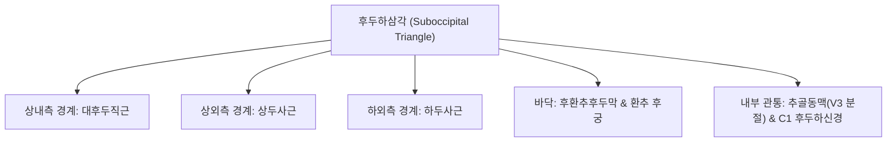

# 🫁 [[상두사근]] (Obliquus Capitis Superior)

> **핵심 요약 (Key Summary)**:
> 환추(C1) 횡돌기에서 기시하여 후두골 하항선 외측면에 정지하는 후두하삼각의 상외측 경계 근육.
> C1 척수신경의 후지인 후두하신경의 지배를 받아 환추후두관절(C0-C1)의 두부 신전 및 외측 굴곡을 수행하고 고유수용성 위치 감각을 제공.
> 일자목 및 거북목 자세에서 과긴장되어 후두하신경과 추골동맥을 압박하여 경추성 두통을 유발하며 C0-C1 후두하 이완 추나와 풍지혈 침치료의 핵심 표적.

---
## 📌 목차
1. [해부학적 정밀 구조 및 부착부 (Origin / Insertion)](#1-해부학적-정밀-구조-및-부착부-origin--insertion)
2. [후두하삼각(Suboccipital Triangle) 경계 및 통과 신경·혈관](#2-후두하삼각suboccipital-triangle-경계-및-통과-신경혈관)
3. [생체역학적 기능 & C0-C1 관절 제어](#3-생체역학적-기능--c0-c1-관절-제어)
4. [근막통증증후군(TP) & 삼차신경경부복합체(TCC) 두통 연관성](#4-근막통증증후군tp--삼차신경경부복합체tcc-두통-연관성)
5. [초음파 해부학(Sonoanatomy) 및 추골동맥 주행 랜드마크](#5-초음파-해부학sonoanatomy-및-추골동맥-주행-랜드마크)
6. [추나·도수치료(후두하 감압술) & 침구·약침 치료 프로토콜](#6-추나도수치료후두하-감압술--침구약침-치료-프로토콜)
7. [출처 및 학술 참고 문헌 (References)](#7-출처-및-학술-참고-문헌-references)

---
## 1. 해부학적 정밀 구조 및 부착부 (Origin / Insertion)

| 항목 | 상세 내용 |
| :--- | :--- |
| **기시 (Origin)** | 제1경추 환추(Atlas, C1) 횡돌기(Transverse process) 상면 |
| **정지 (Insertion)** | [[후두골]](Occipital bone) 하항선 외측부 (외측 1/3 영역, [[두판상근]] 심층) |
| **신경 지배** | [[C1 척수신경]] 후지인 [[후두하신경]](Suboccipital nerve, 운동 지배) |
| **혈관 공급** | [[추골동맥]](Vertebral artery)의 근육지, 후두동맥(Occipital artery) 하행지 |
| **길이 및 형태** | 길이 약 3~4cm의 두텁고 사선으로 비스듬히 상내측을 향하는 근복 |

---
## 2. 후두하삼각(Suboccipital Triangle) 경계 및 통과 신경·혈관

* **후두하삼각에서의 위치 관계**:
  * 상두사근은 삼각형의 상외측 변을 형성합니다.
  * 상두사근의 심층 바닥을 따라 뇌로 향하는 [[추골동맥]] 제3분절(V3 segment)이 대후두공을 향해 급격히 꺾여 주행하므로, 상두사근의 만성 단축은 뇌기저부 혈류 장애를 유발할 수 있습니다.

---
## 3. 생체역학적 기능 & C0-C1 관절 제어

* **환추후두관절(Atlanto-occipital Joint, C0-C1) 운동**:
  * **양측 수축**: 후두골을 후방으로 당겨 고개를 뒤로 젖히는 두부 신전(Extension) 및 미세 턱들림 제어.
  * **편측 수축**: 머리를 동측으로 기울이는 측굴(Lateral flexion)을 유도하고, 반대측으로의 미세 회전을 보조.
* **고유수용성 감각(Proprioception)의 고밀도 센터**:
  * 상두사근을 포함한 후두하근군은 인체 골격근 중 근방추(Muscle spindle) 밀도가 가장 높아, 안구 운동 및 전정기관과의 반사 협응(전정안구반사, VOR)을 통해 두부의 공간적 평형을 유지합니다.

---
## 4. 근막통증증후군(TP) & 삼차신경경부복합체(TCC) 두통 연관성

* **후두부 심부 연관통 지도**:
  * 상두사근의 발통점(TP)은 후두골 기저부 심부에서 시작하여 정수리를 거쳐 안와 후부 및 측두부로 투사되는 둔중한 조임통을 방사합니다.
* **경추성 두통(Cervicogenic Headache) 메커니즘**:
  * 상두사근의 과긴장은 C1 신경을 압박하고, 이는 뇌간 삼차신경 척수로핵(Spinal trigeminal nucleus)으로 구심성 통증 신호를 전달하여 눈골이 쑤시고 머리 전체가 지끈거리는 연관통을 야기합니다.

---
## 5. 초음파 해부학(Sonoanatomy) 및 추골동맥 주행 랜드마크

* **초음파 단축 및 사선 스캔**:
  * 탐촉자를 유양돌기와 C1 횡돌기 사이에 사선으로 거치하면 천층의 두판상근과 두반극근 아래로 C1 횡돌기에서 후두골로 주행하는 상두사근 단면을 식별할 수 있습니다.
  * 컬러 도플러를 켜면 상두사근 심층에서 박동하는 추골동맥 루프(Vertebral artery loop)를 확인할 수 있어 침자 시 안전 궤적 확보의 핵심 지표가 됩니다.

---
## 6. 추나·도수치료(후두하 감압술) & 침구·약침 치료 프로토콜

### 1) 추나요법 (Chuna Manual Therapy)
* **후두하근막 이완술 (Suboccipital Release)**:
  * 앙와위 환자의 후두골 하연에 손가락 끝 패드를 안착시키고, 상두사근 부착부를 부드럽게 두개측 및 미측으로 견인하여 C0-C1 관절 간격을 확보.
* **근에너지기법 (MET / Post-Isometric Relaxation)**:
  * 환자가 눈동자를 위로 향하게 하거나 머리를 아주 약하게 신전시키도록 유도한 후, 호기와 함께 후두하 근막을 동적으로 신장.

### 2) 침구 및 약침 치료
* **주요 혈위**:
  * 풍지(風池, GB20): 승모근과 흉쇄유돌근 사이, 상두사근 정지부 직하방 핵심 혈위.
  * 천주(BL10), 완골(GB12), 옥침(BL9).
* **약침 프로토콜**:
  * 풍지혈에서 C1 횡돌기 방향으로 천사자하여 상두사근 건막에 신바로 약침 또는 중성어혈 약침 0.3cc를 주입하여 후두하신경 압박을 감압.
  * 안전 주의: 지나친 심자(Deep puncture) 시 추골동맥 손상 위험이 있으므로 해부학적 심도(1.5~2cm 이내)를 철저히 엄수.

---
## 7. 출처 및 학술 참고 문헌 (References)

* Standring S. *Gray's Anatomy: The Anatomical Basis of Clinical Practice*. 42nd ed. Elsevier; 2020.
  * `[연구 요약]` 후두하근군의 미세 해부학, 상두사근의 주행 경로, 후두하삼각 경계 및 후두하신경 지배 분석.
* Bogduk N. Cervicogenic headache: Anatomic basis and pathophysiologic mechanisms. *Curr Pain Headache Rep*. 2001;5(4):382-386.
  * `[연구 요약]` 상두사근을 포함한 후두하 근육군의 근방추 과흥분 및 삼차신경-경부 복합체(TCC) 연관 두통 발생 기전.
* 대한척추신경추나의학회. *척추신경추사의학*. 대한척추신경추나의학회; 2019.
  * `[연구 요약]` C0-C1 환추후두관절 장애 및 상두사근 단축에 대한 후두하 이완 추나기법의 두통 완화 임상 유효성.
