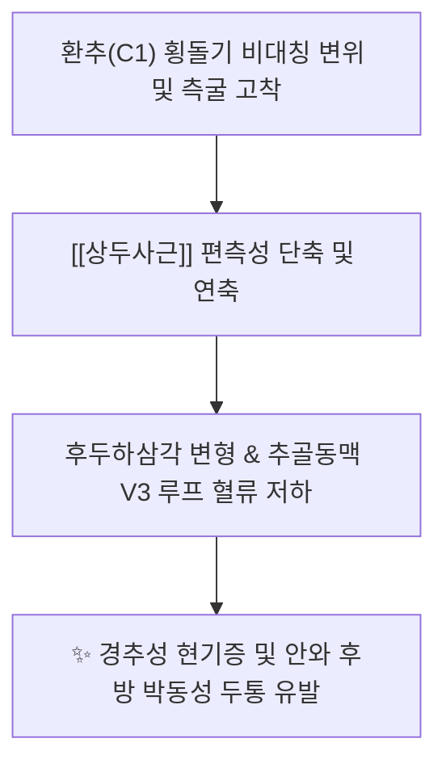
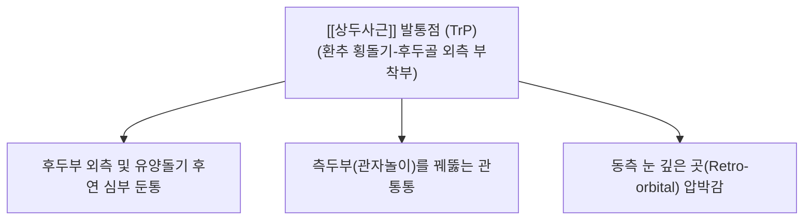

---
aliases:
  - 상두사근
  - 위머리사선근
  - Obliquus capitis superior
---
# [[상두사근]](Obliquus capitis superior)

> **핵심 요약 (Key Summary)**:
> 제1경추 횡돌기에서 기원하여 후두골 상항선과 하항선 사이 외측부에 정지하는 후두하삼각의 상외측 경계 근육입니다.
> 제1경추신경 후지인 후두하신경의 지배를 받으며, 두부의 신전, 동측 측굴 및 환추후두관절의 정밀한 삼차원 균형을 조율합니다.
> [[후두하 심부통]], 경추성 현기증, 안와 후방 압박감, 측두통의 핵심 병변근이며, 풍지·완골·천주 및 환추 횡돌기 부착부 침구가 표적입니다.

---
## 📌 목차
1. [해부학적 정밀 구조 및 지배 신경/혈관](#1-해부학적-정밀-구조-및-지배-신경혈관)
2. [생체역학·토크 분석 & 근막 사슬 (Biomechanical Synergy)](#2-생체역학토크-분석--근막-사슬-biomechanical-synergy)
3. [근막통증증후군(TP) & 연관통 패턴 (Travell & Simons)](#3-근막통증증후군tp--연관통-패턴-travell--simons)
4. [초음파 해부학(Sonoanatomy) 및 중재 시술 랜드마크](#4-초음파-해부학sonoanatomy-및-중재-시술-랜드마크)
5. [⭐ 원장님 심층 임상 고찰 및 원본 필기 (Clinical Pearls)](#5-원장님-심층-임상-고찰-및-원본-필기-clinical-pearls)
6. [관련 임상 질환 및 운동손상 증후군 총괄](#6-관련-임상-질환-및-운동손상-증후군-총괄)
7. [추나·도수치료(MET/PIR) & 침구·약침·재활 프로토콜](#7-추나도수치료metpir--침구약침재활-프로토콜)
8. [출처 및 학술 참고 문헌 (References)](#8-출처-및-학술-참고-문헌-references)

---
## 1. 해부학적 정밀 구조 및 지배 신경/혈관

| 항목 | 상세 내용 |
| :--- | :--- |
| **기시 (Origin)** | 제1경추(환추, Atlas, C1)의 횡돌기(Transverse process) 상면 |
| **정지 (Insertion)** | 후두골 상항선과 [[하항선]](Inferior nuchal line) 사이 외측 반부 골면 ([[두반극근]] 정지부 외측) |
| **신경 지배** | 제1경추신경 후지 ([[후두하신경]], Suboccipital nerve, C1 dorsal ramus) |
| **혈관 공급** | 후두동맥(Occipital A.) 하행지 및 추골동맥(Vertebral A.) 후두하 분지 |

### 🔬 해부학 도해 및 단면도
![[Obliquus_capitis_superior_anatomy.png|450]]
> [Wikipedia 공중도메인 해부학 도해]: 환추(C1) 횡돌기에서 후두골 상외측으로 비스듬히 상후방 주행하여 후두하삼각의 상외측 벽을 이루는 [[상두사근]]의 정밀 주행 관계.

---
## 2. 생체역학·토크 분석 & 근막 사슬 (Biomechanical Synergy)

* **환추후두관절(C0-C1 Joint)의 안정화 및 운동 제어**:
  * **두부 신전 (Extension)**: 양측 수축 시 후두골을 환추 위에서 후하방으로 당겨 신전을 보조.
  * **동측 측굴 (Lateral Flexion)**: 일측 수축 시 귀가 어깨 쪽으로 기울어지는 동측 측굴의 정밀한 미세 조절기 역할.
  * **대측 회전 억제**: 머리가 반대쪽으로 과도하게 회전될 때 편심성 긴장(Eccentric tension)으로 관절 탈구를 방어.
* **후두하삼각(Suboccipital Triangle) 상방 지붕 역할**:
  * 내측의 [[대후두직근]], 하방의 [[하두사근]]과 함께 삼각 공간을 형성하여, 내부에 위치한 **추골동맥 V3 분절**과 **후두하신경(C1)**을 물리적으로 보호하는 완충벽 형성.
* **근막 사슬 연계 (Anatomy Trains)**:
  * **표재후방선(Superficial Back Line, SBL)**: 후두골 부착부에서 모상건막 및 [[두판상근]] 외측 건막과 결합하여 두경부 측상방 인장력 조율.

---
## 3. 근막통증증후군(TP) & 연관통 패턴 (Travell & Simons)

![[Suboccipital_TriggerPoints.jpg|450]]
> [Travell & Simons 발통점 지도]: 후두하근군([[상두사근]]) 발통점에서 후두부 외측 기저부를 지나 측두부(관자놀이)와 안와 심부로 퍼지는 방사통 패턴.

* **발통점 및 연관통 특성**:
  * **후두부 외측 심부 둔통**:
    * 풍지혈과 완골혈 사이의 깊은 틈새에 묵직하고 지속적인 통증이 자리 잡음.
  * **관자놀이 및 안와 방사통**:
    * 통증이 머리 측면을 타고 관자놀이 깊은 곳과 안구 뒤쪽으로 방사되어 편두통과 매우 유사한 임상 양상 연출.
  * **동측 경추 측굴 제한**:
    * 고개를 반대쪽 어깨로 갸우뚱 기울일 때 후두골 외측 기저부에 찢어지는 듯한 저항감 발생.

---
## 4. 초음파 해부학(Sonoanatomy) 및 중재 시술 랜드마크

* **초음파 스캔 프로토콜**:
  * **프로브 위치**: 유양돌기 바로 아래 환추(C1) 횡돌기를 촉지한 후, 후두골 하항선 외측을 잇는 사선 단면(Oblique coronal-sagittal view) 거치.
  * **층별 확인**: 최표층 [[승모근]]/[[두판상근]] → 심층에서 C1 횡돌기에서 후두골로 상내측으로 올라가는 [[상두사근]] 근복 동정.
* **안전 마진 및 위험 구조물 회피 (CRITICAL)**:
  * **추골동맥 수평 분절(Vertebral A. V3 Segment) 보호**:
    * 상두사근의 바로 내하측 심부에는 환추 후궁의 동맥구를 타고 대후두공으로 들어가는 추골동맥이 위치합니다.
    * 침도나 장침 시술 시 절대로 환추 횡돌기 내측 빈 공간(삼각 내부)으로 깊이 자침해서는 안 되며, 반드시 **C1 횡돌기 상면 골면 또는 후두골 하항선 외측 골면에 정확히 안착(Bone touch)**시킨 상태에서만 미세 박리를 시행해야 합니다.

---
## 5. ⭐ 원장님 심층 임상 고찰 및 원본 필기 (Clinical Pearls)

### 1) 후두하 삼각의 상방 경계와 상부 경추 정렬 (원장님 필기 100% 보존)
* 상두사근은 [[대후두직근]], [[하두사근]]과 함께 후두하 삼각을 형성하여 상부 경추의 3차원 정렬을 조율하는 핵심 지지대입니다.
* **원장님 임상 팁**:
  * C1(환추)의 횡돌기는 인체 경추 중 가장 넓게 돌출되어 있어 외부 충격이나 턱괴기, 한쪽 턱으로 전화받기 등의 비대칭 습관에 의해 가장 쉽게 회전 변위(Atlas Subluxation)를 일으킵니다.
  * 환추 횡돌기가 한쪽으로 아탈구되면 상두사근이 편측으로 급격히 단축되어 후두하삼각이 찌그러지고 추골동맥의 미세 혈류 장애가 발생합니다.

### 2) 경추성 어지럼증과 환추 주변 고유수용기 (원장님 필기 100% 보존)
* 환추 횡돌기 주변은 인체에서 고유감각 수용기 밀도가 가장 높은 핵심 부위입니다.
* 상두사근의 만성 긴장은 뇌간으로 들어가는 고유수용성 신호를 왜곡시켜, 시각과 전정기관 간의 신호 불일치를 유발하여 **"땅이 솟아오르는 듯한 어지럼증"** 및 **"차멀미와 유사한 오심"**을 유발합니다.

### 3) 만성 측두통(관자놀이 두통)의 숨은 열쇠
* 관자놀이 통증 환자 치료 시 [[측두근]]만 치료해서 낫지 않는 경우, 십중팔구는 상두사근의 상부 TrP가 측두부로 방사통을 쏘고 있는 것입니다. 풍지혈 외측 깊은 곳의 상두사근을 풀어주면 측두통이 즉시 경감됩니다.

---
## 6. 관련 임상 질환 및 운동손상 증후군 총괄

| 임상 질환 / 증후군 | 병리적 연관 기전 | 주요 증상 및 이학적 검사 | 핵심 교정 타깃 |
| :--- | :--- | :--- | :--- |
| [[후두하 심부통]] | [[상두사근]] 연축 및 정지부 섬유화 | 머리 뒤쪽 외측 깊은 곳의 묵직한 압통 | 환추 횡돌기 상연 및 후두골 도침 |
| [[경추성 두통]] | TCC 수렴 및 측두부 연관통 투사 | 관자놀이 관통통, 안와 후방 압박 | 풍지·완골 심부 침구 감압 |
| 경추성 현기증 | 환추 주변 고유수용기 입력 왜곡 | 보행 시 중심 흔들림, 고개 돌릴 때 핑 돎 | 후두저 이완 수기 추나 |
| 환추 회전 아탈구 | [[상두사근]] 및 [[하두사근]] 비대칭 경축 | 경추 회전 가동역 비대칭, 턱 비대칭 | C1 횡돌기 직접 교정 추나 |
| 만성 시각피로 증후군 | 안구-경추 반사(VOR) 과부하 | 모니터 볼 때 눈 통증, 초점 맞추기 어려움 | [[상두사근]] 자하거약침 및 MET |

---
## 7. 추나·도수치료(MET/PIR) & 침구·약침·재활 프로토콜

* **한의학 경혈 매핑**:
  * 풍지, 천주, 완골, 옥침, 현로
* **침구 및 침도(도침) 프로토콜**:
  * **환추 횡돌기(C1) 상연 기시부**: 유양돌기 전하방 1cm에서 C1 횡돌기를 촉지한 후, 0.35x40mm 침도를 사용하여 횡돌기 골면에 Bone touch 후 골막 유착부를 가볍게 1회 상하 절개 박리.
  * **후두골 하항선 외측 정지부**: 후두골 골면에 수직으로 직자하여 골막 접촉 상태에서 탕전 박리.
* **약침 처방**:
  * **중성어혈약침**: 외상성 경부 편타 손상, C1 횡돌기 부위 국소 어혈성 압통 시 0.5cc 정밀 주입.
  * **황련해독탕약침**: 측두통, 안구 충혈, 찌르는 듯한 열성 박동통 동반 시 [[상두사근]] 근막층 주입.
  * **자하거약침**: 만성 경추성 현기증, 고령자 후두하 근위축 환자의 횡돌기 건골 복합체에 영양 공급.
* **추나 및 도수치료 (Suboccipital Release & MET)**:
  * **환추 횡돌기 직접 측굴 이완법**:
    * 환자 앙와위, 시술자는 모지구로 환자의 C1 횡돌기를 부드럽게 지지하고 반대측으로 가벼운 측굴 텐션을 부여.
  * **근에너지기법 (MET)**:
    * 환자에게 "귀를 동측 어깨 방향으로 20% 힘으로 살짝 기울이세요" 지시 후 5초간 등척성 수축, 호기와 함께 반대측 측굴 범위로 부드럽게 10초간 신장.

---
## 8. 출처 및 학술 참고 문헌 (References)

1. **Standring, S. (2020)**. *Gray's Anatomy: The Anatomical Basis of Clinical Practice* (42nd ed.). Elsevier, pp. 786-787.
   - **[연구 요약]**: 상두사근의 환추 횡돌기 기시 및 후두골 하항선 외측 정지 해부학, 후두하삼각의 경계 구조 분석.
2. **Travell, J. G., & Simons, D. G. (1999)**. *Myofascial Pain and Dysfunction: The Trigger Point Manual*, Vol. 1 (2nd ed.). Williams & Wilkins, pp. 447-461.
   - **[연구 요약]**: [[상두사근]] 발통점에 의한 측두부 관통통 및 안와 후방 연관통 방사 패턴 규명.
3. **Bogduk, N., & Govind, J. (2009)**. Cervicogenic headache: an assessment of the evidence on clinical diagnosis, invasive tests, and treatment. *Lancet Neurol*, 8(10), 959-968. [PMID: 19747657](https://pubmed.ncbi.nlm.nih.gov/19747657/)
   - **[연구 요약]**:  상부 경추부(C1~C3) 구심성 신호의 삼차신경경추핵 수렴 연관통 전이 기전과 경추성 두통 진단 근거 평가.
4. **Treleaven, J. (2008)**. Sensorimotor disturbances in neck disorders affecting postural stability, head and eye movement control. *Man Ther*, 13(1), 2-11. [PMID: 17702636](https://pubmed.ncbi.nlm.nih.gov/17702636/)
   - **[연구 요약]**: 상두사근을 포함한 후두하 심부근 고유수용기 병변이 자세 불안정 및 경추성 현기증을 유발하는 기전 규명.