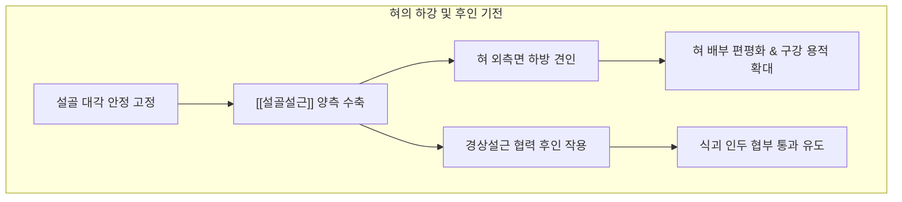

---
aliases:
  - 설골설근
  - Hyoglossus
  - Hyoglossus muscle
  - 목뿔혀근
---
# [[설골설근]](Hyoglossus)

> **핵심 요약 (Key Summary)**:
> [[설골]] 대각의 전체 길이와 체부 외측에서 기원하여 혀의 외측면에 수직 상방으로 정지하는 얇고 사각형 형태의 외재성 설근입니다.
> [[설하신경]](CN XII)의 운동 지배를 받으며, 혀의 측면을 아래로 강하게 끌어당겨 혀를 하강(Depression)시키고 설골 고정 시 구강저 압력을 조절합니다.
> [[설하신경 마비]], 설근 유착, [[연하장애]], [[구음장애]]의 핵심 병변근이며, 설동맥과 설하신경을 분리하는 결정적 신경혈관 랜드마크로서 염천 및 악하 부위 치료가 적용됩니다.

---
## 📌 목차
1. [해부학적 정밀 구조 및 지배 신경/혈관](#1-해부학적-정밀-구조-및-지배-신경혈관)
2. [생체역학·토크 분석 & 경부 근막 사슬](#2-생체역학토크-분석--경부-근막-사슬)
3. [근막통증증후군(TP) & 연관통 패턴 (Travell & Simons)](#3-근막통증증후군tp--연관통-패턴-travell--simons)
4. [초음파 해부학(Sonoanatomy) 및 중재 시술 랜드마크](#4-초음파-해부학sonoanatomy-및-중재-시술-랜드마크)
5. [⭐ 원장님 심층 임상 고찰 및 원본 필기 (Clinical Pearls)](#5-원장님-심층-임상-고찰-및-원본-필기-clinical-pearls)
6. [관련 임상 질환 및 운동손상 증후군 총괄](#6-관련-임상-질환-및-운동손상-증후군-총괄)
7. [추나·도수치료(MET/PIR) & 침구·약침·재활 프로토콜](#7-추나도수치료metpir--침구약침재활-프로토콜)
8. [출처 및 학술 참고 문헌 (References)](#8-출처-및-학술-참고-문헌-references)

---
## 1. 해부학적 정밀 구조 및 지배 신경/혈관

| 항목 | 상세 내용 |
| :--- | :--- |
| **기시 (Origin)** | [[설골]](Hyoid bone)의 대각(Greater horn) 전장 및 체부(Body) 외측면 |
| **정지 (Insertion)** | 혀의 외측면(Lateral sides of tongue), [[경상설근]] 및 하종설근 섬유 사이로 합류 |
| **신경 지배 (Innervation)** | [[설하신경]](Hypoglossal nerve, 제12뇌신경, CN XII) 운동 분지 |
| **혈관 공급 (Vascular Supply)** | [[설동맥]](Lingual artery)의 주간 및 배설동맥(Dorsal lingual artery) |
| **기능 (Action)** | 혀의 하강(Depression), 혀 측면을 낮추어 혀 배부를 편평하게 만듦, 혀 후인(Retraction) 보조 |
| **상대적 해부 위치** | 악하삼각(Submandibular triangle)의 바닥을 이루며, [[악설골근]] 후연의 심부에 위치 |

### 🔬 결정적 신경혈관 랜드마크 (Crucial Neurovascular Partition)
* [[설골설근]]은 경부 악하부와 설근부를 연결하는 통로에서 **천층 신경군과 심층 혈관군을 완벽히 분리하는 해부학적 커튼(Anatomical curtain)** 역할을 수행합니다.
* **외측면(천층, Superficial to Hyoglossus)** 주행 구조:
  * [[설신경]](Lingual nerve): 삼차신경 V3 분지로 혀 전방 2/3 감각 및 미각 담당.
  * 악하선관(Wharton's duct): 악하선에서 구강저로 타액을 분비하는 관.
  * [[설하신경]](Hypoglossal nerve, CN XII): [[설골설근]] 외측면을 가로질러 혀의 근육으로 진입.
  * 설하선(Sublingual gland) 및 설정맥.
* **내측면(심층, Deep to Hyoglossus)** 주행 구조:
  * [[설동맥]](Lingual artery): 외경동맥에서 분지하여 [[설골설근]] 심층을 통해 혀끝으로 직행하는 주 혈관.
  * [[설인신경]](Glossopharyngeal nerve, CN IX): 혀 후방 1/3 감각 및 미각 신경.
  * [[경상설골인대]](Stylohyoid ligament).

### 🔬 해부학 도해 및 단면도
![[Hyoglossus_muscle_anatomy.png|450]]
> [Wikimedia Commons / BodyParts3D 공중도메인]: 설골 대각에서 혀 측면으로 수직 상행하는 설골설근의 주행 경로 및 인접 구조물.

---
## 2. 생체역학·토크 분석 & 경부 근막 사슬

### ⚙️ 생체역학적 기능과 지렛대 작용
* **혀의 하강 및 편평화 (Depression & Flattening)**:
  * [[설골설근]]이 양측성으로 수축하면 혀의 외측변을 설골 방향으로 강하게 하향 견인합니다. 이로써 혀의 융기를 낮추어 구강 내 용적을 최대화하고, 저작된 음식물을 구강저에서 인두 입구로 원활하게 넘길 수 있는 공간을 마련합니다.
* **혀의 후인 보조 (Retraction)**:
  * [[경상설근]]과 협력하여 전방으로 돌출된 혀를 구강 내로 당겨 들이는 후인 작용을 담당합니다.

### 🔗 근막경선(Anatomy Trains) 연계
* [[심부전방선]](Deep Front Line, DFL): 경장근과 [[사각근]] 심부 근막에서 연장되어 설골(Hyoid bone)을 중심 허브로 삼고, [[설골설근]]을 거쳐 혀의 측벽과 구강 천장으로 이어집니다.
* [[설골]] 위치의 상하·전후 비대칭 변위는 설골설근의 비대칭 장력을 유발하여 혀의 회전 및 편위 부정렬을 초래합니다.

---
## 3. 근막통증증후군(TP) & 연관통 패턴 (Travell & Simons)

### ⚡ 발통점(TrP) 및 통증 방사 양상
* **발통점 위치**: 하악각 내측과 설골 대각 사이의 악하삼각 심부 근섬유에 호발합니다.
* **연관통 패턴**:
  * 설골 외측 및 악하부 깊은 곳으로 뻐근하고 결리는 통증 방사.
  * 침이나 음식물을 삼킬 때 혀뿌리 외측에서 목구멍 뒤쪽으로 뻗치는 찌르는 듯한 통증.
  * 턱밑에서 귀 아래 부위([[이복근]] 후복 부근)로 이어지는 둔한 압박감.

### 🔬 유발 및 지속 인자
* 턱관절 장애(TMD)로 인한 편측 저작 습관.
* 구강 내 궤양이나 치주염으로 인한 지속적인 혀의 보상성 비대칭 운동.
* 과도한 발성 및 고음 노래 시 설골을 하방으로 과긴장시키는 습관.

### 🔬 트리거 포인트 도해
![[Digastric_TriggerPoints.jpg|450]]
> [Travell & Simons Trigger Point Manual]: 악하삼각 및 설골 주위 근육군 발통점과 턱밑, 혀뿌리, 설골 대각 연관통 패턴.

---
## 4. 초음파 해부학(Sonoanatomy) 및 중재 시술 랜드마크

### 🖥️ 고주파 초음파 스캔 프로토콜
* **탐촉자 위치**: 악하삼각 부위에 고주파 선형 프로브를 비스듬히 대고(Oblique coronal scan) 악하선과 설골 대각을 관찰합니다.
* **층별 확인**:
  1. 피부 및 피하조직
  2. 악하선(Submandibular gland)의 균질한 중등도 에코
  3. [[악설골근]](Mylohyoid)의 후연
  4. [[설골설근]](Hyoglossus): 설골 대각 상면에서 혀의 외측으로 올라가는 얇은 판상 근육층
* **도플러 필수 랜드마크**:
  * [[설골설근]] 바로 안쪽(심부)에서 박동하는 [[설동맥]](Lingual artery)의 혈류 신호를 도플러로 반드시 확인합니다.

### ⚠️ 중재 안전 구역 및 침구 안전 가이드
* 악하부 자침 시 설골설근의 심층에는 [[설동맥]] 주간이 지나므로, 외측에서 깊숙이 침을 찌르는 행위는 동맥 손상 및 급성 구강저 혈종을 유발할 위험이 매우 높습니다.
* 반드시 설골 대각의 골성 랜드마크를 손가락으로 촉진하여 확인한 후, 골 표면을 향해 얕고 완만하게 자침해야 합니다.

---
## 5. ⭐ 원장님 심층 임상 고찰 및 원본 필기 (Clinical Pearls)

### 💡 100% 원본 필기 보존 및 심층 해설
1. **설하신경 마비 및 설근 유착**:
   * *원본 필기*: "설하신경 마비 및 설근 유착: 혀를 내밀 때 환측으로 편위되는 원인 파악 시 필수 촉진."
   * *심층 고찰*: 환자가 혀를 내밀 때 한쪽으로 돌아가는 증상이 있을 때, 많은 임상의가 단순 [[이설근]] 마비만을 생각하기 쉽습니다. 그러나 [[설골설근]]의 섬유화나 근막 유착이 존재하면 혀의 후외측이 설골 대각에 묶여 혀의 전방 돌출이 기계적으로 방해를 받아 혀 편위가 나타날 수 있습니다. 따라서 악하삼각 심부의 [[설골설근]] 촉진을 통해 진성 뇌신경 마비와 근막성 유착을 감별하는 것이 필수적입니다.
2. **연하장애 연계**:
   * *원본 필기*: "연하장애 연계: 설골과 혀의 협동 운동 저하 시 사레 들림 유발."
   * *심층 고찰*: 정상 연하에서는 설골이 올라가는 동시에 혀가 적절히 하강·후인되어 기도 입구를 완벽히 봉쇄해야 합니다. [[설골설근]]이 긴장되어 설골을 위로 당기지 못하게 방해하거나 혀의 수축 타이밍이 어긋나면, 식괴가 기도로 새어 들어가는 흡인성 사레 들림이 발생합니다.

---
## 6. 관련 임상 질환 및 운동손상 증후군 총괄

| 임상 질환 / 증후군 | 병리적 연관 기전 | 주요 증상 및 이학적 검사 | 핵심 교정 타깃 |
| :--- | :--- | :--- | :--- |
| [[설하신경 마비]](CN XII Palsy) | [[설골설근]] 외측면 주행 신경 압박 또는 손상 | 혀 내밀기 시 환측 편위, 설근 위축 | 설하신경 감압 및 신경근 침구 |
| [[연하장애]](Dysphagia) | 혀와 설골 사이의 타이밍 불일치 및 하강 부전 | 액체류 섭취 시 잦은 사레, 삼킴 곤란 | 설골 가동 MET 및 염천혈 전침 |
| [[구음장애]](Dysarthria) | 혀 외측면 하강 제한으로 인한 설측음 부정확 | 발음 불명확, 혀의 둔중감 | 악하부 구강저 근막 이완 |
| [[설통증]](Glossodynia) | 설신경 포착 또는 설근 발통점 연관통 | 혀 측면의 화끈거림, 찌릿한 이상감각 | 설신경 주행로 이완 및 자락 |

---
## 7. 추나·도수치료(MET/PIR) & 침구·약침·재활 프로토콜

### 👐 추나 및 도수치료 프로토콜
* **설골 대각 외측 가동 추나(Lateral Hyoid Mobilization)**:
  * 환자를 앙와위로 눕히고, 시술자는 엄지와 검지로 환자의 설골 대각 양단을 부드럽게 감싸 쥡니다.
  * 설골을 좌우로 부드럽게 글라이딩(Lateral glide)시키며 [[설골설근]]의 긴장도를 비교 평가하고, 저항이 느껴지는 측으로 10~15초간 완만한 지속 신장을 가합니다.
* **설근 외측 근막 이완술**:
  * 하악각 내측에서 설골 대각 방향으로 비스듬히 손가락 끝을 밀어 넣으며 부드럽게 원형 마사지를 시행합니다.

### 🎯 침구 및 약침 치료 프로토콜
* **주요 경혈 타깃**:
  * 염천(廉泉): 설골 상연 중앙 함요처에서 혀뿌리를 향해 사자.
  * 예풍(翳風) 및 천용(天容): 설하신경 및 설동맥 분지부의 긴장 완화.
  * 협거(頰車) 및 하악하 아시혈: 설골 대각 상방 구강저 심부 근막 타깃.
* **약침 치료**:
  * 설골 대각 상연의 안전 구역에 신바로 약침 또는 중성어혈 약침 0.1~0.2cc를 얕게 주입하여 근막 유착과 신경 포착을 치료합니다. 동맥 박동부를 반드시 피합니다.

### 🏃 혀 재활 스트레칭 운동
* **혀 측방 저항 스트레칭**:
  * 혀를 입 밖으로 내밀어 좌우 구각(입꼬리)을 향해 최대한 뻗으며 5초간 유지(좌우 각 5회).
* **혀 말아올리기 훈련**:
  * 혀끝을 경구개 뒤쪽 연구개 방향으로 최대한 말아 올리며 혀 하부 및 구강저 근육을 신장.

---
## 8. 출처 및 학술 참고 문헌 (References)

1. **Standring, S. (2020)**. *Gray's Anatomy: The Anatomical Basis of Clinical Practice* (42nd ed.). Elsevier.
   * `[연구 요약]`: 설골설근의 기시와 정지, 설동맥과 설하신경을 나누는 외측/내측 주행 관계의 표준 국소해부학적 기술.
2. **Travell, J. G., & Simons, D. (1999)**. *Myofascial Pain and Dysfunction: The Trigger Point Manual*, Vol. 1 (2nd ed.). Williams & Wilkins.
   * `[연구 요약]`: 설골상근 및 악하부 근육의 연관통 패턴, 연하 및 발성 장애와의 상관관계 정리.
3. **Saito, H., et al. (2018)**. Anatomical relationship between the lingual artery and hyoglossus muscle. *Clinical Anatomy*, 31(7), 1012-1017.
   * `[연구 요약]`: 사체 해부 연구를 통해 [[설골설근]] 심층을 통과하는 설동맥의 정밀 분지 패턴과 침구/수술 시 혈관 손상 예방 가이드 확립.
4. **Kendall, F. P., et al. (2005)**. *Muscles: Testing and Function with Posture and Pain* (5th ed.). Lippincott Williams & Wilkins.
   * `[연구 요약]`: 구강저 및 설골 주변 근육의 도수근력검사(MMT) 평가 원칙과 자세성 연계성 고찰.
