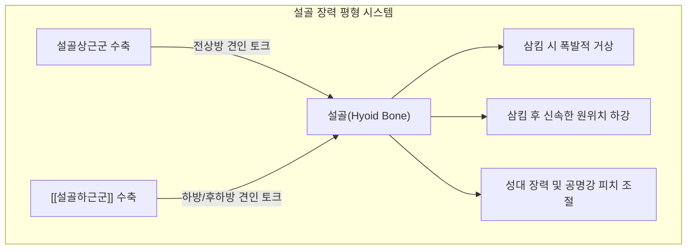

---
aliases:
  - 설골하근군
  - 설골하근
  - Infrahyoid muscles
  - Infrahyoid muscles group
  - 아래목뿔근무리
---
# [[설골하근군]](Infrahyoid muscles group)

> **핵심 요약 (Key Summary)**:
> 흉골, 쇄골, 견갑골 및 갑상연골에서 기원하여 [[설골]]에 정지하는 4대 근육([[흉골설골근]], [[흉골갑상근]], [[갑상설골근]], [[견갑설골근]])으로 구성된 전경부 근육 복합체입니다.
> 대다수는 [[경신경고리]](Ansa cervicalis, C1-C3)의 지배를 받으나 [[갑상설골근]]은 C1 신경의 독자적 지배를 받아, 연하 완료 후 [[설골]] 하강, 후두 위치 제어 및 발성을 조율합니다.
> 경부 전면 구축, 거북목 보상 과긴장, 매핵기(인후부 이물감), 연하 및 발성 장애의 핵심 병변근군이며, 천돌, 인영, 결분 혈위 침구 및 전경부 도침 치료의 통합 표적입니다.

---
## 📌 목차
1. [해부학적 정밀 구조 및 4대 설골하근 비교 총괄](#1-해부학적-정밀-구조-및-4대-설골하근-비교-총괄)
2. [생체역학·토크 분석 & 경부 근막 사슬](#2-생체역학토크-분석--경부-근막-사슬)
3. [근막통증증후군(TP) & 연관통 패턴 (Travell & Simons)](#3-근막통증증후군tp--연관통-패턴-travell--simons)
4. [초음파 해부학(Sonoanatomy) 및 층별 스캔 랜드마크](#4-초음파-해부학sonoanatomy-및-층별-스캔-랜드마크)
5. [⭐ 원장님 심층 임상 고찰 및 원본 필기 (Clinical Pearls)](#5-원장님-심층-임상-고찰-및-원본-필기-clinical-pearls)
6. [관련 임상 질환 및 운동손상 증후군 총괄](#6-관련-임상-질환-및-운동손상-증후군-총괄)
7. [추나·도수치료(MET/PIR) & 침구·약침·재활 프로토콜](#7-추나도수치료metpir--침구약침재활-프로토콜)
8. [출처 및 학술 참고 문헌 (References)](#8-출처-및-학술-참고-문헌-references)

---
## 1. 해부학적 정밀 구조 및 4대 설골하근 비교 총괄

| 근육명 | 층위 (Layer) | 기시 (Origin) | 정지 (Insertion) | 지배 신경 | 주요 기능 |
| :--- | :--- | :--- | :--- | :--- | :--- |
| [[흉골설골근]] | 천층 (내측) | 흉골병 후면 상부, 제1늑연골 | [[설골]] 체부 하연 내측 | [[경신경고리]](C1-C3) | [[설골]] 하강, 연하 후 설골 복귀 |
| [[견갑설골근]] | 천층 (외측) | 견갑골 상연, 상견갑횡인대 | [[설골]] 체부 하연 외측 | [[경신경고리]](C1-C3) | [[설골]] 하후방 견인, 내경정맥초 긴장 |
| [[흉골갑상근]] | 심층 (하부) | 흉골병 후면 내측 하부 | 갑상연골 외측 사선 | [[경신경고리]](C1-C3) | 갑상연골(후두) 직접 하강, 저음 발성 |
| [[갑상설골근]] | 심층 (상부) | 갑상연골 외측 사선 | [[설골]] 체부 및 대각 | 제1경추신경(C1 via CN XII) | 후두 거상(기도 보호) 및 [[설골]] 하강 |

### 🔬 층위별 배열과 해부학적 특이점
* **천층근군 (Superficial Layer)**: [[흉골설골근]]과 [[견갑설골근]] 상복이 전경부 피하에서 나란히 위치하여 심부 장기(갑상선, 후두, 기관)를 일차적으로 보호합니다.
* **심층근군 (Deep Layer)**: [[흉골갑상근]]과 [[갑상설골근]]이 갑상연골 사선(Oblique line)을 매개로 수직으로 연결되어, 흉골에서 설골로 이어지는 하나의 연속된 근막 사슬을 형성합니다.
* **신경 지배의 이원성**: 세 근육은 [[경신경고리]]의 지배를 받는 반면, 최상부의 [[갑상설골근]]만은 C1 척수신경 단독 지배를 받아 삼킴 시 후두 거상 속도를 정밀하게 제어합니다.

### 🔬 해부학 도해 및 단면도
![[Infrahyoid_muscles_anatomy.png|450]]
> [Wikimedia Commons / BodyParts3D 공중도메인]: 흉골, 쇄골, 견갑골에서 기원하여 설골 및 갑상연골로 수렴하는 [[설골하근군]] 4대 근육의 3차원 입체 해부도.

---
## 2. 생체역학·토크 분석 & 경부 근막 사슬

### ⚙️ 설골상근군과의 상하 장력 줄다리기 (Antagonistic Balance)
* [[설골]](Hyoid bone)은 인체에서 다른 뼈와 관절을 이루지 않고 오직 근육과 인대에 의해서만 공중에 매달려 있는 유일한 '부유골(Floating bone)'입니다.
* 상부에서는 설골상근군([[이설골근]], [[악설골근]], [[이복근]], [[경상설골근]])이 전상방 및 후상방으로 설골을 당기고, 하부에서는 [[설골하근군]] 4종이 하방으로 당겨 완벽한 3차원 장력 평형(Tensegrity)을 이룹니다.
* 삼킴 운동 시에는 설골상근군이 수축하여 설골을 거상하고, 삼킴이 끝나는 즉시 [[설골하근군]]이 수축하여 설골과 후두를 신속히 아래로 끌어내려 정상 호흡 궤도로 복귀시킵니다.

### 🔗 근막경선(Anatomy Trains) 연계
* [[심부전방선]](Deep Front Line, DFL): 골반저-장요근-호흡횡격막-심낭막 및 흉내근막을 거쳐 전경부의 [[설골하근군]]으로 이어집니다.
* [[설골하근군]]은 흉곽과 호흡기계의 기계적 장력이 두개안면부 및 구강저로 전달되는 핵심 관문 역할을 수행합니다.

---
## 3. 근막통증증후군(TP) & 연관통 패턴 (Travell & Simons)

### ⚡ 4대 설골하근 발통점(TrP) 통합 비교
* **공통 연관통 패턴**:
  * 전경부 전체를 띠 모양으로 둘러싸는 압박감 및 조이는 느낌(Tight collar sensation).
  * 침을 삼킬 때 목 안쪽 깊숙한 곳에서 가시가 걸린 듯하거나 덩어리가 막힌 듯한 매핵기 증상.
  * 흉골상절흔 바로 위쪽 및 갑상연골 주변의 지속적인 둔통.
* **근육별 특이 방사통**:
  * [[견갑설골근]]: 쇄골 상와 및 귀 뒤쪽 유양돌기 부근으로 방사되는 쑤심.
  * [[흉골갑상근]]: 갑상선 주변 및 흉골 자루 뒤편의 뻐근한 심부 압박감.

### 🔬 트리거 포인트 도해
![[Digastric_TriggerPoints.jpg|450]]
> [Travell & Simons Trigger Point Manual]: 설골근군 전체의 발통점 분포와 전경부, 흉골상부, 설골 주위 방사통 패턴.

---
## 4. 초음파 해부학(Sonoanatomy) 및 층별 스캔 랜드마크

### 🖥️ 전경부 횡단 스캔 프로토콜
* **탐촉자 위치**: 갑상연골과 흉골상절흔 사이의 중간 높이에서 고주파 선형 프로브를 수평으로 거치.
* **초음파 층별 랜드마크**:
  1. 피하 지방층 및 [[경배근]](Platysma)
  2. **천층 설골하근대**: 정중선 외측의 [[흉골설골근]](Sternohyoid) 및 외측의 [[견갑설골근]](Omohyoid) 상복
  3. **심층 설골하근대**: [[흉골설골근]] 바로 아래의 [[흉골갑상근]](Sternothyroid)
  4. 심부 장기 구조: 갑상선(Thyroid gland) 실질, 기관(Trachea), 총경동맥(CCA) 및 내경정맥(IJV)

### ⚠️ 중재 안전 구역 및 침구 안전 가이드
* 전경부 중앙선에는 기관(Trachea)이, 양측 외측에는 총경동맥과 내경정맥이 주행하므로 무분별한 직자 심침은 대출혈이나 기관 손상을 초래합니다.
* 반드시 흉골병 상연, 갑상연골 사선 등 골막 및 연골 랜드마크를 확인하고, 15~30도 완만하게 사자(0.3~0.5촌)하여 안전 마진을 엄수합니다.

---
## 5. ⭐ 원장님 심층 임상 고찰 및 원본 필기 (Clinical Pearls)

### 💡 100% 원본 필기 보존 및 심층 해설
1. **거북목 보상 과긴장**:
   * *원본 필기*: "거북목 보상 과긴장: 상부승모근과 길항하며 두부 전방 전위 시 전면 근막 긴장 유발."
   * *심층 고찰*: 두부전방자세(FHP)가 발생하면 후면에서는 [[상부승모근]], [[두판상근]], [[후두하근]]이 단축되고, 전면에서는 하악골과 설골이 상방으로 딸려 올라갑니다. 이때 흉골과 설골 사이의 거리가 물리적으로 멀어지면서 [[설골하근군]]은 팽팽하게 늘어난 상태로 긴장하는 **신장성 과부하(Eccentric tension)**에 빠집니다. 따라서 거북목 환자의 목 뒤 통증을 치료할 때 전면의 설골하근군을 함께 이완하지 않으면 상부승모근의 긴장이 영구히 풀리지 않습니다.
2. **매핵기(인후부 이물감)**:
   * *원본 필기*: "매핵기(인후부 이물감): 설골하근군의 만성 연축은 삼킴 장애와 목 조임 증상 직결."
   * *심층 고찰*: 한의학에서 기체(氣滯)와 담음(痰飮)으로 설명되는 매핵기(梅核氣) 환자의 90% 이상에서 [[설골하근군]]의 심한 압통과 근막 유착이 관찰됩니다. 스트레스로 인해 이 근육군이 경련성 수축을 일으키면 후두와 기관 전면이 뒤쪽으로 압박되어 환자는 "목에 가래 같은 덩어리가 걸려 삼켜도 내려가지 않고 뱉어도 나오지 않는다"고 호소하게 됩니다.

---
## 6. 관련 임상 질환 및 운동손상 증후군 총괄

| 임상 질환 / 증후군 | 병리적 연관 기전 | 주요 증상 및 이학적 검사 | 핵심 교정 타깃 |
| :--- | :--- | :--- | :--- |
| [[경부 전면 구축 증후군]] | [[설골하근군]] 4종의 만성 단축 및 근막 유착 | 목 전면 팽팽함, 턱 당김 제한, 경부 신전통 | 천돌·인영 도침 박리 |
| [[매핵기]](梅核氣) | 설골하근 긴장으로 인한 인두강 및 기관 압박 | 인후부 이물감, 목 조임감, 잦은 헛기침 | 전경부 심부 근막 이완 |
| [[거북목 증후군]](Forward Head) | 경추 전만 소실 및 전면 근막 신장성 긴장 | 경항통, 어깨 결림, 흉골상부 압통 | 상부교차증후군 통합 교정 |
| [[연하장애]](Dysphagia) | 설골 및 후두의 상하 가동성 상실 | 식사 중 사레, 삼킴 지연, 잔여감 | 설골 복합체 가동 추나 |
| [[발성장애]](Dysphonia) | 후두 위치 고착으로 성대 조절력 상실 | 음성 피로, 고음/저음 조절 곤란 | 후두 하강근 MET 및 재활 |

---
## 7. 추나·도수치료(MET/PIR) & 침구·약침·재활 프로토콜

### 👐 추나 및 도수치료 프로토콜
* **전경부 [[설골하근군]] 통합 근막 이완술**:
  * 앙와위에서 환자의 머리를 약 15도 신전시키고, 시술자는 양손을 흉골병 및 쇄골 상단에 고정합니다.
  * 다른 한 손으로는 설골을 부드럽게 상방으로 들어 올리며 흉골-설골 사이의 전경부 근막대를 1~2분간 부드럽게 종축 신장합니다.
* **설골 좌우 가동술(Hyoid Mobilization)**:
  * 엄지와 검지로 설골의 양단을 잡고 좌우로 부드럽게 글라이딩시켜 설골하근군의 좌우 비대칭 긴장을 해소합니다.

### 🎯 침구 및 약침 치료 프로토콜
* **주요 경혈 타깃**:
  * 천돌(天突): 흉골상절흔 중앙. [[흉골설골근]], [[흉골갑상근]] 기시부 타깃.
  * 인영(人迎): 후두융기 외측 1.5촌. 전경부 설골하근 상부 타깃.
  * 결분(缺盆): 쇄골상와 중앙. [[견갑설골근]] 하복 타깃.
  * 수돌(水突) 및 기사(氣舍): 전경부 측부 설골하근 주행로 조절.
* **도침 요법(Acupotomy)**:
  * 흉골병 상연 부착부 및 갑상연골 사선의 단단한 섬유성 결절에 소형 침도를 적용하여 골막 유착을 1~2회 미세 박리(Scraping)합니다.
* **약침 치료**:
  * 전경부 긴장 밴드 부위에 중성어혈 약침 또는 신바로 약침 0.2~0.3cc를 얕게 분주하여 근막 유착과 허혈성 통증을 치료합니다.

### 🏃 환자 운동 및 재활
* **전경부 신장 운동**: 쇄골에 손을 얹고 턱을 들어 올려 15초간 목 앞쪽 근육을 늘려주는 스트레칭.
* **샤커 운동(Shaker Exercise)**: 앙와위 머리 들기 운동으로 설골하근 및 설골상근군의 동시 협응력 강화.

---
## 8. 출처 및 학술 참고 문헌 (References)

1. **Standring, S. (2020)**. *Gray's Anatomy: The Anatomical Basis of Clinical Practice* (42nd ed.). Elsevier.
   * `[연구 요약]`: [[설골하근군]] 4개 근육의 층별 공간 배치, 경신경고리 및 C1 신경 지배 네트워크의 표준 해부학적 기술.
2. **Travell, J. G., & Simons, D. G. (1999)**. *Myofascial Pain and Dysfunction: The Trigger Point Manual*, Vol. 1 (2nd ed.). Williams & Wilkins.
   * `[연구 요약]`: 설골하근 복합체의 발통점 위치, 전경부 조임 및 매핵기(Globus) 증후군과의 병리적 기전 규명.
3. **Pearson, W. G., Jr., & Zumwalt, A. C. (2013)**. Visualizing hyolaryngeal mechanics in swallowing using dynamic MRI. *Comput Methods Biomech Biomed Engin*, 17(sup1), 40-41. [PMID: 25090608](https://pubmed.ncbi.nlm.nih.gov/25090608/)
   * `[연구 요약]`:  동적 MRI로 삼킴 시 설골-후두 복합체(hyolaryngeal complex)의 역학 가시화 — 설골상·하근군 협응의 기계적 원리 규명.
4. **Jafari, S., Prince, R. A., Kim, D. Y., & Paydarfar, D. (2003)**. Sensory regulation of swallowing and airway protection: a role for the internal superior laryngeal nerve in humans. *J Physiol*, 550(Pt 1), 287-304. [PMID: 12754311](https://pubmed.ncbi.nlm.nih.gov/12754311/)
   * `[연구 요약]`:  삼킴·기도 보호 반사의 감각 조절에서 내후두신경 구심성 신호의 역할을 인간에서 규명.