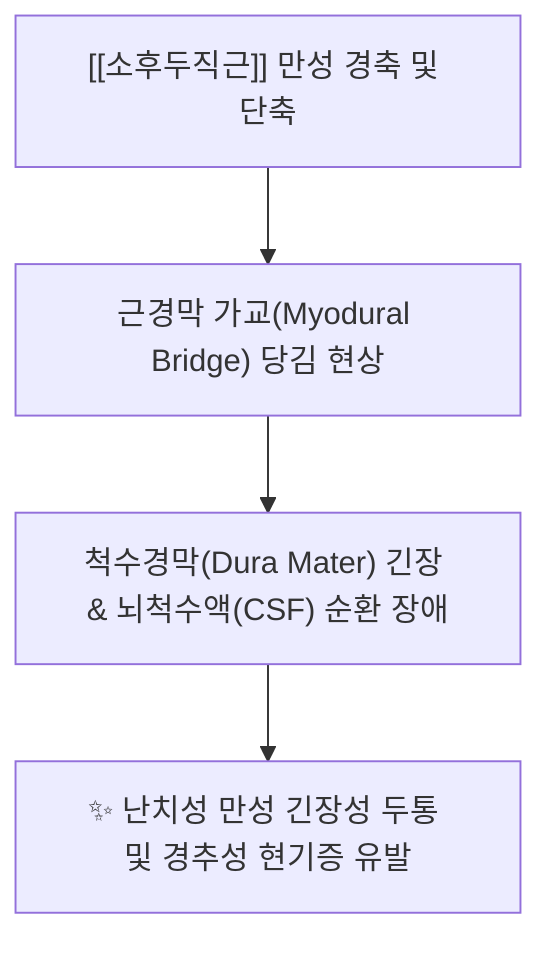
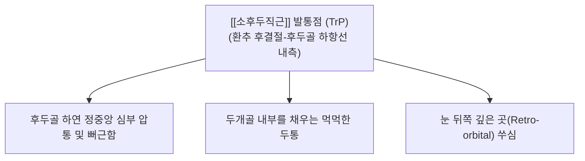

---
aliases:
  - 소후두직근
  - 작은뒤머리직선근
  - Rectus capitis posterior minor
---
# [[소후두직근]](Rectus capitis posterior minor)

> **핵심 요약 (Key Summary)**:
> 제1경추 후결절에서 기원하여 후두골 하항선 내측부에 정지하며 척수경막과 근경막 가교를 형성하는 후두하 심부의 핵심 안정화 근육입니다.
> 제1경추신경 후지인 후두하신경의 지배를 받으며, 환추후두관절의 미세 신전 및 두경부 정밀 고유감각 피드백을 담당합니다.
> [[만성 긴장성 두통]], 경추성 현기증, 경막 장력 이상, 뇌 피로의 핵심 병변근이며, 아문·풍부·풍지 및 환추 후결절 부착부 침구가 표적입니다.

---
## 📌 목차
1. [해부학적 정밀 구조 및 지배 신경/혈관](#1-해부학적-정밀-구조-및-지배-신경혈관)
2. [생체역학·토크 분석 & 근막 사슬 (Biomechanical Synergy)](#2-생체역학토크-분석--경부-근막-사슬-biomechanical-synergy)
3. [근막통증증후군(TP) & 연관통 패턴 (Travell & Simons)](#3-근막통증증후군tp--연관통-패턴-travell--simons)
4. [초음파 해부학(Sonoanatomy) 및 중재 시술 랜드마크](#4-초음파-해부학sonoanatomy-및-중재-시술-랜드마크)
5. [⭐ 원장님 심층 임상 고찰 및 원본 필기 (Clinical Pearls)](#5-원장님-심층-임상-고찰-및-원본-필기-clinical-pearls)
6. [관련 임상 질환 및 운동손상 증후군 총괄](#6-관련-임상-질환-및-운동손상-증후군-총괄)
7. [추나·도수치료(MET/PIR) & 침구·약침·재활 프로토콜](#7-추나도수치료metpir--침구약침재활-프로토콜)
8. [출처 및 학술 참고 문헌 (References)](#8-출처-및-학술-참고-문헌-references)

---
## 1. 해부학적 정밀 구조 및 지배 신경/혈관

| 항목 | 상세 내용 |
| :--- | :--- |
| **기시 (Origin)** | 제1경추(환추, Atlas, C1)의 후결절(Posterior tubercle) 및 인접 외측부 |
| **정지 (Insertion)** | 후두골 [[하항선]](Inferior nuchal line) 내측 1/3 부위 및 대후두공(Foramen magnum) 후연 사이 골면 |
| **신경 지배** | 제1경추신경 후지 ([[후두하신경]], Suboccipital nerve, C1 dorsal ramus) |
| **혈관 공급** | 후두동맥(Occipital A.) 하행지 및 추골동맥(Vertebral A.) 후두하 분지 |

### 🔬 해부학 도해 및 단면도
![[Rectus_capitis_posterior_minor_back.png|450]]
> [Wikipedia 공중도메인 해부학 도해]: 환추(C1) 후결절에서 후두골 하항선 내측 정중선 부근으로 주행하는 [[소후두직근]]의 3D 후방 해부도.

---
## 2. 생체역학·토크 분석 & 근막 사슬 (Biomechanical Synergy)

* **환추후두관절(Atlanto-occipital Joint, C0-C1)의 미세 조정**:
  * 환추 위에서 후두골의 정밀한 시상면 끄덕임(Nodding motion) 및 미세 신전(Micro-extension) 제어.
* **근경막 가교 (Myodural Bridge, MDB)의 기능적 정체성 (핵심)**:
  * 1995년 Hack 박사 연구팀에 의해 규명된 구조로, 소후두직근의 건막 섬유가 환추후두후막(PAOM)을 관통하여 **경수 척수경막(Spinal dura mater)**에 직접 연결.
  * 생리적으로 두부 굴곡 및 신전 시 척수경막이 접히거나 대후두공으로 감겨들어가지 않도록 팽팽하게 앵커링(Anchoring)하는 역할 수행.
* **인체 최상위 고유감각(Proprioception) 센서**:
  * 인체 전체에서 단위 근육량당 근방추(Muscle spindle) 밀도가 가장 높은 부위 중 하나로, 두부의 미세한 위치 변화를 전정신경핵 및 소뇌로 밀리초 단위로 전달.
* **근막 사슬 연계 (Anatomy Trains)**:
  * **표재후방선(Superficial Back Line, SBL)**: 족저근막에서 시작하여 척추기립근을 거쳐 후두하 공간에 도달한 후, [[소후두직근]]-경막 연결을 통해 중추신경계 경막 긴장도와 직접 소통.

---
## 3. 근막통증증후군(TP) & 연관통 패턴 (Travell & Simons)

![[Suboccipital_TriggerPoints.jpg|450]]
> [Travell & Simons 발통점 지도]: 후두하근군([[소후두직근]]) 발통점에서 후두부 기저부 정중앙에서 정수리와 눈 깊은 곳까지 뻗치는 심부 두통 패턴.

* **발통점 및 연관통 특성**:
  * **후두골 하연 내측 심부 둔통**:
    * 아문혈 및 풍부혈 외측의 후두하 정중선 바로 옆 깊은 곳에 묵직하고 지속적인 압박통 형성.
  * **두개내 압박감 및 멍함**:
    * 단순 근육통을 넘어 "뇌 속이 붓는 것 같다", "머리 안쪽에 압력이 차오른다"는 두개강 내압 상승 유사 증상 호소.
  * **안구 깊은 곳의 통증**:
    * [[소후두직근]] TrP 자극 시 동측 또는 양측 안와 심부로 뻐근한 연관통 투사.

---
## 4. 초음파 해부학(Sonoanatomy) 및 중재 시술 랜드마크

* **초음파 스캔 프로토콜**:
  * **프로브 위치**: 후두골 외후두융기(EOP) 하방 정중선에서 C1-C2 레벨 종단면(Sagittal view) 또는 정중 횡단면 거치.
  * **층별 확인 (Superficial → Deep)**:
    1. 최표층: 항인대(Ligamentum nuchae) 및 승모근 건막.
    2. 제2층: [[두반극근]](Semispinalis capitis) 근복.
    3. 제3층: [[소후두직근]] **(Rectus capitis posterior minor)** → 환추 후결절에서 후두골 하항선 내측으로 달리는 작고 두터운 근육 동정.
    4. 최심층: 환추후두후막(PAOM) 및 척수경막(Dura mater) 고에코 라인.
* **안전 마진 및 위험 구조물 회피 (CRITICAL)**:
  * **연수(Medulla oblongata) 및 척수강 진입 절대 회피**: C1에는 극돌기가 없고 편평한 후결절만 존재하므로, 침이나 도침이 후결절 골면을 벗어나 정중앙 심부로 깊이 직자되면 환추후두후막을 뚫고 척수강으로 진입할 위험이 있습니다.
  * **시술 원칙**: 침 끝(Needle tip)은 반드시 **환추 후결절의 골면(Bone touch) 또는 후두골 하항선 골면**에 정확히 안착시켜야 하며, 깊이를 2.0~2.5cm 이내로 엄격히 통제.

---
## 5. ⭐ 원장님 심층 임상 고찰 및 원본 필기 (Clinical Pearls)

### 1) 경막-[[후두하근]] 다리(Myodural Bridge)의 임상적 실체 (원장님 필기 100% 보존)
* 소후두직근과 척수경막이 직접 섬유성 연결을 이루고 있어, 상부 경추의 정렬 이상과 소후두직근의 단축은 **뇌척수액(CSF) 순환과 두개내 압력에 직접적인 영향**을 미칩니다.
* **원장님 임상 적용 노하우**:
  * 만성 두통 환자 중 진통제(NSAIDs, 트립탄)에 전혀 반응하지 않는 난치성 환자의 상당수는 이 **근경막 가교(MDB)의 과도한 견인** 때문입니다.
  * 후두골 하항선 내측 정지부의 긴장을 풀어주면 척수경막의 긴장도가 즉각 떨어지며 두개내압이 정상화되고 두통이 극적으로 소실됩니다.

### 2) 경추성 어지럼증(Cervicogenic Dizziness)의 치료 핵심 (원장님 필기 100% 보존)
* 이비인후과 검사상 이석증이나 전정신경염이 아닌데도 "몸이 붕 뜨는 것 같고 구름 위를 걷는 듯하다"고 호소하는 현기증 환자는 소후두직근의 고유수용기 이상이 원인입니다.
* 소후두직근의 근방추가 턱 들림 자세(Chin-out posture)로 인해 지속적으로 과흥분되면, 시각-전정기관-경추 고유감각 간의 일치성이 깨져 전정성 어지럼증과 메스꺼움(오심)이 발생합니다.

### 3) 두개천골요법(CST)의 CV4 기법과의 해부학적 일치
* 한의학의 아문(GV15)·풍부(GV16) 자침 및 CST의 제4뇌실 압박법(CV4 / 후두저 감압)은 정확히 소후두직근의 근막과 경막 가교를 이완시켜 제4뇌실 주변의 체액 순환을 촉진하는 원리입니다.

---
## 6. 관련 임상 질환 및 운동손상 증후군 총괄

| 임상 질환 / 증후군 | 병리적 연관 기전 | 주요 증상 및 이학적 검사 | 핵심 교정 타깃 |
| :--- | :--- | :--- | :--- |
| [[만성 긴장성 두통]] | MDB를 통한 척수경막 지속 견인 | 뒤통수 밑 묵직함, 머리 조임, 두개내압 상승감 | 후두골 하항선 내측 도침술 |
| 경추성 현기증 (Dizziness) | 근방추 고유감각 신호 왜곡 | 고개 움직일 때 붕 뜨는 어지럼증, 균형 장애 | 환추 후결절 침구 및 CST |
| 만성 뇌피로 및 브레인포그 | 뇌척수액(CSF) 정체 및 정맥 배액 저하 | 머리가 맑지 않음, 집중력 저하, 기억력 감퇴 | 후두저 이완 수기 추나 |
| 경추성 이명 (Somatic Tinnitus) | C1 후지 감각신경핵의 청각 경로 간섭 | 뒷목 결림과 함께 심해지는 삐- 소리 이명 | 아문·풍부 심부 약침 |
| 후두골 하연 압통 증후군 | 환추-후두골 간격 협소화 | 후두골 바로 아래 정중선 심한 압통 | 환추후두관절 견인 추나 |

---
## 7. 추나·도수치료(MET/PIR) & 침구·약침·재활 프로토콜

* **한의학 경혈 매핑**:
  * 아문, 풍부, 풍지, 뇌호, 천주, 옥침
* **침구 및 침도(도침) 프로토콜**:
  * **아문(GV15) 및 환추 후결절 부위**:
    * 환자 좌위 또는 앙와위에서 경추를 가볍게 굴곡시킨 상태로 자침.
    * 0.35x40mm 침으로 약간 상방(하악 방향)을 향해 1.0~1.5촌 완만하게 진침하여 환추 후결절 골면에 정확히 Bone touch. (골면 감각 없이 깊이 찌르는 것은 절대 금기).
  * **후두골 하항선 내측 정지부 도침 박리**:
    * 후두골 하연 골면에 도침을 직자하여 골막에 안착시킨 후 미세하게 좌우 1회 탕전하여 근경막 건막 유착을 분리.
* **약침 처방**:
  * **중성어혈약침**: 급성 경추성 두통, 척수경막 견인성 긴장 완화를 위해 C1 후결절 주변에 0.3~0.5cc 정밀 미량 주입.
  * **자하거약침**: 만성 퇴행성 두통, 고령자 뇌피로, 뇌척수액 순환 부전 환자의 후두저 조직 재생 및 영양 공급.
* **추나 및 도수치료 (Suboccipital Decompression / CST)**:
  * **후두하 경막 감압 기법 (Suboccipital Dural Release)**:
    * 환자 앙와위, 시술자는 양측 중지와 약지 끝을 환자의 후두골 하항선 내측([[소후두직근]] 정지부)에 접촉.
    * 어떠한 강한 힘도 주지 않고 환자의 머리 무게를 손끝에 실어 자연스럽게 후두골이 전상방으로 미세 신장되도록 유도 (최소 3~5분간 이완 유지).
    * 경막 박동(Craniosacral rhythm)의 진폭이 커지면서 환자의 전신 근긴장이 해소됨을 확인.

---
## 8. 출처 및 학술 참고 문헌 (References)

1. **Hack, G. D., Koritzer, R. T., Wang, W. L., Lau, R. H., & Dunn, W. C. (1995)**. *Anatomic relation between the rectus capitis posterior minor muscle and the dura mater*. *Spine*, 20(23), 2484-2486.
   - **[연구 요약]**: 소후두직근과 척수경막 사이의 직접적인 섬유성 가교(Myodural bridge)를 세계 최초로 해부학적으로 규명한 역사적 연구.
2. **Standring, S. (2020)**. *Gray's Anatomy: The Anatomical Basis of Clinical Practice* (42nd ed.). Elsevier, pp. 786-787.
   - **[연구 요약]**: 소후두직근의 환추 후결절 기시 및 하항선 내측 정지, 후두하신경 지배 및 환추후두후막과의 해부학적 상관성.
3. **Travell, J. G., & Simons, D. G. (1999)**. *Myofascial Pain and Dysfunction: The Trigger Point Manual*, Vol. 1 (2nd ed.). Williams & Wilkins, pp. 447-461.
   - **[연구 요약]**: 후두하근군 심부 발통점이 유발하는 두개내 심부 두통 및 안와 후방 방사통 패턴 규명.
4. **Alix, M. E., & Bates, D. K. (1999)**. *A proposed etiology of cervicogenic headache: the suboccipital myodural bridge*. *Journal of Manipulative and Physiological Therapeutics*, 22(8), 534-539.
   - **[연구 요약]**: 소후두직근의 근경막 가교 과긴장이 만성 경추성 두통 및 뇌척수액 순환 장애를 유발하는 병리역학 모델 제시.
