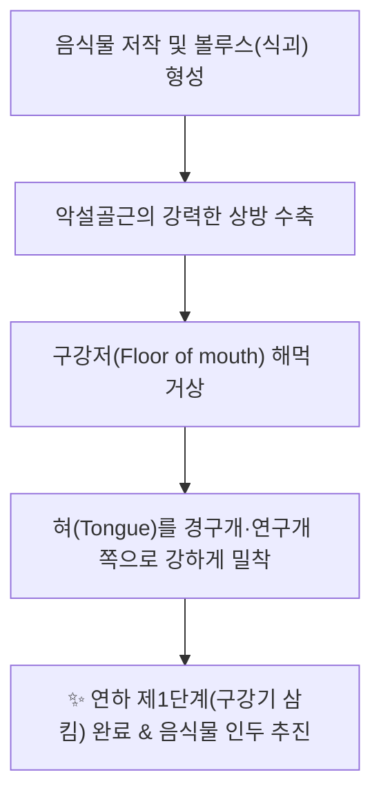
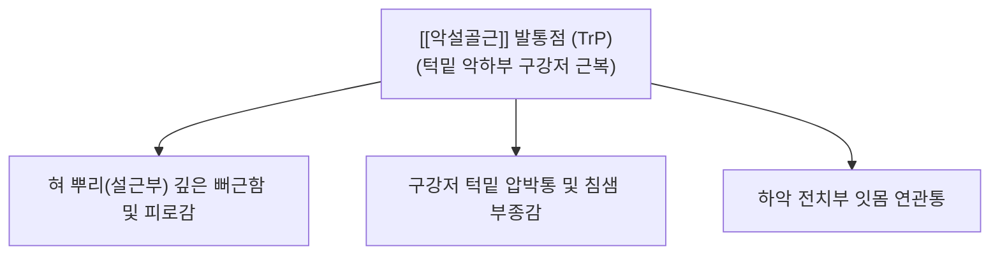

---
aliases:
  - 악설골근
  - 턱목뿔근
  - Mylohyoid
  - Mylohyoid muscle
---
# [[악설골근]](Mylohyoid)

> **핵심 요약 (Key Summary)**:
> 하악골 내측면의 악설골근선에서 기원하여 정중봉선 및 설골 체부 상연에 정지하는 구강저(Oral diaphragm)를 형성하는 판상 근육입니다.
> [[삼차신경]](CN V3) 하악신경의 악설골근신경 지배를 받으며, 설골 거상, 구강저 상승을 통한 혀 밀어올림 및 하악골 개구 보조를 주도합니다.
> [[연하장애]](구강기 삼킴곤란), 턱밑 침샘 부종, 혀밑 뻐근함, 설하통증 및 이중턱의 핵심 병변근이며, 염천·상성·합곡혈 침구 및 도침이 표적입니다.

---
## 📌 목차
1. [해부학적 정밀 구조 및 지배 신경/혈관](#1-해부학적-정밀-구조-및-지배-신경혈관)
2. [생체역학·토크 분석 & 경부 근막 사슬 (Biomechanical Synergy)](#2-생체역학토크-분석--경부-근막-사슬-biomechanical-synergy)
3. [근막통증증후군(TP) & 연관통 패턴 (Travell & Simons)](#3-근막통증증후군tp--연관통-패턴-travell--simons)
4. [초음파 해부학(Sonoanatomy) 및 중재 시술 랜드마크](#4-초음파-해부학sonoanatomy-및-중재-시술-랜드마크)
5. [⭐ 원장님 심층 임상 고찰 및 원본 필기 (Clinical Pearls)](#5-원장님-심층-임상-고찰-및-원본-필기-clinical-pearls)
6. [관련 임상 질환 및 운동손상 증후군 총괄](#6-관련-임상-질환-및-운동손상-증후군-총괄)
7. [추나·도수치료(MET/PIR) & 침구·약침·재활 프로토콜](#7-추나도수치료metpir--침구약침재활-프로토콜)
8. [출처 및 학술 참고 문헌 (References)](#8-출처-및-학술-참고-문헌-references)

---
## 1. 해부학적 정밀 구조 및 지배 신경/혈관

| 항목 | 상세 내용 |
| :--- | :--- |
| **기시 (Origin)** | 하악골(Mandible) 내측면의 전장에서 후방으로 달리는 [[악설골근선]](Mylohyoid line) |
| **정지 (Insertion)** | • 후부 섬유: 설골(Hyoid bone) 체부 상연 전면 • 중·전부 섬유: 좌우 근육이 정중선에서 만나 형성하는 섬유성 정중봉선(Median raphe) |
| **신경 지배** | [[삼차신경]](Trigeminal N., CN V3) 하악신경의 하치조신경에서 분지하는 악설골근신경 (Mylohyoid nerve) |
| **혈관 공급** | 안면동맥의 악하동맥(Submental A.), 설동맥의 설하동맥(Sublingual A.), 하치조동맥 분지 |

### 🔬 해부학 도해 및 단면도
![[Mylohyoid_muscle_anatomy.png|450]]
> [Wikipedia 3D 해부도]: 하악골 내측면 악설골근선에서 시작하여 정중봉선과 설골로 모이며 구강의 바닥(구강격막)을 해먹 형태로 완벽히 받치고 있는 [[악설골근]](Mylohyoid).

![[Suprahyoid_muscles_anatomy.png|450]]
> [Gray's Anatomy 해부도]: [[이복근]] 전복의 심층에서 구강저를 밀폐하고 있는 [[악설골근]]과 설골상근군의 층별 공간 배치.

---
## 2. 생체역학·토크 분석 & 경부 근막 사슬 (Biomechanical Synergy)

* **구강 격막(Oral Diaphragm)으로서의 펌프 기능**:
  * 흉곽의 횡격막, 골반의 골반저근과 마찬가지로 구강의 하부를 완벽하게 밀폐하는 동적 근육 격막.
  * 수축 시 구강저 전체를 위로 들어 올려 혀의 기저부를 입천장(경구개)에 밀착시킴으로써 **음식물 덩어리(Bolus)를 인두 쪽으로 밀어 넣는 강력한 유압 펌프 역할** 수행.
* **하악골 개구 및 설골 전상방 견인**:
  * 설골이 고정되어 있을 때 하악골을 아래로 당겨 [[이복근]]과 함께 입을 벌리는 개구 운동 보조.
  * 하악골이 치아 교합으로 닫혀 있을 때는 설골을 앞으로 당겨 올리며 기도를 확보.
* **근막 사슬 연계 (Anatomy Trains)**:
  * [[심부전방선]](Deep Front Line, DFL): 경추 전면 근막-설골-구강저([[악설골근]], [[이설골근]])를 거쳐 하악골 내측으로 연결되는 인체 중심 코어 축의 종착점.

---
## 3. 근막통증증후군(TP) & 연관통 패턴 (Travell & Simons)

* **발통점 및 연관통 특성**:
  * 턱밑 중앙과 하악연 사이의 연부조직(염천혈 주위)을 촉진할 때 팽팽한 띠(Taut band) 형태로 동정.
  * **혀밑 뻐근함 및 혀 피로감**:
    * 말을 많이 하거나 음식을 씹을 때 "혀 밑바닥이 뻣뻣하고 뻐근해서 혀가 잘 안 굴러간다", "발음이 어눌해지는 느낌이 든다"고 호소.
  * **연하 장애 및 침샘 압박감**:
    * 악설골근의 과긴장은 인접한 악하선(Submandibular gland)과 설하선의 도관을 압박하여 침 분비 장애 및 턱밑 붓기를 유발.

---
## 4. 초음파 해부학(Sonoanatomy) 및 중재 시술 랜드마크

* **초음파 스캔 프로토콜**:
  * 턱끝 바로 아래(Submental area)에서 프로브를 관상단면(Coronal view)으로 거치.
  * **표층**: 피하지방 및 양측 [[이복근]] 전복(타원형 저에코 구조).
  * **중간층**: 양측 하악골 내측을 연결하는 **넓고 편평한 띠 모양의 고-저에코 섬유판인 [[악설골근]] 확인.
  * **심층**: 정중선 양측에 나란히 위치한 원기둥 모양의 [[이설골근]](Geniohyoid) 및 혀 실질인 [[이설근]](Genioglossus).
* **악하선(Submandibular gland)과의 층별 관계**:
  * [[악설골근]] 후연은 악하선의 표재엽(Superficial lobe)과 심엽(Deep lobe)을 나누는 해부학적 분기점(C-loop 랜드마크).
* **안전 시술 절대 수칙 (CRITICAL)**:
  * 턱밑에서 직자 자침 시 침이 악설골근과 이설골근을 뚫고 지나치게 깊이 진입하면 **구강 점막을 관통하여 구강 내로 침 끝이 노출되거나 설동맥 손상 위험**이 있음.
  * **자침 깊이 제어**: 턱밑 정중선에서 설골을 향해 사상방으로 1.0~1.5cm 이내로 안전하게 진침하거나, 하악골 내측면 골면(Mylohyoid line)을 목표로 완만하게 자침.

---
## 5. ⭐ 원장님 심층 임상 고찰 및 원본 필기 (Clinical Pearls)

### 1) 연하 운동의 핵심 펌프 (원장님 필기 100% 보존)
* 혀를 들어 올려 음식물을 식도로 넘기는 구강기 삼킴의 원동력.
* **원장님 핵심 진단 팁**:
  * 뇌졸중 후유증이나 고령 환자에서 "음식이 목으로 잘 안 넘어가고 입안에 계속 맴돈다"는 구강기 연하장애(Oral phase dysphagia)는 악설골근의 근력 저하가 주원인입니다.
  * 염천혈 부위 악설골근에 전침 치료를 시행하고, 혀를 입천장에 강하게 밀어붙이는 저항 운동을 티칭하면 삼킴 기능이 신속히 회복됩니다.

### 2) 턱밑 처짐(이중 턱) 방지 (원장님 필기 100% 보존)
* 악설골근의 긴장도 저하는 구강저와 턱밑 피부 처짐 유발.
* 살이 찌지 않았는데도 턱밑이 불룩하게 처지는 이중턱(Double chin) 환자들은 구강저를 탄탄하게 받쳐주어야 할 [[악설골근]]과 [[이설골근]]의 근긴장도가 풀려 해먹이 늘어지듯 처진 상태입니다. 매선 요법이나 구강저 강화 침 치료로 턱선을 리프팅할 수 있습니다.

### 3) 턱관절 장애(TMD)와의 보상 연쇄
* 교근이나 측두근이 단단하게 굳어 하악골을 꽉 물고 있는 환자는 억지로 입을 벌릴 때 [[악설골근]]과 [[이복근]]을 과도하게 쥐어짜며 보상 작용을 일으킵니다. 이때 턱밑 통증이 발생하므로 저작근과 구강저 근육의 동시 치료가 필수적입니다.

---
## 6. 관련 임상 질환 및 운동손상 증후군 총괄

| 임상 질환 / 증후군 | 병리적 연관 기전 | 주요 증상 및 이학적 검사 | 핵심 교정 타깃 |
| :--- | :--- | :--- | :--- |
| [[연하장애]] (구강기 연하곤란) | [[악설골근]] 수축력 저하로 혀 거상 부전 | 음식물 구강 내 정체, 삼킴 지연, 사레 | 염천혈 전침 및 구강저 재활 |
| [[턱밑 이물감]] 및 압박통 | [[악설골근]] 과긴장으로 구강저 경직 | 턱밑 조임, 혀뿌리 뻐근함, 침 분비 저하 | 악하부 구강저 도침 및 침구 |
| [[이중턱]] (구강저 이완증) | [[악설골근]] 탄력 소실로 구강저 처짐 | 턱밑 불룩함, 목-턱 경계 소실 | [[악설골근]] 매선침 및 근력 강화 |
| [[턱관절 장애]] (TMD 개구통) | 폐구근 단축에 대항한 구강저 과사용 | 입 벌릴 때 턱밑 통증 및 당김 | [[악설골근]]-[[이복근]] 통합 이완 |
| [[설하통]] (혀밑 통증) | [[악설골근]] 신경(V3) 분지 포착 | 혀 아래 찌릿함, 말할 때 혀 피로 | [[악설골근]] 신경 차단부 침도술 |

---
## 7. 추나·도수치료(MET/PIR) & 침구·약침·재활 프로토콜

* **한의학 경혈 매핑**:
  * 염천, 하관, 협거, 지창, 합곡, 통리
* **침구 및 침도(도침) 프로토콜**:
  * **염천혈(CV23) 자침법**:
    * 설골 상연 정중선에서 하악골 내측 설근부 방향으로 사상방 0.5~1.0촌 진침하여 악설골근과 이설골근을 관통 자극.
  * **악설골근선(Mylohyoid line) 하악골 내측 도침술**:
    * 턱밑에서 하악골 내측 골면을 향해 침도를 접근시켜 골면에 Bone touch 후 근건 유착부를 1회 미세 박리.
* **약침 처방**:
  * **중성어혈약침**: 급성 구강저 연축, 턱관절 개구 장애 동반 턱밑 통증 시 0.3~0.5cc 주입.
  * **황련해독탕약침**: 침샘 도관 울체, 구강 건조, 혀밑 작열통 동반 시 염천혈 주입.
  * **자하거약침**: 중풍 후유증 연하장애, 노인성 구강저 무력증 환자 설골상근군 활성화.
* **환자 재활 운동 (Tongue-Pressing Exercise)**:
  * 혀끝과 혀 전체를 입천장(입천장 전체)에 강하게 밀어붙인 상태에서 5초간 유지(구강저 [[악설골근]] 등척성 수축). 하루 20회 반복.

---
## 8. 출처 및 학술 참고 문헌 (References)

1. **Standring, S. (2020)**. *Gray's Anatomy: The Anatomical Basis of Clinical Practice* (42nd ed.). Elsevier, pp. 581-582.
   - [연구 요약] 악설골근의 하악골 악설골근선 기시, 구강저 격막 형성 구조 및 삼차신경 악설골근가지 지배 해부학 분석.
2. **Travell, J. G., & Simons, D. G. (1999)**. *Myofascial Pain and Dysfunction: The Trigger Point Manual*, Vol. 1 (2nd ed.). Williams & Wilkins, pp. 273-284.
   - [연구 요약] 구강저 설골상근군 발통점의 혀뿌리 및 하악 전치부 연관통 투사 기전 제시.
3. **Logemann, J. A. (1998)**. *Evaluation and Treatment of Swallowing Disorders* (2nd ed.). Pro-Ed.
   - [연구 요약] 구강기 삼킴 단계에서 [[악설골근]] 수축에 의한 구강저 거상과 식괴 인두 추진 역학 규명.
