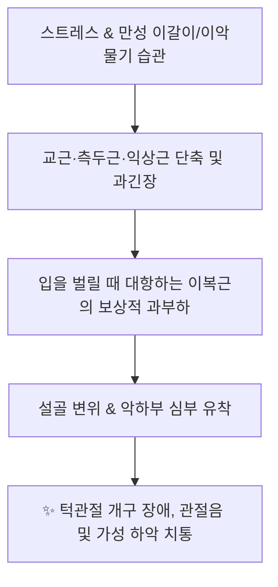
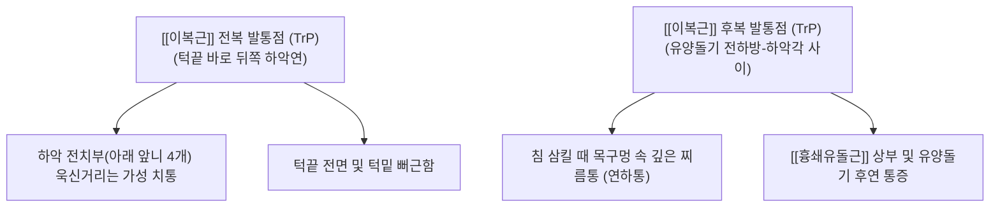

---
aliases:
  - 이복근
  - 두힘살근
  - Digastric
  - Digastric muscle
---
# [[이복근]](Digastric muscle (Anterior & Posterior bellies))

> **핵심 요약 (Key Summary)**:
> 측두골 유양절흔(후복)과 하악골 이복근와(전복)에서 기원하여 중간건을 통해 설골에 정지하는 두복성 설골상근입니다.
> [[삼차신경]](CN V3) 악설골근신경(전복) 및 [[안면신경]](CN VII) 이복근가지(후복)의 이중 신경 지배를 받으며, 하악골 하강(개구) 및 설골 거상을 주도합니다.
> [[턱관절 장애]](TMD), 개구 장애, 가성 하악 치통, 삼킴 시 턱밑 통증 및 이갈이의 핵심 병변근이며, 염천·예풍·지창혈 도침 및 약침이 표적입니다.

---
## 📌 목차
1. [해부학적 정밀 구조 및 지배 신경/혈관](#1-해부학적-정밀-구조-및-지배-신경혈관)
2. [생체역학·토크 분석 & 경부 근막 사슬 (Biomechanical Synergy)](#2-생체역학토크-분석--경부-근막-사슬-biomechanical-synergy)
3. [근막통증증후군(TP) & 연관통 패턴 (Travell & Simons)](#3-근막통증증후군tp--연관통-패턴-travell--simons)
4. [초음파 해부학(Sonoanatomy) 및 중재 시술 랜드마크](#4-초음파-해부학sonoanatomy-및-중재-시술-랜드마크)
5. [⭐ 원장님 심층 임상 고찰 및 원본 필기 (Clinical Pearls)](#5-원장님-심층-임상-고찰-및-원본-필기-clinical-pearls)
6. [관련 임상 질환 및 운동손상 증후군 총괄](#6-관련-임상-질환-및-운동손상-증후군-총괄)
7. [추나·도수치료(MET/PIR) & 침구·약침·재활 프로토콜](#7-추나도수치료metpir--침구약침재활-프로토콜)
8. [출처 및 학술 참고 문헌 (References)](#8-출처-및-학술-참고-문헌-references)

---
## 1. 해부학적 정밀 구조 및 지배 신경/혈관

| 항목 | 전복 (Anterior belly) | 후복 (Posterior belly) |
| :--- | :--- | :--- |
| **기시 (Origin)** | 하악골 정중선 내측 하연의 이복근와 (Digastric fossa of mandible) | 측두골 [[유양돌기]] 내측의 유양절흔 (Mastoid notch) |
| **정지 (Insertion)** | 설골 체부와 대각을 연결하는 섬유성 활차(Fibrous loop)로 연결된 중간건 (Intermediate tendon) | 중간건을 거쳐 설골(Hyoid bone)에 정지 ([[경상설골근]] 건을 관통) |
| **신경 지배** | [[삼차신경]](Trigeminal N., CN V3) 하악신경의 악설골근신경 (Mylohyoid N.) | [[안면신경]](Facial N., CN VII) 본간의 이복근가지 (Digastric branch) |
| **발생학적 기원** | 제1인두궁 (1st Pharyngeal arch, 하악궁) | 제2인두궁 (2nd Pharyngeal arch, 설골궁) |
| **혈관 공급** | 안면동맥(Facial A.)의 악하동맥 분지 | [[후두동맥]](Occipital A.) 및 후이개동맥 분지 |

### 🔬 해부학 도해 및 단면도
![[Digastric_muscle_anatomy.png|450]]
> [Wikipedia 3D 해부도]: 하악골 전하방 이복근와(전복)와 유양절흔(후복)에서 출발하여 설골 활차 고리(중간건)를 통해 V자형 도르래를 형성하는 [[이복근]](Digastric)의 입체 주행.

![[Suprahyoid_muscles_anatomy.png|450]]
> [Gray's Anatomy 해부도]: 악하삼각(Submandibular triangle)과 이복근삼각을 구성하는 [[이복근]], [[경상설골근]], [[악설골근]]의 위치 관계.

---
## 2. 생체역학·토크 분석 & 경부 근막 사슬 (Biomechanical Synergy)

* **하악골 하강(개구, Jaw Opening)의 핵심 주동근**:
  * 설골이 하부 [[설골하근군]]([[흉골설골근]], [[견갑설골근]])에 의해 고정되어 있을 때, 전복이 수축하여 하악골을 아래로 강하게 끌어당겨 **입을 벌리는 일차적 동력** 제공.
  * [[외측익상근]](하악두 전방 활주)과 협동하여 부드러운 개구 궤적(Arthrokinematics)을 완성.
* **연하(Swallowing) 시 설골 거상**:
  * 하악골이 치아 맞물림으로 닫혀 있을 때, 전복과 후복이 동시 수축하면 **설골을 전상방 및 후상방으로 들어 올려 인두강을 개대**하고 음식물을 식도로 압송.
* **길항근-협력근 역동 관계**:
  * **길항근(Antagonists)**: 폐구근군([[교근]], [[측두근]], [[내측익상근]]).
  * **협력근(Synergists)**: [[악설골근]], [[이설골근]], [[외측익상근]].
* **근막 사슬 연계 (Anatomy Trains)**:
  * [[심부전방선]](Deep Front Line, DFL): 흉곽 상구의 설골하근막에서 설골을 거쳐 구강저와 하악골로 이어지는 최상위 저작-연하 연결선.

---
## 3. 근막통증증후군(TP) & 연관통 패턴 (Travell & Simons)

![[Digastric_TriggerPoints.jpg|450]]
> [Travell & Simons 발통점 지도]: [[이복근]] 전복 TrP(아래 앞니 가성 치통)와 후복 TrP(유양돌기 및 목구멍 속 연하통)의 상징적인 연관통 패턴.

* **발통점 및 연관통 특성**:
  * **전복 TrP (아랫니 가성 치통, Pseudo-toothache)**:
    * 하악 4개 절치(중절치, 측절치) 및 인접 잇몸으로 극심한 욱신거림을 방사.
    * 치과 검사상 충치나 치주염이 전혀 없는데도 발치를 요구할 정도로 심한 치통을 호소하는 대표적인 연관통.
  * **후복 TrP (침 삼킬 때 목구멍 통증)**:
    * 유양돌기 전하방(예풍혈 깊은 부위) TrP는 인두 측벽으로 통증을 투사하여 **음식물이나 침을 삼킬 때 편도선염이나 인두염 같은 날카로운 연하통** 유발.
    * 인접한 [[흉쇄유돌근]] 상부와 후두하부로 뻐근함을 방사.

---
## 4. 초음파 해부학(Sonoanatomy) 및 중재 시술 랜드마크

* **초음파 스캔 프로토콜**:
  * **전복 스캔**: 턱끝 아래 악하삼각에서 선형 프로브를 관상단면(Coronal view) 배치 → 표층 피하지방 아래 둥근 저에코 타원형의 전복 동정, 그 바로 깊은 층에 판상의 [[악설골근]] 확인.
  * **후복 스캔**: 하악각과 유양돌기 사이에서 사선 종단 거치 → [[흉쇄유돌근]] 심층에서 하악각 내측을 향해 전하방으로 비스듬히 주행하는 후복 근섬유 확인.
* **인접 고위험 혈관 및 신경 랜드마크**:
  * **안면동맥 및 정맥(Facial vessels)**: 전복 외측 악하선을 가로지르므로 도플러 확인 필수.
  * **경동맥초 및 뇌신경(CN IX, X, XI, XII)**: 후복 심부에는 [[내경동맥]], [[내경정맥]], [[부신경]], [[설하신경]]이 밀집 주행하므로 후방 깊숙한 맹목적 자침 절대 금기.
* **안전 시술 절대 수칙 (CRITICAL)**:
  * 전복 자침 시: 하악골 골면에 침 끝을 향하게 하여 혀밑 설하선 및 구강 점막 관통 방지.
  * 후복 자침 시: 유양돌기 전하연 골면에 가볍게 접촉하거나, 시술자의 손가락으로 하악각과 SCM 사이를 벌려 후복을 표층으로 유도한 뒤 1~1.5cm 이내 천자.

---
## 5. ⭐ 원장님 심층 임상 고찰 및 원본 필기 (Clinical Pearls)

### 1) 턱관절 개구의 주동근 (원장님 필기 100% 보존)
* [[교근]]/[[외측익상근|익상근]]과 길항하여 턱을 벌리는 핵심 역학 수행.
* **원장님 핵심 진단 팁**:
  * 턱을 벌릴 때 딱딱 소리가 나거나(Clicking), 입이 지그재그(S자형)로 벌어지는 환자는 교근만 풀어서는 안 됩니다.
  * 하악골을 밑에서 당겨주는 좌우 [[이복근]] 전복의 장력 불균형을 해결해야 하악두가 관절와 안에서 중심축을 유지하며 똑바로 개구할 수 있습니다.

### 2) 전복과 후복의 복합 신경 지배 (원장님 필기 100% 보존)
* [[삼차신경]]과 [[안면신경]]이 만나는 경부 역학의 교차로.
* 전복은 저작신경인 삼차신경(V3)의 지배를 받아 저작근들과 연동되고, 후복은 표정근 신경인 안면신경(CN VII)의 지배를 받아 감정적 긴장(분노, 스트레스 시 턱 악물기)에 민감하게 반응합니다. 두 신경계의 긴장이 중첩되는 부위이므로 턱관절 환자의 스트레스 지수 평가가 필수적입니다.

### 3) 억울한 발치를 막는 '아랫니 치통' 감별
* "아래 앞니가 쑤셔서 치과에 갔는데 신경치료를 해도 낫지 않는다"는 환자는 턱밑 이복근와를 엄지손가락으로 꾹 눌러보아야 합니다.
* 누르는 순간 아랫니로 전기가 찌릿하게 통한다면 100% [[이복근]] 전복 TrP입니다. 이곳에 침 한 대만 놓아도 수개월 앓던 치통이 1분 만에 소실됩니다.

---
## 6. 관련 임상 질환 및 운동손상 증후군 총괄

| 임상 질환 / 증후군 | 병리적 연관 기전 | 주요 증상 및 이학적 검사 | 핵심 교정 타깃 |
| :--- | :--- | :--- | :--- |
| [[턱관절 장애]] (TMD) | [[이복근]] 과긴장 및 개구 시 회전 불균형 | 개구 장애, 턱관절 잡음, 하악 편위 | [[이복근]] 전복·후복 도침 및 MET |
| [[가성 하악 치통]] | [[이복근]] 전복 TrP 연관통 투사 | 치과적 원인 없는 하악 전치부 통증 | 이복근와 부착부 정밀 침구 |
| [[연하통]] (삼킴통) | [[이복근]] 후복 연축으로 설골 거상 장애 | 침 삼킬 때 편도선 부근 찌름통 | 예풍혈 심부 후복 이완 |
| [[설골 변위 증후군]] | 좌우 [[이복근]] 중간건 장력 불균형 | 목에 이물감, 목소리 잠김, 침샘 부종 | 설골 가동 추나 및 양측 균형 침 |
| [[이갈이]] 및 이악물기 | 수면 중 폐구근-개구근 동시 연축 | 기상 시 턱밑 뻐근함, 치아 마모 | 저작근-[[이복근]] 통합 약침 치료 |

---
## 7. 추나·도수치료(MET/PIR) & 침구·약침·재활 프로토콜

* **한의학 경혈 매핑**:
  * 염천, 예풍, 지창, 하관, 협거, 상관
* **침구 및 침도(도침) 프로토콜**:
  * **전복(하악골 이복근와)**:
    * 턱끝 바로 뒤쪽 하악연 하단에서 하악골 내측면을 향해 0.30x30mm 침으로 0.5~1.0촌 사자 자침.
  * **후복(유양돌기 내측 유양절흔)**:
    * 유양돌기 전하방 함요처(예풍혈 부근)에서 전내측 상방을 향해 0.5~1.0촌 완만 자침 (신경혈관 주의).
* **약침 처방**:
  * **중성어혈약침**: 급성 턱관절 개구 장애, 턱 삔 후 통증 시 전복·후복 부착부에 0.3~0.5cc 주입.
  * **황련해독탕약침**: 아랫니 가성 치통, 구강 내 열감 및 잇몸 염증 양상 동반 시 전복 주입.
  * **자하거약침**: 만성 턱관절 관절원판 마모, 퇴행성 악관절염 환자 관절낭 및 이복근막 영양.
* **추나 및 도수치료 (Digastric MET / PIR)**:
  * **개구근 등척성 수축 후 이완 (PIR)**:
    * 환자 좌위 또는 앙와위, 시술자는 환자의 하악골 턱끝 아래에 손을 받침.
    * 환자에게 "입을 10~15% 힘으로 살짝 벌리려 해보세요(개구 저항)" 지시 (5~7초 등척성 수축).
    * 호기와 함께 완전히 힘을 뺀 상태에서 턱관절을 부드럽게 이완시키며 하악골을 견인 (3회 반복).

---
## 8. 출처 및 학술 참고 문헌 (References)

1. **Standring, S. (2020)**. *Gray's Anatomy: The Anatomical Basis of Clinical Practice* (42nd ed.). Elsevier, pp. 581-583.
   - [연구 요약] [[이복근]] 전복과 후복의 기시, 설골 중간건 활차 고리 및 삼차신경/안면신경 이중 지배 해부학 분석.
2. **Travell, J. G., & Simons, D. G. (1999)**. *Myofascial Pain and Dysfunction: The Trigger Point Manual*, Vol. 1 (2nd ed.). Williams & Wilkins, pp. 273-284.
   - [연구 요약] [[이복근]] 전복의 하악 4전치 가성 치통 유발 기전과 후복의 인두 연하통 연관통 패턴 규명.
3. **Fernández-de-las-Peñas, C., & Svensson, P. (2016)**. Myofascial temporomandibular disorder. *Curr Rheumatol Rev*, 12(1), 40-45. [PMID: 26717949](https://pubmed.ncbi.nlm.nih.gov/26717949/)
   - [연구 요약] 턱관절 장애 환자에서 [[이복근]] 발통점과 저작근 활성도 이상의 상관성 및 도수 치료의 임상 효능 검증.