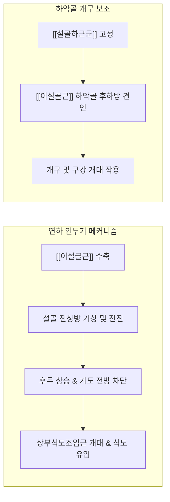

---
aliases:
  - 이설골근
  - Geniohyoid
  - Geniohyoid muscle
  - 턱끝설골근
---
# [[이설골근]](Geniohyoid)

> **핵심 요약 (Key Summary)**:
> 하악골 결합부 내면의 하이극(Mental spine)에서 기원하여 [[설골]] 체부 전면에 정지하는 구강저 심부의 좁고 긴 띠 모양 설골상근입니다.
> [[설하신경]](CN XII)을 경유하여 주행하는 제1경추신경([[경신경총]] C1 섬유)의 지배를 받으며, [[설골]]을 전상방으로 견인하여 인두강을 확장하고 연하 작용을 주도하며 하악골 하강을 보조합니다.
> [[연하장애]], 턱밑 연부조직 긴장, 설골 견인 기능부전의 핵심 타깃이며, 침구 치료 시 염천, 승장 혈위를 중심으로 구강저 심부 근막을 조절합니다.

---
## 📌 목차
1. [해부학적 정밀 구조 및 지배 신경/혈관](#1-해부학적-정밀-구조-및-지배-신경혈관)
2. [생체역학·토크 분석 & 경부 근막 사슬](#2-생체역학토크-분석--경부-근막-사슬)
3. [근막통증증후군(TP) & 연관통 패턴 (Travell & Simons)](#3-근막통증증후군tp--연관통-패턴-travell--simons)
4. [초음파 해부학(Sonoanatomy) 및 중재 시술 랜드마크](#4-초음파-해부학sonoanatomy-및-중재-시술-랜드마크)
5. [⭐ 원장님 심층 임상 고찰 및 원본 필기 (Clinical Pearls)](#5-원장님-심층-임상-고찰-및-원본-필기-clinical-pearls)
6. [관련 임상 질환 및 운동손상 증후군 총괄](#6-관련-임상-질환-및-운동손상-증후군-총괄)
7. [추나·도수치료(MET/PIR) & 침구·약침·재활 프로토콜](#7-추나도수치료metpir--침구약침재활-프로토콜)
8. [출처 및 학술 참고 문헌 (References)](#8-출처-및-학술-참고-문헌-references)

---
## 1. 해부학적 정밀 구조 및 지배 신경/혈관

| 항목 | 상세 내용 |
| :--- | :--- |
| **기시 (Origin)** | 하악골 결합부 내측면의 하이극 (Inferior genial tubercle / Mental spine) |
| **정지 (Insertion)** | [[설골]](Hyoid bone) 체부 전면의 상반부 |
| **신경 지배 (Innervation)** | 제1경추신경([[경신경총]] C1 신경근 섬유, [[설하신경]] CN XII 동반 주행) |
| **혈관 공급 (Vascular Supply)** | [[설동맥]](Lingual artery)의 설하분지(Sublingual branch) 및 [[악동맥]](Facial artery) 분지 |
| **기능 (Action)** | [[설골]]을 전상방으로 견인(연하 보조), [[설골]] 고정 시 하악골 하강 및 후인 보조 |
| **상대적 해부 위치** | [[악설골근]] 상면(구강측 심부)에 접하고, [[이설근]] 바로 아래(심하부)에 평행 주행 |

### 🔬 부착부 및 공간적 주행 관계
* [[이설골근]]은 좌우 한 쌍이 정중선에서 서로 긴밀하게 접하며 하악골 결합부에서 [[설골]] 체부로 직진하는 원통형 띠(Cord-like band) 구조입니다.
* 구강저(Floor of mouth)의 바닥을 이루는 넓은 [[악설골근]]의 바로 위(심부면)에 안착되어 있으며, 설하선(Sublingual gland) 및 [[이설근]] 하부와 해부학적 경계를 형성합니다.
* [[이복근]] 전복과 [[악설골근]]이 구강저의 천층 격막을 이룬다면, [[이설골근]]은 구강저 중앙 축의 심부 기둥 역할을 담당합니다.

### 🔬 지배 신경 특이성 (Neuroanatomical Distinction)
* 대다수 설골상근([[악설골근]], [[이복근]] 전복은 삼차신경 V3; [[경상설골근]], [[이복근]] 후복은 안면신경 CN VII)과 달리, [[이설골근]]은 경추 신경근 유래([[경신경총]] C1 전지)의 고유한 지배를 받습니다.
* C1 신경섬유는 두개저를 통과하는 [[설하신경]](CN XII) 줄기에 편승(Hitchhiking)하여 주행하다가, 구강저 하방에서 분지하여 [[이설골근]]과 [[갑상설골근]]으로 진입합니다.

### 🔬 해부학 도해 및 단면도
![[Geniohyoid_muscle_anatomy.png|450]]
> [Wikimedia Commons / BodyParts3D 공중도메인]: 하악골 하이극에서 설골 체부로 직진하는 이설골근의 정밀 주행 및 인접 구강저 근육군과의 공간적 관계.

---
## 2. 생체역학·토크 분석 & 경부 근막 사슬

### ⚙️ 생체역학적 기능과 지렛대 작용
* **연하 시 설골-후두 복합체 전상방 견인**: 삼킴의 인두기(Pharyngeal phase)에서 [[이설골근]]이 수축하면 [[설골]]이 전상방으로 당겨지면서 후두개(Epiglottis)가 기도를 폐쇄하고 상부식도조임근(UES)이 열려 음식물 덩어리가 원활하게 식도로 넘어갑니다.
* **하악골 하강 및 개구 보조**: [[설골]]이 [[설골하근군]]([[흉골설골근]], [[견갑설골근]], [[갑상설골근]])에 의해 하방 고정된 상태에서는 하악골을 후하방으로 당겨 입을 벌리는 개구 보조 작용을 수행합니다.

### 🔗 근막경선(Anatomy Trains) 연계
* [[심부전방선]](Deep Front Line, DFL): 발바닥 후경골근에서 시작하여 대퇴 내전근, 장요근, 흉곽 심부, 경장근을 거쳐 구강저([[이설골근]], [[악설골근]]) 및 저작근으로 이어지는 신체 심부 안정화 축의 최상단 종착부입니다.
* 골반저근(Pelvic floor)과 흉곽 입구(Thoracic inlet)의 긴장은 [[심부전방선]]을 매개로 구강저 설골상근군의 연축을 유발하며, [[이설골근]]의 단축은 설골 상방 고정 및 연하 기능 저하를 야기합니다.

---
## 3. 근막통증증후군(TP) & 연관통 패턴 (Travell & Simons)

### ⚡ 발통점(TrP) 및 통증 방사 양상
* **발통점 위치**: 하악골 턱끝 바로 뒤쪽 구강저 정중선 심부에 형성됩니다.
* **연관통 패턴**:
  * 턱밑 정중부 및 [[설골]] 상부 영역으로 뻐근하고 둔한 통증 방사.
  * 침을 삼킬 때 목 안쪽(구인두 부위)에 이물감 및 걸리는 느낌(Globus hystericus 유사 증상) 유발.
  * 혀의 기저부로 쑤시는 듯한 연관통을 방사하여 혀의 묵직함을 초래.

### 🔬 유발 및 지속 인자
* 음식물을 급하게 삼키거나 큰 덩어리를 억지로 넘기는 습관.
* 구강 호흡(Mouth breathing) 및 두부전방자세(Forward Head Posture)로 인한 하악골 후하방 변위.
* 치과 치료 중 장시간 개구 유지 또는 이갈이, 이악물기 습관.

### 🔬 트리거 포인트 도해
![[Digastric_TriggerPoints.jpg|450]]
> [Travell & Simons Trigger Point Manual]: 설골상근 및 [[이설골근]] 발통점 영역과 턱밑, 구강저, 설골 주위 연관통 패턴.

---
## 4. 초음파 해부학(Sonoanatomy) 및 중재 시술 랜드마크

### 🖥️ 고주파 초음파 스캔 프로토콜
* **탐촉자 위치**: 고주파 선형 프로브(12~18 MHz)를 턱밑 정중선(Submental midline)에 두고 시상단면(Sagittal) 및 횡단면(Transverse)으로 스캔합니다.
* **층별 구조 확인 (Superficial to Deep)**:
  1. 피부 및 피하 지방층
  2. [[경배근]](Platysma) 얇은 근막층
  3. [[악설골근]](Mylohyoid): 좌우 하악골 내측선을 잇는 가로 주행 근섬유대
  4. [[이설골근]](Geniohyoid): [[악설골근]] 바로 위에 위치하며, 하악 결합부에서 설골로 주행하는 두터운 세로 방향 저에코 근속
  5. [[이설근]](Genioglossus): 이설골근의 심부에서 혀 본체로 부채꼴 모양으로 퍼지는 심부 근육층

### ⚠️ 중재 안전 구역 및 임상 주의점
* [[이설골근]] 바로 외측과 심부에는 [[설동맥]](Lingual artery)과 [[설신경]](Lingual nerve)이 위치하므로, 정중선에서 벗어난 과도한 외측 자침은 혈종 형성 위험이 있습니다.
* 자침 시 하악골 하연 뒤쪽에서 설골 상연 방향으로 완만하게 접근하며, 하악골 내측 피질골을 지표로 삼아 안전 심도를 확보합니다.

---
## 5. ⭐ 원장님 심층 임상 고찰 및 원본 필기 (Clinical Pearls)

### 💡 100% 원본 필기 보존 및 심층 해설
1. **연하 1단계의 방아쇠**:
   * *원본 필기*: "혀와 설골을 전상방으로 밀어 올리는 인두기 삼킴의 핵심 파워."
   * *심층 고찰*: 연하 작용 중 구강기에서 인두기로 전환될 때 식괴(Bolus)를 인두로 밀어 넣기 위해서는 설골의 폭발적인 전상방 이동이 필수적입니다. 이 과정에서 [[이설골근]]은 가장 강력한 전방 견인 토크 벡터를 발생시키는 주동근으로 작용합니다. 만약 뇌졸중 후유증이나 경추 불안정증으로 이 근육이 약화되면 설골 거상이 지연되어 기도 흡인(Aspiration) 위험이 급격히 증가합니다.
2. **턱밑 처짐 방지**:
   * *원본 필기*: "구강저 심부의 긴장도를 유지하여 턱밑 구조 안정화."
   * *심층 고찰*: 턱밑 이중턱(Double chin)이나 구강저 처짐은 단순 지방 축적이 아닌 [[악설골근]]과 [[이설골근]]의 긴장도 상실에서 비롯되는 경우가 많습니다. 특히 두부전방자세로 인해 설골이 후하방으로 당겨지면 구강저 지지력이 약화되어 설근 하수가 동반됩니다.

### 💡 설골 정렬과 호흡·발성 메커니즘
* [[이설골근]]의 양측 단축은 설골을 전상방으로 과도하게 끌어올려 갑상연골과의 간격을 좁히고, 고음 발성 시 목의 긴장과 조임 증상을 유발합니다.
* 편측 긴장 시에는 연하 시 설골이 한쪽으로 비대칭 이동하여 딸깍거리는 클릭음(Hyoid click)이나 연하 시 이물감을 일으킵니다.

---
## 6. 관련 임상 질환 및 운동손상 증후군 총괄

| 임상 질환 / 증후군 | 병리적 연관 기전 | 주요 증상 및 이학적 검사 | 핵심 교정 타깃 |
| :--- | :--- | :--- | :--- |
| [[연하장애]](Dysphagia) | [[이설골근]] 수축력 저하로 설골 전상방 거상 부전 | 삼킴 곤란, 식사 중 사레 들림, 연하 유발 지연 | 염천혈 전침 자극 및 멘델슨 기법 |
| [[폐쇄성 수면무호흡증]](OSA) | 구강저 근육 긴장도 소실 및 설근 후방 침하 | 야간 코골이, 수면 중 호흡 중단, 주간 피로 | 설골 전방 안정화 운동 |
| [[구강저 근막통증증후군]] | 하악 결합부 뒤쪽 발통점 형성 및 근막 단축 | 턱밑 정중부 뻐근함, 인두부 이물감 | 하이극 부착부 도수 이완 |
| [[설골 통증 증후군]] | [[이설골근]] 과긴장으로 인한 설골 전면 견인 부하 | 설골 체부 압통, 침 삼킬 때 통증 | 구강저-설골 근막 이완 |

---
## 7. 추나·도수치료(MET/PIR) & 침구·약침·재활 프로토콜

### 👐 추나 및 도수치료 프로토콜
* **양손 구강내외 복합 이완술(Intraoral & Submental Release)**:
  * 시술자는 한 손의 검지(글러브 착용)를 환자의 구강 내 혀 밑바닥 정중부에 대고, 다른 손의 엄지나 검지는 턱밑 피부 외측에서 정중선으로 접촉합니다.
  * 하악 결합부 내측 하이극 부착부에서 [[설골]] 체부 방향으로 부드럽게 압박하며 근막 스트레칭을 30~60초간 적용합니다.
* **설골 전방 견인 MET(Muscle Energy Technique)**:
  * 환자가 혀끝을 입천장에 밀착한 상태에서 하악골을 가볍게 뒤로 당기게 하고, 시술자는 설골을 안정화하며 등척성 저항(30% 힘, 7초 유지 후 이완)을 가합니다.

### 🎯 침구 및 약침 치료 프로토콜
* **주요 경혈 타깃**:
  * 염천(廉泉): 설골 체부 상연 중앙 오목한 곳. 직자 또는 설근부를 향해 상방으로 1.0~1.5촌 사자.
  * 승장(承漿): 하순구 중앙 함요처. 하악골 하이극 방향으로 0.3~0.5촌 자침.
  * 천돌(天突): 설골하근군과의 길항 균형 조절.
* **전침 치료(Electroacupuncture)**:
  * 염천혈과 턱밑 양측 아시혈에 전침을 연결하여 저주파(2 Hz) 및 혼합파(2/100 Hz)를 15분간 인가하여 설골 거상 근력을 강화합니다.
* **약침 시술**:
  * 하악골 하이극 외측 구강저 근막 부착부에 자하거(Hominis Placenta) 또는 중성어혈 약침 0.1~0.2cc를 주입하여 근막 유착을 해소합니다.

### 🏃 재활 운동 및 환자 티칭
* **멘델슨 기법(Mendelsohn Maneuver)**:
  * 침을 삼키는 도중 설골과 후두가 가장 높이 올라간 지점에서 3~5초간 멈추어 근수축을 유지한 후 천천히 내려놓는 훈련(1회 10회, 하루 3세트).
* **혀 내밀기 삼킴 훈련(Masako Maneuver)**:
  * 혀를 가볍게 치아 사이에 물고 침을 삼킴으로써 구강저 및 인두 수축근의 보상적 강화를 유도.

---
## 8. 출처 및 학술 참고 문헌 (References)

1. **Standring, S. (2020)**. *Gray's Anatomy: The Anatomical Basis of Clinical Practice* (42nd ed.). Elsevier.
   * `[연구 요약]`: 구강저의 시상 단면에서 이설골근의 주행 경로, C1 신경 지배 경로 및 설골 부착 구조의 미세해부학적 기술.
2. **Travell, J. G., & Simons, D. (1999)**. *Myofascial Pain and Dysfunction: The Trigger Point Manual*, Vol. 1 (2nd ed.). Williams & Wilkins.
   * `[연구 요약]`: 설골상근군의 발통점 위치, 구강저 및 인두 부위 연관통 패턴, 연하 곤란 및 이물감 유발 기전 정립.
3. **Pearson, W. G., et al. (2013)**. Evaluating the role of the geniohyoid muscle in hyoid movement during swallowing. *Dysphagia*, 28(4), 515-522.
   * `[연구 요약]`: 고해상도 형광투시조영술(VFSS)을 통해 삼킴 시 이설골근이 설골의 전방 변위를 일으키는 최대 주동근임을 입증.
4. **Logemann, J. A. (1998)**. *Evaluation and Treatment of Swallowing Disorders* (2nd ed.). Pro-Ed.
   * `[연구 요약]`: 뇌신경 장애 환자에서 설골상근군 약화로 인한 기도 흡인 메커니즘과 연하 재활 훈련의 생체역학적 근거 제시.
