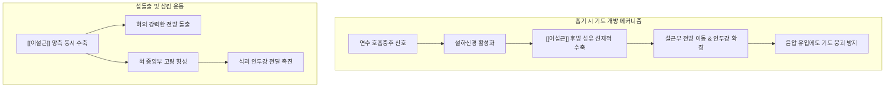

---
aliases:
  - 이설근
  - Genioglossus
  - Genioglossus muscle
  - 턱끝혀근
---
# [[이설근]](Genioglossus)

> **핵심 요약 (Key Summary)**:
> 하악골 결합부 내면의 상이극(Superior mental spine)에서 부채꼴 형태로 기원하여 혀의 전체 배부 및 [[설골]] 체부에 정지하는 혀의 가장 크고 핵심적인 외재성 근육입니다.
> [[설하신경]](CN XII)의 단독 운동 지배를 받으며, 혀를 전방으로 내밀고(전인) 혀 중앙부를 오목하게 하강시켜 기도 개방 유지와 음식물 삼킴 및 발음을 주도합니다.
> [[폐쇄성 수면무호흡증]](OSA), 설근 후인에 의한 기도 폐색, [[구음장애]], [[설하신경 마비]]의 임상 평가 기준 근육이며, 염천, 금진, 옥액 혈위 침구와 구강근기능 재활 요법이 적용됩니다.

---
## 📌 목차
1. [해부학적 정밀 구조 및 지배 신경/혈관](#1-해부학적-정밀-구조-및-지배-신경혈관)
2. [생체역학·토크 분석 & 경부 근막 사슬](#2-생체역학토크-분석--경부-근막-사슬)
3. [근막통증증후군(TP) & 연관통 패턴 (Travell & Simons)](#3-근막통증증후군tp--연관통-패턴-travell--simons)
4. [초음파 해부학(Sonoanatomy) 및 중재 시술 랜드마크](#4-초음파-해부학sonoanatomy-및-중재-시술-랜드마크)
5. [⭐ 원장님 심층 임상 고찰 및 원본 필기 (Clinical Pearls)](#5-원장님-심층-임상-고찰-및-원본-필기-clinical-pearls)
6. [관련 임상 질환 및 운동손상 증후군 총괄](#6-관련-임상-질환-및-운동손상-증후군-총괄)
7. [추나·도수치료(MET/PIR) & 침구·약침·재활 프로토콜](#7-추나도수치료metpir--침구약침재활-프로토콜)
8. [출처 및 학술 참고 문헌 (References)](#8-출처-및-학술-참고-문헌-references)

---
## 1. 해부학적 정밀 구조 및 지배 신경/혈관

| 항목 | 상세 내용 |
| :--- | :--- |
| **기시 (Origin)** | 하악골 결합부 후면 정중선의 상이극 (Superior genial tubercle / Superior mental spine) |
| **정지 (Insertion)** | 혀 전체의 배부(Dorsum) 근막 및 설점막, 최하부 섬유는 [[설골]](Hyoid bone) 체부 상연 |
| **신경 지배 (Innervation)** | [[설하신경]](Hypoglossal nerve, 제12뇌신경, CN XII) 운동 가지 |
| **혈관 공급 (Vascular Supply)** | [[설동맥]](Lingual artery)의 심설동맥(Deep lingual artery) 및 설하동맥(Sublingual artery) |
| **기능 (Action)** | 혀의 전인(Protrusion, 내밀기), 혀 중앙부 함몰(Cupping), 설근부 전방 당김을 통한 상기도 확장 |
| **상대적 해부 위치** | 구강저 최심부에 위치하며, 아래로는 [[이설골근]], 외측으로는 [[설골설근]] 및 [[경상설근]]과 연접 |

### 🔬 부채꼴 근섬유 다발의 분할 구조 (Functional Subdivisions)
* **전방 섬유군 (Anterior fibers)**: 상이극에서 설첨(Tongue tip) 및 설전부로 주행하며, 수축 시 혀끝을 뒤로 당겨 혀를 입 안으로 회수하고 설첨을 아래로 구부립니다.
* **중간 섬유군 (Middle fibers)**: 상이극에서 혀의 몸통(Body) 배부로 방사상 주행하며, 혀의 중앙 함요(Dorsal depression)를 형성하여 음식물 덩어리가 통과하는 고랑(Groove)을 만듭니다.
* **후방 섬유군 (Posterior fibers)**: 상이극에서 설근부(Root of tongue) 및 [[설골]] 체부로 직진하며, 혀 전체를 강하게 전방으로 밀어내어 기도를 확보하고 혀를 밖으로 돌출시킵니다.

### 🔬 지배 신경과 임상 해부학
* [[설하신경]](CN XII)은 혀의 내재근 및 거의 모든 외재근([[이설근]], [[설골설근]], [[경상설근]])을 지배합니다(단, 구개설근은 미주신경 CN X 지배).
* 설하신경의 손상 여부를 확인하는 가장 결정적인 신경학적 검사는 환자에게 혀를 전방으로 내밀게 하는 [[설돌출 검사]]이며, 이때 주동근이 바로 [[이설근]]입니다.

### 🔬 해부학 도해 및 단면도
![[Genioglossus_muscle_anatomy.png|450]]
> [Wikimedia Commons / BodyParts3D 공중도메인]: 하악골 상이극에서 기원하여 혀 전체로 부채꼴 형태로 펼쳐지는 이설근의 해부학적 주행 도해.

---
## 2. 생체역학·토크 분석 & 경부 근막 사슬

### ⚙️ 상기도 개방성 유지의 안전띠 (Airway Safety Guard)
* **상기도 확장 주동근(Pharyngeal Dilator)**: 흡기 시 흉강 내 음압이 발생할 때, [[이설근]]은 횡격막 수축과 동기화되어 선제적으로 수축합니다. 이로써 혀가 뒤로 빨려 들어가 기도가 협착되는 것을 물리적으로 방어합니다.
* **구강기 연하의 펌프 작용**: 음식물을 씹은 후 인두로 넘길 때 혀의 외측변은 구개에 밀착되고, 중앙부는 [[이설근]] 중간 섬유에 의해 함몰되어 식괴(Bolus)를 후방으로 밀어내는 활주로 역할을 형성합니다.

### 🔗 근막경선(Anatomy Trains) 연계
* [[심부전방선]](Deep Front Line, DFL): 발바닥 내측 아치에서 출발하여 골반저, 호흡횡격막, 식도 및 심낭막, 경장근을 거쳐 [[이설근]]과 혀의 설체로 직결됩니다.
* 만성적인 흉식 호흡이나 두부전방자세(FHP)는 [[심부전방선]]의 상부 긴장 붕괴를 초래하여 혀가 아래턱 바닥으로 가라앉는 설위 저하증(Low tongue posture)을 유발합니다.

---
## 3. 근막통증증후군(TP) & 연관통 패턴 (Travell & Simons)

### ⚡ 발통점(TrP) 및 통증 방사 양상
* **발통점 위치**: 하악골 턱끝 바로 뒤편 혀뿌리 정중부 심층에 호발합니다.
* **연관통 패턴**:
  * 혀의 몸통 전체 및 혀 밑바닥으로 퍼지는 둔하고 묵직한 통증 및 이상감각.
  * 연하 시 목 안쪽이 꽉 막힌 듯한 조임과 이물감.
  * 턱밑 정중선에서 설골 상부까지 이어지는 지속적인 압박성 통증.

### 🔬 유발 및 지속 인자
* 수면 중 이악물기(Clenching) 및 혀를 치아 사이에 밀어 넣는 혀 내밀기 버릇(Tongue thrusting).
* 만성적인 구강 호흡과 코막힘(비염, 비중격 만곡).
* 뇌졸중 후유증이나 경추 척수증으로 인한 설하신경 긴장 이상.

### 🔬 트리거 포인트 도해
![[Digastric_TriggerPoints.jpg|450]]
> [Travell & Simons Trigger Point Manual]: 설골상근군 및 설근 발통점 영역과 구강저, 설체부 연관통 투사 경로.

---
## 4. 초음파 해부학(Sonoanatomy) 및 중재 시술 랜드마크

### 🖥️ 고주파 초음파 스캔 프로토콜
* **탐촉자 위치**: 턱밑 정중 시상면(Submental Mid-sagittal view) 및 관상면(Coronal view) 스캔.
* **초음파상 특징**:
  * 시상면에서 하악 결합부 뒤편에서 혀의 상면으로 방사상으로 뻗어나가는 전형적인 부채살(Fan-like) 저에코 근속 패턴 관찰.
  * [[이설근]] 하방에 띠 모양으로 나란히 달리는 [[이설골근]](Geniohyoid)과 그 밑의 [[악설골근]](Mylohyoid)을 층별로 식별.
* **컬러 도플러 확인**:
  * 혀의 외측연과 심부로 들어가는 [[설동맥]](Lingual artery)의 분지(심설동맥) 혈류 신호를 확인하여 혈관 손상을 방지.

### ⚠️ 중재 안전 구역 및 침구 안전 가이드
* 턱밑 염천혈 자침 시 직각으로 깊이 자침하면 구강 내 점막을 관통할 수 있으므로, 설근부를 향해 상후방 45~60도 각도로 1.0~1.5촌 범위 내에서 자침합니다.
* 설하신경의 주행로는 이설근의 외측면을 지나므로 정중선 부근의 자침은 신경 손상 위험이 극히 낮습니다.

---
## 5. ⭐ 원장님 심층 임상 고찰 및 원본 필기 (Clinical Pearls)

### 💡 100% 원본 필기 보존 및 심층 해설
1. **폐쇄성 수면무호흡증(OSA)의 주범**:
   * *원본 필기*: "수면 중 [[이설근]] 긴장도 저하로 혀가 뒤로 처져 기도를 폐쇄하고 코골이/무호흡 유발."
   * *심층 고찰*: 수면 단계(특히 REM 수면기)에 진입하면 골격근의 긴장도가 떨어지는데, [[이설근]]의 긴장도 저하가 심한 환자는 중력에 의해 혀뿌리가 뒤로 떨어지는 설근 침하(Glossoptosis)가 발생합니다. 이는 인두강을 물리적으로 막아 심각한 [[폐쇄성 수면무호흡증]]과 코골이를 유발합니다. 따라서 한의학적 연하/설근 자극 치료와 구강근기능요법(MFT)은 비수술적 OSA 관리의 핵심 수단이 됩니다.
2. **설하신경 마비 시 혀 편위**:
   * *원본 필기*: "설하신경 마비 시 혀 편위: 혀를 내밀 때 마비 측으로 혀가 쏠림."
   * *심층 고찰*: 정상 상태에서는 좌우 [[이설근]]이 대칭적으로 혀를 앞으로 밀어내므로 혀가 정중선으로 곧게 나옵니다. 그러나 편측 [[설하신경 마비]](CN XII palsy)가 발생하면, 건측의 이설근만 정상적으로 전방 추진력을 발휘하므로 혀가 힘을 쓰지 못하는 **환측(마비측, 병변측)으로 편위(Deviation to the paralyzed side)**됩니다. 이는 중추성 및 말초성 뇌신경 마비를 감별하는 결정적 임상 징후입니다.

---
## 6. 관련 임상 질환 및 운동손상 증후군 총괄

| 임상 질환 / 증후군 | 병리적 연관 기전 | 주요 증상 및 이학적 검사 | 핵심 교정 타깃 |
| :--- | :--- | :--- | :--- |
| [[폐쇄성 수면무호흡증]](OSA) | [[이설근]] 긴장도 저하로 수면 중 설근 후방 낙하 | 수면 중 무호흡, 코골이, 주간 기면 | 구강근기능 재활 및 전침 자극 |
| [[설하신경 마비]](CN XII Palsy) | 설하신경 손상으로 인한 편측 [[이설근]] 마비 | 혀 내밀 때 마비측 편위, 설근 위축 및 섬유속연축 | 설하신경 주행부 약침 및 침구 |
| [[구음장애]](Dysarthria) | 혀의 전인 및 미세 운동 조절 부전 | 설음(ㄴ, ㄷ, ㄹ, ㅌ) 발음 장애 | 설근 협응 운동 및 언어 치료 |
| [[연하장애]](Dysphagia) | 혀 배부 함몰 부전으로 식괴 이송 장애 | 구강 내 음식물 잔류, 삼킴 시작 지연 | 염천혈 전침 및 설근 근력 훈련 |

---
## 7. 추나·도수치료(MET/PIR) & 침구·약침·재활 프로토콜

### 👐 도수치료 및 구강근막이완술(MFT)
* **설근 직접 견인 도수치료**:
  * 시술자가 멸균 거즈로 환자의 설첨을 부드럽게 잡고 전방 및 상하좌우로 가볍게 견인하여 설근부 긴장을 해소.
  * 환자가 혀를 뒤로 당기려 할 때 시술자가 가벼운 저항을 주어 등척성 수축(PIR 기법)을 유도한 뒤 이완시킵니다.
* **구강저 심부 지압(Submental Acupressure)**:
  * 턱밑 정중선 상이극 부착부를 엄지손가락으로 상방으로 부드럽게 밀어 올리며 심부 근막을 1분간 지압.

### 🎯 침구 및 약침 치료 프로토콜
* **주요 경혈 타깃**:
  * 염천(廉泉): 설골 상연 중앙 함요처에서 설근을 향해 상후방으로 1.2~1.5촌 사자.
  * 금진(金津)·옥액(玉液): 혀를 입천장으로 들어 올린 후 혀 밑 설소대 좌우 정맥 부위 점자출혈(삼릉침 자락). 중풍 언어장애 및 설통증의 특효 혈위.
  * 합곡(合谷): 원위 취혈을 통한 안면 구강부 기혈 순환 촉진.
* **전침 치료**:
  * 염천혈과 턱밑 좌우 협거혈 또는 하악 하연 아시혈 사이에 전침을 연결(2/100 Hz 교대파, 15분)하여 설근의 신경근 재교육을 유도.
* **약침 요법**:
  * 구강저 설근 기저부에 신바로 약침 또는 황련해독탕 약침 0.2cc를 얕게 주입하여 설근 염증과 근막 긴장을 완화.

### 🏃 구강근기능 재활 운동(Myofunctional Therapy)
* **혀 천장 밀기 운동(Tongue-to-Palate Press)**:
  * 혀 전체를 입천장(경구개)에 강하게 밀착시키고 5초간 유지(10회 반복).
* **혀 내밀기 저항 운동(Tongue Protrusion against Resistance)**:
  * 설압자나 스푼을 혀끝에 대고 저항에 맞서 혀를 전방으로 강하게 내미는 훈련.

---
## 8. 출처 및 학술 참고 문헌 (References)

1. **Standring, S. (2020)**. *Gray's Anatomy: The Anatomical Basis of Clinical Practice* (42nd ed.). Elsevier.
   * `[연구 요약]`: 이설근의 부채꼴 근섬유 기하학적 주행, 설하신경 지배 구조 및 혀 내외재근 복합체의 상호작용 규명.
2. **Travell, J. G., & Simons, D. (1999)**. *Myofascial Pain and Dysfunction: The Trigger Point Manual*, Vol. 1 (2nd ed.). Williams & Wilkins.
   * `[연구 요약]`: 구강저 심부 및 혀 근육군의 발통점 기전과 연관통 투사 경로, 구강 호흡과의 악순환 고리 설명.
3. **Mezzanotte, W. S., Tangel, D. J., & White, D. P. (1992)**. Waking genioglossal electromyogram in sleep apnea patients versus normal controls (a neuromuscular compensatory mechanism). *J Clin Invest*, 89(5), 1571-1579. [PMID: 1569196](https://pubmed.ncbi.nlm.nih.gov/1569196/)
   * `[연구 요약]`: 폐쇄성 수면무호흡증 환자에서 이설근의 보상적 근전도 활성과 수면 중 긴장도 붕괴로 인한 기도 폐쇄 입증.
4. **Remmers, J. E., deGroot, W. J., Sauerland, E. K., & Anch, A. M. (1978)**. Pathogenesis of upper airway occlusion during sleep. *J Appl Physiol Respir Environ Exerc Physiol*, 44(6), 931-938. [PMID: 670014](https://pubmed.ncbi.nlm.nih.gov/670014/)
   * `[연구 요약]`: 음압성 흡기 토크와 [[이설근]] 수축력 사이의 균형이 상기도 개방성 유지의 핵심 결정 요인임을 규명.