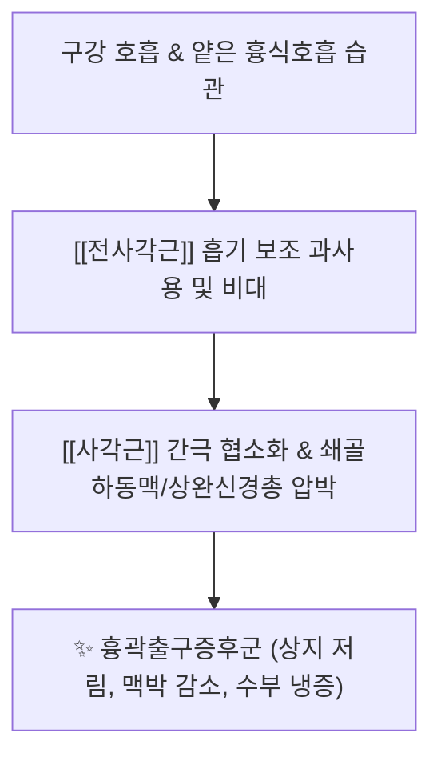
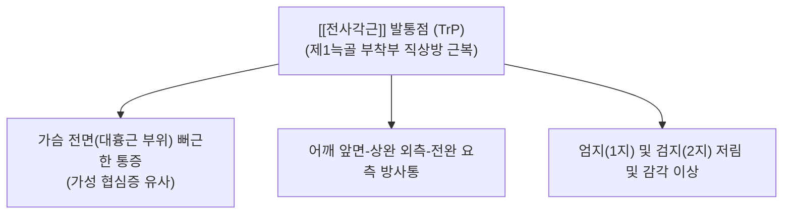

---
aliases:
  - 전사각근
  - 앞목갈비근
  - Scalenus anterior
---
# [[전사각근]](Scalenus anterior)

> **핵심 요약 (Key Summary)**:
> 제3~6경추 횡돌기 전결절에서 기원하여 제1늑골의 [[사각근]] 결절에 정지하는 [[사각근]] 삼각의 전방 벽을 이루는 핵심 근육입니다.
> 경신경 전지(C4~C6)의 지배를 받으며, 경추의 굴곡·측굴·대측 회전 및 흡기 시 제1늑골 거상을 주도합니다.
> [[흉곽출구 증후군|흉곽출구증후군]](TOS), 상지 방사통, 수부 부종 및 저림, 상부교차증후군의 핵심 병변근이며, 결분·천정혈 도침 및 약침이 표적입니다.

---
## 📌 목차
1. [해부학적 정밀 구조 및 지배 신경/혈관](#1-해부학적-정밀-구조-및-지배-신경혈관)
2. [생체역학·토크 분석 & 근막 사슬 (Biomechanical Synergy)](#2-생체역학토크-분석--경부-근막-사슬-biomechanical-synergy)
3. [근막통증증후군(TP) & 연관통 패턴 (Travell & Simons)](#3-근막통증증후군tp--연관통-패턴-travell--simons)
4. [초음파 해부학(Sonoanatomy) 및 중재 시술 랜드마크](#4-초음파-해부학sonoanatomy-및-중재-시술-랜드마크)
5. [⭐ 원장님 심층 임상 고찰 및 원본 필기 (Clinical Pearls)](#5-원장님-심층-임상-고찰-및-원본-필기-clinical-pearls)
6. [관련 임상 질환 및 운동손상 증후군 총괄](#6-관련-임상-질환-및-운동손상-증후군-총괄)
7. [추나·도수치료(MET/PIR) & 침구·약침·재활 프로토콜](#7-추나도수치료metpir--침구약침재활-프로토콜)
8. [출처 및 학술 참고 문헌 (References)](#8-출처-및-학술-참고-문헌-references)

---
## 1. 해부학적 정밀 구조 및 지배 신경/혈관

| 항목 | 상세 내용 |
| :--- | :--- |
| **기시 (Origin)** | 제3~6경추(C3~C6) 횡돌기 전결절 (Anterior tubercles of transverse processes) |
| **정지 (Insertion)** | 제1늑골 상면 내측연의 [[사각근]] 결절 (Scalene tubercle on upper border of 1st rib) |
| **신경 지배** | 제4~6경추신경 전지 ([[경신경총]] 및 상완신경총 분지, C4~C6 anterior rami) |
| **혈관 공급** | 상행경동맥(Ascending cervical A.), 갑상경동맥(Thyrocervical trunk) 분지 |

### 🔬 해부학 도해 및 단면도
![[Scalenus_anterior_anatomy.png|450]]
> [Wikipedia 공중도메인 해부학 도해]: 제3~6경추 횡돌기 전결절에서 제1늑골 [[사각근]] 결절로 사하방 주행하며 [[사각근]] 간극(Scalene triangle)의 전벽을 형성하는 [[전사각근]]의 3D 해부도.

---
## 2. 생체역학·토크 분석 & 근막 사슬 (Biomechanical Synergy)

* **경추 운동 및 두경부 안정화**:
  * **양측 수축 (Bilateral Action)**: 경추를 강력하게 전방 굴곡(Flexion)시키고, 머리가 뒤로 젖혀지는 충격을 지탱.
  * **일측 수축 (Unilateral Action)**: 경추의 동측 측굴(Lateral flexion) 및 **반대측 회전(Contralateral rotation)**을 유도 ([[흉쇄유돌근]](SCM)과 동일한 회전 방향 협력).
* **흡기 보조근 (Accessory Inspiratory Muscle)**:
  * [[횡격막]] 호흡이 무너진 환자에서 제1늑골을 상방으로 강하게 들어 올려 흉곽 상구를 억지로 확장시키는 보상 작용 수행.
* **근막 사슬 연계 (Anatomy Trains)**:
  * **심부전방선(Deep Front Line, DFL)**: [[장요근]]-[[횡격막]]-심부 흉부근막을 거쳐 경추 전방의 [[전사각근]] 및 [[경장근]]으로 이어지는 코어 축의 최상단 앵커.

---
## 3. 근막통증증후군(TP) & 연관통 패턴 (Travell & Simons)

![[Scalene_TriggerPoints.jpg|450]]
> [Travell & Simons 발통점 지도]: [[사각근]] 발통점에서 흉부 전면, 어깨, 상완 외측, 전완 요측을 타고 엄지 및 검지 손가락으로 뻗치는 광범위한 상지 방사통 패턴.

* **발통점 및 연관통 특성**:
  * **어깨 및 상지 방사통 ([[경추 추간판 탈출증|목 디스크]] 오진 최다 원인)**:
    * 어깨 전면에서 상완 외측을 타고 내려가 [[요골신경]] 주행선을 따라 엄지와 검지(C6 신경근 영역)로 저림과 감각 이상 투사.
  * **전흉부 방사통 ([[가성 협심증]], Pseudo-angina)**:
    * 좌측 [[전사각근]] TrP 활성화 시 [[대흉근]] 부위로 통증이 뻗쳐 심장 질환([[협심증]])으로 오인하기 쉬움 (심전도상 정상).
  * **견갑골 내측연 통증**:
    * 견갑골 내측연과 [[능형근]] 부위로 깊은 쑤심을 방사하여 만성 등 통증 유발.

---
## 4. 초음파 해부학(Sonoanatomy) 및 중재 시술 랜드마크

* [[사각근]] **간극(Scalene Triangle / Interscalene Space) 구조**:
  * **전방 벽**: [[전사각근]] (Scalenus anterior)
  * **후방 벽**: [[중사각근]] (Scalenus medius)
  * **바닥**: 제1늑골(1st Rib) 상면
  * **내부 주행물**: [[상완신경총]](Brachial plexus) 신경간(Trunks: C5, C6, C7, C8, T1) 및 [[쇄골하동맥]](Subclavian A.)
* **초음파 단면 소견 (Interscalene View)**:
  * 쇄골 상와에서 선형 프로브를 횡단 배치하면, [[전사각근]]과 [[중사각근]] 사이에 [[상완신경총]] 신경근들이 원형의 저에코 음영으로 세로로 정렬된 '신호등 징후(Traffic Light Sign)' 관찰.
* [[전사각근]] **전면 랜드마크**:
  * [[횡격막신경]](Phrenic nerve): [[전사각근]] 전면 근막 위를 내측 사하방으로 가로지르므로 약침 주입 시 과도한 신경 차단 주의.
* **안전 마진 및 절대 금기 (CRITICAL)**:
  * **기흉(Pneumothorax) 방지**: [[전사각근]] 정지부 심부에는 폐첨부(Apex of lung / Cupula of pleura)가 위치하므로, 침이나 도침의 깊이를 엄격히 통제하고, 반드시 제1늑골 골면에 정확히 안착(Bone touch)시킨 상태에서만 수평 박리 시행 (폐첨부 방향 사자 절대 엄금).

---
## 5. ⭐ 원장님 심층 임상 고찰 및 원본 필기 (Clinical Pearls)

### 1) [[흉곽출구 증후군]](TOS)의 주범과 신경혈관 포착 (원장님 필기 100% 보존)
* [[전사각근]]과 [[중사각근]] 사이를 통과하는 [[상완신경총]]과 [[쇄골하동맥]]을 압박하여 상지 저림 및 혈류 장애를 유발합니다.
* **원장님 핵심 진단 팁**:
  * 환자가 "밤에 잘 때 팔이 저려서 깬다", "손이 붓고 찬물에 닿으면 시리다"고 호소하면 [[경추 추간판 탈출증|목 디스크]]보다 [[사각근]] 기원성 [[흉곽출구 증후군]](TOS)을 먼저 감별해야 합니다.
  * [[애드슨 검사]](Adson test): 환자의 턱을 들고 환측으로 고개를 돌린 뒤 심호흡을 들이마시게 했을 때 요골동맥 맥박이 급격히 약해지거나 소실되면 [[전사각근]]에 의한 [[쇄골하동맥]] 포착으로 확진.

### 2) 횡격막 호흡과의 연계 및 과호흡 증후군 (원장님 필기 100% 보존)
* [[전사각근]]은 대표적인 흡기 보조근으로, 스트레스나 불안으로 인해 복식호흡이 깨지고 얕은 흉식 과호흡이 지속되면 하루 2만 번 이상 과사용되어 만성 단축에 빠집니다.
* [[사각근]] 치료 시 침구 치료와 더불어 반드시 [[횡격막]] 복식호흡 재활을 병행해야 재발의 고리를 끊을 수 있습니다.

### 3) 목 디스크와의 감별과 [[더블 크러시 증후군]](Double Crush Syndrome)
* [[경추 추간판 탈출증]](HIVD) 환자 중 수술이나 신경차단술 후에도 상지 저림이 남는 경우, [[상완신경총]]이 [[사각근]] 간극에서 2차 포착된 [[더블 크러시 증후군]] 상태입니다. 결분혈-천정혈 부위의 [[전사각근]] 긴장을 도침으로 풀어주면 잔여 저림이 즉시 호전됩니다.

---
## 6. 관련 임상 질환 및 운동손상 증후군 총괄

| 임상 질환 / 증후군 | 병리적 연관 기전 | 주요 증상 및 이학적 검사 | 핵심 교정 타깃 |
| :--- | :--- | :--- | :--- |
| [[흉곽출구 증후군]] | [[사각근]] 간극 협소화로 신경혈관 압박 | 상지 저림, 파지력 약화, [[애드슨 검사]] 양성 | 제1늑골 [[사각근]] 결절 도침 박리 |
| [[가성 협심증]] | 좌측 [[전사각근]] TrP의 전흉부 방사 | 좌측 흉통, 숨차는 느낌, EKG 정상 | [[전사각근]] 침구 및 발통점 이완 |
| [[더블 크러시 증후군]] | [[경추 추간판 탈출증]]과 [[사각근]] 포착의 중첩 | 난치성 손가락 저림, 1~2지 감각 둔화 | [[사각근]] 감압 및 경추 추나 병행 |
| [[과호흡 증후군]] | [[횡격막]] 기능 저하로 흡기근 보상 과열 | 만성 뒷목 결림, 쇄골 상와 팽만감 | [[사각근]] MET 및 복식호흡 트레이닝 |
| [[상부교차증후군]] | [[거북목 증후군]]에 따른 [[사각근]] 단축 | 전방 두부 전위, 둥근 어깨, 흉곽 상구 거상 | [[전사각근]] 스트레칭 및 심부굴곡근 강화 |

---
## 7. 추나·도수치료(MET/PIR) & 침구·약침·재활 프로토콜

* **한의학 경혈 매핑**:
  * 결분, 천정, 수돌, 예풍, 기사
* **침구 및 침도(도침) 프로토콜**:
  * **제1늑골 [[사각근]] 결절 도침 박리술 (초고난도 안전 수칙)**:
    * 환자 앙와위, 시술자는 쇄골 상와에서 쇄골하동맥의 박동을 내측으로 밀어 젖히고, 제1늑골의 골면을 확실히 촉지.
    * 0.40x40mm 침도를 제1늑골 골면을 향해 후하방으로 서서히 진침하여 **반드시 제1늑골 골면에 Bone touch**.
    * 골막에 닿은 상태에서만 늑골 장축 방향으로 1회 미세하게 건막 유착을 절개 박리 (절대 골면을 벗어나 내측 심부로 진침 금기).
* **약침 처방**:
  * **오공약침 / 봉약침**: 상완신경총 신경 포착으로 인한 심한 저림, 만성 신경통증에 천정혈-결분혈 라인 사각근막층 0.3~0.5cc 소량 분할 주입.
  * **중성어혈약침**: 쇄골 상와의 혈류 장애, 손의 냉증 및 부종 동반 시 제1늑골 부착부 주입.
  * **자하거약침**: 만성 흉곽출구증후군으로 상지 근위축 및 악력 저하가 발생한 허증 환자 신경 재생 유도.
* **추나 및 신장 테크닉 (Scalene MET / PIR)**:
  * [[전사각근]] **등척성 수축 후 이완 (PIR)**:
    * 환자 앙와위, 시술자는 환자의 머리를 반대측 측굴, 동측 회전, 약간의 경추 신전 상태로 위치시켜 전사각근을 신장 장벽에 거치.
    * 환자에게 "머리를 반대쪽 회전 및 전방 굴곡 방향으로 20% 힘으로 미세요" 지시 후 5~7초간 등척성 수축 유지.
    * 호기와 함께 완전히 이완시키며 새로운 반대측 측굴 범위로 부드럽게 10~15초간 신장 유지 (3회 반복).

---
## 8. 출처 및 학술 참고 문헌 (References)

1. **Standring, S. (2020)**. *Gray's Anatomy: The Anatomical Basis of Clinical Practice* (42nd ed.). Elsevier, pp. 582-584.
   - **[연구 요약]**: 전사각근의 C3-C6 횡돌기 전결절 기시 및 제1늑골 [[사각근]] 결절 정지 구조, [[사각근]] 간극의 경계와 상완신경총/쇄골하동맥 주행 분석.
2. **Travell, J. G., & Simons, D. G. (1999)**. *Myofascial Pain and Dysfunction: The Trigger Point Manual*, Vol. 1 (2nd ed.). Williams & Wilkins, pp. 504-537.
   - **[연구 요약]**: [[사각근]] 발통점에 의한 상지 방사통, 가성 협심증 전흉부 방사통 및 1~2지 저림 임상 경로 규명.
3. **Novak, C. B., & Mackinnon, S. E. (1996)**. Thoracic outlet syndrome. *Orthop Clin North Am*, 27(4), 747-762. [PMID: 8823394](https://pubmed.ncbi.nlm.nih.gov/8823394/)
   - **[연구 요약]**:  전사각근 비대·섬유화에 의한 흉곽출구증후군의 병태생리와 신경학적 평가·치료 원칙 정리.
4. **Mackel, M. (2016)**. Thoracic outlet syndrome. *Curr Sports Med Rep*, 15(5), 344-349. [PMID: 26963010](https://pubmed.ncbi.nlm.nih.gov/26963010/)
   - **[연구 요약]**:  사각근 간극 신경혈관 압박의 진단적 검사와 보존적 치료(도수·주사) 접근 정리.