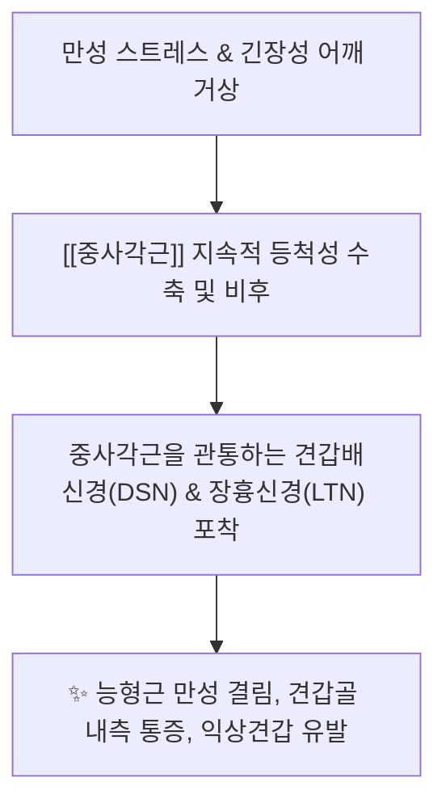
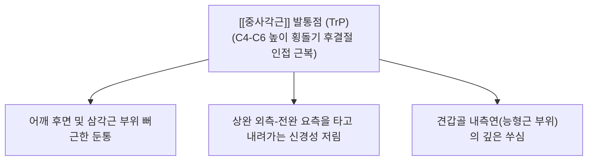

---
aliases:
  - 중사각근
  - 중간목갈비근
  - Scalenus medius
---
# [[중사각근]](Scalenus medius)

> **핵심 요약 (Key Summary)**:
> 제2~7경추 횡돌기 후결절에서 광범위하게 기원하여 제1늑골 상면에 넓게 정지하는 사각근군 중 가장 크고 강력한 근육입니다.
> 경신경 전지(C3~C8)의 지배를 받으며, 경추의 강력한 순수 측굴 및 호흡 시 제1늑골 거상을 주도합니다.
> [[흉곽출구 증후군|흉곽출구증후군]](TOS), 견갑배신경 포착, 경추 측굴 제한, 상지 방사통의 핵심 병변근이며, 결분·천정혈 도침 및 약침이 표적입니다.

---
## 📌 목차
1. [해부학적 정밀 구조 및 지배 신경/혈관](#1-해부학적-정밀-구조-및-지배-신경혈관)
2. [생체역학·토크 분석 & 근막 사슬 (Biomechanical Synergy)](#2-생체역학토크-분석--경부-근막-사슬-biomechanical-synergy)
3. [근막통증증후군(TP) & 연관통 패턴 (Travell & Simons)](#3-근막통증증후군tp--연관통-패턴-travell--simons)
4. [초음파 해부학(Sonoanatomy) 및 중재 시술 랜드마크](#4-초음파-해부학sonoanatomy-및-중재-시술-랜드마크)
5. [⭐ 원장님 심층 임상 고찰 및 원본 필기 (Clinical Pearls)](#5-원장님-심층-임상-고찰-및-원본-필기-clinical-pearls)
6. [관련 임상 질환 및 운동손상 증후군 총괄](#6-관련-임상-질환-및-운동손상-증후군-총괄)
7. [추나·도수치료(MET/PIR) & 침구·약침·재활 프로토콜](#7-추나도수치료metpir--침구약침재활-프로토콜)
8. [출처 및 학술 참고 문헌 (References)](#8-출처-및-학술-참고-문헌-references)

---
## 1. 해부학적 정밀 구조 및 지배 신경/혈관

| 항목 | 상세 내용 |
| :--- | :--- |
| **기시 (Origin)** | 제2~7경추(C2~C7, 축추에서 제7경추까지 전 층) 횡돌기 후결절(Posterior tubercles) |
| **정지 (Insertion)** | 제1늑골 상면 (쇄골하동맥구와 제1늑골 결절 사이 넓은 조면) |
| **신경 지배** | 제3~8경추신경 전지 ([[경신경총]] 및 상완신경총 분지, C3~C8 anterior rami) |
| **혈관 공급** | 상행경동맥(Ascending cervical A.), 경횡동맥(Transverse cervical A.) 및 늑경동맥 분지 |

### 🔬 해부학 도해 및 단면도
![[Scalenus_medius_anatomy.png|450]]
> [Wikipedia 공중도메인 해부학 도해]: C2부터 C7까지 전 경추 횡돌기 후결절에서 부채꼴로 넓게 뻗어내려 제1늑골 상면에 정지하는 [[사각근]] 최대 근육인 [[중사각근]]의 정밀 해부도.

---
## 2. 생체역학·토크 분석 & 근막 사슬 (Biomechanical Synergy)

* **경추 순수 측굴의 최강 주동근 (Pure Lateral Flexor)**:
  * 회전 성분이 거의 없이 **머리와 목을 어깨 쪽으로 정확하게 옆으로 꺾는 순수 관상면 측굴력**을 전담.
* [[사각근]] **간극(Scalene Triangle)의 든든한 후방 지지벽**:
  * 전방의 [[전사각근]]과 함께 상완신경총 신경간(Trunks)을 지탱하며, 목의 측방 굽힘 시 신경총이 뒤로 밀리지 않도록 가이드 레일 역할 수행.
* **중사각근을 직접 관통하는 핵심 신경 2종 (CRITICAL)**:
  * **견갑배신경 (Dorsal scapular nerve, C5)**: [[중사각근]] 근복을 뚫고 나와 [[견갑거근]]과 [[능형근]]을 지배.
  * **장흉신경 (Long thoracic nerve, C5-C7)**: [[중사각근]] 근복을 관통하여 흉벽을 타고 내려가 [[전거근]]을 지배.
  * 따라서 [[중사각근]] 연축 시 목뿐만 아니라 등 뒤 능형근과 갈비뼈 측면 전거근까지 연쇄 마비/통증 초래.
* **근막 사슬 연계 (Anatomy Trains)**:
  * **측선(Lateral Line, LL)** 및 **심부전방선(Deep Front Line, DFL)**: 체간 측면 안정성과 경추 심부 기둥을 연결하는 중추 지지대.

---
## 3. 근막통증증후군(TP) & 연관통 패턴 (Travell & Simons)

![[Scalene_TriggerPoints.jpg|450]]
> [Travell & Simons 발통점 지도]: [[중사각근]] 발통점에서 쇄골 상와를 지나 어깨 후면, 상완 외측, 전완 요측 및 손등과 손가락으로 뻗치는 방사통 패턴.

* **발통점 및 연관통 특성**:
  * **어깨 후면 및 상지 외측 방사통**:
    * 어깨 뒤쪽에서 상완 외측을 타고 전완 요측으로 통증이 흐르며, C5-C6 신경근 병증(Radiculopathy)과 매우 흡사한 양상.
  * **견갑골 내측연 통증 (Dorsal Scapular Pain)**:
    * 트라벨 & 시몬스가 지적한 대로, 능형근 자체의 문제보다 [[중사각근]] TrP에서 견갑골 안쪽 가장자리로 방사되는 연관통 환자가 임상에서 훨씬 흔함.
  * **경추 측굴 각도의 급격한 소실**:
    * 귀가 반대쪽 어깨에 닿지 않고 30도 미만에서 팽팽한 통증과 함께 목 측면이 잠김.

---
## 4. 초음파 해부학(Sonoanatomy) 및 중재 시술 랜드마크

* **초음파 스캔 프로토콜**:
  * **프로브 위치**: C5-C7 레벨 쇄골 상와에서 종단/횡단 스캔 거치.
  * **단면 소견**: [[전사각근]] 후방에서 훨씬 크고 두터운 근육 덩어리로 관찰되며, 그 사이에 [[상완신경총]] 신경근들이 포도송이/신호등 모양으로 배열.
* **신경 관통 랜드마크 (Doppler & Neuro-Sono)**:
  * [[중사각근]] 근복 실질 내부를 가로지르는 [[견갑배신경]](DSN) 및 [[장흉신경]](LTN)의 미세 저에코 관통선을 동정하여 약침 수액박리술(Hydrodissection) 타깃팅.
* **안전 마진 및 절대 금기 (CRITICAL)**:
  * 제1늑골 상면 정지부 시술 시, [[기흉]] 방지를 위해 침향을 내하방으로 향하지 말고, 반드시 제1늑골 골면 후방에 Bone touch를 확인하며 자침.

---
## 5. ⭐ 원장님 심층 임상 고찰 및 원본 필기 (Clinical Pearls)

### 1) [[사각근]] 삼각의 후방 벽과 신경혈관 포착 (원장님 필기 100% 보존)
* [[전사각근]]과 함께 [[상완신경총]] 하강 부위를 압박하여 [[흉곽출구 증후군]](TOS)을 유발하는 핵심 배후입니다.
* [[전사각근]]이 주로 [[쇄골하동맥]]의 혈류 장애(맥박 소실, 손 냉증)를 많이 일으킨다면, [[중사각근]]은 거대한 근육량으로 [[상완신경총]] 신경간을 직접 짓눌러 신경성 상지 방사통과 무력감(Weak grip)을 더 심하게 유발합니다.

### 2) 경추 측굴 제한의 주범 (원장님 필기 100% 보존)
* 만성 스트레스나 컴퓨터 작업 시 무의식적으로 어깨를 으쓱하는 환자는 [[중사각근]] 단축으로 인해 목을 옆으로 꺾기 극히 어렵습니다.
* 목 측굴 제한 환자에게 [[승모근]] 상부만 치료해서는 안 되며, C2~C7 횡돌기 후결절을 따라 [[중사각근]] 기시부 건막을 풀어주어야 목의 측방 굴곡 각도가 즉시 회복됩니다.

### 3) 능형근 통증의 비밀: [[견갑배신경 포착증후군]](DSN Entrapment)
* 환자가 "견갑골 안쪽 등 부위가 쑤시고 결려서 잠을 못 자겠다", "등 뒤에 테니스공을 대고 문질러도 시원하지 않다"고 호소할 때, [[능형근]]을 아무리 침 놓고 부항 떠도 재발합니다.
* 이는 십중팔구 [[견갑배신경]]이 [[중사각근]]을 뚫고 나오는 부위에서 꽉 집혀 있는 것(Entrapment)이므로, 목 측면 [[중사각근]] 중간부를 도침이나 약침으로 감압해주면 등 뒤 통증이 마법처럼 사라집니다.

---
## 6. 관련 임상 질환 및 운동손상 증후군 총괄

| 임상 질환 / 증후군 | 병리적 연관 기전 | 주요 증상 및 이학적 검사 | 핵심 교정 타깃 |
| :--- | :--- | :--- | :--- |
| [[흉곽출구 증후군]] | [[중사각근]] 비후로 [[사각근]] 간극 신경 압박 | 팔 저림, 악수 시 힘 빠짐, [[모를리 검사]] 양성 | 제1늑골 정지부 도침 박리술 |
| [[견갑배신경 포착증후군]] | [[중사각근]] 근복 내 DSN 신경 포착 | 견갑골 내측연 깊은 작열통, [[능형근]] 압통 | [[중사각근]] 신경 관통부 수액박리 |
| [[경추 측굴 장애]] | [[중사각근]] 편측성 만성 경축 | 고개 옆으로 기울임 극심한 제한 및 통증 | C3-C7 횡돌기 후결절 침도술 |
| [[익상견갑]] | [[중사각근]] 연축으로 장흉신경 마비 | 팔 들 때 견갑골 뒤로 들림, [[전거근]] 무력 | [[중사각근]] 이완 및 장흉신경 감압 |
| [[상부 흉곽 호흡장애]] | 제1늑골 거상 고정 및 흉곽 상구 경직 | 가슴이 답답하고 숨을 깊이 들이쉬기 힘듦 | 제1늑골 교정 추나 및 호흡 재활 |

---
## 7. 추나·도수치료(MET/PIR) & 침구·약침·재활 프로토콜

* **한의학 경혈 매핑**:
  * 결분, 천정, 견외유, 풍지, 견정, 노회
* **침구 및 침도(도침) 프로토콜**:
  * **C3~C6 횡돌기 후결절 기시부 도침술**: 횡돌기 후결절 골면에 도침을 직자하여 골막에 안착(Bone touch) 후, [[중사각근]] 건막 유착 부위를 상하로 1~2회 미세 절개.
  * **제1늑골 상면 정지부 도침 감압술**: 쇄골 상와 중앙에서 제1늑골 골면을 향해 직하방으로 진침하여 골면에 닿은 상태에서만 외측으로 1회 탕전 박리.
* **약침 처방**:
  * **오공약침 / 봉약침**: 상완신경총 및 견갑배신경 포착에 의한 신경인성 통증, 손 저림 환자에게 천정혈 심부 중사각근막층에 0.5cc 정밀 주입.
  * **중성어혈약침**: 경추 측굴 제한, 외상성 경부 염좌로 인한 극심한 가동통 시 0.5~1.0cc 주입.
  * **자하거약침**: 만성 신경 포착으로 인한 상지 무력감 및 근위축 환자의 신경근 접합부 재생 유도.
* **추나 및 신장 테크닉 (Scalenus Medius MET)**:
  * **앙와위 순수 측굴 MET**:
    * 환자 앙와위, 시술자는 한 손으로 환자의 동측 어깨를 아래로 단단히 고정하고, 다른 손으로 환자의 머리를 순수하게 반대측 측굴 장벽까지 이동.
    * 환자에게 "귀를 동측 어깨 쪽으로 20% 힘으로 미세요" 지시 후 5~7초간 등척성 수축 유지.
    * 호기와 함께 완전히 힘을 뺀 상태에서 반대측 측굴 범위로 부드럽게 10~15초간 신장 유지 (3~5회 반복).

---
## 8. 출처 및 학술 참고 문헌 (References)

1. **Standring, S. (2020)**. *Gray's Anatomy: The Anatomical Basis of Clinical Practice* (42nd ed.). Elsevier, pp. 582-584.
   - **[연구 요약]**: 중사각근의 전 경추 횡돌기 후결절 기시 및 제1늑골 정지 구조, 견갑배신경과 장흉신경의 근복 관통 해부학 분석.
2. **Travell, J. G., & Simons, D. G. (1999)**. *Myofascial Pain and Dysfunction: The Trigger Point Manual*, Vol. 1 (2nd ed.). Williams & Wilkins, pp. 504-537.
   - **[연구 요약]**: [[중사각근]] 발통점에 의한 어깨 후면 및 견갑골 내측연 방사통, 상완/전완 요측 저림 패턴 확립.
3. **Chen, D., Gu, Y., Lao, J., & Chen, L. (1995)**. Dorsal scapular nerve compression. Atypical thoracic outlet syndrome. *Chin Med J (Engl)*, 108(8), 582-585. [PMID: 7587488](https://pubmed.ncbi.nlm.nih.gov/7587488/)
   - **[연구 요약]**:  견갑배신경 압박(중사각근 통과부)으로 인한 비정형 흉곽출구증후군의 임상 증례·치료 경험 보고.
4. **Novak, C. B., & Mackinnon, S. E. (1996)**. Thoracic outlet syndrome. *Orthop Clin North Am*, 27(4), 747-762. [PMID: 8823394](https://pubmed.ncbi.nlm.nih.gov/8823394/)
   - **[연구 요약]**:  사각근 간극 신경 압박과 보존적 치료 근거를 종합한 리뷰.