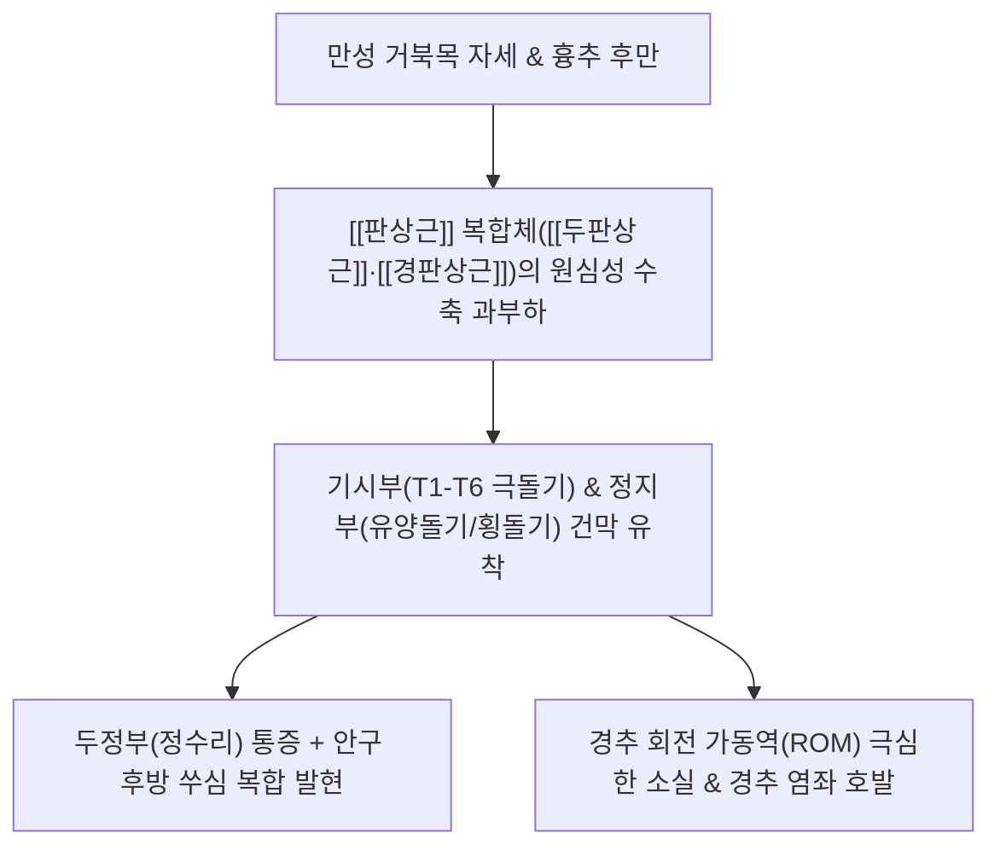

---
aliases:
  - 판상근
  - 널판근
  - Splenius
  - Splenius capitis and cervicis
---
# [[판상근]](Splenius (Capitis & Cervicis))

> **핵심 요약 (Key Summary)**:
> 제7경추 및 상위 흉추(T1~T6) 극돌기에서 기원하여 유양돌기, 후두골 및 상위 경추 횡돌기에 정지하는 [[두판상근]]과 [[경판상근]]으로 구성된 후경부 밴드형 근육군입니다.
> 상위 경신경 후지(C2~C5)의 지배를 받으며, 두경부의 강력한 신전, 동측 측굴 및 동측 회전(반대측 [[흉쇄유돌근]]과 짝힘)을 주도합니다.
> [[경추성 두통]], 정수리 방사통, 안구 후방통, [[긴장성 두통]], [[상부교차증후군]] 및 목 회전 장애의 핵심 병변근이며, 풍지·천주·완골혈 도침 및 약침이 표적입니다.

---
## 📌 목차
1. [해부학적 정밀 구조 및 지배 신경/혈관](#1-해부학적-정밀-구조-및-지배-신경혈관)
2. [생체역학·토크 분석 & 경부 근막 사슬 (Biomechanical Synergy)](#2-생체역학토크-분석--경부-근막-사슬-biomechanical-synergy)
3. [근막통증증후군(TP) & 연관통 패턴 (Travell & Simons)](#3-근막통증증후군tp--연관통-패턴-travell--simons)
4. [초음파 해부학(Sonoanatomy) 및 중재 시술 랜드마크](#4-초음파-해부학sonoanatomy-및-중재-시술-랜드마크)
5. [⭐ 원장님 심층 임상 고찰 및 원본 필기 (Clinical Pearls)](#5-원장님-심층-임상-고찰-및-원본-필기-clinical-pearls)
6. [관련 임상 질환 및 운동손상 증후군 총괄](#6-관련-임상-질환-및-운동손상-증후군-총괄)
7. [추나·도수치료(MET/PIR) & 침구·약침·재활 프로토콜](#7-추나도수치료metpir--침구약침재활-프로토콜)
8. [출처 및 학술 참고 문헌 (References)](#8-출처-및-학술-참고-문헌-references)

---
## 1. 해부학적 정밀 구조 및 지배 신경/혈관

| 근육 구분 | 기시부 (Origin) | 정지부 (Insertion) | 지배 신경 | 주요 혈관 |
| :--- | :--- | :--- | :--- | :--- |
| [[두판상근]] (Splenius capitis) | 항인대 하부 1/2, C7~T3 극돌기 | 측두골 [[유양돌기]] 외측면, 후두골 상항선 외측 1/3 골면 | 경신경 후지의 외측지 (C2~C3) | [[후두동맥]](Occipital A.), 심경동맥 분지 |
| [[경판상근]] (Splenius cervicis) | T3~T6 흉추 극돌기 및 극간인대 | C1~C3(또는 C4) 경추 횡돌기 후결절 | 경신경 후지의 외측지 (C4~C5) | [[추골동맥]](Vertebral A.), 상행경동맥 |

### 🔬 해부학 도해 및 단면도
![[Splenius_capitis_anatomy.png|450]]
> [Wikipedia 3D 해부도]: 하위 경추 및 상위 흉추 극돌기에서 기원하여 후두골 및 유양돌기로 사상방 주행하는 [[두판상근]](Splenius capitis)의 정밀 부착 구조.

![[Splenius_cervicis_muscle_back.png|450]]
> [Wikipedia 후경부 해부도]: 흉추 극돌기에서 기원하여 상위 경추 횡돌기로 사선 주행하며 경추 회전을 담당하는 [[경판상근]](Splenius cervicis).

---
## 2. 생체역학·토크 분석 & 경부 근막 사슬 (Biomechanical Synergy)

* **두경부 회전 및 짝힘 메커니즘 (Force Couple Dynamics)**:
  * **경추 회전의 핵심 주동근**:
    * 오른쪽으로 고개를 돌릴 때: **우측 [[두판상근]]·[[경판상근]](동측 회전)**과 **좌측 [[흉쇄유돌근]](SCM, 대측 회전)**이 한 쌍의 대각선 짝힘(Diagonal force couple)을 형성하여 부드러운 회전 토크 발생.
  * **양측 수축 (Bilateral Action)**:
    * 두경부를 뒤로 젖히는 강력한 신전 작용 및 머리가 전방으로 숙여지는 중력 낙하를 지탱.
* [[두판상근]] **vs 경판상근의 기능 분과**:
  * [[두판상근]]: 두개골(후두골·유양돌기)에 직접 부착하여 **머리의 시선 회전 및 두부 신전**에 특화.
  * [[경판상근]]: 경추 횡돌기에 부착하여 **경추 척추 분절 자체의 측굴과 회전**을 안정적으로 가이드.
* **근막 사슬 연계 (Anatomy Trains)**:
  * [[나선선]](Spiral Line, SPL): 두판상근에서 시작하여 반대측 능형근-전거근-외복사근-복직근초로 이어지는 신체 회전 조율 사슬의 최상단 축.

---
## 3. 근막통증증후군(TP) & 연관통 패턴 (Travell & Simons)

![[Splenius_capitis_TriggerPoints.png|450]]
> [Travell & Simons 발통점 지도 1]: [[두판상근]] 발통점(TrP)에서 정수리(두정부, Vertex)로 붉은 점들이 집중 방사되는 정수리 연관통 패턴.

![[Splenius_cervicis_TriggerPoints.jpg|450]]
> [Travell & Simons 발통점 지도 2]: [[경판상근]] 발통점에서 목덜미 측면을 타고 눈골 속(안구 후방)과 측두부로 방사되는 안구통 패턴.

* **두 판상근의 상징적 연관통 감별 (CRITICAL)**:
  1. [[두판상근]] **TrP (정수리 통증의 대명사)**:
     * C2-C3 높이의 근복 및 유양돌기 부착부 TrP 활성화 시 **정수리(두정부) 꼭대기가 시리고 뻐근하며 콕콕 쑤시는 통증** 투사.
  2. [[경판상근]] **TrP (안구 후방통의 주범)**:
     * C1-C3 횡돌기 부착부 상부 TrP는 삼차경수복합체(TCC)를 자극하여 **"눈알이 빠질 것 같고 눈 뒤가 쑤신다"**는 안와 심부 통증 유발.
     * 하부 TrP(경추-흉추 이행부)는 목덜미 기저부와 어깨 위쪽으로 뻐근한 결림 방사.

---
## 4. 초음파 해부학(Sonoanatomy) 및 중재 시술 랜드마크

* **후경부 횡단 스캔 층별 구조**:
  * C2-C4 레벨에서 선형 프로브를 횡단 거치.
  * **제1층**: 최표층 [[승모근]](Trapezius)
  * **제2층**: [[두판상근]](Splenius capitis) (외측 상방 사선 주행) 및 [[경판상근]](Splenius cervicis)
  * **제3층**: [[두반극근]](Semispinalis capitis) (타원형 두터운 근복)
  * **제4층**: 후두하삼각 근육군 및 척추 추궁판
* **안전 마진 및 위험 구조물 회피 (CRITICAL)**:
  * [[후두동맥]](Occipital artery): 유양돌기 후연 상항선 부착부에서 [[두판상근]] 외측을 관통하여 상행하므로 도플러 확인 필수.
  * [[추골동맥]](Vertebral artery): [[경판상근]] 정지부인 C1-C3 횡돌기 사이 공간(Intertransverse space) 깊은 곳을 주행하므로, 횡돌기간 공간으로 침이 진입하지 않도록 **반드시 횡돌기 후결절 골면에 Bone touch** 확인 필수.

---
## 5. ⭐ 원장님 심층 임상 고찰 및 원본 필기 (Clinical Pearls)

### 1) 두통의 온상: 경추성 두통과 정수리 방사통 (원장님 필기 100% 보존)
* [[경추성 두통]] 환자에서 [[판상근]] TrP는 관자놀이와 정수리 통증의 주원인.
* **원장님 핵심 진단 팁**:
  * 환자가 머리 꼭대기(백회혈 부위)가 시리거나 아프다고 호소하면 뇌 질환이나 두피 문제보다 [[두판상근]] **TrP를 1순위로 촉진**해야 합니다.
  * 만약 "눈 뒤쪽이 쑤시고 빠질 듯이 아프며 눈이 침침하다"고 호소하면 [[경판상근]] **상부 TrP**를 표적으로 삼아야 합니다.

### 2) 상부교차증후군 연동: 굽은등과 과신전 보상 (원장님 필기 100% 보존)
* 굽은등 자세에서 과신전 보상으로 만성 피로 호발.
* 스마트폰이나 컴퓨터 작업으로 흉추가 둥글게 말리면(흉추 후만), 시야를 확보하기 위해 목 뒤 판상근들이 머리를 뒤로 젖힌 채 하루 종일 버텨야 합니다.
* 이때 판상근은 만성 신장성 긴장에 빠져 허혈성 유착이 발생하므로, 목만 치료하지 말고 **T1-T6 흉추 극돌기 기시부와 흉추 후만 교정 추나를 반드시 병행**해야 합니다.

### 3) 목 회전 제한(Stiff Neck) 시 대측 SCM과의 동시 치료
* 고개가 한쪽으로 잘 안 돌아가는 급성 낙침(落枕) 환자는 단축된 동측 판상근만 풀어서는 50%밖에 호전되지 않습니다.
* 회전 짝힘을 이루는 **반대측 [[흉쇄유돌근]](SCM)의 쇄골두**를 동시에 풀어주어야 목의 회전 가동역이 100% 즉각 회복됩니다.

---
## 6. 관련 임상 질환 및 운동손상 증후군 총괄

| 임상 질환 / 증후군 | 병리적 연관 기전 | 주요 증상 및 이학적 검사 | 핵심 교정 타깃 |
| :--- | :--- | :--- | :--- |
| [[경추성 두통]] | [[두판상근]] TrP 활성화로 두정부 방사 | 정수리 통증, 관자놀이 둔통, 두피 조임 | 풍지·완골 도침 및 근막이완 |
| [[경추성 안정피로]] | [[경판상근]] 상부 TrP의 TCC 수렴 | 안구 후방 쑤심, 시야 침침함, 눈부심 | C1-C3 횡돌기 부착부 도침 |
| [[경부 회전 장애]] | [[판상근]] 복합체 편측 경축 및 섬유화 | 고개 동측 회전 시 극심한 가동 제한 | [[판상근]] MET 및 대측 SCM 이완 |
| [[상부교차증후군]] | 흉추 후만으로 인한 기시부 견인 손상 | 굽은등, 거북목, 목덜미 기저부 둔통 | T1-T6 기시부 이완 & 흉추 신전 추나 |
| [[편타 손상]] | 급격한 가감속 외상 시 [[판상근]] 급성 파열 | 수상 후 목 전반의 경직 및 회전 불가 | 초기 중성어혈약침 및 경추 안정화 |

---
## 7. 추나·도수치료(MET/PIR) & 침구·약침·재활 프로토콜

* **한의학 경혈 매핑**:
  * 풍지, 천주, 완골, 대추, 신주, 천유, 견외유
* **침구 및 침도(도침) 프로토콜**:
  * **풍지(GB20) 및 완골(GB12) [[두판상근]] 정지부**:
    * 유양돌기 후연 골면에 침도를 직자하여 Bone touch 후 골막 유착부를 1~2회 탕전 박리.
  * **C1~C3 횡돌기 [[경판상근]] 정지부**:
    * 횡돌기 후결절 골면에 정확히 접촉 후 미세 절개 박리.
  * **T1~T6 흉추 극돌기 기시부**:
    * 극돌기 외측 1cm 부위에서 늑골 방향으로 사자하여 건막 견인 유착 박리.
* **약침 처방**:
  * **중성어혈약침**: 급성 낙침, 교통사고 [[편타 손상]], 회전 제한 시 기시/정지부에 0.5~1.0cc 주입.
  * **소염약침 / 황련해독탕약침**: 안구 후방 쑤심, 두정부 열감성 두통 환자 상부 TrP 주입.
  * **자하거약침**: 만성 거북목 환자의 퇴행성 건 부착부 조직 재생.
* **추나 및 신장 테크닉 (Splenius MET / PIR)**:
  * [[판상근]] **등척성 수축 후 이완 (PIR)**:
    * 환자 앙와위, 시술자는 환자의 머리를 반대측 회전, 반대측 측굴, 가벼운 전방 굴곡 상태로 위치시켜 신장 장벽 형성.
    * 환자에게 "머리를 제 손 저항 방향(동측 회전 및 신전)으로 20% 힘으로 미세요" 지시 (5~7초 유지).
    * 호기와 함께 완전히 이완시키며 새로운 회전/측굴 범위로 15초간 신장 유지 (3회 반복).

---
## 8. 출처 및 학술 참고 문헌 (References)

1. **Standring, S. (2020)**. *Gray's Anatomy: The Anatomical Basis of Clinical Practice* (42nd ed.). Elsevier, pp. 834-835.
   - [연구 요약] [[두판상근]] 및 경판상근의 척추 및 두개골 부착 구조, 경신경 후지 외측지 신경 지배 및 혈관 주행 분석.
2. **Travell, J. G., & Simons, D. G. (1999)**. *Myofascial Pain and Dysfunction: The Trigger Point Manual*, Vol. 1 (2nd ed.). Williams & Wilkins, pp. 432-452.
   - [연구 요약] 두판상근의 정수리(두정부) 방사통과 경판상근의 안구 후방통(Retro-orbital pain) 임상 감별 지침 규명.
3. **Bogduk, N., & Govind, J. (2009)**. Cervicogenic headache: an assessment of the evidence on clinical diagnosis, tests, and treatment. *Lancet Neurol*, 8(10), 959-968. [PMID: 19747657](https://pubmed.ncbi.nlm.nih.gov/19747657/)
   - [연구 요약] 경추성 두통 환자에서 경부 신전근([[판상근]] 복합체)의 긴장과 삼차경수복합체 수렴 기전에 대한 근거 분석.