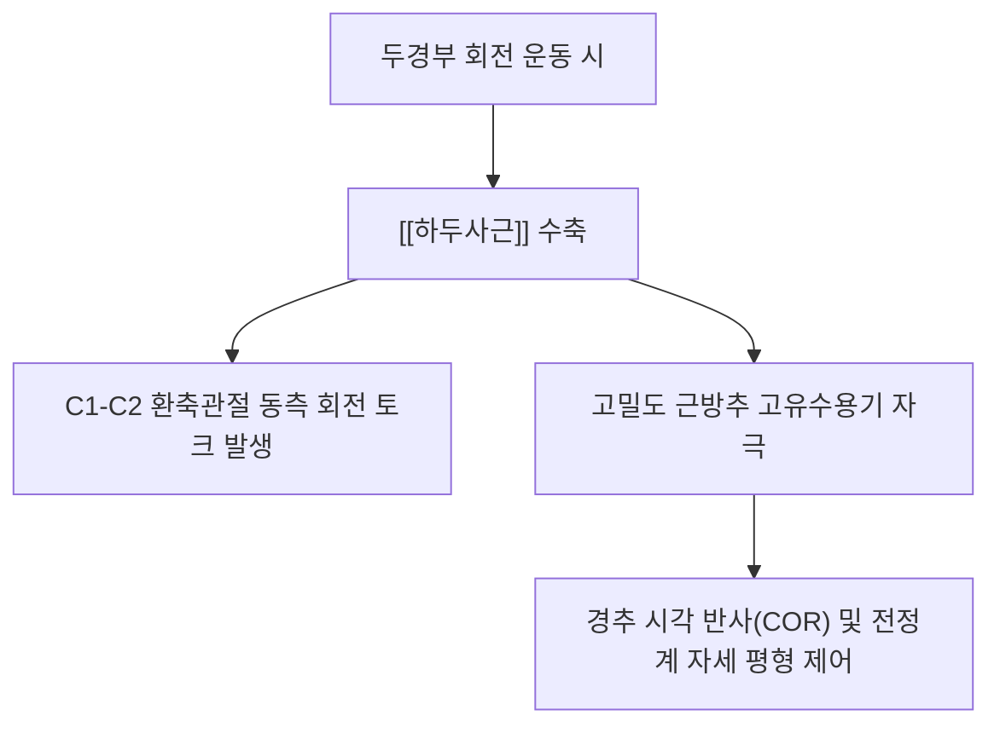

---
aliases:
  - 하두사근
  - 아래머리사선근
  - Obliquus capitis inferior
tags:
  - 근육
  - 경부
  - 후두하근
  - 경추성두통
  - 후두신경통
---
# 🫁 [[하두사근]] (Obliquus Capitis Inferior, 아래머리사선근)

> **핵심 요약 (Key Summary)기시 (Origin)** | 제2경추(C2, 축추 Axis)의 극돌기 외측면 |
| **정지 (Insertion)** | 제1경추(C1, 환추 Atlas)의 횡돌기 하후연 |
| **신경 지배** |  |
| **혈관 공급** | 추골동맥(Vertebral artery)의 후두하 분지, 후두동맥 심부 하행지 |
| **구조적 특이점** | 4개의 [[후두하근]] 중 두개골(후두골)에 부착하지 않고 오직 경추골(C1-C2) 사이에만 연결되는 유일한 근육 |

---

## 2. 생체역학·토크 분석 & 관절 안정성

* **C1-C2 회전 주동근**:
  * 환축관절(Atlantoaxial joint)은 두경부 전체 회전 가동범위(ROM)의 약 50%(약 40~45°)를 담당합니다.
  * 하두사근은 사선으로 강력한 지렛대 팔(Moment arm)을 형성하여 머리를 같은 쪽으로 돌리는 동측 회전(Ipsilateral rotation)의 강력한 엔진으로 작용합니다.
* **고유수용성 감각 수용체의 보고**:
  * 근육 1g당 근방추(Muscle spindle) 밀도가 인체 근육 중 최고 수준(대퇴사두근의 수십 배)으로, 미세한 머리 위치 변화와 눈 움직임을 동조시키는 고유감각 센서 역할을 수행합니다.

---

## 3. 대후두신경(GON) 포착 메커니즘 & 신경통

* **후두하삼각(Suboccipital triangle)의 하벽 형성**:
  * 상내측: [[대후두직근]], 상외측: [[상두사근]], .
* **대후두신경(Greater Occipital Nerve, GON)과의 교차 관계**:
  * C2 척수신경 후지(dorsal ramus)의 내측지인 [[대후두신경]]은 하두사근의 **하연을 바짝 감아 돌면서(Looping)** 후두부 상방으로 주행합니다.
  * 스마트폰 사용, 거북목 자세로 인해 하두사근이 단축·경결되면 대후두신경을 직접 옭아매어(Entrapment) **후두부 찌릿한 방산통, 정수리 통증, 안구 뒤쪽 통증(눈골 쑤심)**을 유발합니다.

---

## 4. 초음파 해부학(Sonoanatomy) 및 안전 자침 랜드마크

* **초음파 스캔 랜드마크**:
  * C2 극돌기(두 갈래로 갈라진 뼈 음영)에 프로브를 대고 C1 횡돌기 방향으로 사선으로 기울이면, C2 극돌기에서 C1 횡돌기로 이어지는 두꺼운 하두사근 단면을 선명하게 확인.
  * 하두사근 표층으로 [[두반극근]], 심층 내측으로 C1-C2 척추궁판과 추골동맥 주행을 식별.
* **자침 안전 마진**:
  * 하두사근 심층 외측에는 추골동맥(Vertebral artery)의 V3 분절이 지나므로, 무리한 심자나 외측 깊은 자입은 피하고 C2 극돌기 외측 골막을 촉지하며 안전하게 접근.

---

## 5. 관련 임상 질환 및 감별 진단

* :
  * 목 움직임이나 특정 자세 유지 시 악화되며, 후두부에서 시작하여 관자놀이, 전두부, 안와부로 뻗치는 편측성 두통.
* :
  * 대후두신경 주행 경로를 따라 발작적으로 찌르는 듯한(Shooting) 전격성 통증.
* **경성 현훈(Cervicogenic Dizziness)**:
  * 하두사근의 과도한 긴장으로 경추 고유감각과 전정계 신호의 불일치가 발생하여 생기는 자세성 어지럼증.

---

## 6. 추나·도수치료 & 침구·약침 프로토콜

* **추나치료 및 MET(근에너지기법)**:
  * **후두하근군 이완 견인 추나**: 환자를 앙와위로 눕히고 검지와 중지로 C2 극돌기와 후두골 기저부를 지지하며 완만하게 축성 견인(Axial traction)과 C1-C2 가동화 적용.
  * **안구 운동 연동 PIR(Post-isometric relaxation)**: 환자에게 시선을 위로 보게 하면서 저항을 준 후, 시선을 아래로 내릴 때 숨을 내쉬며 하두사근을 부드럽게 신장.
* **침구 및 약침 시술**:
  * **주요 혈위**: 풍지(GB20), 천주(BL10) 외하방 1.5cm 부위.
  * **약침 처방**: [[오공약침]](0.2~0.3ml) 또는 [[봉약침]](Sweet BV)을 하두사근 막 주위에 미세 팽진 주입하여 신경 포착 부종과 무균성 염증 신속 박리.

---

## 7. 출처 및 학술 참고 문헌 (References)
* Bogduk N. The anatomy and pathophysiology of neck pain. *Phys Med Rehabil Clin N Am*. 2011;22(3):367-382.
  * `[연구 요약]`: 상부 경추 후두하근군(하두사근)과 대후두신경 포착에 의한 경추성 두통의 해부병리학적 기전 규명.
* Simons DG, Travell JG. *Myofascial Pain and Dysfunction: The Trigger Point Manual*. Vol 1. 2nd ed. Williams & Wilkins, 1999: 450-462.
  * `[연구 요약]`: 하두사근을 포함한 후두하근군의 발통점 위치, 연관통 방사 패턴 및 도수 치료법 분석.
