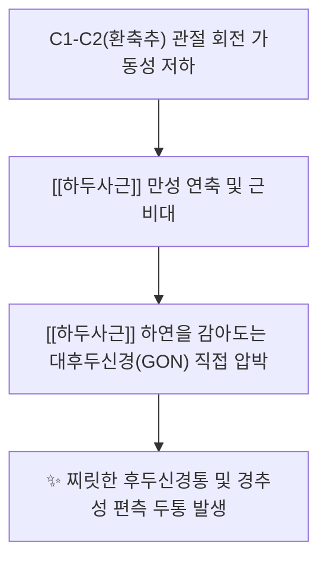
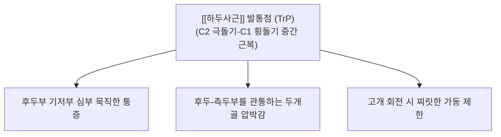

---
aliases:
  - 하두사근
  - 아래머리사선근
  - Obliquus capitis inferior
---
# [[하두사근]](Obliquus capitis inferior)

> **핵심 요약 (Key Summary)**:
> 제2경추 극돌기에서 기원하여 제1경추 횡돌기에 사선으로 정지하는 후두골에 부착하지 않는 후두하삼각의 하방 경계 근육입니다.
> 제1경추신경 후지인 후두하신경의 지배를 받으며, 환축추 관절의 강력한 동측 회전을 주도하여 두경부 회전 가동역의 핵심 축을 담당합니다.
> [[경부 회전 장애]], 대후두신경통, 후두하 연관통, 경추성 어지럼증의 핵심 병변근이며, 풍지·천주·완골 및 C1-C2 부착부 침구가 표적입니다.

---
## 📌 목차
1. [해부학적 정밀 구조 및 지배 신경/혈관](#1-해부학적-정밀-구조-및-지배-신경혈관)
2. [생체역학·토크 분석 & 근막 사슬 (Biomechanical Synergy)](#2-생체역학토크-분석--경부-근막-사슬-biomechanical-synergy)
3. [근막통증증후군(TP) & 연관통 패턴 (Travell & Simons)](#3-근막통증증후군tp--연관통-패턴-travell--simons)
4. [초음파 해부학(Sonoanatomy) 및 중재 시술 랜드마크](#4-초음파-해부학sonoanatomy-및-중재-시술-랜드마크)
5. [⭐ 원장님 심층 임상 고찰 및 원본 필기 (Clinical Pearls)](#5-원장님-심층-임상-고찰-및-원본-필기-clinical-pearls)
6. [관련 임상 질환 및 운동손상 증후군 총괄](#6-관련-임상-질환-및-운동손상-증후군-총괄)
7. [추나·도수치료(MET/PIR) & 침구·약침·재활 프로토콜](#7-추나도수치료metpir--침구약침재활-프로토콜)
8. [출처 및 학술 참고 문헌 (References)](#8-출처-및-학술-참고-문헌-references)

---
## 1. 해부학적 정밀 구조 및 지배 신경/혈관

| 항목 | 상세 내용 |
| :--- | :--- |
| **기시 (Origin)** | 제2경추(축추, Axis, C2)의 극돌기(Spinous process) 외측면 및 상연 |
| **정지 (Insertion)** | 제1경추(환추, Atlas, C1)의 횡돌기(Transverse process) 하후면 |
| **신경 지배** | 제1경추신경 후지 ([[후두하신경]], Suboccipital nerve, C1 dorsal ramus) |
| **혈관 공급** | 후두동맥(Occipital A.) 하행지 및 추골동맥(Vertebral A.) 근육가지 |

### 🔬 해부학 도해 및 단면도
![[Obliquus_capitis_inferior_back.png|450]]
> [Wikipedia 공중도메인 해부학 도해]: 축추(C2) 극돌기에서 환추(C1) 횡돌기로 굵게 사하방-상외측 주행하며, 후두골에 전혀 닿지 않는 독특한 형태의 [[하두사근]] 3D 해부도.

---
## 2. 생체역학·토크 분석 & 근막 사슬 (Biomechanical Synergy)

* **환축추 관절(Atlanto-axial Joint, C1-C2) 회전의 메인 파워하우스**:
  * 인체 경추 전체 회전 가동범위(약 80~90도) 중 **절반에 달하는 40~45도가 C1-C2 관절에서 발생**합니다.
  * 하두사근은 치돌기(Dens)를 중심축으로 환추(C1)를 회전시키는 **가장 강력하고 유일한 전담 수평 회전근**입니다.
* **두개골에 부착하지 않는 유일한 [[후두하근]]:
  * 4개의 [[후두하근]] 중 유일하게 후두골에 닿지 않고 **순수하게 C2 → C1만을 연결**하여, 두개골의 무게 부담 없이 환축추 간의 정밀 회전 토크를 전담.
* **근막 사슬 연계 (Anatomy Trains)**:
  * **나선선(Spiral Line, SL)** 및 **표재후방선(Superficial Back Line, SBL)**: 체간의 회전 장력이 상부 경추로 집약될 때 최종적으로 두부의 방향을 결정하는 핵심 사슬.

---
## 3. 근막통증증후군(TP) & 연관통 패턴 (Travell & Simons)

![[Suboccipital_TriggerPoints.jpg|450]]
> [Travell & Simons 발통점 지도]: 후두하근군([[하두사근]]) 발통점에서 후두부 외측 기저부와 관자놀이, 안구 심부로 방사되는 연관통 패턴.

* **발통점 및 연관통 특성**:
  * **후두하부 심부의 묵직한 방사통**:
    * 후두골 바로 아래, C1과 C2 사이 깊은 곳에서 시작되어 머리 뒤쪽 전체로 뻐근하게 퍼짐.
  * **경부 회전 시 통증 격발**:
    * 고개를 좌우로 돌릴 때 C1-C2 회전 축에서 찌르는 듯한 국소 통증과 함께 회전 가동역이 50% 이상 급격히 감소.
  * **대후두신경통 동반**:
    * [[하두사근]] TrP의 긴장으로 신경이 포착되면 정수리까지 전기가 오듯 찌릿찌릿한 방전통 투사.

---
## 4. 초음파 해부학(Sonoanatomy) 및 중재 시술 랜드마크

* **초음파 스캔 프로토콜**:
  * **프로브 위치**: C2 극돌기에서 C1 횡돌기 방향으로 프로브를 45도 사선 거치.
  * **소견**: 표층의 [[두반극근]](Semispinalis capitis) 심층에서, C2 극돌기와 C1 횡돌기 사이를 대각선으로 두텁게 가로지르는 [[하두사근]] 근복이 관찰됨.
* **대후두신경(GON)의 랜드마크**:
  * 대후두신경(C2 dorsal ramus)이 [[하두사근]] **하연을 아래에서 위로 감아돌아 근복 표면을 비스듬히 가로지르는 모습**을 고해상도 선형 프로브로 명확히 동정 가능.
* **안전 마진 및 시술 랜드마크 (CRITICAL)**:
  * 하두사근의 상외측 심부에는 추골동맥이 주행하므로, 자침 시 침향을 상외측 심부로 향하지 말고 반드시 **C2 극돌기 외측 골면 또는 C1 횡돌기 후면 골면에 Bone touch**를 확인하며 안전하게 자침.

---
## 5. ⭐ 원장님 심층 임상 고찰 및 원본 필기 (Clinical Pearls)

### 1) 머리 회전의 메인 엔진과 회전 장애 1순위 타깃 (원장님 필기 100% 보존)
* 상부 경추 회전 각도의 대부분을 담당하므로, 고개를 좌우로 돌릴 때 뻑뻑하고 걸리는 환자는 **하두사근이 1순위 치료 타깃**입니다.
* **원장님 핵심 진단 팁 (굴곡-회전 검사, FRT)**:
  * 환자의 목을 최대로 굴곡(하위 경추의 회전을 잠금)시킨 상태에서 머리를 좌우로 회전시킬 때 가동 범위가 45도 미만으로 떨어지고 후두통이 유발되면, 이는 100% [[하두사근]] **단축 및 환축추(C1-C2) 관절 병변**입니다.

### 2) 대후두신경(GON)과의 인접성과 포착 기전 (원장님 필기 100% 보존)
* 대후두신경은 C2 신경근에서 나와 하두사근의 하연을 감싸고 올라가므로, 하두사근이 과긴장하거나 부종이 생기면 신경이 올가미에 걸리듯 짓눌립니다.
* 만성 후두신경통 환자에서 두피 부위나 천주혈만 치료해서 재발하는 경우, [[하두사근]] **하연(C2 극돌기 외측 1.5cm 부위)**을 도침으로 박리해 주면 신경 포착이 근본적으로 해소됩니다.

### 3) 턱관절(TMJ) 장애와의 상호 연동
* 턱관절의 개구 및 저작 시 하악골의 움직임은 상부 경추 C1-C2의 미세 회전과 실시간으로 연동됩니다. 하두사근이 굳어 C1-C2가 잠기면 TMJ 디스크에 비대칭 편하중이 걸리므로, 턱관절 환자에게 [[하두사근]] 이완은 필수적입니다.

---
## 6. 관련 임상 질환 및 운동손상 증후군 총괄

| 임상 질환 / 증후군 | 병리적 연관 기전 | 주요 증상 및 이학적 검사 | 핵심 교정 타깃 |
| :--- | :--- | :--- | :--- |
| [[경부 회전 장애]] | [[하두사근]] 연축으로 C1-C2 잠김 | 고개 회전 시 후두부 찌름통, FRT 양성 | [[하두사근]] 도침 및 C1-C2 관절 추나 |
| [[후두신경통]] | [[하두사근]] 하연에서 대후두신경(GON) 포착 | 뒤통수부터 정수리로 뻗치는 방전통 | [[하두사근]] 하연 신경 감압 박리술 |
| 경추성 현기증 | C1-C2 회전 감각 고유수용기 왜곡 | 고개 돌릴 때 시야 흔들림, 현기증 | 후두저 이완 수기 및 안정화 추나 |
| 상부 경추성 편두통 | TCC 수렴 및 후두하 삼각 압박 | 일측성 관자놀이 및 안와 통증 | 풍지·완골 심부 침구 및 약침 |
| 턱관절 장애 (TMD) | C1-C2 회전 축 정렬 이상 연동 | 턱 벌릴 때 걸림, 안면 비대칭 | [[하두사근]] MET 및 TMJ 추나 |

---
## 7. 추나·도수치료(MET/PIR) & 침구·약침·재활 프로토콜

* **한의학 경혈 매핑**:
  * 풍지, 완골, 천주, 아문, 옥침
* **침구 및 침도(도침) 프로토콜**:
  * **C2 극돌기 기시부 도침 박리술**: C2 극돌기 외측연에 0.40x40mm 침도를 직자(Bone touch)하여 골막 건막 유착 부위를 1~2회 미세 절개 박리.
  * **C1 횡돌기 후면 정지부 자침**: 유양돌기 하방 C1 횡돌기 후면에 침을 닿게 하여 [[하두사근]] 건 부착부 이완.
* **약침 처방**:
  * **중성어혈약침**: 급성 경부 염좌로 인한 목 회전 불가(낙침, 落枕) 환자에게 C2 극돌기 외측 [[하두사근]] 근복에 0.5~1.0cc 주입 → 즉각적인 회전각 회복.
  * **소염약침 / 황련해독탕약침**: 대후두신경 자극으로 인한 신경성 통증 및 화끈거림 동반 시 신경 주행 경로 주입.
  * **자하거약침**: 만성 C1-C2 관절증, 퇴행성 경추 환자의 [[하두사근]] 허혈성 섬유화 부위 영양 공급.
* **추나 및 관절가동기법 (C1-C2 MET)**:
  * **앙와위 환축추 회전 MET**:
    * 환자 앙와위, 시술자는 환자의 경추를 완전 굴곡시켜 C2 이하를 고정한 뒤, 환자의 머리를 제한된 회전 방향 장벽까지 회전.
    * 환자에게 "반대쪽으로 머리를 20% 힘으로 돌리세요" 지시 후 5~7초간 등척성 수축 유지.
    * 호기와 함께 새로운 회전 장벽으로 10초간 부드럽게 가동역 증진 (3~5회 반복).

---
## 8. 출처 및 학술 참고 문헌 (References)

1. **Standring, S. (2020)**. *Gray's Anatomy: The Anatomical Basis of Clinical Practice* (42nd ed.). Elsevier, pp. 786-787.
   - **[연구 요약]**: 하두사근의 축추 극돌기 기시 및 환추 횡돌기 정지 구조, 대후두신경과의 공간적 교차 관계 분석.
2. **Travell, J. G., & Simons, D. G. (1999)**. *Myofascial Pain and Dysfunction: The Trigger Point Manual*, Vol. 1 (2nd ed.). Williams & Wilkins, pp. 447-461.
   - **[연구 요약]**: [[하두사근]] 발통점이 유발하는 경부 회전 제한 및 후두부 방사통 임상 경로 규명.
3. **Ogince, M., Hall, T., Robinson, K., & Blackmore, A. M. (2007)**. The diagnostic validity of the cervical flexion-rotation test in C1/2-related cervicogenic headache. *Man Ther*, 12(3), 260-265. [PMID: 17112768](https://pubmed.ncbi.nlm.nih.gov/17112768/)
   - **[연구 요약]**:  C1/C2 유래 경추성 두통에서 경추 굴곡-회전 검사의 진단적 타당도를 검증.
4. **Lesser, E. R., et al. (2025)**. Trans-obliquus inferior capitis course of the greater occipital nerve: a potential cause of occipital neuralgia? *Clin Anat*, 38(4), 508-513. [PMID: 39329339](https://pubmed.ncbi.nlm.nih.gov/39329339/)
   - **[연구 요약]**:  대후두신경이 하두사근을 관통하는 변이 주행과 후두신경통의 연관성을 해부로 보고 — 침·신경차단 시 보존의 해부학적 근거.