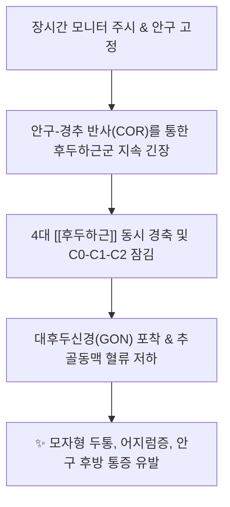
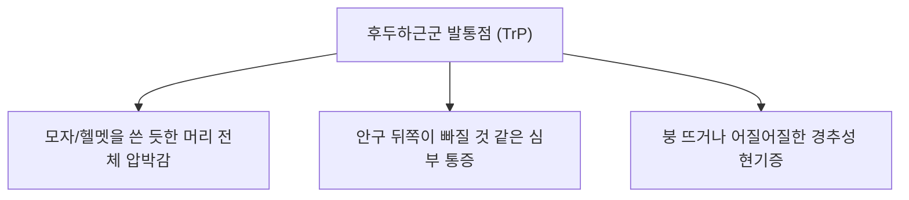

---
aliases:
  - 후두하근
  - 후두하근군
  - 뒤통수밑근
  - Suboccipital muscles
---
# [[후두하근]](Suboccipital muscles)

> **핵심 요약 (Key Summary)**:
> 후두골과 제1·2경추(환추·축추) 사이를 연결하는 4쌍의 심부 후두하 근육군([[대후두직근]], [[소후두직근]], [[상두사근]], [[하두사근]])의 총괄 복합체입니다.
> 제1경추신경 후지인 후두하신경의 지배를 받으며, 두부의 삼차원 미세 조정과 인체 최상위 근방추 밀도를 통한 안구-전정-경추 고유감각을 통합합니다.
> [[경추성 두통]], 헬멧형 두통, 경추성 현기증, 만성 뇌피로의 핵심 병변근이며, 풍지·아문·천주·완골 및 후두저 이완 수기가 표적입니다.

---
## 📌 목차
1. [해부학적 정밀 구조 및 지배 신경/혈관](#1-해부학적-정밀-구조-및-지배-신경혈관)
2. [생체역학·토크 분석 & 경부 근막 사슬 (Biomechanical Synergy)](#2-생체역학토크-분석--경부-근막-사슬-biomechanical-synergy)
3. [근막통증증후군(TP) & 연관통 패턴 (Travell & Simons)](#3-근막통증증후군tp--연관통-패턴-travell--simons)
4. [초음파 해부학(Sonoanatomy) 및 중재 시술 랜드마크](#4-초음파-해부학sonoanatomy-및-중재-시술-랜드마크)
5. [⭐ 원장님 심층 임상 고찰 및 원본 필기 (Clinical Pearls)](#5-원장님-심층-임상-고찰-및-원본-필기-clinical-pearls)
6. [관련 임상 질환 및 운동손상 증후군 총괄](#6-관련-임상-질환-및-운동손상-증후군-총괄)
7. [추나·도수치료(MET/PIR) & 침구·약침·재활 프로토콜](#7-추나도수치료metpir--침구약침재활-프로토콜)
8. [출처 및 학술 참고 문헌 (References)](#8-출처-및-학술-참고-문헌-references)

---
## 1. 해부학적 정밀 구조 및 지배 신경/혈관

| 근육명 | 기시 (Origin) | 정지 (Insertion) | 주작용 (Primary Action) |
| :--- | :--- | :--- | :--- |
| [[대후두직근]] | 제2경추(축추) 극돌기 | 후두골 [[하항선]] 외측부 | 두부 신전, 동측 회전 |
| [[소후두직근]] | 제1경추(환추) 후결절 | 후두골 [[하항선]] 내측부 및 경막 가교 | 두부 미세 신전, 경막 텐션 조절 |
| [[상두사근]] | 제1경추(환추) 횡돌기 | 후두골 상항선-하항선 사이 외측 | 두부 신전, 동측 측굴 |
| [[하두사근]] | 제2경추(축추) 극돌기 | 제1경추(환추) 횡돌기 | 환축추 관절의 강력한 동측 회전 |

* **신경 지배**: 제1경추신경 후지 ([[후두하신경]], Suboccipital nerve, C1 dorsal ramus)
* **혈관 공급**: 후두동맥(Occipital A.) 분지 및 추골동맥(Vertebral A.) 후두하 분지

### 🔬 해부학 도해 및 단면도
![[DeepNapeMuscles.jpg|450]]
> [Wikipedia 공중도메인 해부학 도해]: 4쌍의 후두하근과 후두하삼각 내부를 주행하는 추골동맥(Vertebral A.), 후두하신경(C1), 그리고 근막을 뚫고 상행하는 대후두신경(GON)의 정밀 입체 관계.

---
## 2. 생체역학·토크 분석 & 경부 근막 사슬 (Biomechanical Synergy)

* **인체 최상위 근방추(Muscle Spindle) 밀도**:
  * 후두하근군은 근육 1g당 약 150~240개의 근방추를 보유하여 인체 전체에서 밀도가 가장 높습니다.
  * 이는 단순한 머리 움직임뿐 아니라, **머리의 미세한 공간 위치를 감지하여 시선을 안정화하는 정밀 센서**로 작동함을 의미합니다.
* **안구-경추 반사(Cervico-ocular Reflex, COR) 및 전정-경추 반사(VCR)**:
  * 눈동자가 움직일 때마다 후두하근군은 반사적으로 미세 수축하여 안구의 시선 축과 머리의 방향을 실시간 동기화.
* **근막 사슬 연계 (Anatomy Trains)**:
  * **표재후방선(Superficial Back Line, SBL)**: 족저근막-비복근-햄스트링-기립근을 타고 올라온 인체 후방의 전신 장력이 후두하근군에서 모상건막(Galea)으로 넘어가는 '인체 후방 장력의 중앙 통제소'.

---
## 3. 근막통증증후군(TP) & 연관통 패턴 (Travell & Simons)

![[Suboccipital_TriggerPoints.jpg|450]]
> [Travell & Simons 발통점 지도]: 후두하근군 발통점에서 후두부 기저부를 지나 머리 측면을 타고 눈 뒤쪽까지 뻗치는 모자형(Helmet) 연관통 패턴.

* **발통점 및 연관통 특성**:
  * **모자형/헬멧형 두통 (Helmet-like Headache)**:
    * 후두부 깊은 곳에서 시작하여 두정부, 측두부, 전두부까지 머리 전체를 꽉 쥐어짜는 듯한 압박 통증.
  * **안구 심부 연관통**:
    * 삼차신경-경수복합체(TCC) 수렴에 의해 눈 뒤쪽 깊은 곳이 쑤시고 침침하며 눈부심 동반.
  * **경추성 어지럼증 (Cervicogenic Dizziness)**:
    * 고개를 좌우로 돌리거나 일어설 때 균형 감각이 무너지며 휘청거리는 느낌 유발.

---
## 4. 초음파 해부학(Sonoanatomy) 및 중재 시술 랜드마크

* **후두하삼각(Suboccipital Triangle)의 3대 경계**:
  * 상내측: [[대후두직근]]
  * 상외측: [[상두사근]]
  * 하외측: [[하두사근]]
* **초음파 스캔 프로토콜**:
  * **프로브 위치**: C2 극돌기에서 외측으로 환추 횡돌기 및 후두골 하항선을 잇는 삼각 스캔.
  * **도플러(Doppler) 혈류 확인**: 후두하삼각 바닥(환추 후궁)을 가로지르는 **추골동맥 V3 루프**의 박동성 혈류를 반드시 컬러 도플러로 확인하여 시술 안전 구역 설정.
* **안전 시술 절대 수칙**:
  * 침도 및 장침 시술 시 삼각 내부의 빈 연부조직 공간으로 깊이 자침하는 것은 절대 엄금.
  * 침 끝은 무조건 **C2 극돌기 외측 골면, C1 횡돌기 골면, 또는 후두골 하항선 골면에 정확히 접촉(Bone touch)**시킨 상태에서만 미세 절개 박리를 시행.

---
## 5. ⭐ 원장님 심층 임상 고찰 및 원본 필기 (Clinical Pearls)

### 1) 경막-[[후두하근]] 다리(Myodural Bridge)와 뇌척수액 순환 (원장님 필기 100% 보존)
* [[소후두직근]]을 비롯한 후두하근군은 환추후두후막을 통해 척수경막(Dura mater)과 직접 연결되어 두개내 압력 및 뇌척수액(CSF) 순환에 직접 개입합니다.
* **원장님 임상 팁**:
  * 만성 피로, 브레인포그(Brain fog), 수면장애, 불면증 환자는 후두하근군이 돌처럼 굳어 제4뇌실 주변의 뇌척수액 배액이 차단되어 있습니다.
  * 후두저 감압 수기(Suboccipital release)를 통해 후두하 공간을 열어주면 환자가 시술 도중 깊은 이완 상태(Alpha wave 유도)에 빠지며 두개내압이 정상화됩니다.

### 2) 안구-목 반사(COR)와 스마트폰 증후군 (원장님 필기 100% 보존)
* 스마트폰이나 PC 화면을 집중해서 보면 안구는 작은 화면에 고정되지만, 인체 신경계는 후두하근군에 지속적인 등척성 수축 명령을 내립니다.
* 눈이 피로하다고 호소할 때 눈 주위만 치료할 것이 아니라, **후두하근군을 이완시켜야 안구 피로와 조절 장애가 근본적으로 해결**됩니다.

### 3) 턱관절-상부경추 복합체(Craniocervical-Mandibular System)
* 턱관절 장애(TMD) 환자 중 교합 교정이나 스플린트로 낫지 않는 환자는 100% 후두하근군의 비대칭 단축으로 인해 환추-축추 회전 축이 비틀려 있습니다. [[후두하근]] 교정이 턱관절 치료의 선행 조건입니다.

---
## 6. 관련 임상 질환 및 운동손상 증후군 총괄

| 임상 질환 / 증후군 | 병리적 연관 기전 | 주요 증상 및 이학적 검사 | 핵심 교정 타깃 |
| :--- | :--- | :--- | :--- |
| [[후두하 두통]] | 후두하근군 전반의 만성 과긴장 | 머리 뒤쪽 묵직함, 모자 쓴 듯한 압박 | 후두골 하항선 도침 및 CST |
| [[후두신경통]] | [[하두사근]]-[[대후두직근]] 사이 GON 포착 | 후두부에서 정수리로 뻗치는 방전통 | C2 극돌기 외측 신경 감압 박리술 |
| 경추성 어지럼증 | 근방추 고유수용기 감각 왜곡 | 붕 뜨는 현기증, 시야 흔들림 | 후두하삼각 심부 약침 및 추나 |
| 만성 뇌피로 (Brain Fog) | 뇌척수액 정체 및 정맥총 순환 부전 | 머리가 멍함, 집중력 저하, 불면증 | 후두저 이완(CV4) 수기요법 |
| 텍스트넥 (거북목 증후군) | 상부 경추 과신전 고정 및 하위 굴곡 | 뒷목 결림, 턱 들림 자세, 어깨 통증 | [[후두하근]] 신장 및 상부경추 추나 |

---
## 7. 추나·도수치료(MET/PIR) & 침구·약침·재활 프로토콜

* **한의학 경혈 매핑**:
  * 풍지, 아문, 천주, 완골, 풍부, 옥침, 백회
* **침구 및 침도(도침) 프로토콜**:
  * **안전 삼각 구역(Safe Triangle Zone) 박리술**:
    * C2 극돌기 외측연 및 후두골 하항선 골면에 0.40x40mm 도침을 안착시켜 골막 유착부를 1~2회 미세 절개 박리.
    * 추골동맥 주행 부위인 환추 후궁 외측 공간은 절대 자침 회피.
* **약침 처방**:
  * **중성어혈약침**: 급성 경추 염좌, 낙침, 후두부 어혈성 압통 시 C1-C2 후두하 공간에 0.5~1.0cc 주입.
  * **소염약침 / 황련해독탕약침**: 안구 충혈, 찌릿한 신경통, 열감 동반 두통 시 풍지·천주 심부 주입.
  * **자하거약침 / 녹용약침**: 만성 퇴행성 경추증, 고령자 뇌피로, 허혈성 근위축 환자에게 후두저 조직 재생 유도.
* **추나 및 도수치료 (Suboccipital Release & Cranial Decompression)**:
  * **후두저 이완 3단계 테크닉 (Suboccipital Release)**:
    1. 환자 앙와위, 시술자는 제2~4수지 끝을 후두골 하항선 바로 아래 후두하근군에 안착.
    2. 시술자의 손가락을 90도 갈고리 모양으로 세워 머리의 무게를 손가락 끝에 실음.
    3. 조직이 스스로 녹아내릴 때까지(Tissue melting) 3~5분간 미세 견인 유지 → 전신 부교감신경 항진 및 뇌척수액 박동 회복.

---
## 8. 출처 및 학술 참고 문헌 (References)

1. **Standring, S. (2020)**. *Gray's Anatomy: The Anatomical Basis of Clinical Practice* (42nd ed.). Elsevier, pp. 786-787.
   - **[연구 요약]**: 후두하 4대 근육군의 정밀 기시-정지 구조 및 후두하삼각의 경계와 신경혈관 주행 체계 분석.
2. **Travell, J. G., & Simons, D. G. (1999)**. *Myofascial Pain and Dysfunction: The Trigger Point Manual*, Vol. 1 (2nd ed.). Williams & Wilkins, pp. 447-461.
   - **[연구 요약]**: 후두하근군 발통점이 유발하는 두개골 모자형 연관통 및 안와 후방 방사통 임상 경로 규명.
3. **Hack, G. D., Koritzer, R. T., Robinson, W. L., Lau, R. H., & Dunn, W. C. (1995)**. Anatomic relation between the rectus capitis posterior minor muscle and the dura mater. *Spine*, 20(23), 2484-2486. [PMID: 8610241](https://pubmed.ncbi.nlm.nih.gov/8610241/)
   - **[연구 요약]**:  소후두직근-경막 근경막 가교(Myodural bridge)의 해부학적 관계 규명.
4. **Treleaven, J. (2008)**. Sensorimotor disturbances in neck disorders affecting postural stability, head and eye movement control. *Man Ther*, 13(1), 2-11. [PMID: 17702636](https://pubmed.ncbi.nlm.nih.gov/17702636/)
   - **[연구 요약]**: 후두하근군의 고유수용기 병변이 자세 안정성과 안구-경추 운동 조절에 미치는 신경생리학적 영향 분석.