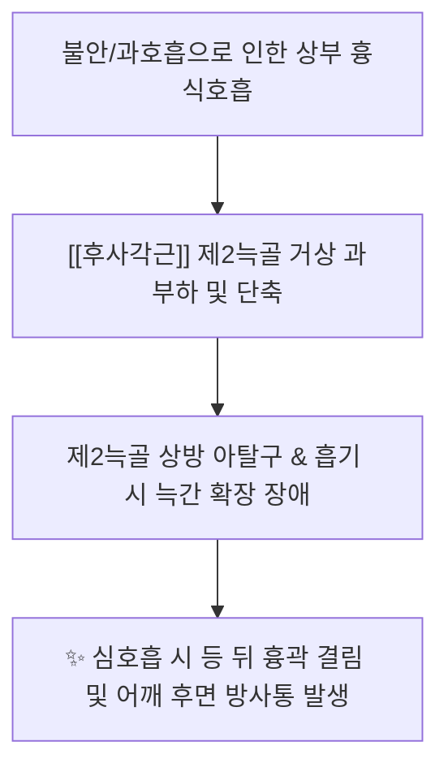
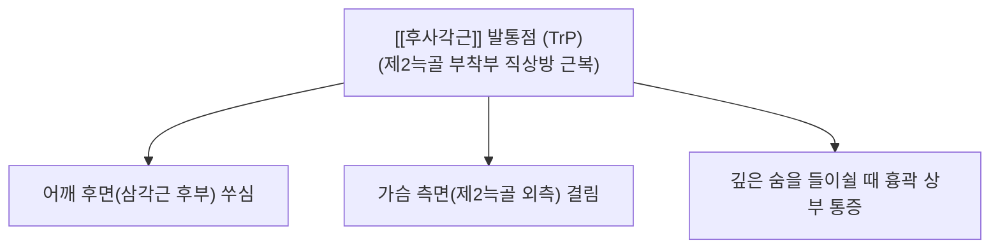

---
aliases:
  - 후사각근
  - 뒤목갈비근
  - Scalenus posterior
---
# [[후사각근]](Scalenus posterior)

> **핵심 요약 (Key Summary)**:
> 제4~6경추 횡돌기 후결절에서 기원하여 유일하게 제2늑골 외측면에 정지하는 사각근군 중 가장 심부에 위치한 근육입니다.
> 경신경 전지(C5~C8)의 지배를 받으며, 제2늑골 거상을 통한 심호흡 보조 및 경추의 동측 측굴을 담당합니다.
> [[흉곽출구 증후군|흉곽출구증후군]], 제2늑골 기능부전, 호흡 시 흉곽 상부 통증, 견갑골 외측 통증의 핵심 병변근이며, 결분·천정혈 침구 및 도침이 표적입니다.

---
## 📌 목차
1. [해부학적 정밀 구조 및 지배 신경/혈관](#1-해부학적-정밀-구조-및-지배-신경혈관)
2. [생체역학·토크 분석 & 경부 근막 사슬 (Biomechanical Synergy)](#2-생체역학토크-분석--경부-근막-사슬-biomechanical-synergy)
3. [근막통증증후군(TP) & 연관통 패턴 (Travell & Simons)](#3-근막통증증후군tp--연관통-패턴-travell--simons)
4. [초음파 해부학(Sonoanatomy) 및 중재 시술 랜드마크](#4-초음파-해부학sonoanatomy-및-중재-시술-랜드마크)
5. [⭐ 원장님 심층 임상 고찰 및 원본 필기 (Clinical Pearls)](#5-원장님-심층-임상-고찰-및-원본-필기-clinical-pearls)
6. [관련 임상 질환 및 운동손상 증후군 총괄](#6-관련-임상-질환-및-운동손상-증후군-총괄)
7. [추나·도수치료(MET/PIR) & 침구·약침·재활 프로토콜](#7-추나도수치료metpir--침구약침재활-프로토콜)
8. [출처 및 학술 참고 문헌 (References)](#8-출처-및-학술-참고-문헌-references)

---
## 1. 해부학적 정밀 구조 및 지배 신경/혈관

| 항목 | 상세 내용 |
| :--- | :--- |
| **기시 (Origin)** | 제4~6경추(C4~C6, 때로 C7 포함) 횡돌기 후결절(Posterior tubercles) |
| **정지 (Insertion)** | 제2늑골(2nd rib) 외측면 조면 ([[전거근]] 제1~2두 부착부 후상방) |
| **신경 지배** | 제5~8경추신경 전지 ([[상완신경총]] 하부 분지, C5~C8 anterior rami) |
| **혈관 공급** | 상행경동맥(Ascending cervical A.), 경횡동맥(Transverse cervical A.) 및 늑경동맥 분지 |

### 🔬 해부학 도해 및 단면도
![[Scalenus_posterior_anatomy.png|450]]
> [Wikipedia 공중도메인 해부학 도해]: [[중사각근]] 심후방에서 제1늑골을 건너뛰어 제2늑골 외측면으로 정지하는 [[후사각근]]의 3D 해부도.

---
## 2. 생체역학·토크 분석 & 근막 사슬 (Biomechanical Synergy)

* **제2늑골(2nd Rib) 거상의 전담 엔진**:
  * 전사각근과 중사각근이 제1늑골을 들어 올릴 때, 후사각근은 **제2늑골을 위로 견인하여 상부 흉곽의 전후·좌우 직경을 동시에 확장**시키는 핵심 심호흡 보조근.
* **경추 동측 측굴 보조**:
  * [[중사각근]] 심층에서 경추의 측방 굴곡력을 미세하게 지지하고, 경추 굴곡 시 후외측 관절의 과도한 회전을 억제.
* **근막 사슬 연계 (Anatomy Trains)**:
  * **측선(Lateral Line, LL)** 및 **심부전방선(Deep Front Line, DFL)**: 경추 횡돌기에서 흉곽 외측벽 전거근 라인으로 연결되는 호흡-체간 측면 슬링의 시발점.

---
## 3. 근막통증증후군(TP) & 연관통 패턴 (Travell & Simons)

![[Scalene_TriggerPoints.jpg|450]]
> [Travell & Simons 발통점 지도]: 사각근군([[후사각근]]) 발통점에서 어깨 후면, 상완 후외측, 견갑골 상각 및 가슴 측면으로 퍼지는 방사통 패턴.

* **발통점 및 연관통 특성**:
  * **어깨 후면 및 상완 외측 방사통**:
    * 전사각근이 엄지와 검지(C6 영역)로 방사통을 보낸다면, 후사각근은 어깨 후면과 상완 후외측으로 묵직한 통증을 투사.
  * **심호흡 시 흉통 (Inspiratory Chest Pain)**:
    * 숨을 깊게 들이마시거나 한숨을 쉴 때 제2늑골이 팽창하면서 [[후사각근]] 정지부에 날카로운 당김과 통증 격발.
  * **견갑골 상각(Superior Angle) 부위 결림**:
    * [[견갑거근]] 부착부와 맞닿아 있어 만성적인 상부 등 결림의 숨은 원인으로 작용.

---
## 4. 초음파 해부학(Sonoanatomy) 및 중재 시술 랜드마크

* **초음파 스캔 프로토콜**:
  * **프로브 위치**: 쇄골 상와 외측 후방에서 사선 종단 스캔(Oblique sagittal view) 거치.
  * **단면 소견**: [[중사각근]] 후외측 심부에서 제1늑골을 건너뛰어 **제2늑골의 둥근 외측면 고에코 골피질 라인**에 부착하는 [[후사각근]] 건섬유 확인.
* **안전 마진 및 절대 금기 (CRITICAL)**:
  * [[기흉]](Pneumothorax) 발생 원천 차단:
    * [[후사각근]] 정지부 바로 아래는 제2늑간극(2nd intercostal space)과 흉막(Pleura)이 위치합니다.
    * 자침이나 도침 시술 시 절대로 제2늑골의 뼈 감각(Bone touch) 없이 허공이나 늑간 공간으로 깊이 찌르면 안 됩니다.
    * **시술 절대 수칙**: 침 끝을 반드시 **제2늑골의 외측 골면에 정확히 안착(Bone touch)**시킨 뒤에만 미세한 박리를 시행해야 합니다.

---
## 5. ⭐ 원장님 심층 임상 고찰 및 원본 필기 (Clinical Pearls)

### 1) 제2늑골 거상의 주동근과 [[늑골 기능부전]] (원장님 필기 100% 보존)
* 상부 늑간 호흡 시 제2늑골을 위로 들어 올리는 핵심 역할을 수행합니다.
* **원장님 임상 팁**:
  * 불안증, 공황장애, 만성 과호흡 환자는 제2늑골이 상방으로 변위되어 고착(Subluxated 2nd rib)됩니다.
  * 환자가 "가슴 윗부분이 답답하고 숨이 끝까지 안 들어간다", "기침할 때 등 뒤 갈비뼈가 결린다"고 호소할 때, [[늑간신경통]]으로 오진하지 말고 [[후사각근]] 제2늑골 부착부 긴장을 확인해야 합니다.

### 2) [[상완신경총]] 하부 신경간(Lower Trunk) 포착 (원장님 필기 100% 보존)
* [[후사각근]]의 단축은 드물게 [[상완신경총]] 하부 신경간(C8-T1)을 상방으로 밀어올려, 4~5지(약지, 새끼손가락)의 저림과 [[척골신경]] 주행선 통증을 유발할 수 있습니다.
* 손의 4~5지가 저릴 때 [[주관증후군]](Cubital tunnel)이나 [[경추 추간판 탈출증|목 디스크]](C8)뿐만 아니라 [[후사각근]]의 하부 신경총 압박을 함께 감별해야 합니다.

### 3) [[늑연골염]](Tietze 증후군)과의 감별
* 앞가슴 2번 갈비뼈 접합부 통증으로 내원하는 환자 중 상당수는 앞쪽의 염증이 아니라, 뒤쪽 [[후사각근]]이 제2늑골을 뒤에서 강하게 잡아당겨 앞쪽 연골 부위에 견인성 통증이 발생하는 것입니다. [[후사각근]]을 풀어주면 앞가슴 통증이 즉각 사라집니다.

---
## 6. 관련 임상 질환 및 운동손상 증후군 총괄

| 임상 질환 / 증후군 | 병리적 연관 기전 | 주요 증상 및 이학적 검사 | 핵심 교정 타깃 |
| :--- | :--- | :--- | :--- |
| [[늑골 기능부전]] | [[후사각근]] 연축으로 제2늑골 상방 고착 | 심호흡 시 흉곽 상부 통증, 늑골 압통 | 제2늑골 도침 및 늑골 교정 추나 |
| [[흉곽출구 증후군]] | 상완신경총 하부 신경간(C8-T1) 포착 | 4~5수지 저림, 전완 척측 감각 이상 | 결분·천정 심부 도침 감압 |
| [[가성 늑연골염]] | [[후사각근]] 견인력의 흉골 전방 투사 | 제2늑연골 부위 뻐근함, 기침 시 악화 | [[후사각근]] TrP 이완 및 침구 |
| [[상부 흉곽 호흡장애]] | 심호흡 보조근 과부하 | 깊은 한숨 유발, 가슴 팽만감 저하 | [[사각근]] MET 및 [[횡격막]] 호흡 재활 |
| [[견갑골 상각 연쇄통]] | [[견갑거근]]과의 근막 유착 | 목 돌릴 때 어깨 뒤쪽 깊은 결림 | [[후사각근]]-[[견갑거근]] 계면 박리술 |

---
## 7. 추나·도수치료(MET/PIR) & 침구·약침·재활 프로토콜

* **한의학 경혈 매핑**:
  * 결분, 천정, 견외유, 풍지, 견정
* **침구 및 침도(도침) 프로토콜**:
  * **제2늑골 외측면 도침 박리술 (초고난도 안전 수칙)**:
    * 쇄골 상와 외측에서 제1늑골 아래로 제2늑골 골면을 촉지.
    * 0.40x40mm 침도를 제2늑골 골면을 향해 완만하게 진침하여 **반드시 제2늑골 뼈 감각(Bone touch)** 확인.
    * 골막에 닿은 상태에서만 늑골 장축 방향으로 미세하게 1회 박리 시행 (늑간 공간 절대 진입 금지).
* **약침 처방**:
  * **중성어혈약침**: 제2늑골 결림, 호흡 시 흉곽 통증 환자의 정지부에 0.5cc 주입 → 늑골 가동성 즉시 회복.
  * **오공약침 / 봉약침**: 4~5수지 저림 및 하부 상완신경총 신경 포착 시 천정혈 심부에 0.3cc 소량 주입.
  * **자하거약침**: 만성 호흡기 질환, 천식, 노인성 흉곽 경직 환자의 [[후사각근]] 건 부착부 조직 강화.
* **추나 및 신장 테크닉 (Scalenus Posterior MET)**:
  * **제2늑골 하강 추나 & MET**:
    * 환자 좌위 또는 앙와위, 시술자는 모지구로 환자의 제2늑골 상면을 아래(미측)로 지지.
    * 환자가 숨을 들이쉬며 고개를 반대측 측굴 및 가벼운 전방 굴곡 상태에서 20% 힘으로 저항(5초간 등척성 수축).
    * 환자가 숨을 "후-" 길게 내쉴 때, 시술자는 제2늑골을 호기 방향(하비골 방향)으로 부드럽게 하강 유도 (3회 반복).

---
## 8. 출처 및 학술 참고 문헌 (References)

1. **Standring, S. (2020)**. *Gray's Anatomy: The Anatomical Basis of Clinical Practice* (42nd ed.). Elsevier, pp. 582-584.
   - **[연구 요약]**: 후사각근의 C4-C6 횡돌기 기시 및 유일한 제2늑골 정지 구조, 신경혈관 주행 및 흉막과의 인접 관계 분석.
2. **Travell, J. G., & Simons, D. G. (1999)**. *Myofascial Pain and Dysfunction: The Trigger Point Manual*, Vol. 1 (2nd ed.). Williams & Wilkins, pp. 504-537.
   - **[연구 요약]**: [[후사각근]] 발통점에 의한 어깨 후면 방사통 및 심호흡 시 흉곽 상부 통증 발생 경로 규명.
3. **Sanders, R. J., & Annest, S. J. (2014)**. *Thoracic outlet syndrome: a review*. *Neurologic Clinics*, 32(3), 723-740.
   - **[연구 요약]**: 사각근군과 제1·2늑골 기능부전에 의한 흉곽출구증후군 및 늑골 도수치료의 임상 효과성 검증.
4. **Bordoni, B., & Zanier, E. (2013)**. *Anatomic connections of the diaphragm: influence of respiration on the whole body*. *Journal of Multidisciplinary Healthcare*, 6, 281-291.
   - **[연구 요약]**: 후사각근을 포함한 흡기 보조근의 만성 과사용과 횡격막 호흡 부전 간의 병리역학적 연계성 분석.
