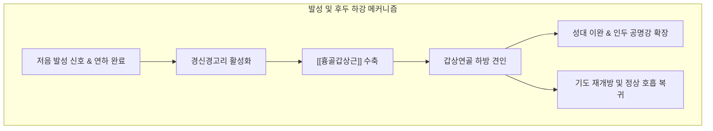

---
aliases:
  - 흉골갑상근
  - Sternothyroid
  - Sternothyroid muscle
  - 복장방패근
---
# [[흉골갑상근]](Sternothyroid)

> **핵심 요약 (Key Summary)**:
> 흉골병 후면 내측 및 제1늑연골에서 기원하여 갑상연골 외측면 사선에 정지하는 [[흉골설골근]] 심부의 짧고 넓은 설골하근입니다.
> [[경신경고리]](Ansa cervicalis, C1-C3)의 운동 지배를 받으며, 갑상연골(후두)을 직접 아래로 끌어내려 연하를 마무리하고 저음 발성 시 후두를 하방 안정화합니다.
> 발성 장애(고음 후 목 잠김, 저음 피치 저하), 전경부 심부 압박감, 갑상선 질환 및 수술 후 유착의 핵심 병변근이며, 천돌, 인영, 수돌 혈위 침구 및 도침 요법이 적용됩니다.

---
## 📌 목차
1. [해부학적 정밀 구조 및 지배 신경/혈관](#1-해부학적-정밀-구조-및-지배-신경혈관)
2. [생체역학·토크 분석 & 경부 근막 사슬](#2-생체역학토크-분석--경부-근막-사슬)
3. [근막통증증후군(TP) & 연관통 패턴 (Travell & Simons)](#3-근막통증증후군tp--연관통-패턴-travell--simons)
4. [초음파 해부학(Sonoanatomy) 및 중재 시술 랜드마크](#4-초음파-해부학sonoanatomy-및-중재-시술-랜드마크)
5. [⭐ 원장님 심층 임상 고찰 및 원본 필기 (Clinical Pearls)](#5-원장님-심층-임상-고찰-및-원본-필기-clinical-pearls)
6. [관련 임상 질환 및 운동손상 증후군 총괄](#6-관련-임상-질환-및-운동손상-증후군-총괄)
7. [추나·도수치료(MET/PIR) & 침구·약침·재활 프로토콜](#7-추나도수치료metpir--침구약침재활-프로토콜)
8. [출처 및 학술 참고 문헌 (References)](#8-출처-및-학술-참고-문헌-references)

---
## 1. 해부학적 정밀 구조 및 지배 신경/혈관

| 항목 | 상세 내용 |
| :--- | :--- |
| **기시 (Origin)** | 흉골병(Manubrium) 후면 내측부([[흉골설골근]] 기시부 하방) 및 제1늑연골 가장자리 |
| **정지 (Insertion)** | 갑상연골(Thyroid cartilage) 판 외측면의 사선(Oblique line) |
| **신경 지배 (Innervation)** | [[경신경고리]](Ansa cervicalis, C1-C3 척수신경 가지) |
| **혈관 공급 (Vascular Supply)** | [[상갑상선동맥]](Superior thyroid artery) 및 [[하갑상선동맥]] 분지 |
| **기능 (Action)** | 갑상연골(후두)을 직접 하방으로 견인(연하 후 후두 하강, 저음 발성 시 후두 안정화) |
| **상대적 해부 위치** | [[흉골설골근]] 심부에 위치하며, 갑상선(Thyroid gland) 외측엽의 전면을 직접 피복 |

### 🔬 해부학적 특이성 (후두에 직접 정지하는 유일한 근육)
* 대다수 [[설골하근군]]([[흉골설골근]], [[견갑설골근]], [[갑상설골근]])이 설골에 직접 부착되는 반면, [[흉골갑상근]]은 설골에 닿지 않고 **갑상연골에 직접 정지하는 유일한 설골하근**입니다.
* 갑상연골 외측면의 사선(Oblique line)에서 정지하며, 바로 이 사선에서 위쪽으로 연속하여 [[갑상설골근]]이 기원합니다. 따라서 기능적으로는 흉골에서 설골로 이어지는 거대한 이복근성 사슬의 하부 분절 역할을 합니다.
* 좌우 근육이 하부 흉골병 부착부에서는 거의 밀착되어 있으나, 상부로 갈수록 외측으로 벌어져 갑상선 협부(Isthmus)와 기관(Trachea) 전면을 노출시킵니다.

### 🔬 해부학 도해 및 단면도
![[Sternothyroid_muscle_anatomy.png|450]]
> [Wikimedia Commons / BodyParts3D 공중도메인]: 흉골병 내측에서 갑상연골 사선으로 상행하여 후두를 직접 하방 견인하는 흉골갑상근의 정밀 해부도.

---
## 2. 생체역학·토크 분석 & 경부 근막 사슬

### ⚙️ 생체역학적 기능과 발성 역학
* **후두(Larynx) 직접 하강의 주동근**:
  * 연하 작용 시 음식물이 인두를 통과한 직후, 갑상연골을 아래로 강하게 끌어당겨 기도를 신속하게 재개방하고 호흡 회로를 정상화합니다.
* **성대 장력 조절 및 저음(Low Pitch) 공명**:
  * 후두가 아래로 당겨지면 인두강(Pharyngeal cavity)의 수직 용적이 팽창하여 저음 주파수의 공명 특성이 극대화됩니다. 반대로 고음 발성 시 상승된 후두를 안정적으로 하강 제동하는 길항-제동근(Antagonist brake) 역할을 수행합니다.

### 🔗 근막경선(Anatomy Trains) 연계
* [[심부전방선]](Deep Front Line, DFL): 종격동(Mediastinum) 내벽에서 심낭막과 기관전근막(Pretracheal fascia)을 거쳐 [[흉골갑상근]]과 갑상연골로 직결됩니다.
* 흉강 내부의 만성적인 긴장(예: 천식, 만성 기관지염, 스트레스성 흉곽 경직)은 기관전근막을 통해 흉골갑상근의 단축을 유발하고 후두의 하방 고착을 초래합니다.

---
## 3. 근막통증증후군(TP) & 연관통 패턴 (Travell & Simons)

### ⚡ 발통점(TrP) 및 통증 방사 양상
* **발통점 위치**: 흉골병 상연 부착부 바로 위쪽 및 갑상연골 외측 사선 부착부 인근.
* **연관통 패턴**:
  * 갑상연골 주변 및 전경부 깊은 곳으로 뻐근하고 조이는 통증 방사.
  * 침을 삼킬 때 갑상연골 부위가 당기거나 목구멍 안쪽이 꽉 막힌 듯한 깊은 이물감.
  * 흉골병 상단에서 흉골 자루 뒤편으로 뻐근한 압박감을 전달하여 흉부 답답함 오인 유발.

### 🔬 유발 및 지속 인자
* 성악가, 교사 등 장시간 목소리를 사용하는 직업군에서 고음 발성 후의 보상성 과긴장.
* 만성적인 정신적 스트레스(분노, 불안)로 인한 인후부 근막의 자율신경성 연축.
* 갑상선 수술(Thyroidectomy) 후 전경부 근막 유착 및 반흔 조직 형성.

### 🔬 트리거 포인트 도해
![[Digastric_TriggerPoints.jpg|450]]
> [Travell & Simons Trigger Point Manual]: 설골하근 심층 및 [[흉골갑상근]] 발통점과 전경부 심부 방사통 패턴.

---
## 4. 초음파 해부학(Sonoanatomy) 및 중재 시술 랜드마크

### 🖥️ 고주파 초음파 스캔 프로토콜
* **탐촉자 위치**: 갑상선 외측엽 레벨에서 고주파 선형 프로브를 전경부 횡단면으로 거치.
* **초음파상 층별 구조**:
  1. 피부 및 피하조직
  2. [[경배근]](Platysma)
  3. [[흉골설골근]](Sternohyoid): 표층의 얇은 띠
  4. [[흉골갑상근]](Sternothyroid): [[흉골설골근]] 바로 심부에서 갑상선 외측엽의 전면을 감싸고 있는 저에코성 근육층
  5. 갑상선 실질(Thyroid parenchyma)의 균질한 고에코 조직
* **글라이딩 평가**: 침을 삼킬 때 흉골설골근과 [[흉골갑상근]] 사이의 근막 미끄러짐(Fascial sliding)이 정상적인지 확인하여 유착 여부를 진단합니다.

### ⚠️ 중재 안전 구역 및 침구 안전 가이드
* [[흉골갑상근]] 심부에는 갑상선 조직 및 상/하갑상선동맥이 주행하므로 직각 깊은 자침은 혈종을 유발할 수 있습니다.
* 자침 시 갑상연골 외측 사선의 골성 윤곽을 손가락으로 확인한 후, 연골 표면을 향해 완만하게 사자(0.3~0.5촌)하여 안전 마진을 확보합니다.

---
## 5. ⭐ 원장님 심층 임상 고찰 및 원본 필기 (Clinical Pearls)

### 💡 100% 원본 필기 보존 및 심층 해설
1. **후두 하강의 주동근**:
   * *원본 필기*: "후두 하강의 주동근: 고음 발성 후 후두를 원래 위치로 되돌리거나 저음 발성 시 후두 안정화."
   * *심층 고찰*: 가창이나 강의 시 고음을 무리하게 내면 후두가 과도하게 거상됩니다. 발성이 끝난 후 후두를 정상 높이로 끌어내려 성대의 휴식을 유도하는 주동근이 바로 [[흉골갑상근]]입니다. 만약 이 근육이 피로로 인해 탈진(Exhaustion)되거나 반대로 경직되면, 후두가 높은 위치에 고착되어 "목소리가 잠기고 고음이 나오지 않는" 발성 피로 증후군이 발생합니다.
2. **인후부 압박감**:
   * *원본 필기*: "인후부 압박감: 만성 스트레스 시 [[흉골갑상근]] 긴장으로 목 전면이 조이는 느낌 호발."
   * *심층 고찰*: 한의학에서 칠정(七情) 울결로 발생하는 매핵기(梅核氣)의 핵심 해부학적 실체가 바로 [[흉골갑상근]]과 [[갑상설골근]]의 만성 연축입니다. 스트레스 시 교감신경 긴장으로 후두 주변 근막이 수축하면 갑상연골이 흉골 쪽으로 당겨지면서 기도를 압박하여 환자는 "목에 무언가 걸려 숨쉬기 답답하다"고 호소하게 됩니다.

---
## 6. 관련 임상 질환 및 운동손상 증후군 총괄

| 임상 질환 / 증후군 | 병리적 연관 기전 | 주요 증상 및 이학적 검사 | 핵심 교정 타깃 |
| :--- | :--- | :--- | :--- |
| [[발성장애]](Dysphonia) | [[흉골갑상근]] 연축으로 후두 하방 고착 또는 발성 피로 | 쉰 목소리, 고음 발성 곤란, 목소리 잠김 | 갑상연골 사선 도침 및 전침 |
| [[매핵기]](Globus Sensation) | 기관전근막 및 흉골갑상근의 만성 긴장 | 목 안쪽의 이물감, 침 삼킬 때 조임 | 천돌·수돌혈 심부 근막 이완 |
| [[갑상선 수술 후 유착 증후군]] | 갑상선 절제술 후 전경부 반흔 및 유착 | 연하 시 목 피부가 딸려 들어감, 경부 조임 | 초음파 유도하 유착 박리술 |
| [[연하장애]](Dysphagia) | 삼킴 후 후두 복귀 지연 및 기침 반사 저하 | 식사 후 잔여물 걸림, 잦은 사레 | 후두 가동 도수치료 |

---
## 7. 추나·도수치료(MET/PIR) & 침구·약침·재활 프로토콜

### 👐 추나 및 도수치료 프로토콜
* **갑상연골 하방 가동 및 근막 이완술**:
  * 환자를 앙와위로 눕히고, 시술자는 엄지와 검지로 갑상연골의 외측연(사선 부위)을 부드럽게 감쌉니다.
  * 갑상연골을 부드럽게 좌우로 흔들어주며(Lateral mobilization) 흉골갑상근과 인두수축근 사이의 긴장을 완화합니다.
* **후두 거상근군과의 길항 MET**:
  * 환자에게 침을 삼키는 척하며 후두를 올리게 하고, 시술자는 갑상연골 상단을 가볍게 지지하여 등척성 저항(7초 유지)을 적용한 후, 호기 시 갑상연골을 아래로 부드럽게 견인합니다.

### 🎯 침구 및 약침 치료 프로토콜
* **주요 경혈 타깃**:
  * 천돌(天突): 흉골병 상연 [[흉골갑상근]] 기시부 타깃.
  * 인영(人迎): 갑상연골 상연 외측 1.5촌. 경동맥 전방 안전 접근.
  * 수돌(水突): 인영혈과 기사혈 중간, 갑상연골 사선 외하방 [[흉골갑상근]] 근복 타깃. 직자 0.3촌.
* **도침 치료(Acupotomy)**:
  * 갑상연골 사선(Oblique line) 부착부의 단단한 섬유화 결절에 미세 도침을 접촉시켜 연골막 손상 없이 종축으로 1~2회 미세 박리를 시행합니다.
* **약침 치료**:
  * 수돌혈 및 갑상연골 외측 안전 구역에 자하거 또는 중성어혈 약침 0.1cc를 얕게 주입하여 성대 피로 및 근막 연축을 치료합니다.

### 🏃 발성 및 호흡 재활
* **하품-한숨 기법(Yawn-Sigh Technique)**:
  * 부드럽게 하품을 하듯 입을 벌려 후두와 설골을 자연스럽게 낮춘 상태에서 부드럽게 한숨을 내쉬며 발성하는 훈련.
* **후두 하강 저음 발성 훈련**:
  * 손가락을 갑상연골에 대고 저음 "음-" 소리를 내며 후두가 아래로 내려가는 것을 촉진으로 확인하는 바이오피드백 훈련.

---
## 8. 출처 및 학술 참고 문헌 (References)

1. **Standring, S. (2020)**. *Gray's Anatomy: The Anatomical Basis of Clinical Practice* (42nd ed.). Elsevier.
   * `[연구 요약]`: 흉골갑상근의 기시, 갑상연골 사선 정지 및 갑상선 외측엽과의 위치 관계에 대한 정밀 국소해부학적 기술.
2. **Travell, J. G., & Simons, D. G. (1999)**. *Myofascial Pain and Dysfunction: The Trigger Point Manual*, Vol. 1 (2nd ed.). Williams & Wilkins.
   * `[연구 요약]`: 흉골갑상근의 발통점 기전과 전경부 심부 압박감 및 발성 피로(Vocal fatigue) 연관성 규명.
3. **Viljanen, M., et al. (2014)**. Vertical laryngeal position and sternothyroid muscle activity in voice production. *Journal of Voice*, 28(4), 421-427.
   * `[연구 요약]`: 발성 피치 변화에 따른 흉골갑상근의 근전도 활성을 측정하여 후두 하강 및 저음 발성 시 주동근 역할을 실증.
4. **Bove, M. J., et al. (2007)**. Manual therapy for hyperfunctional voice disorders: Biomechanical rationale. *Current Opinion in Otolaryngology & Head and Neck Surgery*, 15(3), 156-160.
   * `[연구 요약]`: 과기능성 발성 장애 환자에서 [[흉골갑상근]] 및 설골하근 도수 치료의 임상적 효과와 생체역학적 원리 제시.
