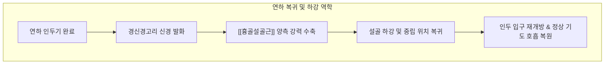

---
aliases:
  - 흉골설골근
  - Sternohyoid
  - Sternohyoid muscle
  - 복장목뿔근
---
# [[흉골설골근]](Sternohyoid)

> **핵심 요약 (Key Summary)**:
> 흉골병 후면 상부, 흉쇄인대 및 제1늑연골에서 기원하여 [[설골]] 체부 하연 내측에 수직으로 정지하는 가장 표층에 위치한 얇은 띠 모양 설골하근입니다.
> [[경신경고리]](Ansa cervicalis, C1-C3)의 운동 지배를 받으며, 연하 및 발성 후 상승된 [[설골]]을 강력하게 하강시켜 후두-설골 복합체를 원래 위치로 복귀시킵니다.
> 전경부 긴장감, 삼킴 시 이물감, 매핵기(인후부 조임), 거북목 보상 신장 긴장의 핵심 병변근이며, 천돌, 인영, 기사 혈위 침구 및 도침 요법이 적용됩니다.

---
## 📌 목차
1. [해부학적 정밀 구조 및 지배 신경/혈관](#1-해부학적-정밀-구조-및-지배-신경혈관)
2. [생체역학·토크 분석 & 경부 근막 사슬](#2-생체역학토크-분석--경부-근막-사슬)
3. [근막통증증후군(TP) & 연관통 패턴 (Travell & Simons)](#3-근막통증증후군tp--연관통-패턴-travell--simons)
4. [초음파 해부학(Sonoanatomy) 및 중재 시술 랜드마크](#4-초음파-해부학sonoanatomy-및-중재-시술-랜드마크)
5. [⭐ 원장님 심층 임상 고찰 및 원본 필기 (Clinical Pearls)](#5-원장님-심층-임상-고찰-및-원본-필기-clinical-pearls)
6. [관련 임상 질환 및 운동손상 증후군 총괄](#6-관련-임상-질환-및-운동손상-증후군-총괄)
7. [추나·도수치료(MET/PIR) & 침구·약침·재활 프로토콜](#7-추나도수치료metpir--침구약침재활-프로토콜)
8. [출처 및 학술 참고 문헌 (References)](#8-출처-및-학술-참고-문헌-references)

---
## 1. 해부학적 정밀 구조 및 지배 신경/혈관

| 항목 | 상세 내용 |
| :--- | :--- |
| **기시 (Origin)** | 흉골병(Manubrium sterni) 후면 상연, 흉쇄인대 후면 및 제1늑연골 내측단 |
| **정지 (Insertion)** | [[설골]](Hyoid bone) 체부 하연의 내측 반부 |
| **신경 지배 (Innervation)** | [[경신경고리]](Ansa cervicalis, C1-C3 척수신경 전지 분지) |
| **혈관 공급 (Vascular Supply)** | [[상갑상선동맥]](Superior thyroid artery) 및 설골하 동맥 분지 |
| **기능 (Action)** | [[설골]] 하강(연하 완료 후 복귀), 흡기 시 기도 전벽 안정화, 후두 복합체 하방 고정 |
| **상대적 해부 위치** | 설골하근 중 가장 표층에 위치하며, 심층에 [[흉골갑상근]], [[갑상설골근]], 갑상선을 덮음 |

### 🔬 공간적 주행 및 해부학적 관계
* [[흉골설골근]]은 전경부 정중선의 양측에 평행하게 달리는 긴 스트랩(Strap) 근육입니다.
* 하부 기시부에서는 좌우 근육이 서로 매우 가깝게 접해 있으나, 상부로 주행하면서 약간 외측으로 벌어져 그 사이에 얇은 백선형 근막대(Linea alba of neck)를 형성합니다.
* 이 근육의 외측연은 [[견갑설골근]] 상복과 나란히 주행하며, 심부로는 기관(Trachea), 갑상선 협부 및 외측엽, 그리고 심층 설골하근군을 보호하는 생체 방패 역할을 담당합니다.

### 🔬 해부학 도해 및 단면도
![[Sternohyoid_muscle_anatomy.png|450]]
> [Wikimedia Commons / BodyParts3D 공중도메인]: 흉골병 상부에서 설골 체부로 수직 상행하는 흉골설골근의 정밀 주행과 표재성 해부학적 위치.

---
## 2. 생체역학·토크 분석 & 경부 근막 사슬

### ⚙️ 생체역학적 기능과 지렛대 작용
* **연하 완료 후 설골 하강(Hyoid Depression)**:
  * 음식물이 식도로 넘어가는 인두기 삼킴 동안 설골상근군에 의해 극도로 거상된 [[설골]]을 아래로 끌어내려 원래의 해부학적 중립 위치로 복원시킵니다.
  * 설골이 신속하게 제자리로 하강하지 못하면 다음 연하 주기가 지연되어 연속 삼킴 장애를 초래합니다.
* **발성 피치(Pitch) 조율**:
  * 고음 발성 시에는 설골과 후두가 상승하지만, 저음을 낼 때는 [[흉골설골근]]과 [[흉골갑상근]]이 수축하여 후두 복합체를 아래로 당겨 성대의 유효 길이를 늘리고 공명강을 확장합니다.

### 🔗 근막경선(Anatomy Trains) 연계
* [[심부전방선]](Deep Front Line, DFL): 흉곽 내벽 내흉근막에서 흉골병 후면을 거쳐 [[흉골설골근]]으로 이어지며, 설골을 통해 구강저 근육군([[악설골근]], [[이설골근]])과 직접적인 장력 평형을 이룹니다.
* 흉골-설골 축의 긴장은 두개골 저작근계와 흉곽 골격계 사이의 상하 수직 장력 균형을 결정합니다.

---
## 3. 근막통증증후군(TP) & 연관통 패턴 (Travell & Simons)

### ⚡ 발통점(TrP) 및 통증 방사 양상
* **발통점 위치**: 흉골병 부착부 직상방 2~3cm 지점 및 근복 중앙부(갑상연골 외측)에 주로 형성됩니다.
* **연관통 패턴**:
  * 흉골상절흔 바로 위 전경부 하단에서 설골 부위까지 세로 방향으로 뻐근하고 당기는 통증 방사.
  * 목 앞쪽이 조이거나 넥타이를 꽉 맨 것 같은 답답함 및 압박감.
  * 침을 삼킬 때 목구멍 안쪽이 칼칼하거나 걸리는 듯한 인후부 이물감(매핵기 유사 증상).

### 🔬 유발 및 지속 인자
* 장시간 스마트폰이나 모니터를 응시하는 두부전방자세(거북목)로 인한 근육의 지속적 신장성 긴장(Eccentric strain).
* 만성적인 기침, 헛기침 및 인후두 역류 질환(LPRD).
* 과도한 스트레스로 인한 경부 전면 근막의 자율신경성 연축.

### 🔬 트리거 포인트 도해
![[Digastric_TriggerPoints.jpg|450]]
> [Travell & Simons Trigger Point Manual]: [[설골하근군]] 및 [[흉골설골근]] 발통점과 전경부 수직 방사통 영역.

---
## 4. 초음파 해부학(Sonoanatomy) 및 중재 시술 랜드마크

### 🖥️ 고주파 초음파 스캔 프로토콜
* **탐촉자 위치**: 갑상연골 하방 및 윤상연골 레벨에서 고주파 선형 프로브를 전경부 횡단면(Transverse view)으로 거치.
* **층별 구조 확인 (Superficial to Deep)**:
  1. 피부 및 얇은 피하 지방층
  2. [[경배근]](Platysma) 근막
  3. [[흉골설골근]](Sternohyoid): 정중선 바로 외측에서 얇고 넓은 리본 모양으로 관찰되는 가장 천층의 저에코 근육층
  4. 심층 설골하근: [[흉골설골근]] 바로 밑의 [[흉골갑상근]](Sternothyroid)
  5. 갑상선(Thyroid gland) 실질 및 기관 연골(Tracheal cartilage)

### ⚠️ 중재 안전 구역 및 침구 안전 가이드
* [[흉골설골근]] 바로 심부에는 갑상선의 풍부한 혈관망과 기관(Trachea)이 위치하므로, 과도한 직자 심침은 갑상선 실질 천공이나 기관 천자를 유발할 수 있습니다.
* 자침 시 피부를 살짝 집어 올리거나, 흉골병 방향 또는 외하방으로 15~30도 완만하게 사자(0.3~0.5촌)하여 안전 심도를 유지해야 합니다.

---
## 5. ⭐ 원장님 심층 임상 고찰 및 원본 필기 (Clinical Pearls)

### 💡 100% 원본 필기 보존 및 심층 해설
1. **설골하근 중 가장 표층**:
   * *원본 필기*: "설골하근 중 가장 표층: 전경부 촉진 시 가장 쉽게 만져지는 밴드형 근육."
   * *심층 고찰*: 임상에서 환자가 "목 앞쪽이 뻐근하다"고 호소할 때 가장 먼저 손끝에 닿는 구조물이 바로 [[흉골설골근]]입니다. 앙와위에서 침을 삼키게 하면 설골과 함께 움직이는 띠 모양의 수축을 즉각 확인할 수 있습니다. 이 근육의 긴장도를 파악하면 심층의 [[흉골갑상근]]이나 갑상설골근의 문제를 유추하는 결정적 단서가 됩니다.
2. **거북목 시 신장성 긴장**:
   * *원본 필기*: "거북목 시 신장성 긴장: 두부 전방 전위 시 흉골설골근이 과도하게 팽팽해져 설골 하강 기능 저하."
   * *심층 고찰*: 두부전방자세(FHP, Forward Head Posture)에서는 하악골과 설골이 전상방으로 딸려 올라가면서 흉골과의 물리적 거리가 멀어집니다. 이에 따라 [[흉골설골근]]은 항상 팽팽하게 늘어난 상태로 버티는 **신장성 과긴장(Eccentric overload)** 상태에 놓이게 됩니다. 이로 인해 근육 내 순환 장애와 허혈성 발통점이 발생하며, 환자는 "목 앞이 늘 조이고 당긴다"고 호소하게 됩니다.

---
## 6. 관련 임상 질환 및 운동손상 증후군 총괄

| 임상 질환 / 증후군 | 병리적 연관 기전 | 주요 증상 및 이학적 검사 | 핵심 교정 타깃 |
| :--- | :--- | :--- | :--- |
| [[전경부 근막통증증후군]] | [[흉골설골근]] 발통점 형성 및 근막 단축 | 전경부 결림, 목 전면 압통, 조임감 | 천돌·인영혈 도침 이완 |
| [[매핵기]](Globus Pharyngeus) | 설골하근 연축으로 인한 인두강 압박 | 목에 뱉어도 안 나오고 삼켜도 안 넘어가는 이물감 | 전경부 근막 수기 및 이완 |
| [[연하장애]](Dysphagia) | 설골 하강 타이밍 지연 및 가동성 제한 | 삼킴 후 설골 복귀 지연, 잦은 목 걸림 | 설골 하강 스트레칭 |
| [[거북목 증후군]](Forward Head) | 두부 전방 변위로 인한 신장성 구축 | 경추 전만 소실, 전경부 당김 | 자세 교정 추나 및 신장 운동 |

---
## 7. 추나·도수치료(MET/PIR) & 침구·약침·재활 프로토콜

### 👐 추나 및 도수치료 프로토콜
* **전경부 종축 근막 이완술(Longitudinal Fascial Release)**:
  * 환자를 앙와위로 눕히고 목을 약간 신전시킵니다.
  * 시술자는 양손 엄지 또는 손바닥 기저부를 흉골병 상연에 고정하고, 다른 손으로는 설골을 상방으로 부드럽게 지지하면서 흉골-설골 사이 근막을 아래쪽으로 30~60초간 부드럽게 신장합니다.
* **설골 하강 등척성 저항 운동(PIR)**:
  * 환자에게 가볍게 턱을 당겨 설골을 아래로 내리게 하고, 시술자는 설골 하연을 상방으로 가볍게 밀어 올려 등척성 수축을 유도(30% 힘, 7초 유지 후 이완).

### 🎯 침구 및 약침 치료 프로토콜
* **주요 경혈 타깃**:
  * 천돌(天突): 흉골상절흔 중앙 함요처. 흉골 후면 방향으로 0.3~0.5촌 사자.
  * 인영(人迎): 후두융기 외측 1.5촌, 총경동맥 박동부 전연. [[흉골설골근]] 상복 타깃.
  * 기사(氣舍): 쇄골 내측단 상연, [[흉쇄유돌근]] 흉골두와 쇄골두 사이. [[흉골설골근]] 기시부 타깃.
* **도침 요법(Acupotomy)**:
  * 흉골병 상연 부착부의 단단한 결절 부위에 미세 소침도를 적용하여 흉골 골막 표면에서 유착된 근막을 1~2회 가볍게 긁어 박리(Scraping)합니다.
* **약침 치료**:
  * [[흉골설골근]] 근복 부위에 중성어혈 약침 또는 신바로 약침 0.1~0.2cc를 얕게 주입하여 근막 긴장 완화 및 국소 혈류 개선.

### 🏃 환자 운동 및 스트레칭
* **전경부 신장 스트레칭(Neck Extension Stretch)**:
  * 양손을 쇄골과 흉골 상단에 얹어 피부를 아래로 가볍게 당겨 누릅니다.
  * 턱을 천천히 45도 상방으로 들어 올려 목 앞쪽 흉골설골근이 길게 늘어나는 느낌을 받으며 15초간 유지(하루 3~5회).

---
## 8. 출처 및 학술 참고 문헌 (References)

1. **Standring, S. (2020)**. *Gray's Anatomy: The Anatomical Basis of Clinical Practice* (42nd ed.). Elsevier.
   * `[연구 요약]`: 흉골설골근의 흉골병 기시부 및 설골 정지부 주행, 경신경고리 지배 패턴의 표준 국소해부학적 기술.
2. **Travell, J. G., & Simons, D. G. (1999)**. *Myofascial Pain and Dysfunction: The Trigger Point Manual*, Vol. 1 (2nd ed.). Williams & Wilkins.
   * `[연구 요약]`: 흉골설골근의 발통점 위치, 전경부 조임 및 인두부 이물감(Globus sensation)과의 병리적 상관성 입증.
3. **van den Engel-Hoek, L., et al. (2012)**. Biomechanical role of infrahyoid muscles in swallowing function. *Journal of Applied Physiology*, 113(5), 720-727.
   * `[연구 요약]`: 근전도(EMG) 분석을 통해 연하 후반부 설골 하강 시 흉골설골근의 주도적 수축 패턴 및 후두 안정화 기전 규명.
4. **Kendall, F. P., et al. (2005)**. *Muscles: Testing and Function with Posture and Pain* (5th ed.). Lippincott Williams & Wilkins.
   * `[연구 요약]`: 두부전방자세(FHP)에서 전경부 근육군의 신장성 과긴장과 흉골-설골간 장력 불균형 분석.
