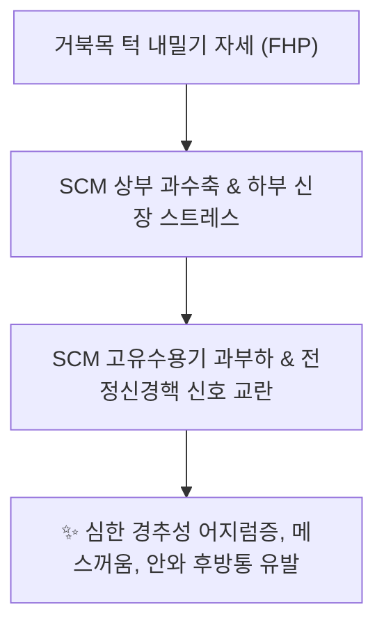
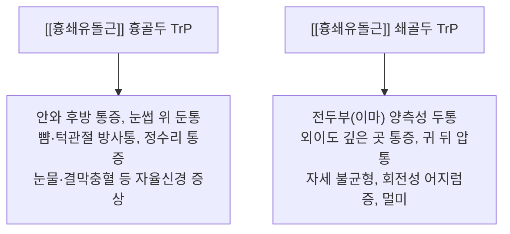

---
aliases:
  - 흉쇄유돌근
  - 목빗근
  - SCM
  - Sternocleidomastoid
---
# [[흉쇄유돌근]](Sternocleidomastoid)

> **핵심 요약 (Key Summary)**:
> 흉골병 및 쇄골 내측단에서 기원하여 측두골 유양돌기와 후두골 상항선에 정지하는 경부 전외측의 최대 표재성 사선 근육입니다.
> 제11뇌신경인 부신경과 제2·3경신경 전지의 이중 지배를 받으며, 두경부 굴곡·측굴·반대측 회전 및 호흡 보조를 주도합니다.
> [[경추성 어지럼증]], 긴장성 편두통, 천경신경총 포착, 자율신경 실조증, 사경의 핵심 병변근이며, 인영·부돌·천정·완골혈 침구가 표적입니다.

---
## 📌 목차
1. [해부학적 정밀 구조 및 지배 신경/혈관](#1-해부학적-정밀-구조-및-지배-신경혈관)
2. [생체역학·토크 분석 & 근막 사슬 (Biomechanical Synergy)](#2-생체역학토크-분석--경부-근막-사슬-biomechanical-synergy)
3. [근막통증증후군(TP) & 연관통 패턴 (Travell & Simons)](#3-근막통증증후군tp--연관통-패턴-travell--simons)
4. [초음파 해부학(Sonoanatomy) 및 중재 시술 랜드마크](#4-초음파-해부학sonoanatomy-및-중재-시술-랜드마크)
5. [⭐ 원장님 심층 임상 고찰 및 원본 필기 (Clinical Pearls)](#5-원장님-심층-임상-고찰-및-원본-필기-clinical-pearls)
6. [관련 임상 질환 및 운동손상 증후군 총괄](#6-관련-임상-질환-및-운동손상-증후군-총괄)
7. [추나·도수치료(MET/PIR) & 침구·약침·재활 프로토콜](#7-추나도수치료metpir--침구약침재활-프로토콜)
8. [출처 및 학술 참고 문헌 (References)](#8-출처-및-학술-참고-문헌-references)

---
## 1. 해부학적 정밀 구조 및 지배 신경/혈관

| 항목 | 상세 내용 |
| :--- | :--- |
| **기시 (Origin)** | • **흉골두 (Sternal head)**: 흉골병(Manubrium sterni) 전상연 (둥근 힘줄 형태) • **쇄골두 (Clavicular head)**: 쇄골 내측 1/3 상면 (넓고 편평한 근건 형태) |
| **정지 (Insertion)** | 측두골 [[유양돌기]](Mastoid process) 외측면 전반 및 후두골 상항선(Superior nuchal line) 외측 1/2 |
| **신경 지배** | 운동 신경: [[부신경]](Accessory nerve, CN XI) 고유감각 신경: 제2·3경신경 전지 ([[경신경총]], C2~C3 anterior rami) |
| **혈관 공급** | 후두동맥(Occipital A.), 상갑상동맥(Superior thyroid A.) [[흉쇄유돌근]] 가지 |

### 🔬 해부학 도해 및 단면도
![[Sternocleidomastoid_anatomy.png|450]]
> [Wikipedia 공중도메인 해부학 도해]: 흉골두와 쇄골두가 상외측으로 비스듬히 합쳐져 유양돌기에 정지하는 경부의 랜드마크 [[흉쇄유돌근]]의 3D 해부도.

---
## 2. 생체역학·토크 분석 & 근막 사슬 (Biomechanical Synergy)

* **양측 수축 (Bilateral Action)**:
  * 경추 하부를 굴곡(Flexion)시키면서 동시에 환추후두관절에서 두포(Head)를 신전(Extension)시켜 턱을 앞으로 내미는 전방 두부 변위(Forward head posture) 조장.
  * 흡기 시 흉골과 쇄골을 강하게 거상하여 호흡을 보조.
* **일측 수축 (Unilateral Action)**:
  * 두경부의 **동측 측굴(Ipsilateral lateral flexion)** 및 **반대측 회전(Contralateral rotation)**을 강력하게 수행.
  * 대측 [[두판상근]], [[경판상근]]과 짝힘(Force couple)을 형성하여 두부 회전 토크 완성.
* **근막 사슬 연계 (Anatomy Trains)**:
  * **나선선(Spiral Line, SL)** 및 **표재전방선(Superficial Front Line, SFL)**: 복직근-흉골근-흉골병을 거쳐 두개골 측면으로 상행하는 전방 인장 슬링의 핵심 매개체.

---
## 3. 근막통증증후군(TP) & 연관통 패턴 (Travell & Simons)

![[SCM_TriggerPoints.jpg|450]]
> [Travell & Simons 발통점 지도]: [[흉쇄유돌근]] 흉골두(안와 후방, 볼, 정수리, 인후부 방사통)와 쇄골두(이마, 귀 뒤쪽, 어지럼증 유발)의 명확히 구별되는 발통점 지도.

* **흉골두 발통점 (Sternal Head TrP) - 안면 및 자율신경계 증상**:
  * **안와 후방 및 눈썹 통증**: "눈 뒤가 빠질 것 같고 눈썹 뼈가 아프다"고 호소.
  * **자율신경계 반응**: 동측 눈물 분비 과다, 결막 충혈, 눈꺼풀 처짐(Ptosis), 콧물 등 호너 증후군 유사 반응 유발.
  * **인후부 삼킴통**: 침을 삼킬 때 목구멍 안쪽에 이물감이나 통증 유발.
* **쇄골두 발통점 (Clavicular Head TrP) - 전정계 및 두통 증상**:
  * **이마 관통 두통**: 이마를 가로지르는 무거운 두통 투사.
  * **경추성 어지럼증 (Cervicogenic Dizziness)**:
    * 고개를 돌리거나 누웠다 일어날 때 천장이 도는 회전성 현기증, 공간 지남력 상실, 메스꺼움 유발.

---
## 4. 초음파 해부학(Sonoanatomy) 및 중재 시술 랜드마크

* **경동맥초(Carotid Sheath)와의 공간적 관계 (CRITICAL)**:
  * [[흉쇄유돌근]] 바로 심층 내측에 [[총경동맥]](Common carotid A.), [[내경정맥]](Internal jugular V.), [[미주신경]](Vagus N., CN X)이 주행.
  * [[흉쇄유돌근]] 표면을 비스듬히 가로지르는 [[외경정맥]](External jugular V.) 주의.
* **초음파 스캔 프로토콜**:
  * C4-C6 높이 전외측 경부에서 횡단 스캔(Transverse view) 거치.
  * 표층의 넓은 SCM 근복 아래로 박동성 [[총경동맥]]과 확장성 [[내경정맥]]의 위치를 실시간 확인.
* **안전 시술 절대 수칙**:
  * 심부 혈관초를 향해 직자 자침하는 것은 절대 엄금.
  * 반드시 **집게 손가락과 엄지로 SCM 근복을 외측으로 집어 올려(Pincer Grip)** 혈관 다발과 근육을 분리한 후 안전하게 횡자/사자 자침 시행.

---
## 5. ⭐ 원장님 심층 임상 고찰 및 원본 필기 (Clinical Pearls)

### 1) [[천경신경총 포착증후군]]과 후두통·이개통 (원장님 필기 100% 보존)
* SCM 중간 후연(신경점, Erb's point)에서 [[천경신경총]]의 [[소후두신경]], [[대이개신경]], [[경횡신경]], [[쇄골상신경]]이 빠져나옵니다.
* SCM이 긴장되면 이 신경들이 집혀 **후두부 외측면, 귓바퀴(이개) 및 측두부 통증**이 방사됩니다.
* 특히 **상부 1/3 지점**은 회전 가동역이 커서 부종, 유착, 섬유화가 가장 빈발하며, 이로 인해 만성 [[승모근]], [[견갑거근]], [[능형근]] 통증이 도미노처럼 동반됩니다.

### 2) 전정성 어지럼증과 자율신경계 연계 (원장님 필기 100% 보존)
* SCM에는 고유수용성 감각 신경이 매우 조밀하게 분포하여 [[경추성 어지럼증]]의 주범이 됩니다.
* [[부신경]] 압박 및 인접한 [[미주신경]](Vagus N.)과의 신경학적 연쇄 반응으로 인해 어지럼증, 메스꺼움, 차멀미, 심계항진 등 자율신경 실조 증상이 빈발합니다.
* [[이석증]] 치료 후에도 남아 있는 잔여 어지럼증 환자는 쇄골두 TrP를 풀어주면 즉시 소실됩니다.

### 3) [[턱관절 장애]](TMD) 및 [[안면 비대칭]] 연계
* 편측 SCM 단축은 하악골을 반대측으로 편위시켜 부정교합과 턱관절 잡음(Clicking)을 유발하므로 [[안면 비대칭]] 교정의 1차 표적입니다.

---
## 6. 관련 임상 질환 및 운동손상 증후군 총괄

| 임상 질환 / 증후군 | 병리적 연관 기전 | 주요 증상 및 이학적 검사 | 핵심 교정 타깃 |
| :--- | :--- | :--- | :--- |
| [[경추성 어지럼증]] | 쇄골두 고유감각 교란 및 전정핵 간섭 | 고개 회전 시 핑 도는 현기증, 오심 | 쇄골두 TrP 약침 및 MET |
| [[천경신경총 포착증후군]] | Erb's point에서 소후두·대이개신경 압박 | 귀 뒤쪽 및 귓바퀴 찌릿함, 감각 이상 | SCM 후연 신경점 도침 감압 |
| [[사경]] | 일측 SCM의 급성 경축 또는 선천성 단축 | 고개가 한쪽으로 꺾이고 회전 제한 | SCM 핀치그립 침도 및 PIR |
| [[자율신경성 두통]] | 흉골두 TrP에 의한 혈관운동신경 자극 | 안와 통증, 눈물, 결막 충혈, 콧물 | 흉골두 상부 자침 및 온침 |
| [[안면 비대칭]] | 비대칭 SCM 긴장으로 인한 하악골 편위 | [[턱관절 장애]], 개구 장애, 안면 틀어짐 | 단축측 SCM 이완 및 경추 추나 |

---
## 7. 추나·도수치료(MET/PIR) & 침구·약침·재활 프로토콜

* **한의학 경혈 매핑**:
  * 인영, 부돌, 천정(天鼎), 천용, 완골, 예풍
* **침구 및 침도(도침) 프로토콜 (안전 핀치그립법)**:
  * **SCM 근복 자침 (Pincer Technique)**: 시술자의 엄지와 검지로 SCM 근복을 경동맥초로부터 외측으로 완전히 들어 올린 상태에서 0.30x40mm 침으로 전후 관통 방향으로 횡자 (직자 절대 금기).
  * **유양돌기 부착부 도침 박리술**: 유양돌기 하연 골면에 Bone touch 후 골막 유착부를 1회 미세 절개 박리.
* **약침 처방**:
  * **중성어혈약침**: 급성 사경, 교통사고 편타 손상 후 경부 회전 불가 시 SCM 근복에 0.5~1.0cc 주입.
  * **자하거약침**: 만성 경추성 어지럼증, 메스꺼움, 자율신경 실조증 환자의 Erb's point 주변 0.5cc 주입.
  * **황련해독탕약침**: 안구 충혈, 안와 후방 열감성 두통 동반 시 흉골두 TrP 주입.
* **추나 및 신장 테크닉 (SCM MET / PIR)**:
  * **앙와위 SCM MET**:
    * 환자 앙와위, 시술자는 환자의 머리를 반대측 측굴, 동측 회전, 약간의 신전 장벽에 위치시킴.
    * 환자에게 "머리를 반대쪽으로 돌리면서 앞으로 살짝 끄덕이세요(동측 회전/굴곡 저항)" 지시 (20% 힘, 5~7초).
    * 호기와 함께 완전히 이완시키며 새로운 신장 범위로 10~15초간 유지 (3회 반복).

---
## 8. 출처 및 학술 참고 문헌 (References)

1. **Standring, S. (2020)**. *Gray's Anatomy: The Anatomical Basis of Clinical Practice* (42nd ed.). Elsevier, pp. 580-582.
   - **[연구 요약]**: 흉쇄유돌근의 흉골두/쇄골두 해부학, 부신경(CN XI)과 경신경총의 신경 지배 및 경동맥초 주행 관계 규명.
2. **Travell, J. G., & Simons, D. G. (1999)**. *Myofascial Pain and Dysfunction: The Trigger Point Manual*, Vol. 1 (2nd ed.). Williams & Wilkins, pp. 299-335.
   - **[연구 요약]**: 흉골두의 안와/안면/자율신경 방사통과 쇄골두의 전두통/경추성 현기증 유발 병리역학 확립.
3. **Bove, G. M., & Nilsson, N. (1999)**. *Cervicogenic headache: a critical review*. *Cephalalgia*, 19(10), 841-848.
   - **[연구 요약]**: 흉쇄유돌근의 고유수용성 감각 이상이 전정계 및 경추성 두통 발생에 미치는 임상적 상관성 입증.
4. **Tubbs, R. S., et al. (2007)**. *Surgical anatomy of the cervical plexus and its branches: clinical implications for neck dissection and regional anesthesia*. *Journal of Neurosurgery: Spine*, 6(3), 205-208.
   - **[연구 요약]**: SCM 후연의 신경점(Erb's point)에서 빠져나오는 천경신경총 분지들의 포착 메커니즘 분석.
