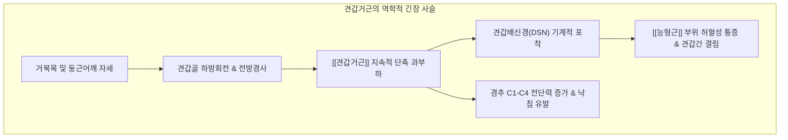

---
aliases:
  - 견갑거근
  - Levator Scapulae
  - Levator scapulae muscle
  - 어깨올림근
---
# [[견갑거근]](Levator Scapulae)

> **핵심 요약 (Key Summary)**:
> C1~C4 경추 횡돌기 후결절에서 기원하여 [[견갑골]] 상각 및 내측연 상부에 정지하는 목-어깨 경계부의 대표적인 거상 및 하방회전 근육입니다.
> [[견갑배신경]](C5) 및 제3·4 [[경추신경]](C3-C4) 전지의 지배를 받으며, [[견갑골]] 거상과 하방회전을 주도하고 [[경추]] 동측 측굴 및 동측 회전을 유발합니다.
> [[낙침]](급성 경항통), [[견갑거근 증후군]], [[견갑배신경 포착]]([[능형근]]간 결림), 거북목의 핵심 표적근이며, 견외수, 견중수, C1-C4 횡돌기 혈위 침도 및 MET 치료가 적용됩니다.

---
## 📌 목차
1. [해부학적 정밀 구조 및 지배 신경/혈관](#1-해부학적-정밀-구조-및-지배-신경혈관)
2. [생체역학·토크 분석 & 근막 사슬 (Biomechanical Synergy)](#2-생체역학토크-분석--근막-사슬-biomechanical-synergy)
3. [근막통증증후군(TP) & 연관통 패턴 (Travell & Simons)](#3-근막통증증후군tp--연관통-패턴-travell--simons)
4. [초음파 해부학(Sonoanatomy) 및 중재 시술 랜드마크](#4-초음파-해부학sonoanatomy-및-중재-시술-랜드마크)
5. [⭐ 원장님 심층 임상 고찰 및 원본 필기 (Clinical Pearls)](#5-원장님-심층-임상-고찰-및-원본-필기-clinical-pearls)
6. [관련 임상 질환 및 운동손상 증후군 총괄](#6-관련-임상-질환-및-운동손상-증후군-총괄)
7. [추나·도수치료(MET/PIR) & 침구·약침·재활 프로토콜](#7-추나도수치료metpir--침구약침재활-프로토콜)
8. [출처 및 학술 참고 문헌 (References)](#8-출처-및-학술-참고-문헌-references)

---
## 1. 해부학적 정밀 구조 및 지배 신경/혈관

| 항목 | 상세 내용 |
| :--- | :--- |
| **기시 (Origin)** | [[경추]] C1~C4 횡돌기 후결절(Transverse processes posterior tubercles) |
| **정지 (Insertion)** | [[견갑골]](Scapula) 상각(Superior angle) 및 견갑극 기저부 상방의 내측연 상부 |
| **신경 지배 (Innervation)** | [[견갑배신경]](Dorsal scapular nerve, C5 분지) 및 제3·4 [[경추신경]](C3, C4) 전지 가지 |
| **혈관 공급 (Vascular Supply)** | [[견갑배동맥]](Dorsal scapular artery) 및 경추횡동맥(Transverse cervical artery) 심지 |
| **기능 (Action)** | [[견갑골]] 거상(Elevation) 및 하방회전(Downward rotation), [[경추]] 동측 측굴 및 동측 회전 |
| **상대적 해부 위치** | 천층의 [[상부승모근]]과 [[흉쇄유돌근]] 심부에 위치하며, 후경삼각의 바닥을 구성 |

### 🔬 나선형 꼬임 주행 (Spiral/Twisted Architecture)
* [[견갑거근]]은 4개의 독립된 근건성 갈래(Slips)로 기원하여 하외측으로 주행하면서 180도 나선형으로 비틀리는 독특한 해부학적 구조를 가집니다.
* **최상부 섬유(C1)**: 기원하여 가장 아래쪽인 견갑골 내측연 상부로 내려가 정지합니다.
* **최하부 섬유(C4)**: 기원하여 가장 위쪽인 견갑골 상각(Superior angle) 정점에 정지합니다.
* 이러한 꼬임 구조 덕분에 경추 회전 시 근섬유가 풀리거나 조여지며 목의 회전 각도에 따른 장력 변화가 폭발적으로 발생합니다.

### 🔬 해부학 도해 및 단면도
![[Levator_scapulae_anatomy.png|450]]
> [Wikimedia Commons / BodyParts3D 공중도메인]: 경추 횡돌기 후결절에서 견갑골 상각으로 비틀리며 주행하는 [[견갑거근]]의 정밀 3차원 해부도.

![[견갑배신경-20240918005143222.png|450]]
> [구조적 특징 및 부착부 단면도]: 경추 횡돌기에서 견갑골 상각으로 나선형(Spiral)으로 꼬이며 주행하여 경추 회전과 견갑 거상을 강력하게 연결합니다.

---
## 2. 생체역학·토크 분석 & 근막 사슬 (Biomechanical Synergy)

### ⚙️ 견갑골 하방회전 vs 상방회전 짝힘 대립
* **견갑골 하방회전(Downward Rotation) 주동**:
  * 관절와(Glenoid cavity)를 아래로 향하게 회전시키는 대표 근육으로, [[소흉근]], [[능형근]]과 함께 하방회전 삼총사를 이룹니다.
  * 상지를 머리 위로 올리는 외전(Abduction) 시에는 견갑골이 상방회전되어야 하므로, [[견갑거근]]은 상방회전근([[상부승모근]], [[하부승모근]], [[전거근]])과 팽팽한 길항 작용을 수행합니다.
* **경추 동측 회전 및 동측 측굴 벡터**:
  * 견갑골이 하방 고정된 상태에서는 경추를 같은 쪽으로 기울이고(측굴), 얼굴을 같은 쪽으로 돌리는(동측 회전) 강력한 회전 토크를 발생시킵니다.

### 🔗 근막경선(Anatomy Trains) 연계
* [[나선선]](Spiral Line, SPL): 후두골-[[두판상근]]-[[능형근]]-[[전거근]] 사슬에서 경추와 견갑골을 잇는 회전 안정화 교량 역할을 담당합니다.
* [[심부후방상지선]](Deep Back Arm Line, DBAL): 경추 횡돌기에서 출발하여 견갑골 상각, 회전근개, 척골 골막으로 이어지는 상지 지탱선입니다.

---
## 3. 근막통증증후군(TP) & 연관통 패턴 (Travell & Simons)

### ⚡ 발통점(TrP) 및 통증 방사 양상
* **발통점 위치**:
  * **하부 TrP (주 TrP)**: 견갑골 상각(Superior angle) 바로 위쪽 근건 연접부.
  * **상부 TrP**: 목 외측 C4-C5 레벨에서 [[흉쇄유돌근]] 후연과 [[상부승모근]] 전연 사이의 근복.
* **연관통 패턴**:
  * 목덜미 각도부(경견각 부위)에 극심한 쑤심과 뻣뻣함 유발.
  * 견갑골 내측연을 따라 견갑골 하각 부근까지 아래로 뻗치는 방사통.
  * 어깨 뒤쪽 및 상완 삼각근 후면으로 은근한 방사통 투사.
  * **낙침(Stiff Neck)의 주범**: 환자가 고개를 환측으로 돌리지 못하여 몸 전체를 돌려 뒤를 바라보는 전형적인 임상 양상을 초래.

### 🔬 유발 및 지속 인자
* 추운 날씨에 어깨를 움츠리고 다니거나 차가운 바람을 목덜미에 직접 쐴 때(풍한 침습).
* 컴퓨터 작업을 하며 전화기를 귀와 어깨 사이에 끼우고 장시간 통화하는 자세.
* 무거운 숄더백을 편측 어깨에 메고 다니는 습관.

### 🔬 트리거 포인트 도해
![[Levator_scapulae_TriggerPoints.jpg|450]]
> [Travell & Simons Trigger Point Manual]: [[견갑거근]] 발통점과 목덜미 각도부, 견갑골 내측연 방사통 지도.

---
## 4. 초음파 해부학(Sonoanatomy) 및 중재 시술 랜드마크

### 🖥️ 고주파 초음파 스캔 프로토콜
* **탐촉자 위치**: 경부 외측 횡단면에서 선형 프로브를 거치하여 C3-C5 횡돌기 후결절을 확인한 후 하외측으로 추적(Tracking).
* **층별 구조 확인**:
  1. 피하조직 및 [[상부승모근]](Trapezius)
  2. [[견갑거근]](Levator scapulae): [[승모근]] 심부에서 타원형 저에코 근속으로 관찰
  3. 심층 근육: [[경판상근]](Splenius cervicis) 및 [[두반극근]](Semispinalis capitis)
* **신경혈관 탐색**: [[견갑거근]] 심층면과 [[전거근]]/[[능형근]] 사이로 주행하는 [[견갑배신경]](DSN)과 견갑배동맥의 박동 신호를 도플러로 확인.

### ⚠️ 중재 안전 구역 및 침구 안전 가이드
* 견갑골 상각 부착부 자침 시 갈비뼈(제1·2늑골) 방향으로 깊숙이 직자하면 흉막강을 천공하여 기흉(Pneumothorax)이 발생할 수 있습니다.
* 반드시 견갑골 상각의 뼈 윤곽(Bone touch)을 손가락으로 확인한 후, 뼈 표면을 향해 평각 또는 완만하게 사자(0.5~0.8촌)해야 합니다.

---
## 5. ⭐ 원장님 심층 임상 고찰 및 원본 필기 (Clinical Pearls)

### 💡 100% 원본 필기 보존 및 심층 해설
1. **신경 포착 메커니즘 (CRITICAL)**:
   * *원본 필기*: "견갑배신경 포착: [[견갑거근]] 긴장/단축 시 견갑배신경을 압박 → [[대능형근]], [[소능형근]] 부위의 허혈성 통증(견갑골 사이 통증, [[능형근]]통) 유발."
   * *심층 고찰*: 임상에서 많은 환자가 "날개뼈 안쪽([[능형근]] 부위)이 결리고 타는 듯이 아프다"고 호소합니다. 이때 통증 부위인 [[능형근]]에만 침을 놓으면 호전이 일시적입니다. [[견갑배신경]](C5)은 [[중사각근]]을 관통한 후 [[견갑거근]] 심층면을 타고 내려가 [[능형근]]으로 진입하므로, [[견갑거근]]의 만성 연축이 신경을 압박(Entrapment)하여 원위부인 [[능형근]] 영역에 신경병증성 허혈 통증을 방사합니다. 따라서 [[능형근]] 통증의 진정한 치료 타깃은 [[견갑거근]]과 중[[사각근]]입니다.
2. **치료 우선순위 프로토콜**:
   * *원본 필기*: "목 주변 통증에서 [[흉쇄유돌근]] 상부, [[중사각근]] 중부를 치료했는데도 통증/회전 제한이 남아있으면 반드시 [[견갑거근]]을 치료."
   * *심층 고찰*: 경추 가동성 제한(특히 회전 제한) 환자에서 [[흉쇄유돌근]]과 [[중사각근]]을 먼저 치료하여 표층 긴장을 푼 뒤에도 끝 범위(End-range) 회전 잠김이 남아있다면, 그것은 100% [[견갑거근]] 나선형 섬유의 꼬임 구축 때문입니다. 견갑골 상각 부착부 도침 치료가 최종 관문을 해결합니다.
3. **견갑 상방회전 vs 하방회전 감별**:
   * *원본 필기*: "어깨 외전 시 견갑골이 전체적으로 으쓱하며 올라가는 경향을 보이면 [[견갑거근]]이 과도하게 단축된 상태. 상부 [[승모근]](상방회전)과 [[견갑거근]](하방회전)의 불균형 감별 필수."
   * *심층 고찰*: 팔을 옆으로 들어 올릴 때 견갑골이 부드럽게 바깥 위로 돌아가지 않고 어깨를 으쓱(Hiking)하며 들어 올린다면, 하방회전근인 [[견갑거근]]이 과긴장되어 상방회전을 억제하는 운동손상증후군입니다.

---
## 6. 관련 임상 질환 및 운동손상 증후군 총괄

| 임상 질환 / 증후군 | 병리적 연관 기전 | 주요 증상 및 이학적 검사 | 핵심 교정 타깃 |
| :--- | :--- | :--- | :--- |
| [[낙침]](落枕, Stiff Neck) | 수면 중 풍한 노출 및 [[견갑거근]] 급성 연축 | 목 회전 극심한 제한, 환측 경견각 통증 | 견외수 도침 및 MET |
| [[견갑배신경 포착 증후군]] | [[견갑거근]] 심층면 신경 압박 | 견갑골 내측연 결림, [[능형근]] 타는 통증 | [[견갑거근]] 하부 신경 수압박리 |
| [[견갑거근 증후군]] | 견갑골 상각 건병증 및 마찰 윤활낭염 | 상각 부위 뚝뚝 소리(Snapping), 압통 | 견갑골 상각 골막 박리 |
| [[거북목 증후군]](Forward Head) | 경추 전만 소실로 인한 후방 버팀 과부하 | 목덜미 만성 피로, 두통, 어깨 솟음 | 자세 교정 추나 및 신장 |

---
## 7. 추나·도수치료(MET/PIR) & 침구·약침·재활 프로토콜

### 👐 추나 및 도수치료 프로토콜
* [[견갑거근]] **등척성 수축 후 이완기법(PIR)**:
  * 환자를 좌위 또는 앙와위로 두고, 고개를 반대측으로 45도 회전시킨 후 턱을 반대측 쇄골 방향으로 굴곡시킵니다.
  * 치료 측 어깨를 아래로 하강 고정한 상태에서, 환자에게 고개를 원래 위치로 돌리며 턱을 들도록 약 20%의 힘으로 저항을 유도(7초 유지).
  * 호기 시 고개를 더 깊이 굴곡·반대측 회전시켜 [[견갑거근]] 나선 섬유를 완전히 신장시킵니다(3~5회 반복).
* **견갑골 상각 하방 감압 추나**:
  * 시술자의 엄지 모지구로 견갑골 상각을 접촉하여 전하방으로 미세 압박을 가하며 견갑골 가동성을 확보합니다.

### 🎯 침구 및 약침 치료 프로토콜
* **주요 경혈 타깃**:
  * 견외수(肩外兪): 제1흉추 극돌기 하연 외측 3촌, 견갑골 상각 바로 안쪽. [[견갑거근]] 정지부 핵심 혈위.
  * 견중수(肩中兪): 제7경추 극돌기 하연 외측 2촌. [[견갑거근]] 근복 타깃.
  * 천두(天牖) 및 C1-C4 횡돌기 부착부 아시혈: 기시부 긴장 완화.
* **도침 요법(Acupotomy)**:
  * 견갑골 상각의 골막 유착 부위에 소형 도침을 골면에 수직으로 접촉시킨 후, 골막을 긁어내듯(Scraping) 1~2회 미세 절개하여 신경 포착과 건병증을 해소합니다.
* **약침 치료**:
  * 견갑골 상각 부착부 및 경추 횡돌기 부착부에 신바로 약침 또는 중성어혈 약침 0.2~0.3cc를 분주하여 국소 무균성 염증을 제거합니다.

### 🏃 재활 운동 및 자가 스트레칭
* **의자 잡고 겨드랑이 냄새 맡기 스트레칭(Sniffing Armpit Stretch)**:
  * 의자에 앉아 한 손으로 의자 시트를 잡아 어깨를 하방 고정합니다.
  * 고개를 반대측으로 45도 돌리고 손으로 머리를 잡아 반대측 겨드랑이를 바라보는 방향으로 지그시 당겨 15~20초간 유지합니다.

---
## 8. 출처 및 학술 참고 문헌 (References)

1. **Simons, D. G., & Travell, J. G. (1999)**. *Myofascial Pain and Dysfunction: The Trigger Point Manual*, Vol. 1 (2nd ed.). Williams & Wilkins, pp. 491-504.
   * `[연구 요약]`: [[견갑거근]] 발통점이 목덜미 각도부와 견갑골 내측연으로 방사하는 통증 패턴 및 뻣뻣한 목(Stiff neck/낙침)의 병리적 기전 정립.
2. **Chen, Y., et al. (2017)**. Dorsal scapular nerve entrapment neuropathy: Clinical and anatomical study. *Journal of Neurosurgery: Spine*, 26(3), 350-356.
   * `[연구 요약]`: [[중사각근]] 및 [[견갑거근]]에 의한 견갑배신경(DSN) 포착과 [[능형근]] 허혈성 통증 사이의 해부학적 인과관계 입증.
3. **Standring, S. (2020)**. *Gray's Anatomy: The Anatomical Basis of Clinical Practice* (42nd ed.). Elsevier.
   * `[연구 요약]`: [[견갑거근]]의 C1-C4 기시부 나선형 꼬임 주행과 견갑배동맥 및 신경 주행 경로 기술.
4. **Sahrmann, S. (2002)**. *Diagnosis and Treatment of Movement Impairment Syndromes*. Mosby.
   * `[연구 요약]`: 견갑골 하방회전 증후군에서 [[견갑거근]]의 과활성화와 [[상부승모근]]과의 짝힘 기능부전 평가 가이드 제시.
