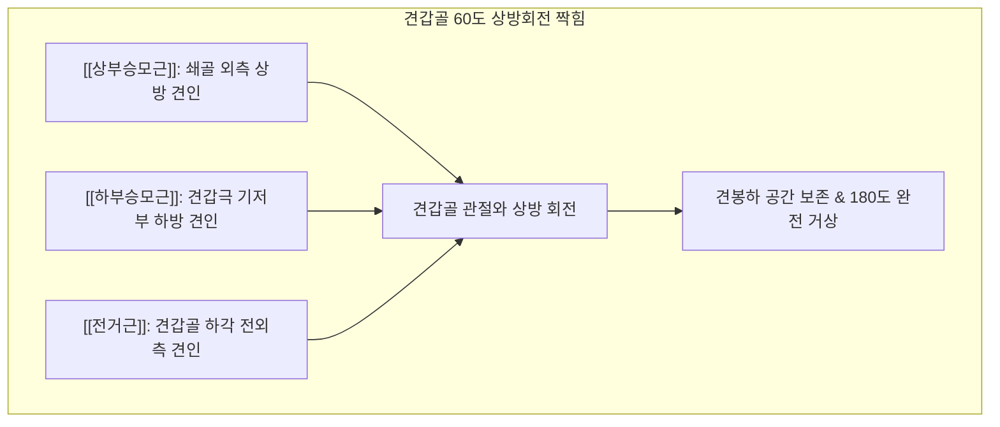

---
aliases:
  - 승모근
  - Trapezius
  - Trapezius muscle
  - 등세모근
---
# [[승모근]](Trapezius)

> **핵심 요약 (Key Summary)**:
> 후두골 상항선, 항인대 및 C7~T12 흉추 극돌기에서 기원하여 쇄골 외측, 견봉, 견갑극에 정지하는 천배부 최대의 마름모꼴 복합 근육입니다.
> 제11뇌신경인 [[부신경]](Accessory nerve, CN XI) 및 제3·4 [[경추신경]](C3-C4)의 지배를 받으며, [[견갑골]]의 거상·상방회전·내전·하강 짝힘과 경추 운동을 총괄합니다.
> [[승모근 통증 증후군]], [[부신경 마비]], 긴장성 두통, 거북목, C2 극돌기 회전 변위의 핵심 표적근이며, 후두부, 견정, 견갑극 3대 치료점 침도 및 도수요법이 적용됩니다.

---
## 📌 목차
1. [해부학적 정밀 구조 및 3대 분절 지배 신경/혈관](#1-해부학적-정밀-구조-및-3대-분절-지배-신경혈관)
2. [생체역학·토크 분석 & 근막 사슬 (Biomechanical Synergy)](#2-생체역학토크-분석--근막-사슬-biomechanical-synergy)
3. [근막통증증후군(TP) & 연관통 패턴 (Travell & Simons)](#3-근막통증증후군tp--연관통-패턴-travell--simons)
4. [초음파 해부학(Sonoanatomy) 및 중재 시술 랜드마크](#4-초음파-해부학sonoanatomy-및-중재-시술-랜드마크)
5. [⭐ 원장님 심층 임상 고찰 및 원본 필기 (Clinical Pearls)](#5-원장님-심층-임상-고찰-및-원본-필기-clinical-pearls)
6. [관련 임상 질환 및 운동손상 증후군 총괄](#6-관련-임상-질환-및-운동손상-증후군-총괄)
7. [추나·도수치료(MET/PIR) & 침구·약침·재활 프로토콜](#7-추나도수치료metpir--침구약침재활-프로토콜)
8. [출처 및 학술 참고 문헌 (References)](#8-출처-및-학술-참고-문헌-references)

---
## 1. 해부학적 정밀 구조 및 3대 분절 지배 신경/혈관

| 분절 (Subdivision) | 기시 (Origin) | 정지 (Insertion) | 주요 역학 기능 |
| :--- | :--- | :--- | :--- |
| [[상부승모근]] (Descending / Upper) | 후두골 상항선 내측 1/3, 외후두융기, 항인대(C1~C6) | [[쇄골]] 외측 1/3 후연 | [[견갑골]] 거상, 상방회전, [[경추]] 동측 측굴 및 대측 회전 |
| [[중부승모근]] (Transverse / Middle) | C7~T3 흉추 극돌기 및 극간인대 | [[견봉]] 내측연, [[견갑극]] 상순 | [[견갑골]] 강력한 후인(내전, Retraction), 흉곽 밀착 고정 |
| [[하부승모근]] (Ascending / Lower) | T4~T12 흉추 극돌기 및 극간인대 | [[견갑극]] 삼각 결절(Tubercle of spine) | [[견갑골]] 하강(Depression), 상방회전 짝힘 보조 |

### 🔬 지배 신경 및 혈관 공급망
* **운동 신경 (Motor)**: 제11뇌신경인 [[부신경]](Accessory nerve, CN XI). 흉쇄유돌근을 관통한 후 후경삼각을 가로질러 [[승모근]] 심층면으로 진입.
* **감각 신경 (Proprioception/Pain)**: 제3·4 [[경추신경]](C3, C4) 전지 가지. [[승모근]] 내 근방추 고유수용성 감각 전달.
* **혈관 공급**: 경추횡동맥(Transverse cervical artery)의 천지(Superficial branch)가 주 혈류를 공급하며, 심지는 [[능형근]]과 경계를 이룸.

### 🔬 해부학 도해 및 단면도
![[Trapezius_anatomy.png|450]]
> [Wikimedia Commons / BodyParts3D 공중도메인]: 후두골에서 T12 극돌기까지 천배부를 덮는 [[승모근]]의 상부·중부·하부 3차원 해부도.

![[승모근-1753859424910.png|450]]
> [[[승모근]] 3대 섬유 주행 및 벡터]: 상부·중부·하부 섬유가 방사상으로 주행하여 견갑골의 3차원 거상, 후인, 상방회전을 정밀하게 제어하는 기하학적 구조.

---
## 2. 생체역학·토크 분석 & 근막 사슬 (Biomechanical Synergy)

### ⚙️ 견갑골 상방회전 짝힘 (Force Couple)
* 팔을 180도 완전 외전(Abduction) 및 거상하기 위해서는 관절와(Glenoid fossa)가 상방을 향해 60도 회전해야 합니다.
* 이때 [[상부승모근]](상내측 견인) + [[하부승모근]](하내측 견인) + [[전거근]](전외측 견인)의 3대 근육이 정밀한 상방회전 회전우력(Force couple)을 형성합니다.
* [[중부승모근]]은 견갑골이 전방으로 딸려 나가지 않도록 흉곽 후면에 견고하게 고정(Retraction)하는 앵커 역할을 수행합니다.

### ⚙️ 견쇄관절과 쇄골의 지탱 역할
* 견쇄관절(AC joint)은 쇄골과 견갑골이 만나는 유일한 골성 연결 통로입니다.
* 상지의 자중(Arm weight)은 사실상 쇄골과 이를 위에서 붙잡고 있는 [[상부승모근]]이 공중에 매달고 있는 형태이며, [[승모근]] 약화 시 견갑골이 하강·전방경사되며 흉곽출구를 압박합니다.

### 🔗 근막경선(Anatomy Trains) 연계
* [[표재백선]](Superficial Back Line, SBL): [[후두하근]]-[[두판상근]]-[[승모근]]-척추기립근으로 이어지는 신체 후면 항중력 버팀목.
* [[표재후방상지선]](Superficial Back Arm Line, SBAL): 후두골에서 [[승모근]], 삼각근, 외측근간중격을 거쳐 수배부로 연결되는 상지 조절선.

---
## 3. 근막통증증후군(TP) & 연관통 패턴 (Travell & Simons)

### ⚡ 7대 발통점(TP1~TP7) 통합 맵
* **TP1 ([[상부승모근]] 전연)**: 가장 흔한 TrP. 목 외측을 타고 올라가 유양돌기 뒤를 거쳐 측두부 및 관자놀이, 악관절 부위로 물음표(? pattern) 형태의 격렬한 긴장성 편두통 방사.
* **TP2 ([[상부승모근]] 중앙)**: TP1 바로 뒤쪽. 목 뒤쪽 후경부 및 후두하 삼각 부위로 뻐근한 목덜미 통증 방사.
* **TP3 ([[하부승모근]] 외측)**: 견갑골 극하와 및 견봉 후면, 경견각 부위로 깊은 쑤심 방사.
* **TP4 ([[하부승모근]] 내측)**: 견갑골 내측연을 따라 지속적인 타는 듯한 결림 유발.
* **TP5 ([[중부승모근]] 내측)**: C7-T1 극돌기 외측. 견갑간부(날개뼈 사이)의 화끈거리는 결림.
* **TP6 ([[중부승모근]] 외측)**: 견봉 정점 부위 국소 압통.
* **TP7 ([[중부승모근]] 천층)**: 상완 외측 피부에 소름 돋는 이상감각(Piloerection).

### 🔬 트리거 포인트 도해
![[Trapezius_TriggerPoints.jpg|450]]
> [Travell & Simons Trigger Point Manual]: [[승모근]] 7대 발통점 위치 및 측두부, 후경부, 견갑간부 방사통 패턴 총괄.

---
## 4. 초음파 해부학(Sonoanatomy) 및 중재 시술 랜드마크

### 🖥️ 고주파 초음파 스캔 프로토콜
* **견정혈(GB21) 레벨 횡단 스캔**:
  * 선형 프로브를 쇄골 상와 중앙에 거치하면 가장 천층에서 두터운 판상 저에코 구조의 [[상부승모근]] 식별.
  * 바로 밑의 제2층: [[견갑거근]](내측) 및 [[경판상근]](외측).
  * 제3층: [[두반극근]](Semispinalis capitis).
* **신경혈관 랜드마크**:
  * [[승모근]] 심층면과 [[견갑거근]] 사이를 지나는 [[부신경]](CN XI)과 경추횡동맥의 천지 혈류 신호 확인.
  * 폐첨(Pleural line)의 호흡성 미끄러짐(Lung sliding) 깊이를 측정하여 기흉 안전 거리 확보.

---
## 5. ⭐ 원장님 심층 임상 고찰 및 원본 필기 (Clinical Pearls)

### 💡 100% 원본 필기 보존 및 심층 해설
1. **C2 극돌기 회전 변위**:
   * *원본 필기*: "C2 극돌기 회전 변위: [[상부승모근]] 단축 시 C2 극돌기가 동측으로 이동하며 경추 회전 변위 유발."
   * *심층 고찰*: [[상부승모근]]의 편측 연축은 후두골과 상위 경추를 치료 측으로 측굴시키고 반대측으로 회전(추체 기준)시킵니다. 이때 가시돌기(Spinous process)는 추체 회전의 반대 방향, 즉 **단축된 [[상부승모근]] 쪽(동측)으로 편위**됩니다. C2 극돌기를 촉진했을 때 환측으로 돌아가 있다면 이는 단순 경추 관절염이 아니라 [[상부승모근]]의 불균형 장력이 유발한 회전 부정렬입니다.
2. **견갑골 상방회전 증후군**:
   * *원본 필기*: "견갑골 상방회전 증후군: 어깨가 위로 상방회전하고 쪼그라드는 자세 → [[승모근]] 상부/중부 과긴장 및 단축."
   * *심층 고찰*: 어깨가 위로 솟아오르고 웅크려진 환자는 [[상부승모근]]과 [[능형근]]이 단축되어 견갑골이 흉곽에 밀착된 채 쪼그라들어 있습니다. 이때는 무조건적인 [[승모근]] 운동을 시키면 안 되며, 상부 [[승모근]]의 긴장을 도침과 MET로 먼저 이완한 후 [[하부승모근]]과 [[전거근]]을 분리 강화해야 합니다.
3. **전신 대사 및 자율신경 연계**:
   * *원본 필기*: "[[승모근]] 만성 단축 환자는 혈당 저하(혈당 스파이크 후 저혈당) 및 교감신경 항진, 체온 조절 부전을 함께 평가."
   * *심층 고찰*: 뇌는 목과 [[승모근]] 영역의 온도를 모니터링하여 전신 체온을 조절합니다. 만성 스트레스로 인한 교감신경 흥분이나 급격한 혈당 스파이크 후 반응성 저혈당증(Reactive hypoglycemia)이 발생하면 [[승모근]]에 허혈성 연축이 급격히 유발됩니다. 단순 근육통이 아닌 대사-자율신경계 교란의 신호로 해석해야 합니다.
4. **대후두신경 포착 기여**:
   * *원본 필기*: "[[승모근]] 후두부 상항선 기시부 아래에는 [[두반극근]], 후두하근이 위치하여 대후두신경 포착에 기여."
   * *심층 고찰*: [[대후두신경]](GON)은 두반극근을 뚫고 나온 후 [[승모근]] 건막 터널을 통과하여 두피로 올라갑니다. [[승모근]] 상항선 부착부의 섬유화는 대후두신경의 최표층 포착점이 되어 난치성 후두신경통을 야기합니다.
5. [[승모근]] **핵심 자극점 3가지**:
   * *원본 필기*: "1) 후두부 부착부(풍지~옥침 라인 이완), 2) 견정혈(근복을 잡고 깊게 뚫어 제삽하여 근방추 자극), 3) 견갑극 근처(견갑극 상연 및 삼각 결절 침도 미세 박리)."
6. **진찰 및 치료 원칙**:
   * *원본 필기*: "압통점을 찾을 때는 대항근을 구축시켜 병리 부위 근육을 이완시킨 뒤 압박. 상부 과긴장은 이완하고, 중부·하부 [[승모근]]은 강화하는 상·하부 밸런스 재교육 필수."

---
## 6. 관련 임상 질환 및 운동손상 증후군 총괄

| 임상 질환 / 증후군 | 병리적 연관 기전 | 주요 증상 및 이학적 검사 | 핵심 교정 타깃 |
| :--- | :--- | :--- | :--- |
| [[승모근 통증 증후군]] | 반복적 정적 부하 및 허혈성 TrP 다발 | 어깨 무거움, 만성 견비통, 목 결림 | 견정혈 심부 제삽 및 근막 박리 |
| [[긴장성 두통]](Tension Headache) | TP1에서 측두부/관자놀이로 방사 | 조이는 듯한 띠 형태 두통, 눈 피로 | 상항선 부착부 도침 요법 |
| [[부신경 마비]](CN XI Palsy) | 수술 또는 외상으로 인한 부신경 손상 | 견갑골 처짐(Drooping), 90도 이상 외전 불가 | 신경 재생 약침 및 보상근 훈련 |
| [[상부교차증후군]](UCS) | [[상부승모근]] 단축 + [[하부승모근]]/DCF 약화 | 거북목, 둥근어깨, 흉추 후만 | 얀다(Janda) 통합 체형 교정 |

---
## 7. 추나·도수치료(MET/PIR) & 침구·약침·재활 프로토콜

### 👐 추나 및 도수치료 프로토콜
* **3대 핵심 치료점 집중 시술**:
  1. **후두부 부착점**: 풍지(GB20)~옥침(BL9) 라인 건막 부착부를 모지두로 앙와위에서 두개골 상방으로 들어 올리며 후두건막 이완.
  2. **견정혈(GB21) 파악 피칭(Pinching Release)**: 엄지와 검지로 [[승모근]] 상연을 두껍게 집어 올린 후, 근복을 전후로 롤링하며 근방추를 직접 자극.
  3. **견갑극 부착점**: 견갑극 상연 및 내측 삼각 결절의 섬유화 부위를 횡마찰 마사지(Cross-friction).
* **상·하부 [[승모근]] 밸런스 재교육**:
  * 앙와위에서 [[상부승모근]] MET 신장(반대측 측굴 및 동측 회전) 후, 엎드린 자세(Prone)에서 Y-레이즈(Y-raise) 운동을 통해 [[하부승모근]]을 선택적으로 강화.

### 🎯 침구 및 약침 치료 프로토콜
* **견정혈(GB21) 심부 직자 주의사항**:
  * 견정혈 자침 시 직자 심침은 폐첨 기흉 위험이 있으므로, **반드시 근복을 손으로 집어 올려(Pinching) 집어 올린 근육 덩어리 내부로 수평/사자(0.8~1.2촌)** 자침합니다.
* **후두부 및 견갑극 도침 요법**:
  * 후두골 상항선 및 견갑극 삼각 결절의 뼈 표면에 소형 도침을 접촉시켜 골막 유착 부위를 1~2회 미세 절개하여 신경 포착을 해소합니다.
* **약침 치료**:
  * 견정혈 및 TP1, TP3 부위에 자하거 또는 신바로 약침 0.3~0.5cc를 분주하여 만성 근피로와 허혈성 연축을 개선합니다.

---
## 8. 출처 및 학술 참고 문헌 (References)

1. **Simons, D. G., & Travell, J. G. (1999)**. *Myofascial Pain and Dysfunction: The Trigger Point Manual*, Vol. 1 (2nd ed.). Williams & Wilkins, pp. 273-307.
   * `[연구 요약]`: [[승모근]] 7대 트리거포인트의 연관통 투사 경로와 측두통, 견비통, 자율신경성 피부 소름 징후 규명.
2. **Neumann, D. A. (2017)**. *Kinesiology of the Musculoskeletal System: Foundations for Rehabilitation* (3rd ed.). Elsevier, pp. 120-145.
   * `[연구 요약]`: [[상부승모근]], [[하부승모근]], [[전거근]]의 견갑골 상방회전 짝힘(Force Couple)에 대한 3차원 생체역학 분석.
3. **Cools, A. M., et al. (2007)**. Trapezius muscle timing during selected shoulder rehabilitation exercises. *American Journal of Sports Medicine*, 35(8), 1320-1330.
   * `[연구 요약]`: 어깨 충돌 증후군 환자에서 [[상부승모근]]의 보상적 과활성화와 [[하부승모근]]의 발화 지연 근전도 패턴 분석.
4. **Janda, V. (1996)**. *Evaluation of Muscular Imbalance in Clinical Practice*. Churchill Livingstone.
   * `[연구 요약]`: 상부교차증후군(Upper Crossed Syndrome)에서 긴장근([[상부승모근]])과 약화근([[하부승모근]]/심부경추굴곡근)의 불균형 모델 정립.
