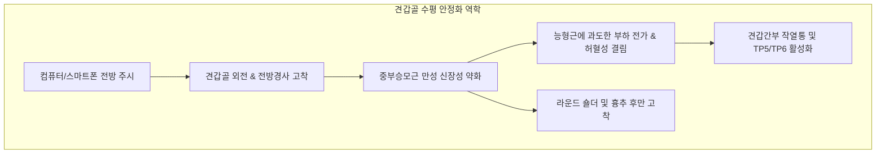

---
aliases:
  - 중부승모근
  - 중부 승모근
  - Middle Trapezius
  - Middle Trapezius muscle
  - 등세모근 중간섬유
---
# [[중부승모근]](Middle Trapezius)

> **핵심 요약 (Key Summary)**:
> C7~T5 흉추 극돌기 및 극간인대에서 수평으로 기원하여 [[견봉]] 내측연 및 [[견갑극]] 상순에 정지하는 견갑대 수평 안정화의 주동근입니다.
> 제11뇌신경인 [[부신경]](Accessory nerve, CN XI)과 제3·4 [[경추신경]](C3-C4) 전지의 지배를 받으며, [[견갑골]]의 순수 후인(내전) 및 흉곽 밀착 고정을 주도합니다.
> [[라운드 숄더]], [[익상견갑]], 흉추 후만, 견갑간부 결림(TP5, TP6)의 핵심 재활 표적근이며, 부분, 백호 혈위 침구 및 T-레이즈 강화 훈련이 적용됩니다.

---
## 📌 목차
1. [해부학적 정밀 구조 및 지배 신경/혈관](#1-해부학적-정밀-구조-및-지배-신경혈관)
2. [생체역학·토크 분석 & 근막 사슬 (Biomechanical Synergy)](#2-생체역학토크-분석--근막-사슬-biomechanical-synergy)
3. [근막통증증후군(TP) & 연관통 패턴 (Travell & Simons)](#3-근막통증증후군tp--연관통-패턴-travell--simons)
4. [초음파 해부학(Sonoanatomy) 및 중재 시술 랜드마크](#4-초음파-해부학sonoanatomy-및-중재-시술-랜드마크)
5. [⭐ 원장님 심층 임상 고찰 및 원본 필기 (Clinical Pearls)](#5-원장님-심층-임상-고찰-및-원본-필기-clinical-pearls)
6. [관련 임상 질환 및 운동손상 증후군 총괄](#6-관련-임상-질환-및-운동손상-증후군-총괄)
7. [추나·도수치료(MET/PIR) & 침구·약침·재활 프로토콜](#7-추나도수치료metpir--침구약침재활-프로토콜)
8. [출처 및 학술 참고 문헌 (References)](#8-출처-및-학술-참고-문헌-references)

---
## 1. 해부학적 정밀 구조 및 지배 신경/혈관

| 항목 | 상세 내용 |
| :--- | :--- |
| **기시 (Origin)** | [[경추]] C7 극돌기 및 [[흉추]] T1~T5 극돌기, 극간인대(Interspinous ligaments) |
| **정지 (Insertion)** | [[견봉]](Acromion)의 내측연 및 [[견갑극]](Spine of scapula)의 상순 전장 |
| **신경 지배 (Innervation)** | 운동 신경: [[부신경]](Accessory nerve, CN XI) 감각 신경: 제3·4 [[경추신경]](C3, C4) 전지 가지 |
| **혈관 공급 (Vascular Supply)** | 경추횡동맥(Transverse cervical artery)의 천지 및 후늑간동맥 분지 |
| **기능 (Action)** | [[견갑골]]의 순수 후인(내전, Retraction), 흉곽 후면에 견갑골 밀착 고정, 쇄골 후인 보조 |
| **상대적 해부 위치** | 천층에 위치하며, 심층에 [[대능형근]], [[소능형근]], 상후거근 및 척추기립근을 피복 |

### 🔬 순수 수평 섬유판의 기하학적 특성
* [[중부승모근]]은 상부나 하부 섬유와 달리 근섬유 주행 방향이 척추에서 견갑극을 향해 **완전히 수평(Horizontal)**으로 배열되어 있습니다.
* 상하 회전 모멘트가 거의 상쇄되어 순수한 견갑골 후인(Retraction) 토크만을 생성하므로, 견갑대가 전외측으로 미끄러져 흉곽에서 멀어지는 것을 물리적으로 방어하는 유일한 수평 텐션 가이드 역할을 수행합니다.

### 🔬 해부학 도해 및 단면도
![[Trapezius_anatomy.png|450]]
> [Wikimedia Commons / BodyParts3D 공중도메인]: C7-T5 극돌기에서 견갑극으로 수평 방사되는 중부승모근의 위치와 주변 근육과의 배열.

![[승모근-1753859355643.png|450]]
> [중부승모근 수평 섬유판 구조]: 흉추 극돌기에서 견갑극을 향해 완전히 수평(Horizontal) 방향으로 주행하는 순수 내전 섬유판.

---
## 2. 생체역학·토크 분석 & 근막 사슬 (Biomechanical Synergy)

### ⚙️ 견갑대 수평 안정화와 익상 방어 메커니즘
* **견갑골 강력한 후인 (Retraction / Adduction)**:
  * [[견갑골]]을 척추 중심선 방향으로 끌어당겨 흉곽 후면에 밀착 고정시킵니다.
  * [[능형근]]이 하방회전을 동반하며 후인을 수행하는 반면, [[중부승모근]]은 회전 없는 순수 후인을 수행하므로 팔을 들어 올릴 때 견갑골이 적절한 상방회전 궤적을 유지하도록 지지대 역할을 담당합니다.
* **견갑골 내측연 들림(익상) 방지**:
  * 팔을 앞으로 뻗거나 푸시업 동작 시 견갑골 내측연이 흉곽에서 붕 뜨는 익상견갑(Winged scapula)을 방어합니다.

### 🔗 근막경선(Anatomy Trains) 연계
* [[표재후방상지선]](Superficial Back Arm Line, SBAL): 척추 극돌기에서 [[중부승모근]], 삼각근 후부, 상완 외측근간중격을 거쳐 신근건막으로 이어지는 수평 사슬.
* [[기능선]](Functional Line, FL): 반대측 대둔근 및 광배근과 X자형 교차 장력을 형성하여 보행 시 흉배부의 회전력을 흡수합니다.

---
## 3. 근막통증증후군(TP) & 연관통 패턴 (Travell & Simons)

### ⚡ 발통점(TP5, TP6, TP7) 및 연관통 양상
* **TP5 (C7-T1 극돌기 외측)**:
  * 흉추 극돌기 바로 옆 근육 내측 연접부.
  * 견갑골 내측연과 척추 사이(견갑간부)로 화끈거리거나 결리는 작열통(Burning pain) 방사.
* **TP6 (견봉 첨부 및 견갑극 외측)**:
  * 견봉 외측 정점 부위에 국소적인 압통과 쑤심 투사.
* **TP7 (중부승모근 표층)**:
  * 상완 외측 삼각근 표면으로 소름이 돋거나 털이 곤두서는 듯한 이상감각(Piloerection) 반사 유발.

### 🔬 유발 및 지속 인자
* 장시간 양팔을 앞으로 뻗은 채 운전하거나 타이핑하는 자세(상부승모근 과긴장 vs 중부승모근 신장성 약화).
* 무거운 짐을 가슴 안쪽으로 안고 장시간 운반하는 동작.
* 라운드 숄더로 인해 견갑골이 전외측으로 만성 전위된 체형.

### 🔬 트리거 포인트 도해
![[Trapezius_TriggerPoints.jpg|450]]
> [Travell & Simons Trigger Point Manual]: 중부승모근 TP5, TP6, TP7 발통점 위치 및 견갑간부, 견봉 첨부 방사통 패턴.

---
## 4. 초음파 해부학(Sonoanatomy) 및 중재 시술 랜드마크

### 🖥️ 고주파 초음파 스캔 프로토콜
* **견갑간부(T1-T4 극돌기 외측) 횡단 스캔**:
  * 선형 프로브를 척추 극돌기와 견갑골 내측연 사이에 수평으로 거치.
  * **제1층(천층)**: 얇고 평평한 저에코 근육대인 [[중부승모근]] 식별.
  * **제2층(심층)**: 중부승모근 바로 아래에서 두텁게 관찰되는 [[대능형근]](Rhomboid major).
  * **제3층**: 척추기립근(Erector spinae) 및 갈비뼈(Rib) 피질골 라인.

### ⚠️ 중재 안전 구역 및 침구 안전 가이드
* 흉배부 견갑간부는 심부에 늑간근과 흉막(Pleura)이 바로 위치하므로, 척추 방향이 아닌 갈비뼈 사이로 깊숙이 직자하면 기흉(Pneumothorax) 위험이 큽니다.
* 반드시 늑골 표면을 향해 15~30도 사자(0.5~0.8촌)하거나 척추 극돌기 골막을 랜드마크로 삼아 안전 자침을 시행합니다.

---
## 5. ⭐ 원장님 심층 임상 고찰 및 원본 필기 (Clinical Pearls)

### 💡 100% 원본 필기 보존 및 심층 해설
1. **근육 불균형 패턴 (상부 과긴장 vs 중부 약화)**:
   * *원본 필기*: "장시간 컴퓨터 작업 시 상부 승모근은 과긴장 단축되고, 중부 승모근은 만성 신장성 약화에 노출. 중부 승모근 약화 시 견갑골이 전외측으로 외전되면서 대능형근, 소능형근에 과도한 부하 전가."
   * *심층 고찰*: 임상에서 등(견갑간부)이 아프다고 호소하는 환자들의 대다수는 근육이 뭉친 것이 아니라, 너무 늘어나서 힘을 쓰지 못하는 **신장성 약화(Lengthened weakness)** 상태입니다. 이때 등에 침을 강하게 놓아 근육을 더 풀어버리면 견갑골 안정성이 더욱 붕괴되어 통증이 악화됩니다. 따라서 전면의 [[소흉근]]과 상부의 [[상부승모근]] 단축을 먼저 해결한 뒤, [[중부승모근]]은 침 자극 후 반드시 강화 운동을 통해 단축 장력을 회복시켜야 완치됩니다.
2. **자세 유지 및 흉추 정렬**:
   * *원본 필기*: "기립 및 보행 시 흉추가 앞으로 굽는 후만 변형을 억제하고 쇄골을 뒤로 젖힘."
   * *심층 고찰*: [[중부승모근]]은 흉추 후만을 억제하는 가장 중요한 항중력 브레이크입니다. 이 근육의 활성도가 떨어지면 흉추 후만이 심화되고 연쇄적으로 경추 전만이 소실되어 거북목이 유발됩니다.
3. **촉진 및 치료 프로토콜**:
   * *원본 필기*: "촉진법: 견갑골 극하와 내측과 흉추 극돌기 사이(부분혈, 백호혈 부위)에서 수평 섬유 팽찰도 확인. 추나 및 운동 치료: 흉추 교정 추나 및 중부 승모근 활성화 운동(엎드려 'T'자 레이즈 / 수평 외전 운동). 견갑간 부위 침구 치료 및 흉배부 근막 이완술."

---
## 6. 관련 임상 질환 및 운동손상 증후군 총괄

| 임상 질환 / 증후군 | 병리적 연관 기전 | 주요 증상 및 이학적 검사 | 핵심 교정 타깃 |
| :--- | :--- | :--- | :--- |
| [[라운드 숄더]](Round Shoulder) | [[소흉근]] 단축 및 [[중부승모근]] 만성 약화 | 어깨 전방 말림, 견갑골 외전 변위 | 중부승모근 T-레이즈 강화 |
| [[익상견갑]](Scapular Winging) | 견갑골 후인 및 흉곽 밀착 부전 | 견갑골 내측연 들림, 팔 뻗을 때 불안정 | 전거근/중부승모근 협응 훈련 |
| [[견갑간부 근막통증증후군]] | TP5 발통점 형성 및 능형근 과부하 | 날개뼈 사이 타는 듯한 결림, 결절 | 부분·백호혈 전침 및 침도 |
| [[흉추 후만증]](Hyperkyphosis) | 중부승모근 지지력 상실로 흉추 굽음 | 등 굽음, 흉배부 피로, 호흡량 감소 | 흉추 신전 교정 추나 |

---
## 7. 추나·도수치료(MET/PIR) & 침구·약침·재활 프로토콜

### 👐 추나 및 도수치료 프로토콜
* **흉추 신전 및 견갑골 후인 추나 교정**:
  * 환자를 앙와위로 눕히고 시술자는 주먹을 흉추 T3-T5 후만 정점에 댄 후 환자의 팔을 교차시켜 후방 압박 신전(Drop 기법)을 가하여 흉추 가동성을 회복합니다.
* **중부승모근 능동적 활성화 도수치료**:
  * 엎드린 자세(Prone)에서 시술자가 견갑골 내측연을 손으로 촉진하며, 환자에게 팔을 90도 외전한 상태에서 천장 쪽으로 들어 올리게 하여 정확한 근수축 감각을 바이오피드백합니다.

### 🎯 침구 및 약침 치료 프로토콜
* **주요 경혈 타깃**:
  * 부분(附分, BL41): 제2흉추 극돌기 하연 외측 3촌. 중부승모근 상단 타깃.
  * 백호(魄戶, BL42): 제3흉추 극돌기 하연 외측 3촌. 중부승모근 근복 및 TP5 타깃.
  * 고황(膏肓, BL43): 제4흉추 극돌기 하연 외측 3촌. 견갑간부 만성 결림의 특효 혈위.
* **자침 안전 각도**:
  * 척추 방향(내측)으로 15~30도 사자(0.5~0.8촌)하여 늑간 천자를 철저히 방지.
* **약침 치료**:
  * 백호 및 고황혈 부위에 중성어혈 약침 또는 황련해독탕 약침 0.2~0.3cc를 주입하여 국소 염증과 허혈성 결림을 치료합니다.

### 🏃 재활 운동 및 운동 치료
* **엎드려 T-레이즈(Prone T-Raise)**:
  * 엎드린 자세에서 양팔을 옆으로 90도 벌리고(T자 형태) 엄지손가락을 천장으로 향하게 한 뒤, 어깨를 으쓱하지 않고 견갑골을 척추 쪽으로 모아 팔을 들어 올림(12회씩 3세트).
* **밴드 풀 어파트(Band Pull-Apart)**:
  * 선 자세에서 탄력 밴드를 가슴 높이로 잡고 양팔을 바깥쪽으로 벌리며 견갑골을 흉곽에 밀착시키는 훈련.

---
## 8. 출처 및 학술 참고 문헌 (References)

1. **Simons, D. G., & Travell, J. G. (1999)**. *Myofascial Pain and Dysfunction: The Trigger Point Manual*, Vol. 1 (2nd ed.). Williams & Wilkins, pp. 273-307.
   * `[연구 요약]`: 중부승모근 TP5, TP6 발통점의 신경생리학적 기전과 견갑간부 작열통 투사 경로 규명.
2. **Neumann, D. A. (2017)**. *Kinesiology of the Musculoskeletal System: Foundations for Rehabilitation* (3rd ed.). Elsevier, pp. 120-145.
   * `[연구 요약]`: 중부승모근과 능형근의 상호작용을 통한 견갑골 수평 후인 토크 및 흉곽 밀착 안정화 역학 분석.
3. **De Mey, K., Cagnie, B., Danneels, L. A., Cools, A. M., & Van de Velde, A. (2009)**. Trapezius muscle timing during selected shoulder rehabilitation exercises. *J Orthop Sports Phys Ther*, 39(10), 743-752. [PMID: 19801813](https://pubmed.ncbi.nlm.nih.gov/19801813/)
   * `[연구 요약]`:  견관절 재활 운동 중 승모근 상·중·하부의 근활성 개시 시점(timing)을 EMG로 분석 — 상부승모근 과활동 조절을 위한 운동 선택 근거.
4. **Janda, V. (1996)**. *Evaluation of Muscular Imbalance in Clinical Practice*. Churchill Livingstone.
   * `[연구 요약]`: 상부교차증후군에서 자세성 억제(Inhibition)에 취약한 중부승모근의 신경근 재교육 원칙 제시.