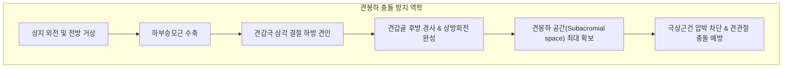

---
aliases:
  - 하부승모근
  - 하부 승모근
  - Lower Trapezius
  - Lower Trapezius muscle
  - 등세모근 하부섬유
---
# [[하부승모근]](Lower Trapezius)

> **핵심 요약 (Key Summary)**:
> T6~T12 흉추 극돌기 및 극간인대에서 상외측 사선으로 기원하여 [[견갑극]] 기저부 내측의 삼각 결절에 정지하는 견갑골의 핵심 하강 및 상방회전 근육입니다.
> 제11뇌신경인 [[부신경]](Accessory nerve, CN XI)과 제3·4 [[경추신경]](C3-C4) 전지의 지배를 받으며, [[견갑골]] 하강, 후방 경사 및 상방회전 짝힘을 형성하여 견봉하 공간을 보존합니다.
> [[견관절 충돌증후군]], [[회전근개 건병증]], [[라운드 숄더]], 상지 거상 장애의 가장 결정적인 재활 표적근이며, 흉추 T6~T12 라인 침구 및 Prone Y-레이즈 운동의 핵심입니다.

---
## 📌 목차
1. [해부학적 정밀 구조 및 지배 신경/혈관](#1-해부학적-정밀-구조-및-지배-신경혈관)
2. [생체역학·토크 분석 & 근막 사슬 (Biomechanical Synergy)](#2-생체역학토크-분석--근막-사슬-biomechanical-synergy)
3. [근막통증증후군(TP) & 연관통 패턴 (Travell & Simons)](#3-근막통증증후군tp--연관통-패턴-travell--simons)
4. [초음파 해부학(Sonoanatomy) 및 중재 시술 랜드마크](#4-초음파-해부학sonoanatomy-및-중재-시술-랜드마크)
5. [⭐ 원장님 심층 임상 고찰 및 원본 필기 (Clinical Pearls)](#5-원장님-심층-임상-고찰-및-원본-필기-clinical-pearls)
6. [관련 임상 질환 및 운동손상 증후군 총괄](#6-관련-임상-질환-및-운동손상-증후군-총괄)
7. [추나·도수치료(MET/PIR) & 침구·약침·재활 프로토콜](#7-추나도수치료metpir--침구약침재활-프로토콜)
8. [출처 및 학술 참고 문헌 (References)](#8-출처-및-학술-참고-문헌-references)

---
## 1. 해부학적 정밀 구조 및 지배 신경/혈관

| 항목 | 상세 내용 |
| :--- | :--- |
| **기시 (Origin)** | [[흉추]] T6~T12 극돌기(Spinous processes) 및 극간인대 전장 |
| **정지 (Insertion)** | [[견갑극]](Spine of scapula) 기저부 내측의 삼각 결절(Tubercle of scapular spine) |
| **신경 지배 (Innervation)** | 운동 신경: [[부신경]](Accessory nerve, CN XI) 감각 신경: 제3·4 [[경추신경]](C3, C4) 전지 가지 |
| **혈관 공급 (Vascular Supply)** | 경추횡동맥(Transverse cervical artery) 심지 및 후늑간동맥(Posterior intercostal artery) 분지 |
| **기능 (Action)** | [[견갑골]] 하강(Depression), 상방회전(Upward rotation), 후방 경사(Posterior tilt), 흉추 신전 보조 |
| **상대적 해부 위치** | 흉배부 하부 표층에 위치하며, 심층에 [[광배근]] 기시부, 하후거근, 척추기립근을 덮음 |

### 🔬 T12까지 이어지는 상외측 사선 주행의 기하학
* [[하부승모근]]은 흉추 최하단인 T12 극돌기에서 시작하여 견갑극 내측단을 향해 **상외측 사선(Superolateral oblique)** 방향으로 뻗어 올라가는 부채꼴 형태입니다.
* 아래쪽에서 대각선으로 견갑극을 잡아당기기 때문에, 견갑골을 흉곽 아래로 끌어내리는 동시에 관절와를 위로 회전시키는 강력한 상방회전 지렛대 암(Lever arm)을 제공합니다.

### 🔬 해부학 도해 및 단면도
![[Trapezius_anatomy.png|450]]
> [Wikimedia Commons / BodyParts3D 공중도메인]: 흉추 T6-T12 극돌기에서 견갑극 기저부로 부채꼴 형태로 수렴하는 하부승모근의 정밀 3차원 해부도.

![[승모근-1753859424910.png|450]]
> [하부승모근 사선 주행 벡터]: 흉추 하부에서 견갑극 내측단을 향해 사선으로 뻗어 올라가 견갑골을 아래뒤쪽으로 당겨 내리는 벡터.

---
## 2. 생체역학·토크 분석 & 근막 사슬 (Biomechanical Synergy)

### ⚙️ 견관절 충돌 방지의 핵심: 후방 경사(Posterior Tilting)
* **견봉하 공간(Subacromial Space) 보존**:
  * 팔을 앞으로 들어 올리거나 옆으로 외전할 때, 견갑골은 반드시 뒤쪽으로 젖혀지는 **후방 경사(Posterior tilt)**가 일어나야 견봉(Acromion)이 회전근개 건(극상근건)을 씹지 않습니다.
  * [[하부승모근]]은 견갑골 후방 경사를 일으키는 가장 강력한 근육이며, 이 근육이 약화되면 견갑골이 앞으로 엎어지는 전방 경사(Anterior tilt)가 고착되어 100% 견관절 충돌증후군이 발생합니다.
* **상방회전 삼총사 짝힘의 아래쪽 닻**:
  * [[상부승모근]](위쪽 견인) + [[전거근]](하각 외측 견인)과 함께, [[하부승모근]]은 견갑극 내측을 아래로 끌어내려 관절와가 부드럽게 60도 상방회전하도록 회전 중심축을 안정화합니다.

### 🔗 근막경선(Anatomy Trains) 연계
* [[표재후방상지선]](Superficial Back Arm Line, SBAL): 흉추 하부에서 하부승모근을 통해 견갑골 후면으로 진입하는 상지 안정화 축.
* [[나선선]](Spiral Line, SPL): 능형근 및 반대측 척추기립근과 교차하여 몸통 회전 시 상지의 축성 안정성을 보장합니다.

---
## 3. 근막통증증후군(TP) & 연관통 패턴 (Travell & Simons)

### ⚡ 발통점(TP3, TP4) 및 연관통 양상
* **TP3 (견갑골 하각 내측 근복)**:
  * 가장 중요한 TrP. 목덜미 각도부(경견각 부위), 견봉 후면 및 후두골 기저부까지 위쪽으로 광범위하게 쑤시고 타는 듯한 연관통을 역방사(Upward referred pain)합니다.
  * 종종 만성 경추통이나 후두하근 긴장으로 오진됩니다.
* **TP4 (견갑극 삼각 결절 부착부)**:
  * 견갑골 내측연을 따라 견갑간부에 지속적이고 묵직한 결림을 투사합니다.

### 🔬 유발 및 지속 인자
* 스마트폰이나 컴퓨터 작업 시 등을 구부정하게 둥글게 말고 있는 자세(Thoracic kyphosis).
* 팔을 어깨 높이 이하로만 장시간 사용하는 좌식 생활 습관(상지 거상 기회 박탈로 인한 만성 억제).
* 벤치프레스 등 가슴 전면 굴곡근만 과도하게 단련하고 후면 당기기 운동을 배제한 운동 불균형.

### 🔬 트리거 포인트 도해
![[Trapezius_TriggerPoints.jpg|450]]
> [Travell & Simons Trigger Point Manual]: 하부승모근 TP3, TP4 발통점 위치 및 목덜미, 견봉 후면, 견갑골 내측연 방사통 지도.

---
## 4. 초음파 해부학(Sonoanatomy) 및 중재 시술 랜드마크

### 🖥️ 고주파 초음파 스캔 프로토콜
* **흉추 T7-T10 레벨 사위 스캔**:
  * 선형 프로브를 흉추 극돌기와 견갑골 하각 사이에서 대각선 사위(Oblique) 방향으로 거치.
  * **제1층(천층)**: 피부 및 피하 지방.
  * **제2층**: 얇은 띠 형태의 저에코 근육층인 [[하부승모근]] 식별.
  * **제3층**: [[하부승모근]] 심층에 위치하는 [[광배근]](Latissimus dorsi) 섬유 및 척추기립근.
  * **제4층**: 갈비뼈(Rib)와 고에코 흉막선(Pleural line).

### ⚠️ 중재 안전 구역 및 침구 안전 가이드
* 흉배부 하부 자침 시에는 늑간강(Intercostal space)과 폐 실질이 2.0~2.5cm 깊이에 위치하므로 직자 심침은 기흉을 초래합니다.
* 반드시 흉추 극돌기 방향(내측)으로 15~30도 사자(0.5~0.8촌)하거나 갈비뼈 표면을 가볍게 터치(Rib touch)하여 안전 심도를 엄수합니다.

---
## 5. ⭐ 원장님 심층 임상 고찰 및 원본 필기 (Clinical Pearls)

### 💡 100% 원본 필기 보존 및 심층 해설
1. **T12까지 길게 부착된 흉추 라인 전체 치료**:
   * *원본 필기*: "T12까지 길게 부착되어 있기 때문에 흉추 라인 전체 치료를 반드시 고려."
   * *심층 고찰*: 많은 치료사들이 어깨가 아프다고 하면 어깨 주변(견갑골 상부)만 치료합니다. 그러나 [[하부승모근]]의 기시부는 흉추 맨 아래인 T12까지 내려가 요추 바로 위까지 뻗어 있습니다. 따라서 만성 어깨 충돌이나 거북목 환자는 T7~T12 흉추 하부 극돌기 라인(격수, 간수, 담수, 비수, 위수)의 침구 치료와 흉추 가동화가 동반되지 않으면 하부승모근의 기능이 결코 살아나지 않습니다.
2. **현대인 자세에서 가장 쉽게 약화(Inhibition)되는 핵심 근육**:
   * *원본 필기*: "아래쪽에서 당겨서 견갑골을 상방회전시키는 핵심 근육. 현대인의 좌식 생활, 스마트폰 자세에서 가장 쉽게 약화(Inhibition)되어 상부 승모근 과활성화를 초래하는 근본 원인."
   * *심층 고찰*: 얀다(Janda)의 근육 불균형 이론에 따르면, 인체 근육은 긴장성 근육(Postural/Tight)과 위상성 근육(Phasic/Weak)으로 나뉩니다. [[상부승모근]]은 과긴장되기 쉬운 반면, [[하부승모근]]은 만성적으로 억제되고 약화되는 대표적인 위상성 근육입니다. 상부승모근의 긴장을 영구히 풀 수 있는 유일한 열쇠는 길항 짝힘인 하부승모근의 신경근 재활성화입니다.
3. **진찰 및 치료 프로토콜**:
   * *원본 필기*: "촉진법: T6~T12 흉추 외측 부위에서 견갑극 삼각 결절을 잇는 대각선 라인을 따라 압통 및 근위축 탐색. 추나 및 한의 재활 프로토콜: 흉추 가동화 추나(T-spine mobilization) 및 하부 승모근 타겟 침구 치료. 하부 승모근 강화 운동: 엎드려 'Y'자 레이즈(Prone Y-raise with thumb up), 월 슬라이드(Wall slide)."

---
## 6. 관련 임상 질환 및 운동손상 증후군 총괄

| 임상 질환 / 증후군 | 병리적 연관 기전 | 주요 증상 및 이학적 검사 | 핵심 교정 타깃 |
| :--- | :--- | :--- | :--- |
| [[견관절 충돌증후군]](SIS) | 견갑골 후방 경사 부전으로 견봉하 협착 | Neer/Hawkins 검사 양성, 외전 시 통증 | 하부승모근 강화 및 후방 경사 회복 |
| [[회전근개 건병증]](Rotator Cuff) | 견갑골 상방회전 제한으로 극상근 과부하 | 상지 60~120도 거상 시 통증 호(Painful arc) | 하부승모근 활성화 및 짝힘 재교육 |
| [[익상견갑]](Scapular Dyskinesis) | 견갑골 하각 전방 들림(Type I Dyskinesis) | 팔 내릴 때 견갑골 하각이 붕 뜸 | 하부승모근/전거근 분리 강화 |
| [[만성 흉배통증]](Mid-Back Pain) | T6-T12 기시부 허혈성 TP3/TP4 활성화 | 견갑골 안쪽 및 하각 부근 묵직한 결림 | 흉추 기시부 침도 및 전침 |

---
## 7. 추나·도수치료(MET/PIR) & 침구·약침·재활 프로토콜

### 👐 추나 및 도수치료 프로토콜
* **흉추 신전 가동화 추나(Thoracic Extension Mobilization)**:
  * 환자를 좌위 또는 앙와위로 두고 흉추 T6~T12 분절의 굴곡 구축을 해소하는 흉추 신전 드롭(Drop) 및 롤링 추나를 적용합니다.
* **하부승모근 수기 활성화 및 촉각 피드백**:
  * 엎드린 자세에서 시술자가 환자의 흉추 하부에서 견갑극 삼각 결절로 이어지는 사선 섬유를 손가락으로 가볍게 두드리거나(Tapping) 마찰하여 감각 운동 피드백을 제공합니다.

### 🎯 침구 및 약침 치료 프로토콜
* **주요 경혈 타깃 (T6-T12 흉추 라인)**:
  * 격수(膈兪, BL17): 제7흉추 극돌기 하연 외측 1.5촌. 하부승모근 기시 상단.
  * 간수(肝兪, BL18): 제9흉추 극돌기 하연 외측 1.5촌. 하부승모근 근복 타깃.
  * 담수(膽兪, BL19) 및 비수(脾兪, BL20): 제10·11흉추 극돌기 외측 1.5촌. 하부승모근 하단 기시부 타깃.
  * 견갑극 삼각 결절 아시혈: 정지부 건병증 타깃.
* **도침 요법(Acupotomy)**:
  * 견갑극 삼각 결절의 뼈 표면에 소형 침도를 적용하여 만성 장력성 유착을 1~2회 미세 박리(Scraping)합니다.
* **약침 치료**:
  * 흉추 T8-T10 극돌기 외측 부착부에 자하거 또는 신바로 약침 0.3cc를 분주하여 근위축을 방지하고 신경근 활성을 촉진합니다.

### 🏃 필수 재활 운동 프로토콜
* **엎드려 Y-레이즈(Prone Y-Raise)**:
  * 엎드린 상태에서 양팔을 머리 위 대각선 120도 방향(Y자)으로 뻗고, 엄지손가락을 천장으로 향하게 합니다.
  * 어깨를 으쓱하지 않고 견갑골을 아래뒤쪽으로 당기면서 팔을 들어 올려 3초간 유지(10회씩 3세트). **하부승모근의 EMG 활성도가 가장 높은 골드 스탠다드 운동**.
* **월 슬라이드(Wall Slide with Forearm)**:
  * 벽을 마주보고 전완을 벽에 댄 상태에서 팔을 위로 밀어 올리며 견갑골 상방회전 감각을 익히는 훈련.

---
## 8. 출처 및 학술 참고 문헌 (References)

1. **Cools, A. M., et al. (2007)**. Rehabilitation of scapular muscle balance: Which exercises to prescribe?. *American Journal of Sports Medicine*, 35(10), 1744-1751.
   * `[연구 요약]`: 견관절 충돌증후군 환자에서 상부승모근 억제 및 하부승모근 선택적 강화를 위한 최적의 운동 프로토콜(Prone Y-raise 등) 규명.
2. **Simons, D. G., & Travell, J. G. (1999)**. *Myofascial Pain and Dysfunction: The Trigger Point Manual*, Vol. 1 (2nd ed.). Williams & Wilkins, pp. 273-307.
   * `[연구 요약]`: 하부승모근 TP3 발통점이 견갑골 상각 및 후경부로 역방사되는 메커니즘과 만성 흉배통과의 연관성 분석.
3. **Ekstrom, R. A., et al. (2003)**. Surface electromyographic analysis of exercises for the trapezius and serratus anterior muscles. *Journal of Orthopaedic & Sports Physical Therapy*, 33(5), 247-258.
   * `[연구 요약]`: 다양한 상지 운동 중 하부승모근의 최대 수의적 수축(MVIC)을 유도하는 생체역학적 궤적 정량화.
4. **Ludewig, P. M., & Cook, T. M. (2000)**. Alterations in shoulder kinematics and associated muscle activity in people with symptoms of shoulder impingement. *Physical Therapy*, 80(3), 276-291.
   * `[연구 요약]`: 어깨 충돌 환자에서 하부승모근 활성 감소와 견갑골 후방 경사 결손 사이의 병리적 인과성 규명.
