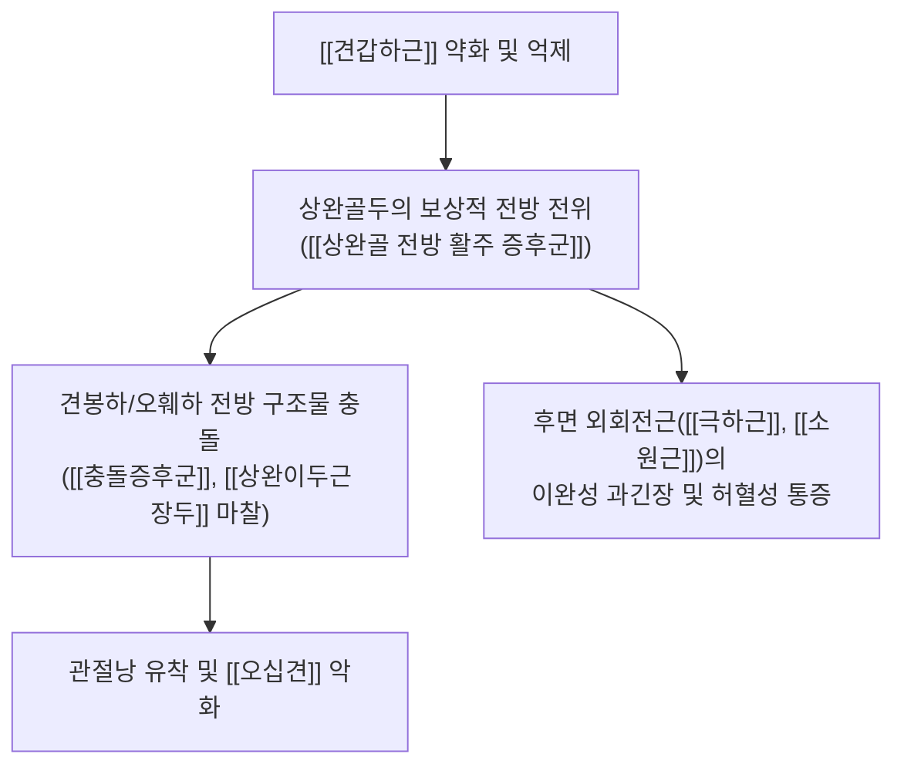
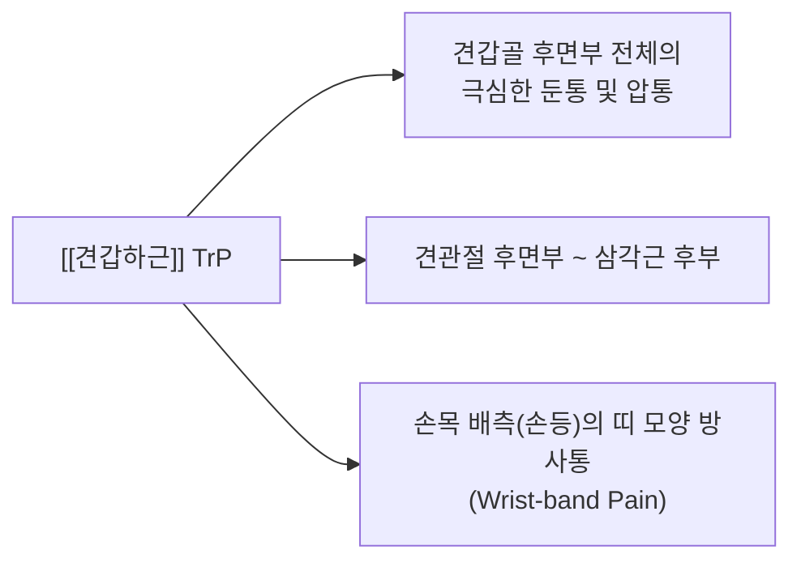

# [[견갑하근]](Subscapularis)

> **핵심 요약 (Key Summary)**:
> [[회전근개]] 중 유일하게 견갑골 전면에 위치하여 상완골두를 후하방으로 당겨 관절와에 중심화(Centration)시키는 핵심 안정화 근육입니다.
> [[상견갑하신경]] 및 [[하견갑하신경]](C5-C7)의 지배를 받으며, 상완골의 가장 강력한 내전·내회전 토크를 발생시키고 상완골두 전방 탈구 및 [[상완골 전방 활주 증후군]]을 능동적으로 차단합니다.
> 기능 부전 시 [[오십견]]([[유착성 관절낭염]]), [[견관절 충돌증후군]], [[상완이두근 장두 건초염]]을 유발하며, 특수 검사(Belly-Press, Bear-Hug, Lift-Off) 및 후방 자침/도침, MET 추나와 배꼽 누르기 운동이 핵심 치료점입니다.

---
## 📌 목차
1. [해부학적 정밀 구조 및 지배 신경/혈관](#1-해부학적-정밀-구조-및-지배-신경혈관)
2. [생체역학·토크 분석 & 근막 사슬 (Fascial Chains)](#2-생체역학토크-분석--근막-사슬-fascial-chains)
3. [근막통증증후군(TP) & 연관통 패턴 (Travell & Simons)](#3-근막통증증후군tp--연관통-패턴-travell--simons)
4. [초음파 해부학(Sonoanatomy) 및 중재 시술 랜드마크](#4-초음파-해부학sonoanatomy-및-중재-시술-랜드마크)
5. [관련 임상 질환 및 운동손상 증후군 총괄](#5-관련-임상-질환-및-운동손상-증후군-총괄)
6. [추나·도수치료(MET/PIR) & 침구·도침·재활 운동 프로토콜](#6-추나도수치료metpir--침구도침재활-운동-프로토콜)
7. [출처 및 학술 참고 문헌 (References)](#7-출처-및-학술-참고-문헌-references)

---
## 1. 해부학적 정밀 구조 및 지배 신경/혈관

| 항목 | 상세 내용 |
| :--- | :--- |
| **기시 (Origin)** | 견갑골 늑골면(전면)의 [[견갑하와]](Subscapular fossa) 내측 2/3 및 하각 부위 건막 능선 |
| **정지 (Insertion)** | 상완골 [[소결절]](Lesser tubercle) 및 관절낭 전면, 결절간구(Bicipital groove) 내측능 |
| **신경 지배** | [[상견갑하신경]](Upper subscapular N., C5-C6) 및 [[하견갑하신경]](Lower subscapular N., C5-C6) |
| **혈관 공급** | [[견갑하자동맥]](Subscapular A.), [[액와동맥]](Axillary A.)의 분지, [[전상완회선동맥]](Anterior humeral circumflex A.) |
| **해부학적 특징** | • 다우상근(Multipennate) 구조로 강력한 힘 생성에 최적화 • 상부 건성 섬유(소결절 상부 부착)와 하부 근육성 섬유(소결절 하부 및 상완골 경부 부착)로 기능 분화 • 건의 상외측 섬유는 [[오훼상완인대]](CHL)와 함께 [[회전근개 간격]](Rotator interval) 및 [[상완이두근 장두]] 활차(Biceps pulley) 구조 형성 |

### 🔬 해부학 도해 및 단면도
![[Pasted image 20240120153356.png|476]]
> [구조적 특징 및 주행]: 견갑골 전면 늑골면과 흉벽 사이의 견갑흉곽관절(Scapulothoracic joint) 심부에 위치하며, 건이 상완골두 전면을 감싸며 소결절에 단단히 정지합니다.

---
## 2. 생체역학·토크 분석 & 근막 사슬 (Fascial Chains)

### (1) 관절 중심화(Centration) 및 짝힘(Force Couple) 메커니즘
* **상완골두 후하방 견인 벡터**: 
  * 팔을 외전(Abduction)하거나 굴곡할 때 삼각근이 상완골두를 상방으로 당기는 전단력(Shearing force)을 발생시킵니다.
  * 이때 [[견갑하근]]은 상완골두를 **후방(Posteriorly) 및 하방(Inferiorly)**으로 강하게 당겨 관절와(Glenoid fossa)의 중심에 안착시키는 핵심 음압/압박력(Joint compression)을 제공합니다.
* **수평면 짝힘 (Transverse Force Couple)**:
  * 전면의 [[견갑하근]]과 후면의 [[극하근]], [[소원근]]이 완벽한 장력 균형을 이루어야 상완골두가 전후방으로 흔들리지 않고 중심축 회전을 유지할 수 있습니다.

### (2) 근막 사슬 연계 (Anatomy Trains)
* **심부 전방 상지선 (Deep Front Arm Line, DFAL)**:
  * [[소흉근]] $\rightarrow$ 쇄흉근막 $\rightarrow$ [[견갑하근]] $\rightarrow$ 상완골 소결절 $\rightarrow$ 상완이두근 장두 건 $\rightarrow$ 요골 골막으로 이어지는 근막 라인의 핵심 정거장입니다.
  * 컴퓨터 작업, 벤치프레스, 스마트폰 사용 등 라운드 숄더 자세에서 이 라인이 단축되면 견갑골 전방경사(Anterior tilt)와 상완골 내회전이 고착화됩니다.

---
## 3. 근막통증증후군(TP) & 연관통 패턴 (Travell & Simons)

### 📍 발통점(TP) 위치 및 임상 방사통 특징
1. **견갑골 외측연/상부 발통점 (TP 1)**:
   * **방사통**: 견갑골 후면부 전체에 걸쳐 깊고 묵직한 통증을 방사하며, 견관절 후면 및 상완 후면으로 퍼집니다.
   * **특징적 원격 연관통**: **손목 배측(손등 쪽 손목)에 시계 밴드를 찬 것처럼 띠 모양의 통증(Wrist-band pattern)**을 유발하여 손목 건초염으로 오진되기 쉽습니다.
2. **견갑골 하각 부위 발통점 (TP 2)**:
   * **방사통**: 견갑골 하각 주변 및 상완 전면부로 연관통을 방사합니다.
3. **가동범위 제한 (ROM Restriction)**:
   * **외회전(External Rotation)의 현저한 제한**: 팔을 바깥으로 벌리는 동작이 심하게 제한되며, 외회전 시 어깨 앞쪽에서 날카로운 통증이 발생합니다.
   * **수평 외전(Horizontal Abduction) 제한**: 가슴을 펴는 동작 시 견갑골 전면의 조임과 통증이 유발됩니다.

---
## 4. 초음파 해부학(Sonoanatomy) 및 중재 시술 랜드마크

### (1) 표준 초음파 스캔 뷰
* **환자 자세**: 팔꿈치를 90° 굴곡하고 전완을 회외(Supination)시킨 상태에서 상완골을 **수동 외회전(External Rotation)**시켜 소결절에 부착된 견갑하근 건을 전방으로 노출시킵니다.
* **장축 스캔 (Long-axis View)**:
  * 프로브를 횡축(수평)으로 위치시키면 오훼돌기 외측에서 상완골 소결절로 주행하는 부채꼴 모양의 견갑하근 건 섬유 다발(Fibrillar pattern)을 관찰할 수 있습니다.
* **단축 스캔 (Short-axis View)**:
  * 프로브를 수직으로 회전하여 상하 건 섬유의 두께와 결절간구(Bicipital groove) 내 [[상완이두근 장두 건]]과의 경계를 확인합니다.

### (2) 침도/약침/주사 시술 시 안전 마진 (Safety Margin)
* ⚠️ **액와신경 및 혈관 손상 방지**:
  * 오훼돌기 내측으로 너무 깊게 자침하면 상완신경총(Brachial plexus) 및 액와동정맥 손상 위험이 있으므로, 반드시 **오훼돌기 외측 1~1.5cm 지점**을 촉지하고 소결절 골면을 타깃으로 진입합니다.
* ⚠️ **기흉(Pneumothorax) 방지 안전각도**:
  * 견갑하근 체부(Belly)에 접근할 때는 늑골 방향으로 직자하지 않고, 견갑골 전면 골면을 스치듯이(Bone contact) 바늘을 평행하게 유도합니다.

---
## 5. 관련 임상 질환 및 운동손상 증후군 총괄

| 임상 질환 / 증후군 | 병리적 연관 기전 | 주요 증상 및 이학적 검사 | 핵심 교정 타깃 |
| :--- | :--- | :--- | :--- |
| [[상완골 전방 활주 증후군]] | 견갑하근의 후방 견인력 상실로 대흉근/광배근이 상완골두를 전방으로 밀어냄 | 수평 외전이나 신전 시 어깨 전면 통증, 수동 후방 밀기 시 통증 소실 | 견갑하근 강화 + 대흉근 이완 |
| [[오십견]]([[유착성 관절낭염]]) | 견갑하근 아래 점액낭 유착 및 하부 관절낭 섬유화 수축 | 모든 방향(특히 외회전, 열중쉬어) 능동/수동 가동범위 전반적 소실 | 견갑하 점액낭 박리 도침 + 관절수기 |
| [[회전근개 파열]](견갑하근 건 파열) | 외상성 과신전/외회전 손상 또는 오훼하 충돌(Subcoracoid impingement) | Belly-Press Test (+) Bear-Hug Test (+) Lift-Off Test (+) | 건 정지부 약침 + 안정화 재활 |
| [[상완이두근 장두 건 탈구]] | 견갑하근 건 상부 섬유(지지띠) 파열로 이두근 장두가 내측으로 이탈 | 팔을 회전할 때 결절간구 부위에서 '뚝'하는 염발음(Popping/Clicking) | 회전근개 간격 안정화 |

---
## 6. 추나·도수치료(MET/PIR) & 침구·도침·재활 운동 프로토콜

### (1) 한의학 경혈 매핑 & 도침 포인트
* **경혈 매핑**: [[견정(肩貞)]], [[천종(天宗)]], [[극천(極泉)]], [[견우(肩髃)]]
* **정지부 도침 박리술**:
  * 소결절 정지부의 만성 건병증 및 유착 부위에 소결절 골면을 확인한 후 건 섬유 주행 방향과 평행하게 유착을 절개 박리합니다.

### (2) @후방접근법 (Posterior Approach Needling)
* **자침 기법**:
  * 환자의 팔을 내회전(열중쉬어 자세)시켜 견갑골이 흉벽에서 들리고 벌어지게(Winging 유도) 만듭니다.
  * 견갑골 내측연 하부 틈새로 침을 진입시켜 **견갑골 전면(늑골면)과 흉벽 사이 공간을 따라 상완골두 방향으로 45~60° 사자(Oblique insertion)**합니다.

![[Pasted image 20240120153446.png|445]]
> [후방접근법 모식도]: 견갑골 내회전으로 내측연을 거상시킨 후 견갑골 전면을 따라 안전하게 자침하는 경로.

### (3) 견갑하근 수기요법 및 MET (근에너지기법)
![[견갑하근-20240914220001061.png]]
* **앙와위(Supine) 촉진 및 허혈성 압박**:
  * 환자의 팔을 90° 외전시킨 후 시술자의 엄지손가락으로 액와와(Axillary fossa) 후벽을 타고 견갑골 전면 깊숙이 진입하여 견갑하근 근복을 직접 압박합니다.
* **PIR 스트레칭 (Post-Isometric Relaxation)**:
  1. 환자의 팔을 견관절 외회전 제한 장벽(Barrier)까지 부드럽게 위치시킵니다.
  2. 환자에게 "손을 배 쪽으로 돌리며 20% 힘으로 가볍게 내회전하세요"라고 지시하며 5~7초간 등척성 저항을 줍니다.
  3. 환자가 숨을 내쉬며 완전히 이완할 때 새로운 외회전 가동범위로 부드럽게 신장합니다.

### (4) @견갑하근 강화 운동 (Rehabilitation)
* **배꼽 누르기 운동 (Belly-Press Exercise)**:
  * 손바닥을 배꼽 위에 얹고 팔꿈치를 몸 앞쪽으로 유지한 상태에서 배꼽을 손바닥으로 꾹 누르며 5초간 유지합니다 ([[대흉근]]의 과도한 보상을 막기 위해 팔꿈치가 뒤로 빠지지 않도록 큐잉).
* **밴드 내회전 등척성/원심성 운동 (Theraband Internal Rotation)**:
  * 팔꿈치와 몸통 사이에 수건을 끼우고(상완골 내전 유지) 0°~45° 내회전 구간에서 부드럽게 운동을 수행합니다.

---
## 7. 출처 및 학술 참고 문헌 (References)

1. **Travell, J. G., & Simons, D. G. (1998)**. *Myofascial Pain and Dysfunction: The Trigger Point Manual*, Vol. 1 (2nd ed.). Williams & Wilkins.
   - **[연구 요약]**: 견갑하근 TrP가 유발하는 손목 배측 띠 모양 연관통(Wrist-band pain) 및 견관절 외회전 가동범위 제한 기전 규명.
2. **Sahrmann, S. (2002)**. *Diagnosis and Treatment of Movement Impairment Syndromes*. Mosby.
   - **[연구 요약]**: 견갑하근 약화 시 대흉근/광배근 우세로 인한 상완골 전방 활주 증후군(Humeral Anterior Glide)의 병태생리 및 교정 원리 수록.
3. **Arai, R., et al. (2008)**. *Anatomy of the subscapularis tendon: A study with special reference to the insertion site and the function of each part*. **Arthroscopy**, 24(10), 1140-1147.
   - **[연구 요약]**: 견갑하근 건이 상부 건성 정지부와 하부 근육성 정지부로 분화되어 상완골두를 동적으로 안정화시키는 미세해부학적 구조 증명.
4. **StatPearls (2023)**. *Subscapularis Tendon Tear and Examination Protocols*.
   - **[임상 가이드]**: Belly-Press, Lift-Off, Bear-Hug 검사의 민감도/특이도 비교 및 초음파하 소결절 접근 랜드마크 가이드라인.