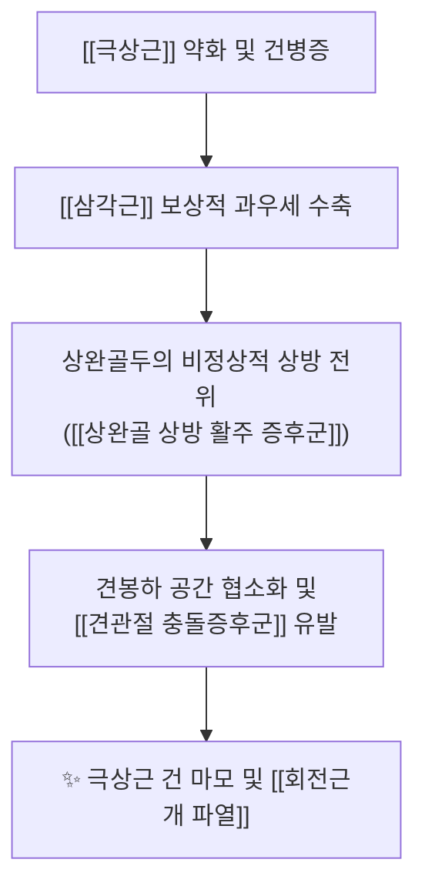
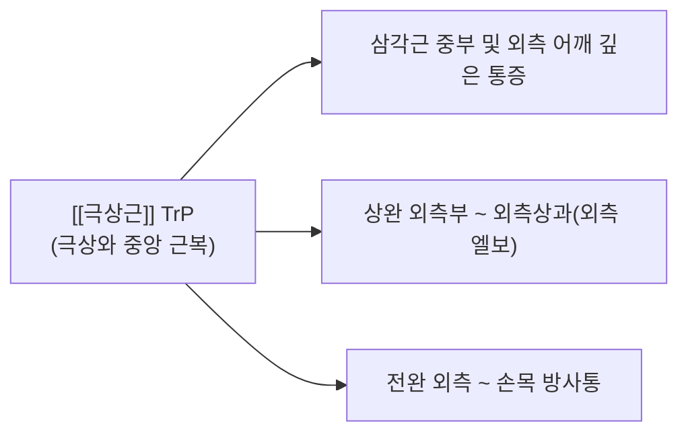

# [[극상근]](Supraspinatus)

> **핵심 요약 (Key Summary)**:
> [[회전근개]] 중 가장 상방에 위치하여 견봉하 공간을 수평 관통하며 상완골두를 관절와에 강력하게 압박·밀착시키는 핵심 수직 안정화 근육입니다.
> [[견갑상신경]](C5-C6)의 지배를 받으며, 어깨 외전 초기 0°~15°를 주동 개시하고 [[삼각근]] 과우세 시 상완골두 상방 전위를 억제합니다.
> [[견관절 충돌증후군]] 및 [[극상근건 파열]] 호발 1위 부위로, [[Empty-Can Test]], 초음파 Modified Crass 뷰, 곡원·견외수 약침 및 하방 글라이딩 추나가 핵심입니다.

---
## 📌 목차
1. [해부학적 정밀 구조 및 지배 신경/혈관](#1-해부학적-정밀-구조-및-지배-신경혈관)
2. [생체역학·토크 분석 & 근막 사슬 (Biomechanical Synergy)](#2-생체역학토크-분석--근막-사슬-biomechanical-synergy)
3. [근막통증증후군(TP) & 연관통 패턴 (Travell & Simons)](#3-근막통증증후군tp--연관통-패턴-travell--simons)
4. [초음파 해부학(Sonoanatomy) 및 중재 시술 랜드마크](#4-초음파-해부학sonoanatomy-및-중재-시술-랜드마크)
5. [⭐ 원장님 심층 임상 고찰 및 원본 필기 (Clinical Pearls)](#5-원장님-심층-임상-고찰-및-원본-필기-clinical-pearls)
6. [관련 임상 질환 및 운동손상 증후군 총괄](#6-관련-임상-질환-및-운동손상-증후군-총괄)
7. [추나·도수치료(MET/PIR) & 침구·약침·재활 프로토콜](#7-추나도수치료metpir--침구약침재활-프로토콜)
8. [출처 및 학술 참고 문헌 (References)](#8-출처-및-학술-참고-문헌-references)

---
## 1. 해부학적 정밀 구조 및 지배 신경/혈관

| 항목 | 상세 내용 |
| :--- | :--- |
| **기시 (Origin)** | 견갑골 후면의 극상와(Supraspinous fossa) 내측 2/3 및 극상근막 |
| **정지 (Insertion)** | 상완골 대결절(Greater tubercle)의 최상단면(Superior facet) 및 견관절낭 상부 |
| **신경 지배** | [[견갑상신경]](Suprascapular N., C5-C6) - 견갑절흔(Suprascapular notch)과 상견갑횡인대 하부 통과 |
| **혈관 공급** | [[견갑상동맥]](Suprascapular A.) 및 [[견갑배동맥]](Dorsal scapular A.) 분지 |
| **해부학적 특징** | 건 정지부 근위 1cm 지점에 무혈관성 위험 구역([[Critical Zone]]) 존재 (허혈성 퇴행 및 건 파열 최다 호발 부위) 견봉(Acromion), 오훼견봉인대(CAL), 견봉하 점액낭(SAD) 바로 아래를 통과하는 터널 구조 |

### 🔬 해부학 도해 및 단면도

![[Supraspinatus_anatomy.png|450]]
> [Wikimedia Commons / BodyParts3D 공중도메인]: 극상와(Supraspinous fossa)에서 기시하여 견봉하 공간을 관통하는 [[극상근]]의 후면 해부학 도해.

![[Pasted image 20240120153125.png|450]]
> [구조적 특징 및 주행]: 극상와에서 시작하여 견봉하 공간(Subacromial space)을 수평으로 관통한 후 대결절 상면에 부착되며, 상완골두를 위에서 누르는 지붕 역할을 수행합니다.

---
## 2. 생체역학·토크 분석 & 근막 사슬 (Biomechanical Synergy)

### (1) 상완골두 하방 압박 및 삼각근과의 짝힘 (Force Couple)
* **외전 시 짝힘 메커니즘**:
  * [[삼각근]](Deltoid)은 위쪽으로 당기는 상방 전단력(Upward shear)을 발생시켜 상완골두를 견봉에 부딪히게 만듭니다.
  * [[극상근]]은 상완골두를 관절와 안쪽으로 강력하게 밀착시키면서 **하방 및 내측(Inferior/Medial)**으로 당겨 회전 중심(Instant Center of Rotation)을 안정화합니다.
* **외전 0°~15° 개시 토크**:
  * 외전 초기 15도 구간에서는 삼각근의 모멘트 암이 거의 0에 가깝기 때문에 극상근이 주동적으로 외전을 개시합니다.
  * 15도 이후에는 삼각근이 주동근이 되며, 극상근은 '관절와 중심화 지지체(Centration stabilizer)'로 전환됩니다.

### (2) 자세 및 견갑골 운동형상학 연계
* [[라운드 숄더]] & [[거북목 증후군]]의 악영향:
  * 견갑골이 하방회전(Downward rotation) 및 전방경사(Anterior tilt)되면 견봉 전외측이 하강하여 견봉하 공간이 좁아집니다.
  * 이 상태에서 팔을 외전하면 극상근 건이 견봉 전하방에 직접 끼이며 급성/만성 건염이 발생합니다.

---
## 3. 근막통증증후군(TP) & 연관통 패턴 (Travell & Simons)

### 📍 발통점(TP) 및 임상 방사통 특징

![[Supraspinatus_TriggerPoints.jpg|450]]
> [Travell & Simons 발통점 도해]: [[극상근]] 근복의 TrP와 외측 삼각근, 상완 외측부, 외측상과로 뻗어나가는 방사통 분포.

* **발통점 위치**: 견갑극 상부 극상와 중앙 근복부 (곡원혈, 견외수혈 부근).
* **연관통 패턴**:
  * [[삼각근]] 부위(어깨 외측)에 깊고 뻐근한 통증을 가장 흔하게 방사합니다.
  * 상완 외측부를 타고 내려가 **외측상과(Tennis elbow 부위) 및 전완 요측**까지 방사되므로 테니스 엘보로 오진되기 쉽습니다.
* **증상 특징**:
  * **야간통(Night pain)**: 이환된 쪽으로 누워 잘 때 극심한 통증 유발.
  * 무거운 물건을 들고 팔을 아래로 늘어뜨리고 있을 때 팔 무게로 인한 지속 장력으로 통증 악화.

---
## 4. 초음파 해부학(Sonoanatomy) 및 중재 시술 랜드마크

### (1) 표준 초음파 스캔 뷰 (Modified Crass View)
* **환자 자세 (Modified Crass)**: 이환된 쪽 손을 뒤로 돌려 동측 후주머니(또는 장골능 후부)에 얹고 팔꿈치를 전방으로 향하게 하여 극상근 건을 견봉 밖으로 최대한 노출시킵니다.
* **장축 뷰 (Long-axis View)**:
  * 대결절 상면의 독수리 부리 모양 골면(Beak sign) 위를 덮고 있는 **새 부리 모양의 균일한 고에코 섬유 다발(Tendon footprint)**을 관찰합니다.
  * 건 상방의 얇은 무에코 선인 견봉하 점액낭(SAD)과 삼각근 근육층을 순차적으로 확인합니다.
* **단축 뷰 (Short-axis View)**:
  * 프로브를 90° 회전하여 상완이두근 장두 건 바로 외측에서부터 [[극하근]] 건과의 경계(Rotator cable)까지 연속성을 스캔합니다.

### (2) 초음파 유도하 약침/주사 안전 마진
* ⚠️ **견봉하 점액낭(SAD) 및 건초 주입**:
  * 극상근 건 실질 내 직접 자침(Intratendinous)은 건 섬유 손상 및 파열 위험을 높이므로, 초음파로 확인하며 **건 외막(Peritendon) 또는 견봉하 점액낭 내 공간**으로 약침액을 정밀 주입합니다.

---
## 5. ⭐ 원장님 심층 임상 고찰 및 원본 필기 (Clinical Pearls)

### (1) Critical Zone(무혈관 구역) 허혈과 건 파열 감별 팁
* **호발 부위의 병태생리**:
  * 상완골 대결절 부착부 직전 1cm 지점은 전상완회선동맥과 견갑상동맥의 말초 혈류가 만나는 문합 부위이나, 팔을 내리고 있을 때 상완골두의 압박으로 인해 상시 허혈 상태에 놓입니다.
  * 환자가 "밤에 어깨가 빠개질 듯이 욱신거려 잠을 깰 정도"라면 단순 근육통이 아니라 Critical Zone의 급성 염증 또는 파열을 반드시 의심해야 합니다.

### (2) Neer / Hawkins vs Empty-Can / Full-Can 임상 감별 프로토콜
* **견봉하 충돌 vs 실질 건 파열의 구분**:
  * [[Neer Test]]와 [[Hawkins-Kennedy Test]]는 견봉하 공간의 물리적 마찰과 충돌 여부를 감별하는 검사입니다.
  * [[Empty-Can Test]](Jobe 검사)와 [[Full-Can Test]]는 극상근 자체의 건 섬유 연속성 및 수축력을 평가합니다.
  * 충돌 검사에서 양성이 나오더라도 Empty-Can 검사에서 근력이 온전히 유지된다면 보존적 한의 치료(약침·침도·추나)로 90% 이상 호전됩니다.

### (3) 삼각근 보상 작용 차단 및 거북목·라운드숄더 연계 치료
* **으쓱임(Shrug Sign) 보상 패턴 차단**:
  * 극상근이 약화된 환자는 팔을 옆으로 들 때 어깨를 으쓱하며 [[상부승모근]]과 [[삼각근]]으로 팔을 들어 올립니다.
  * 이 보상 동작을 차단하지 않고 외전 운동을 시키면 견봉 충돌이 가속화되므로, 반드시 견갑골을 하강 안정화시킨 상태에서 운동을 지도해야 합니다.

### (4) 견갑상신경 절흔(Suprascapular Notch)에서의 신경 포착 감별
* 어깨 외측 통증과 함께 극상와 및 극하와의 뚜렷한 근위축이 관찰될 경우, 상견갑횡인대 비후나 신경절낭종(Ganglion cyst)에 의한 [[견갑상신경 포착 증후군]]을 감별하고 견갑절흔 부위 침도 치료를 우선 고려해야 합니다.

---
## 6. 관련 임상 질환 및 운동손상 증후군 총괄

| 임상 질환 / 증후군 | 병리적 연관 기전 | 주요 증상 및 이학적 검사 | 핵심 교정 타깃 |
| :--- | :--- | :--- | :--- |
| [[견관절 충돌증후군]] | 견봉하 공간 협소화 및 극상근 건/점액낭 마찰 | [[Neer Test]] (+) [[Hawkins-Kennedy Test]] (+) [[Painful Arc]] (60°~120° 통증호) | 견봉하 공간 확보 + 견갑골 상방회전 회복 |
| [[극상근건 파열]] | Critical Zone 허혈성 퇴행 및 반복적 견봉 충돌 | [[Empty-Can Test]] (+) [[Full-Can Test]] (+) [[Drop Arm Sign]] (+) | 건 정지부 약침 + 관절와 중심화 재활 |
| [[상완골 상방 활주 증후군]] | 극상근 약화로 삼각근이 상완골두를 위로 끌어올림 | 외전 30°~90° 구간에서 찝히는 통증, 상완골두 상방 돌출 | 극상근 활성화 + 삼각근 과긴장 이완 |
| [[견갑상신경 포착 증후군]] | 상견갑횡인대 비후 또는 신경절낭종(Ganglion) 압박 | 극상와/극하와 근위축, 어깨 후외측 둔통 및 외전력 저하 | 견갑절흔 침도 박리 및 횡인대 이완 |

---
## 7. 추나·도수치료(MET/PIR) & 침구·약침·재활 프로토콜

### (1) 한의학 경혈 매핑 & 자침 포인트
* **경혈 매핑**: 곡원(曲垣), 견외수(肩外兪), 병풍(秉風), 견우(肩髃)
* **극상와 자침법**:
  * 견갑극 상부 극상와 골면을 향해 바늘을 직자/약간 사자하여 골막을 가볍게 터치(Bone contact)하며 근복의 TrP를 해소합니다 (전방 늑골 방향으로 깊이 찌르지 않아 기흉 위험 없음).

### (2) 추나 관절 가동 및 MET (근에너지기법)
* **상완골두 하방 글라이딩 (Inferior Gliding Mobilization)**:
  * 환자를 앙와위로 눕히고 시술자가 상완골두 근위부를 파지한 후, 외전 각도를 주면서 발 쪽(하방)으로 부드럽게 글라이딩하여 견봉하 공간을 물리적으로 확장합니다.
* **PIR 가동화 스트레칭**:
  1. 환자의 팔을 내전 및 신전(뒤짐 자세)시켜 극상근의 제한 장벽에 놓습니다.
  2. 환자에게 "20% 힘으로 팔을 가볍게 벌리세요(외전 저항)"라고 지시하며 5초간 등척성 수축을 유도합니다.
  3. 호기 시 새로운 이완 장벽으로 부드럽게 유도합니다.

### (3) 재활 운동 & 보상 패턴 차단
* **Full-Can 운동 (외전 30° 견갑골면 스캡션)**:
  * 엄지를 위로 향하게 한 상태(Full-can)에서 견갑골면(Scapular plane, 전방 30°)을 따라 30°~60°까지만 들어 올려 극상근을 선택적으로 강화합니다 (Empty-can은 충돌 위험이 있으므로 재활 초기 금기).
* **견갑골 상방회전 협응 강화**:
  * [[전거근]]과 [[하부승모근]] 강화 훈련을 병행하여 팔을 들 때 견갑골이 충분히 상방회전되도록 유도합니다.

---
## 8. 출처 및 학술 참고 문헌 (References)

1. **Neer, C. S. (1983)**. *Impingement lesions*. **Clinical Orthopaedics and Related Research**, (173), 70-77.
   - **[연구 요약]**: 견봉하 충돌증후군의 3단계 병기 분류 및 극상근 건 파열로 이어지는 병태생리 정립.
2. **Jobe, F. W., & Moynes, D. R. (1982)**. *Delineation of diagnostic criteria and a rehabilitation program for rotator cuff injuries*. **The American Journal of Sports Medicine**, 10(6), 336-339.
   - **[연구 요약]**: 극상근 건 손상 진단을 위한 Jobe Test(Empty-Can Test)의 생체역학적 원리 및 진단 정확도 증명.
3. **Sahrmann, S. (2002)**. *Diagnosis and Treatment of Movement Impairment Syndromes*. Mosby.
   - **[연구 요약]**: 극상근 약화 시 삼각근 과우세로 발생하는 상완골 상방 활주(Humeral Superior Glide) 증후군 메커니즘 수록.
4. **Travell, J. G., & Simons, D. G. (1999)**. *Myofascial Pain and Dysfunction: The Trigger Point Manual*, Vol. 1 (2nd ed.). Williams & Wilkins.
   - **[연구 요약]**: 극상근 발통점이 삼각근 외측 및 상완/전완 요측으로 방사되는 연관통 패턴 규명.
5. **StatPearls (2023)**. *Anatomy, Shoulder and Upper Limb, Supraspinatus Muscle*.
   - **[임상 가이드]**: 견갑상신경 주행, Critical Zone 무혈관 구역 및 초음파 Modified Crass 스캔 랜드마크.
