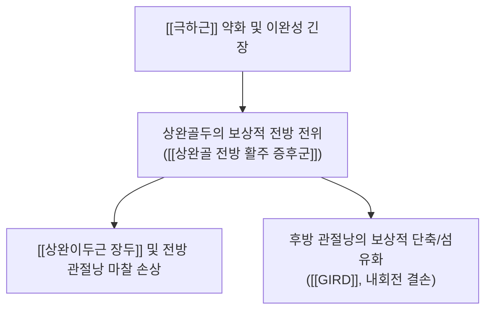
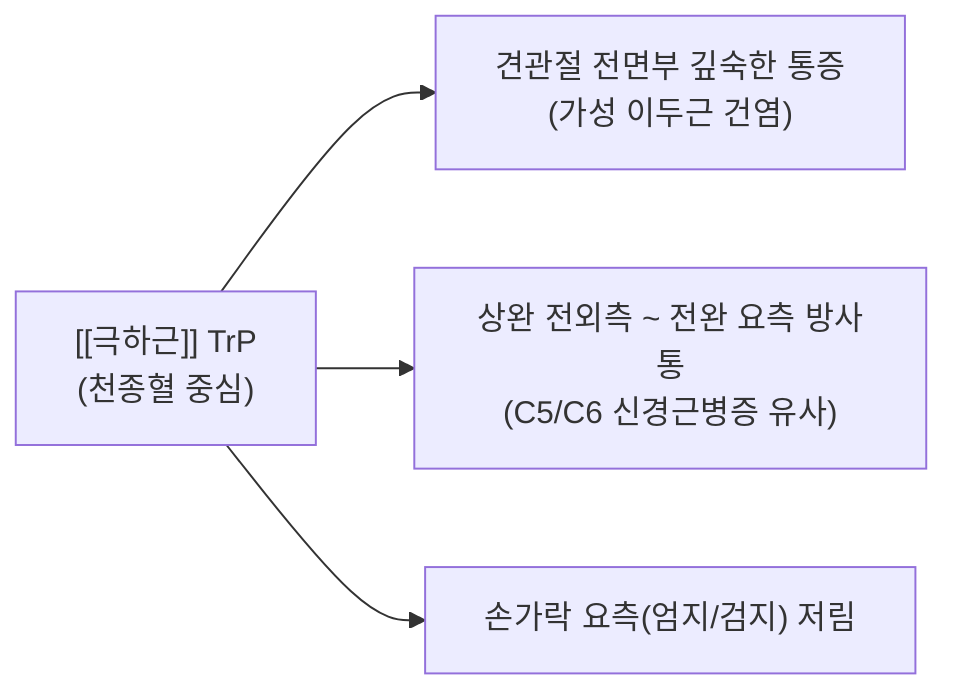

# [[극하근]](Infraspinatus)

> **핵심 요약 (Key Summary)**:
> 견갑골 후면 극하와에 위치하여 견관절 외회전 토크의 90% 이상을 담당하며 상완골두의 전방 전위를 제동하는 핵심 후방 안정화 근육입니다.
> [[견갑상신경]](C5-C6)의 지배를 받으며, [[견갑하근]]과의 짝힘 불균형 시 [[상완골 전방 활주 증후군]] 및 후방 관절낭 단축([[GIRD]])을 초래합니다.
> 천종혈 부위 극심한 허혈성 발통점(TP), [[External Rotation Lag Sign]], 초음파 후방와순 스캔 및 습부항·도침·MET 후방 관절낭 이완술이 핵심 치료점입니다.

---
## 📌 목차
1. [해부학적 정밀 구조 및 지배 신경/혈관](#1-해부학적-정밀-구조-및-지배-신경혈관)
2. [생체역학·토크 분석 & 근막 사슬 (Biomechanical Synergy)](#2-생체역학토크-분석--근막-사슬-biomechanical-synergy)
3. [근막통증증후군(TP) & 연관통 패턴 (Travell & Simons)](#3-근막통증증후군tp--연관통-패턴-travell--simons)
4. [초음파 해부학(Sonoanatomy) 및 중재 시술 랜드마크](#4-초음파-해부학sonoanatomy-및-중재-시술-랜드마크)
5. [⭐ 원장님 심층 임상 고찰 및 원본 필기 (Clinical Pearls)](#5-원장님-심층-임상-고찰-및-원본-필기-clinical-pearls)
6. [관련 임상 질환 및 운동손상 증후군 총괄](#6-관련-임상-질환-및-운동손상-증후군-총괄)
7. [추나·도수치료(MET/PIR) & 침구·약침·재활 프로토콜](#7-추나도수치료metpir--침구약침재활-프로토콜)
8. [출처 및 학술 참고 문헌 (References)](#8-출처-및-학술-참고-문헌-references)

---
## 1. 해부학적 정밀 구조 및 지배 신경/혈관

| 항목 | 상세 내용 |
| :--- | :--- |
| **기시 (Origin)** | 견갑골 후면의 극하와(Infraspinous fossa) 내측 2/3 및 극하근막 |
| **정지 (Insertion)** | 상완골 대결절(Greater tubercle)의 중간면(Middle facet) 및 후방 관절낭 |
| **신경 지배** | [[견갑상신경]](Suprascapular N., C5-C6) - 대견갑절흔(Spinoglenoid notch)을 지나 진입 |
| **혈관 공급** | [[견갑상동맥]](Suprascapular A.) 및 [[견갑회선동맥]](Circumflex scapular A.) |
| **해부학적 특징** | 두꺼운 삼각형 근육으로 상부 횡주 섬유와 하부 사주 섬유로 구성 건이 견관절 후방 관절낭과 유착되어 있어 수축 시 후방 관절낭이 관절면에 찝히는 것을 방지 |

### 🔬 해부학 도해 및 단면도

![[Infraspinatus_anatomy.png|450]]
> [Wikimedia Commons / BodyParts3D 공중도메인]: 견갑골 후면 극하와 전체를 덮고 대결절 중간면으로 수평 주행하는 [[극하근]]의 정밀 해부도.

![[극하근-1753858914255.png|450]]
> [구조적 특징 및 주행]: 견갑극 하부 전체를 덮고 대결절 중간면으로 수평 주행하며, 후방 관절낭을 직접 보강합니다.

---
## 2. 생체역학·토크 분석 & 근막 사슬 (Biomechanical Synergy)

### (1) 외회전 토크 및 관절와 중심화 (Centration)
* **상완골두 후방 견인력**:
  * 팔을 앞으로 뻗거나 들어 올릴 때 상완골두가 전방으로 밀려나가지 않도록 뒤쪽에서 강력하게 잡아당겨 중심화시킵니다.
* **수평면 짝힘 (Transverse Force Couple)**:
  * 전면의 [[견갑하근]]과 완벽한 장력 균형을 이루어야 상완골두가 전후방으로 흔들리지 않습니다.

### (2) 던지기 동작(오버헤드 스포츠)에서의 이심성 감속(Eccentric Deceleration)
* 야구 투수나 배드민턴 스매싱 시, 팔이 최고 속도로 내회전된 직후 상완골을 멈추기 위해 극하근이 극심한 **원심성(이심성) 수축 부하**를 받습니다. 이로 인해 만성 미세 손상 및 피로 누적이 가장 흔하게 발생합니다.

---
## 3. 근막통증증후군(TP) & 연관통 패턴 (Travell & Simons)

### 📍 발통점(TP) 및 임상 방사통 특징

![[Infraspinatus_TriggerPoints.jpg|450]]
> [Travell & Simons 발통점 도해]: [[극하근]] TrP가 견관절 전면 관절와 깊은 곳 및 상완 외측, 전완 요측, 손가락으로 뻗어 나가는 방사통 패턴.

* **발통점 위치**: 견갑극 하방 2~3cm 지점, 극하와 중앙부의 천종(天宗)혈 부위.
* **임상적 특징 (가장 기만적인 연관통)**:
  * 통증의 90% 이상을 **어깨 앞쪽(전면 관절와 부위)**에 방사하여 환자는 "어깨 앞이 쑤시고 아프다"고 호소합니다 (실제 원인은 뒤쪽 극하근).
  * 상완 외측과 전완 요측을 타고 내려가 손가락까지 방사되므로 **경추 5~6번 추간판 탈출증(C5-C6 Radiculopathy)으로 자주 오진**됩니다.
* **기능 제한**:
  * 등 뒤로 손을 올리는 동작(지갑 꺼내기, 브래지어 채우기) 시 날카로운 통증 발생.

---
## 4. 초음파 해부학(Sonoanatomy) 및 중재 시술 랜드마크

### (1) 표준 초음파 스캔 뷰 (Posterior Glenohumeral View)
* **환자 자세**: 손을 반대쪽 어깨 위에 얹게 하여 극하근을 이완시킵니다.
* **스캔 랜드마크**:
  * 프로브를 견갑극 하방에서 횡으로 위치시키면 **상완골두 후면, 후방 섬유연골 관절와순(Posterior labrum), 극하근 건**이 삼각 구도로 관찰됩니다.
  * 상완골을 내회전/외회전시키며 극하근 건이 대결절 중간면에 활주하는 모습을 동적으로 확인합니다.

### (2) 초음파하 안전 진입 랜드마크
* ⚠️ **스피노글레노이드 절흔(Spinoglenoid notch) 신경 포착 확인**:
  * 관절와 외측연 부근에 위치한 [[견갑상신경]] 주행 부위에 결절종(Ganglion cyst) 유무를 확인합니다.

---
## 5. ⭐ 원장님 심층 임상 고찰 및 원본 필기 (Clinical Pearls)

### (1) 가장 기만적인 통증 유발자 (The Great Masquerader)
* **어깨 전면 통증의 1차 감별점**:
  * 환자가 "어깨 앞쪽 관절 속이 쑤시고 아프다", "팔뚝 앞쪽이 저리고 쑤신다"고 호소하며 내원했을 때, 어깨 앞쪽(이두근 장두구)을 아무리 눌러도 심한 압통이 없다면 십중팔구 원인은 뒤쪽의 [[극하근]] 발통점입니다.
  * 천종혈을 강하게 압박했을 때 환자가 "선생님, 거기를 누르니까 어깨 앞쪽으로 찌릿하게 통증이 뻗쳐요!"라고 재현 통증(Referred pain reproduction)을 확인하면 확진할 수 있습니다.

### (2) 천종(天宗)혈 사혈 습부항(Wet Cupping)의 즉각적인 통증 소퇴 기전
* 극하근은 장시간 팔을 전방으로 들거나 컴퓨터 작업을 할 때 신장성 과부하(Eccentric overload)와 국소 구획 압력 상승으로 인한 미세순환 장애(허혈)가 가장 심하게 발생하는 근육입니다.
* 천종혈 압통점에 사혈침으로 다자(점자) 후 습부항을 강하게 걸어 울혈을 배출시키면, 허혈성 경축이 즉각 풀리면서 수초 만에 어깨 앞쪽의 뻐근한 통증이 70% 이상 경감되는 드라마틱한 치료 반응을 보입니다.

### (3) GIRD와 후방 관절낭 단축에 대한 추나 교정 노하우
* 야구 선수나 라켓 운동 동호인에게서 내회전 결손([[GIRD]])이 20° 이상 나타날 때, 단순히 관절을 꺾는 방식의 강제 스트레칭은 전방 관절와순 손상을 악화시킵니다.
* 슬리퍼 스트레칭(Sleeper stretch) 시 견갑골을 후방에서 완벽히 고정(Scapular stabilization)한 상태로 PIR(등척성 수축 후 이완)을 적용해야 안전하게 후방 관절낭만 타깃팅할 수 있습니다.

---
## 6. 관련 임상 질환 및 운동손상 증후군 총괄

| 임상 질환 / 증후군 | 병리적 연관 기전 | 주요 증상 및 이학적 검사 | 핵심 교정 타깃 |
| :--- | :--- | :--- | :--- |
| [[후방 관절낭 단축 및 GIRD]] | 극하근 만성 경직 및 후방 관절낭 섬유화 | [[GIRD]](Glenohumeral Internal Rotation Deficit): 내회전 20° 이상 감소 | 슬리퍼 스트레칭 + 후방 관절낭 도침 |
| [[극하근 파열]] | 오버헤드 투구 동작 및 만성 퇴행성 마모 | [[External Rotation Lag Sign]] (+) Infraspinatus Muscle Test (+) | 건 정지부 약침 + 외회전 협응 재활 |
| [[스피노글레노이드 절흔 증후군]] | 대견갑절흔에서 견갑상신경 하부 분지 포착 | 극상근은 정상이나 극하근 단독 위축/약화 | 절흔 부위 침도 감압 박리술 |
| [[상완골 전방 활주 증후군]] | 극하근의 후방 견인 부전으로 상완골두 전방 이탈 | 수평 내전 및 신전 시 전방 찝힘 통증 | 극하근 강화 + [[대흉근]] 이완 |

---
## 7. 추나·도수치료(MET/PIR) & 침구·약침·재활 프로토콜

### (1) 한의학 경혈 매핑 & 습부항 요법
* **경혈 매핑**: 천종(天宗), 노수(臑兪), 견정(肩貞)
* **천종혈 습부항(Wet Cupping) 요법**:
  * 극하근은 장시간 컴퓨터 작업이나 팔 지탱 시 피로 물질(젖산)과 허혈성 긴장이 가장 심하게 축적되는 부위입니다.
  * 천종혈 압통점에 사혈 후 습부항을 시술하여 국소 허혈성 미세순환을 극적으로 개선합니다.

### (2) 추나 관절 가동 & Sleeper Stretch (MET)

![[Pasted image 20240120153226.png|450]]
> [Sleeper Stretch 기반 후방 관절낭 가동화]: 측와위에서 견갑골을 지면에 고정한 후 내회전 저항 수축을 통한 PIR 이완.

* **슬리퍼 스트레칭 (Sleeper Stretch) 기반 MET**:
  1. 환자를 환측이 바닥으로 가도록 측와위(Side-lying)로 눕히고 어깨와 팔꿈치를 90° 굴곡시킵니다.
  2. 반대쪽 손으로 손목을 아래(내회전) 방향으로 부드럽게 눌러 제한 장벽에 놓습니다.
  3. 환자에게 "20% 힘으로 손목을 위로 들어 올리세요(외회전 저항)"라고 지시하며 5초간 등척성 수축을 유도합니다.
  4. 호기 시 손목을 바닥 쪽으로 부드럽게 더 눌러 후방 관절낭을 신장합니다.

### (3) 외회전 밴드 강화 운동
* 팔꿈치를 90° 굴곡하고 수건을 옆구리에 끼운 상태에서 탄력 밴드를 잡고 바깥쪽으로 천천히 회전시켜 극하근과 [[소원근]]을 선택적으로 강화합니다.

---
## 8. 출처 및 학술 참고 문헌 (References)

1. **Travell, J. G., & Simons, D. G. (1998)**. *Myofascial Pain and Dysfunction: The Trigger Point Manual*, Vol. 1 (2nd ed.). Williams & Wilkins.
   - **[연구 요약]**: 극하근 TrP가 어깨 전면 및 상완 외측/손가락으로 유발하는 위장 연관통 패턴 규명.
2. **Burkhart, S. S., Morgan, C. D., & Kibler, W. B. (2003)**. The disabled throwing shoulder: spectrum of pathology. Part I: pathoanatomy and biomechanics. *Arthroscopy*, 19(4), 404-420. [PMID: 12671624](https://pubmed.ncbi.nlm.nih.gov/12671624/)
   - **[연구 요약]**: 오버헤드 투수에서 발생하는 극하근 건병증 및 후방 관절낭 단축(GIRD) 메커니즘 정립.
3. **StatPearls (2023)**. *Anatomy, Shoulder and Upper Limb, Infraspinatus Muscle*.
   - **[임상 가이드]**: 스피노글레노이드 절흔 부위 견갑상신경 포착 및 초음파 후방 횡단면 랜드마크.