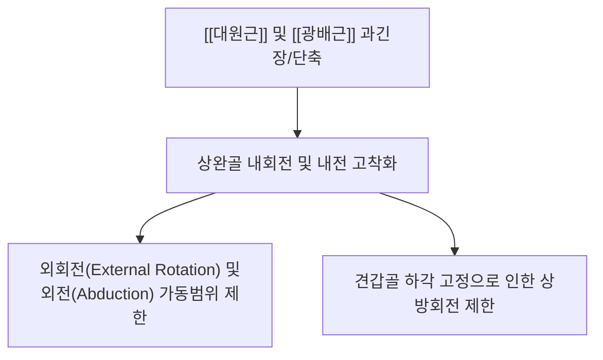
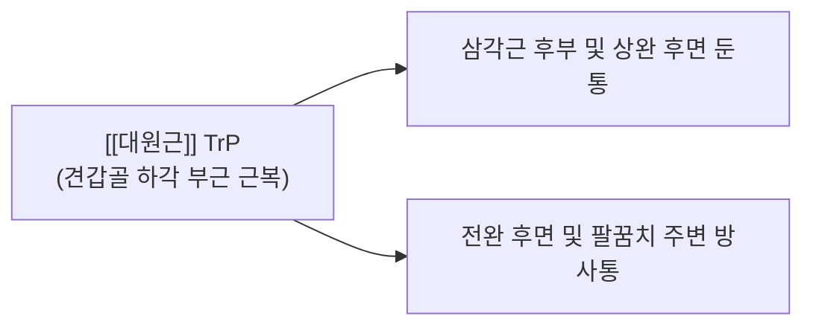

# [[대원근]](Teres Major)

> **핵심 요약 (Key Summary)**:
> 견갑골 하각에서 시작하여 상완골 결절간구 내측순에 정지하며, [[광배근]]의 강력한 동반자(소배근)로서 상완골의 내전·내회전·신전을 담당합니다.
> [[하견갑신경]](C5-C7)의 지배를 받으며, 상부의 [[소원근]] 및 삼두근과 함께 [[사각공간]]과 삼각공간의 하부 경계를 형성합니다.
> 견갑하각 부위 압통, 광배근 과긴장과의 감별(견갑하각 부착 여부) 및 견정(肩貞)혈 자침·추나 MET 상완 외전/외회전 가동화가 핵심 치료 프로토콜입니다.

---
## 📌 목차
1. [해부학적 정밀 구조 및 지배 신경/혈관](#1-해부학적-정밀-구조-및-지배-신경혈관)
2. [생체역학·토크 분석 & 광배근과의 협응 (Biomechanical Synergy)](#2-생체역학토크-분석--광배근과의-협응-biomechanical-synergy)
3. [근막통증증후군(TP) & 연관통 패턴 (Travell & Simons)](#3-근막통증증후군tp--연관통-패턴-travell--simons)
4. [초음파 해부학(Sonoanatomy) 및 중재 시술 랜드마크](#4-초음파-해부학sonoanatomy-및-중재-시술-랜드마크)
5. [관련 임상 질환 및 운동손상 증후군 총괄](#5-관련-임상-질환-및-운동손상-증후군-총괄)
6. [추나·도수치료(MET/PIR) & 침구·약침·재활 프로토콜](#6-추나도수치료metpir--침구약침재활-프로토콜)
7. [출처 및 학술 참고 문헌 (References)](#7-출처-및-학술-참고-문헌-references)

---
## 1. 해부학적 정밀 구조 및 지배 신경/혈관

| 항목 | 상세 내용 |
| :--- | :--- |
| **기시 (Origin)** | 견갑골 [[하각]](Inferior angle) 후면의 타원형 부위 및 외측연 하부 |
| **정지 (Insertion)** | 상완골 [[결절간구 내측순]](Medial lip of intertubercular sulcus) |
| **신경 지배** | [[하견갑신경]](Lower subscapular N., C5-C7) |
| **혈관 공급** | [[견갑하자동맥]](Subscapular A.) 및 [[흉배동맥]](Thoracodorsal A.) |
| **해부학적 경계** | • **사각공간(Quadrilateral space)**의 하부 경계 형성 • **삼각공간(Triangular space)**의 하부 경계 형성 (견갑회선동맥 통과) |

### 🔬 해부학 도해 및 단면도
![[Pasted image 20240120152611.png]]
> [구조적 특징]: 견갑골 하각에서 비스듬히 상외측으로 주행하여 광배근 건 바로 뒤/옆에서 결절간구 내측순에 정지합니다.

---
## 2. 생체역학·토크 분석 & 광배근과의 협응 (Biomechanical Synergy)

### (1) '소배근(Little Helper of Latissimus Dorsi)' 역할
* **파워풀한 내전 및 내회전**:
  * 대원근은 짧고 두꺼운 지레 구조를 가져 광배근과 함께 상완골을 강력하게 몸통 쪽으로 끌어당기고(내전) 안쪽으로 돌립니다(내회전).
  * 수영(자유형/접영의 풀 동작), 클라이밍, 턱걸이(풀업) 동작에서 핵심 파워를 발휘합니다.
* **광배근(Latissimus Dorsi)과의 감별 포인트 (원장님 임상 팁)**:
  * **광배근**: 흉요근막/장골능에서 시작하여 견갑골 하각 '아래'를 스치듯 지나 상완골로 주행.
  * **대원근**: 견갑골 하각 '자체'에 단단히 부착되어 상완골로 주행.

---
## 3. 근막통증증후군(TP) & 연관통 패턴 (Travell & Simons)

### 📍 발통점(TP) 위치 및 임상 방사통 특징
* **발통점 위치**: 견갑골 하각 상외측 2~3cm 부근의 대원근 근복 (견정혈 외하방).
* **연관통 패턴**:
  * 삼각근 후부 깊은 곳과 상완 후면에 뻐근하고 쑤시는 통증을 방사합니다.
  * 팔을 머리 위로 외전하거나 등 뒤로 외회전할 때 견갑골 하각 주변에서 심한 당김 통증이 유발됩니다.

---
## 4. 초음파 해부학(Sonoanatomy) 및 중재 시술 랜드마크

### (1) 표준 초음파 스캔 뷰 (Posterior Axillary View)
* **스캔 랜드마크**:
  * 액와 후벽에서 프로브를 위치시키면 두꺼운 대원근 근복과 그 표층을 감싸는 광배근 건을 구분할 수 있습니다.
  * 대원근 상연에서 삼각공간을 통과하는 견갑회선동맥(Circumflex scapular A.)의 도플러 신호를 확인합니다.

---
## 5. 관련 임상 질환 및 운동손상 증후군 총괄

| 임상 질환 / 증후군 | 병리적 연관 기전 | 주요 증상 및 이학적 검사 | 핵심 교정 타깃 |
| :--- | :--- | :--- | :--- |
| [[대원근-광배근 과긴장 증후군]] | 풀업/로우 등 당기기 운동 과사용으로 인한 단축 | 팔을 180° 끝까지 올리지 못함, 외회전 시 당김 | 대원근 침도 박리 + MET 외전 스트레칭 |
| [[견갑골 고정성 결손]] | 대원근 약화 시 견갑골 하각 지지력 저하 | 팔 내전 시 견갑골 하각의 비정상적 들림 | 대원근 협응 강화 |

---
## 6. 추나·도수치료(MET/PIR) & 침구·약침·재활 프로토콜

### (1) 한의학 경혈 매핑 & 치료점
* **경혈 매핑**: [[견정(肩貞)]], [[천종(天宗)]]
* **견정(肩貞)혈 치료점 (원장님 팁)**:
  * 액와 후벽 주름 상방 1촌 지점의 견정혈은 소원근과 대원근, 광배근이 교차하는 핵심 혈자리로 약침 및 도침 치료의 핵심 포인트입니다.

### (2) 대원근 MET (근에너지기법)
* **외전/외회전 가동화**:
  1. 환자의 팔을 120° 이상 굴곡/외전 및 외회전시켜 대원근의 제한 장벽에 놓습니다.
  2. 환자에게 "20% 힘으로 팔을 아래로 끌어당기며 안쪽으로 돌리세요(내전/내회전 저항)"라고 지시하며 5초간 등척성 수축을 유도합니다.
  3. 호기 시 팔을 위로 더 부드럽게 밀어올려 대원근을 완전히 신장합니다.

---
## 7. 출처 및 학술 참고 문헌 (References)

1. **Travell, J. G., & Simons, D. G. (1998)**. *Myofascial Pain and Dysfunction: The Trigger Point Manual*, Vol. 1 (2nd ed.). Williams & Wilkins.
   - **[연구 요약]**: 대원근 TrP의 삼각근 후부 및 상완 후면 방사통 양상 규명.
2. **StatPearls (2023)**. *Anatomy, Shoulder and Upper Limb, Teres Major Muscle*.
   - **[임상 가이드]**: 하견갑신경 주행, 사각공간/삼각공간 해부학적 경계 및 임상적 중요성.