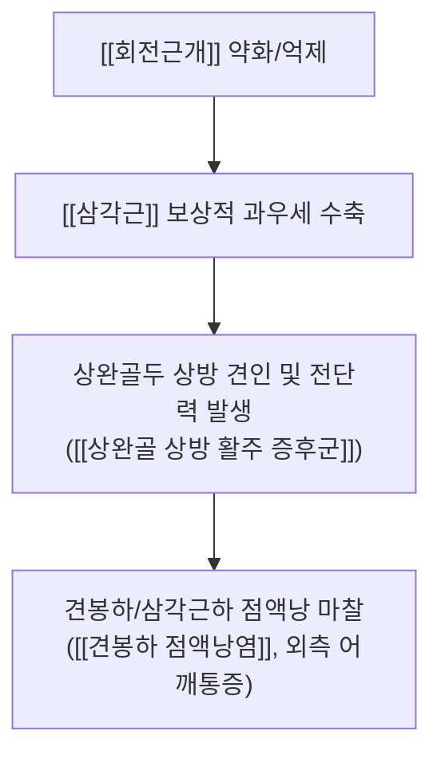
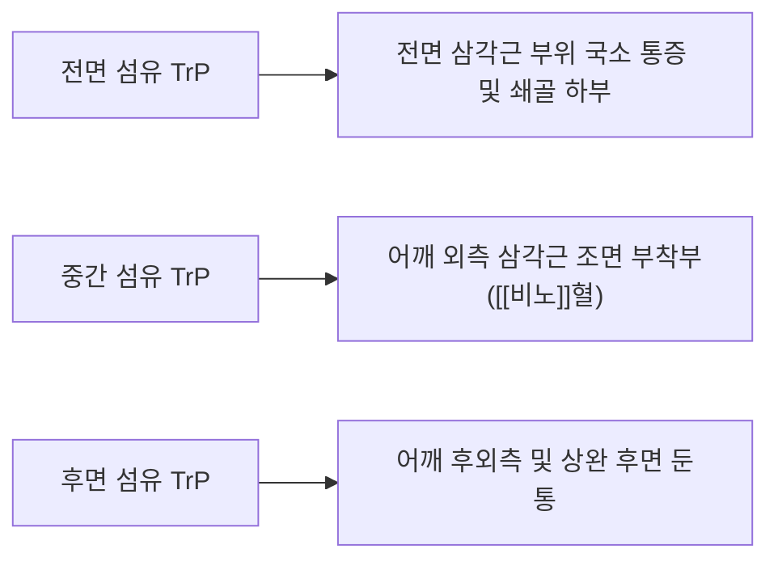

# [[삼각근]](Deltoid)

> **핵심 요약 (Key Summary)**:
> 어깨 관절 외측을 감싸는 강력한 파워 생성 근육으로, 전면(굴곡/내회전), 중관(외전 15° 이후 주동), 후면(신전/외회전)의 3개 분절 섬유로 구성됩니다.
> [[액와신경]](C5-C6)의 지배를 받으며, [[회전근개]] 기능 부전 시 보상적 과우세로 상완골두를 상방으로 끌어올려 [[상완골 상방 활주 증후군]] 및 견봉하 충돌을 유발합니다.
> 비노(臂臑)혈 정지부 압통점, 견봉하/삼각근하 점액낭염(SAD/SBD) 초음파 감별 및 승모근 연계 추나·침구 치료가 핵심 프로토콜입니다.

---
## 📌 목차
1. [해부학적 정밀 구조 및 지배 신경/혈관](#1-해부학적-정밀-구조-및-지배-신경혈관)
2. [생체역학·토크 분석 & 분절별 역할 (Biomechanical Analysis)](#2-생체역학토크-분석--분절별-역할-biomechanical-analysis)
3. [근막통증증후군(TP) & 연관통 패턴 (Travell & Simons)](#3-근막통증증후군tp--연관통-패턴-travell--simons)
4. [초음파 해부학(Sonoanatomy) 및 점액낭 감별](#4-초음파-해부학sonoanatomy-및-점액낭-감별)
5. [관련 임상 질환 및 운동손상 증후군 총괄](#5-관련-임상-질환-및-운동손상-증후군-총괄)
6. [추나·도수치료(MET/PIR) & 침구·약침·재활 프로토콜](#6-추나도수치료metpir--침구약침재활-프로토콜)
7. [출처 및 학술 참고 문헌 (References)](#7-출처-및-학술-참고-문헌-references)

---
## 1. 해부학적 정밀 구조 및 지배 신경/혈관

| 항목 | 상세 내용 |
| :--- | :--- |
| **기시 (Origin)** | • **전면부(Clavicular)**: 쇄골 외측 1/3 전면 • **중간부(Acromial)**: 견봉(Acromion) 외측연 (다우상근 구조) • **후면부(Spinal)**: 견갑극(Spine of scapula) 하연 |
| **정지 (Insertion)** | 상완골 간부 외측의 [[삼각근 조면]](Deltoid tuberosity) |
| **신경 지배** | [[액와신경]](Axillary N., C5-C6) - 사각공간 통과 후 상완골 외과경을 돌아 삼각근 심면으로 진입 |
| **혈관 공급** | [[후상완회선동맥]](Posterior humeral circumflex A.) 및 [[흉견봉동맥]](Thoracoacromial A.)의 삼각근지 |
| **근막 연속성** | 쇄골 및 견갑극을 경계로 하여 상부의 [[승모근]](Trapezius) 건막과 직접 근막적으로 연결 |

### 🔬 해부학 도해 및 단면도
![[Pasted image 20240120152738.png]]
> [구조적 특징]: 전·중·후 3개 섬유가 상완골 삼각근 조면으로 수렴하며, 심부에 견봉하/삼각근하 점액낭(Subdeltoid bursa)을 품고 있습니다.

---
## 2. 생체역학·토크 분석 & 분절별 역할 (Biomechanical Analysis)

### (1) 상완골 상방 전단력(Upward Shear)과 회전근개와의 역학 관계
* **외전 각도별 모멘트 암**:
  * 외전 0°~15°: 삼각근의 수축선이 상완골 장축과 거의 평행하여 **상완골두를 위로 끌어올리는 상방 전단력(Upward shearing force)**만 발생시킵니다.
  * 외전 15° 이상: 모멘트 암이 증가하여 본격적인 외전 토크를 발휘합니다.
* **삼각근 과우세 패턴 (Deltoid Dominance)**:
  * 극상근/극하근 등 회전근개가 억제된 상태에서 삼각근만 과도하게 수축하면 상완골두가 위로 솟구치며 [[상완골 상방 활주 증후군]] 및 견봉하 충돌을 필연적으로 유발합니다.

---
## 3. 근막통증증후군(TP) & 연관통 패턴 (Travell & Simons)

### 📍 발통점(TP) 위치 및 임상 방사통 특징
1. **전면부 TP**: 전면 삼각근 부착부 및 대흉근 쇄골부 주변 통증 (팔을 뒤로 젖힐 때 통증).
2. **중간부 TP (가장 흔함)**: 어깨 외측 중간 근복부 및 상완골 삼각근 조면 부착부. **외전 시 60°~90° 구간에서 뻐근한 통증**.
3. **후면부 TP**: 어깨 뒤쪽 깊은 통증 (수평 내전 시 당김 통증).

---
## 4. 초음파 해부학(Sonoanatomy) 및 점액낭 감별

### (1) 표준 초음파 스캔 뷰 (Subdeltoid Bursa View)
* **스캔 랜드마크**:
  * 어깨 외측 삼각근 근복 부위에서 프로브를 위치시키면 표층의 [[삼각근]] 근육층, 그 아래의 **삼각근하 점액낭(Subdeltoid bursa, SDB)**, 그리고 심층의 [[대결절]] 및 [[극상근/극하근 건]]이 층판으로 관찰됩니다.
  * 점액낭염 발생 시 삼각근 아래에서 2mm 이상의 저에코성 삼출액(Fluid collection)을 확인합니다.

---
## 5. 관련 임상 질환 및 운동손상 증후군 총괄

| 임상 질환 / 증후군 | 병리적 연관 기전 | 주요 증상 및 이학적 검사 | 핵심 교정 타깃 |
| :--- | :--- | :--- | :--- |
| [[상완골 상방 활주 증후군]] | 회전근개 약화 시 삼각근 과우세로 상완골두 상방 충돌 | 외전 시 어깨 외측 찝힘 통증, 견봉하 마찰음 | 삼각근 이완 + 회전근개 활성화 |
| [[삼각근건염 및 점액낭염]] | 반복적 팔 거상 및 과사용에 의한 삼각근 조면 염증 | **삼각근 조면([[비노]]혈) 극심한 압통** Dawbarn's Sign (+) | 비노혈 약침 + 휴식 및 소염 |
| [[액와신경 마비]] | 상완골 외과경 골절 또는 사각공간 압박 | 삼각근 전체 위축 및 어깨 외전력 상실, 감각 마비 | 액와신경 감압 침도술 |

---
## 6. 추나·도수치료(MET/PIR) & 침구·약침·재활 프로토콜

### (1) 한의학 경혈 매핑 & 치료점
* **경혈 매핑**: [[견우(肩髃)]], [[견료(肩髎)]], [[비노(臂臑)]]
* **비노(臂臑)혈 정지부 치료점 (원장님 핵심 팁)**:
  * 삼각근 3개 섬유가 모두 모이는 상완골 삼각근 조면의 **비노혈**은 만성 건병증 및 장력성 통증이 가장 호발하는 치료 포인트입니다. 약침 및 도침을 비노혈 골면에 적용합니다.
* **승모근 연계 치료 (원장님 팁)**:
  * 삼각근 섬유는 쇄골과 견봉을 거쳐 승모근과 기능적 연속성을 가지므로, 반드시 [[상부승모근]]과 삼각근을 함께 평가하여 이완합니다.

![[삼각근-1780585440779.png|192]]
> [삼각근 TrP 및 방사통]: 삼각근 조면 정지부 비노혈을 중심으로 한 연관통 경로.

### (2) 삼각근 MET (근에너지기법)
* **수평 내전을 통한 후면 삼각근 이완**:
  1. 환자의 팔을 90° 굴곡 후 반대쪽 어깨 방향으로 수평 내전시켜 후면 삼각근의 제한 장벽에 놓습니다.
  2. 환자에게 "20% 힘으로 팔을 바깥쪽으로 수평 외전하세요"라고 지시하며 5초간 등척성 수축을 유도합니다.
  3. 호기 시 반대쪽 어깨로 더 깊이 부드럽게 당겨 후면 섬유를 신장합니다.

---
## 7. 출처 및 학술 참고 문헌 (References)

1. **Inman, V. T., et al. (1944)**. *Observations on the function of the shoulder joint*. **The Journal of Bone and Joint Surgery**, 26(1), 1-30.
   - **[연구 요약]**: 외전 시 삼각근과 회전근개의 짝힘(Force couple) 및 견갑-상완 리듬의 고전적 역학 규명.
2. **Sahrmann, S. (2002)**. *Diagnosis and Treatment of Movement Impairment Syndromes*. Mosby.
   - **[연구 요약]**: 삼각근 과우세에 의한 상완골 상방 활주(Humeral Superior Glide) 및 어깨 충돌 교정 원리.
3. **StatPearls (2023)**. *Anatomy, Shoulder and Upper Limb, Deltoid Muscle*.
   - **[임상 가이드]**: 액와신경 주행 경로, 삼각근하 점액낭 초음파 감별 랜드마크.
