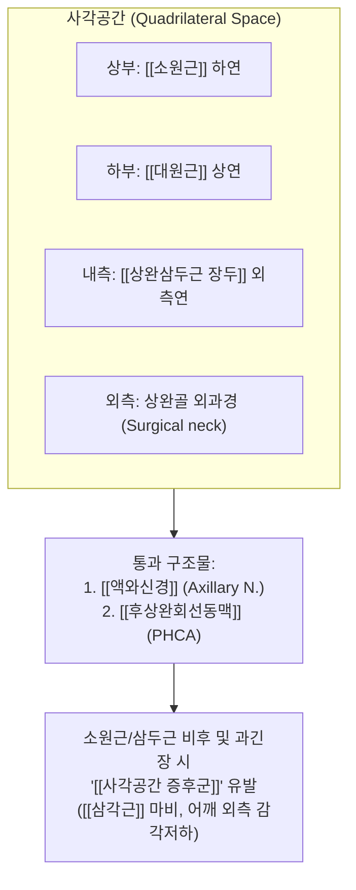
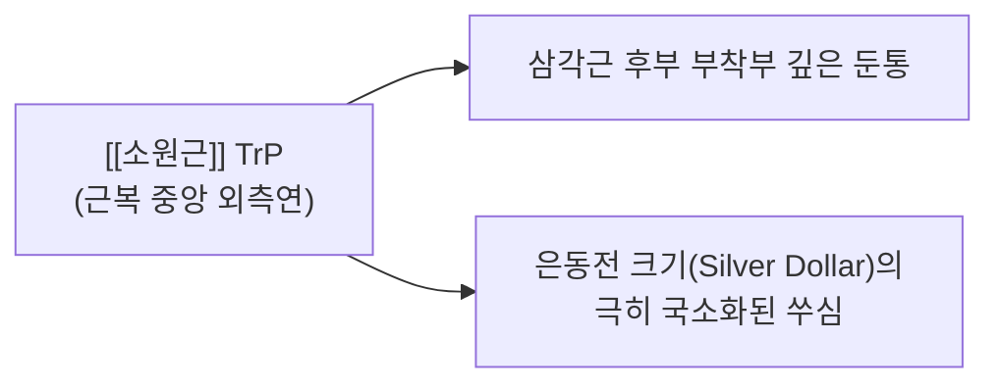

# [[소원근]](Teres Minor)

> **핵심 요약 (Key Summary)**:
> [[회전근개]] 중 가장 후하방에 위치하여 팔의 외전(90° 이상) 상태에서 강력한 외회전 토크를 제공하며 상완골두 후방 탈구를 방지하는 안정화 근육입니다.
> [[액와신경]](C5-C6)의 지배를 받으며, [[대원근]]·[[상완삼두근 장두]]와 함께 [[사각공간]]을 형성하여 신경혈관 포착을 유발합니다.
> [[Hornblower's Sign]], 135° 외전 촉진선 기반 노유혈 오공/봉약침 사각공간 수력박리술 및 MET 외회전 가동화가 핵심 치료 프로토콜입니다.

---
## 📌 목차
1. [해부학적 정밀 구조 및 지배 신경/혈관](#1-해부학적-정밀-구조-및-지배-신경혈관)
2. [생체역학·토크 분석 & 사각공간 (Quadrilateral Space)](#2-생체역학토크-분석--사각공간-quadrilateral-space)
3. [근막통증증후군(TP) & 연관통 패턴 (Travell & Simons)](#3-근막통증증후군tp--연관통-패턴-travell--simons)
4. [초음파 해부학(Sonoanatomy) 및 중재 시술 랜드마크](#4-초음파-해부학sonoanatomy-및-중재-시술-랜드마크)
5. [⭐ 원장님 심층 임상 고찰 및 원본 필기 (Clinical Pearls)](#5-원장님-심층-임상-고찰-및-원본-필기-clinical-pearls)
6. [관련 임상 질환 및 운동손상 증후군 총괄](#6-관련-임상-질환-및-운동손상-증후군-총괄)
7. [추나·도수치료(MET/PIR) & 침구·약침·재활 프로토콜](#7-추나도수치료metpir--침구약침재활-프로토콜)
8. [출처 및 학술 참고 문헌 (References)](#8-출처-및-학술-참고-문헌-references)

---
## 1. 해부학적 정밀 구조 및 지배 신경/혈관

| 항목 | 상세 내용 |
| :--- | :--- |
| **기시 (Origin)** | 견갑골 후면의 외측연(Lateral border) 상부 2/3 부위 |
| **정지 (Insertion)** | 상완골 대결절(Greater tubercle)의 최하단면(Inferior facet) 및 후하방 관절낭 |
| **신경 지배** | [[액와신경]](Axillary N., C5-C6)의 후지(Posterior branch) |
| **혈관 공급** | [[견갑회선동맥]](Circumflex scapular A.) 및 [[후상완회선동맥]](Posterior humeral circumflex A.) |
| **해부학적 랜드마크** | [[극하근]] 바로 아래에 위치하며, 하부의 [[대원근]]과 함께 액와 후벽을 구성 [[사각공간]](Quadrilateral space)의 상부 경계를 형성 |

### 🔬 해부학 도해 및 단면도

![[Teres_minor_anatomy.png|450]]
> [Wikimedia Commons / BodyParts3D 공중도메인]: 견갑골 외측연 상부에서 기시하여 대결절 최하단면에 부착되는 [[소원근]]의 후면 해부도.

![[Pasted image 20240120145711.png|450]]
> [구조적 특징]: 극하근 아래에서 견갑골 외측연을 따라 비스듬히 상외측으로 주행하여 대결절 최하면에 부착됩니다.

---
## 2. 생체역학·토크 분석 & 사각공간 (Quadrilateral Space)

### (1) 상완골 외전 각도에 따른 외회전 역할 분담
* **0° 외전 상태**: [[극하근]]이 외회전 토크의 대부분을 담당.
* **90° 이상 외전 상태**: 극하근의 모멘트 암이 감소하고, [[소원근]]의 주행 방향이 회전축과 수직을 이루면서 외회전의 주동근 역할을 수행합니다 (Hornblower 동작).

### (2) 사각공간(Quadrilateral Space, QLS)의 해부학적 경계와 신경 포착

---
## 3. 근막통증증후군(TP) & 연관통 패턴 (Travell & Simons)

### 📍 발통점(TP) 및 임상 방사통 특징

![[Teres_minor_TriggerPoints.jpg|450]]
> [Travell & Simons 발통점 도해]: [[소원근]] TrP와 삼각근 후부 정지부에 은동전 크기(Silver dollar size)로 국한되는 전형적인 방사통.

* **발통점 위치**: 견갑골 외측연 상부 1/3 지점의 근복.
* **연관통 패턴**:
  * 삼각근 후부(어깨 뒤쪽)에 **은동전 크기(Silver dollar size, 직경 3~5cm)**로 뚜렷하게 국한된 깊은 통증을 방사합니다.
  * 다른 근육과 달리 손이나 목으로 멀리 방사되지 않고 어깨 뒤쪽에 콕콕 박히는 듯한 통증이 특징입니다.
* **감별 포인트**:
  * 액와신경이 압박될 경우 삼각근 외측 피부의 감각 저하(배지 패치 영역)가 동반될 수 있습니다.

---
## 4. 초음파 해부학(Sonoanatomy) 및 중재 시술 랜드마크

### (1) 표준 초음파 스캔 뷰
* **환자 자세**: 팔을 90° 외전 및 외회전시키거나 앙와위에서 스캔.
* **스캔 랜드마크**:
  * [[극하근]] 하방으로 프로브를 이동시키면 대결절 최하단면에 붙는 둥근 방추형의 소원근 건과 근복이 관찰됩니다.
  * 사각공간을 스캔할 때는 컬러 도플러를 켜서 후상완회선동맥(PHCA)의 박동을 확인하며 그 옆을 주행하는 [[액와신경]]을 포착합니다.

### (2) 자침 시 안전 마진
* ⚠️ **액와신경 손상 방지**:
  * 소원근 하연 및 사각공간으로 깊이 자침할 때는 신경 혈관 다발이 위치하므로, 견갑골 외측연 골면을 기준으로 삼아 안전하게 접근합니다.

---
## 5. ⭐ 원장님 심층 임상 고찰 및 원본 필기 (Clinical Pearls)

### (1) @소원근 135° 외전 촉진선 (Palpation Line) 노하우
* **촉진 자세의 핵심**:
  * 팔을 중립위에 두면 극하근과 소원근이 겹쳐져 구분이 매우 어렵습니다.
  * 환자의 팔을 **135° 외전**시키면 견갑골 외측연과 상완골두를 잇는 소원근의 주행선이 팽팽하게 긴장되면서 극하근과의 근간(Intermuscular septum)이 명확히 벌어집니다.
  * 견갑골 외측연 중점과 상완골두 후하방을 잇는 사선 라인을 따라 깊이 압박하면 뚜렷한 압통과 함께 삼각근 후부 방사통을 유발하는 정확한 TrP를 촉지할 수 있습니다.

### (2) 말초신경약침의학 사각공간 포착 해소 약침 기법 (원장님 핵심 프로토콜)
* **액와신경 포착 해소 기전**:
  * [[소원근]]의 과긴장 및 섬유화는 사각공간(Quadrilateral space)을 협소화하여 그 속을 관통하는 [[액와신경]]과 [[후상완회선동맥]]을 압박합니다.
* **주입 혈위 및 랜드마크**:
  * **노유(臑兪, SI10)**: 액와 후연 상방, 견갑극 외측단 하방의 사각공간 정중앙 함몰처.
* **약침 처방 및 주입법**:
  * **처방**: [[오공약침]](0.3~0.5ml) 또는 [[봉약침]](Sweet BV 0.3ml).
  * **자입 기법**: 30G 25mm 니들로 노유 혈위에서 상완골 경부 골면을 향해 수직 직자하여 심부 사각공간 결합조직에 0.3ml를 주입하여 신경주위 수력박리(Hydrodissection) 효과를 유도합니다.

### (3) 삼각근 후부 '은동전 크기' 통증과 사각공간 증후군 감별
* 환자가 "어깨 뒤쪽 딱 한 군데가 콕콕 쑤신다"고 짚으면 소원근 TrP일 확률이 95% 이상입니다.
* 이때 어깨 외측 삼각근 부위의 피부 감각 저하나 팔을 90° 이상 외전한 상태에서 쥐는 힘이 빠지는 양상이 동반된다면, 단순 발통점을 넘어 사각공간 내 액와신경 포착([[사각공간 증후군]])으로 진행된 것이므로 노유혈 약침 치료를 반드시 병행해야 합니다.

---
## 6. 관련 임상 질환 및 운동손상 증후군 총괄

| 임상 질환 / 증후군 | 병리적 연관 기전 | 주요 증상 및 이학적 검사 | 핵심 교정 타깃 |
| :--- | :--- | :--- | :--- |
| [[사각공간 증후군]] | 사각공간 내 액와신경 및 후상완회선동맥 섬유성 포착 | 어깨 90° 외전+외회전 시 삼각근 마비, 어깨 뒤 통증 | 사각공간 침도 박리 + 소원근/삼두근 이완 |
| [[소원근 파열]] | 액와신경 손상 또는 심한 회전근개 광범위 파열 | [[Hornblower's Sign]] (+) [[Patte's Test]] (+) | 소원근 약침 + 외전 외회전 재교육 |
| [[어깨 외회전 결손]] | 소원근의 섬유화 단축 또는 근력 저하 | 팔을 90° 든 상태에서 손을 뒤로 넘기지 못함 | MET 외회전 스트레칭 |

---
## 7. 추나·도수치료(MET/PIR) & 침구·약침·재활 프로토콜

### (1) 한의학 경혈 매핑 & 자침법
* **경혈 매핑**: 견정(肩貞, SI9), 노유(臑兪, SI10)
* **침도(Acupotomy) & 자침 가이드**:

![[Pasted image 20240120152534.png|450]]
> [소원근 촉진 및 자침 가이드]: 135도 외전 자세에서 견갑골 외측연 라인을 따라 정확한 자침 위치를 결정합니다.

### (2) 추나 MET (근에너지기법)
* **90° 외전 상태에서의 외회전 가동화**:
  1. 환자의 어깨를 90° 외전, 팔꿈치 90° 굴곡 상태로 세팅한 후 내회전 방향으로 부드럽게 눌러 제한 장벽을 찾습니다.
  2. 환자에게 "20% 힘으로 손목을 천장 쪽으로 가볍게 돌리세요(외회전 저항)"라고 지시하며 5초간 등척성 수축을 유도합니다.
  3. 호기 시 새로운 내회전 가동범위로 부드럽게 신장하여 소원근을 이완합니다.

### (3) 재활 운동 (Hornblower 훈련)
* 밴드를 전방에 고정하고 팔꿈치를 어깨 높이(90° 외전)로 유지한 상태에서 주먹을 귀 옆으로 들어 올리는 외회전 운동을 수행합니다.

---
## 8. 출처 및 학술 참고 문헌 (References)

1. **Walch, G., Boulahia, A., Calderone, S., & Robinson, A. H. (1998)**. The 'dropping' and 'hornblower's' signs in evaluation of rotator-cuff tears. *J Bone Joint Surg Br*, 80(4), 624-628. [PMID: 9699824](https://pubmed.ncbi.nlm.nih.gov/9699824/)
   - **[연구 요약]**:  소원근 기능 부전을 특이적으로 평가하는 Hornblower's Sign과 dropping sign의 임상적 유용성을 회전근개 파열 환자에서 검증.
2. **Cahill, B. R., & Palmer, R. E. (1983)**. Quadrilateral space syndrome. *J Hand Surg Am*, 8(1), 65-69. [PMID: 6827057](https://pubmed.ncbi.nlm.nih.gov/6827057/)
   - **[연구 요약]**: 사각공간 증후군에서 소원근-대원근-삼두근에 의한 액와신경 포착 병태생리 정립.
3. **Travell, J. G., & Simons, D. G. (1999)**. *Myofascial Pain and Dysfunction: The Trigger Point Manual*, Vol. 1 (2nd ed.). Williams & Wilkins.
   - **[연구 요약]**: 소원근 TrP가 삼각근 후부에 은동전 크기로 국한되는 연관통 패턴 규명.
4. **StatPearls (2023)**. *Anatomy, Shoulder and Upper Limb, Teres Minor Muscle*.
   - **[임상 가이드]**: 액와신경 후지 주행, 초음파 후방 접근법 및 사각공간 중재 랜드마크.