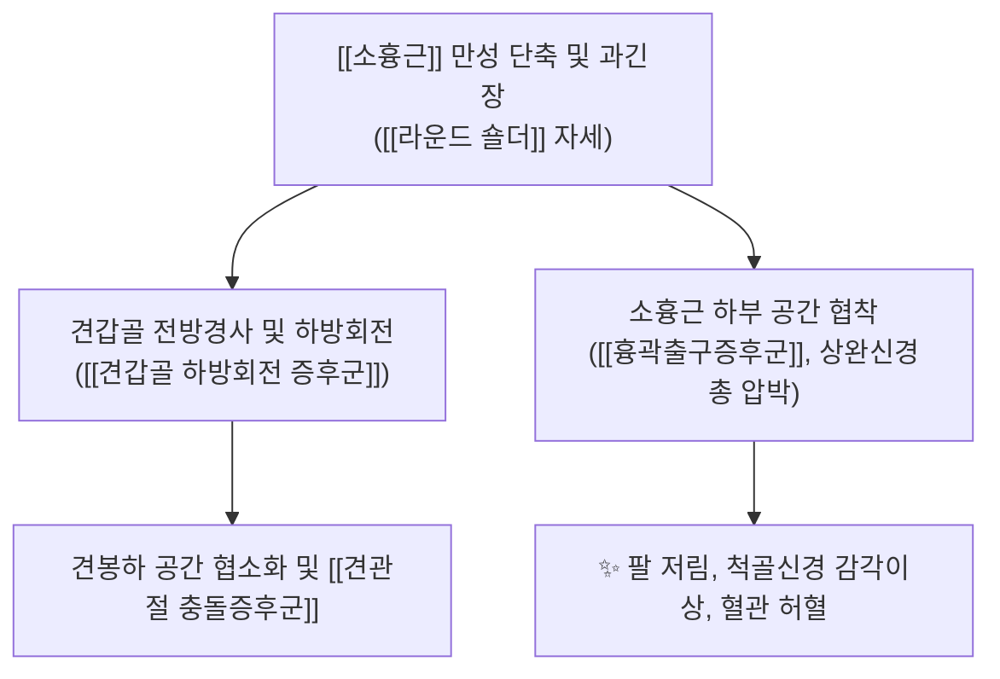
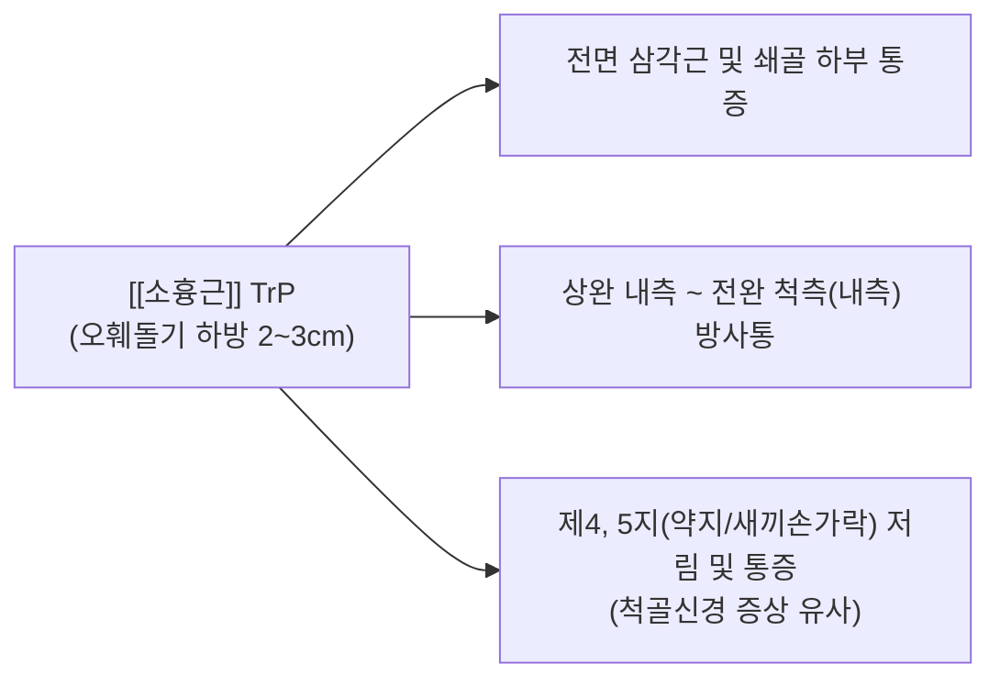

# [[소흉근]](Pectoralis Minor)

> **핵심 요약 (Key Summary)**:
> 늑골에서 오훼돌기로 주행하며 견갑골을 전하방으로 당겨 고정하는 심부 흉근으로, 단축 시 견갑골 전방경사와 라운드 숄더를 유발합니다.
> [[내측흉근신경]](C8-T1) 및 [[외측흉근신경]](C6-C7)의 지배를 받으며, 하부 공간에서 [[상완신경총]]과 액와혈관을 압박하여 [[흉곽출구증후군]](TOS)을 유발하는 핵심 근육입니다.
> [[Wright Test]], [[Roos Test]], 오훼돌기 촉지법, 초음파 PECS 블록 및 기흉 방지 안전각도 기반 침구·도침·추나 이완술이 핵심 프로토콜입니다.

---
## 📌 목차
1. [해부학적 정밀 구조 및 지배 신경/혈관](#1-해부학적-정밀-구조-및-지배-신경혈관)
2. [생체역학·토크 분석 & 흉곽출구 공간 (Subcoracoid Space)](#2-생체역학토크-분석--흉곽출구-공간-subcoracoid-space)
3. [근막통증증후군(TP) & 연관통 패턴 (Travell & Simons)](#3-근막통증증후군tp--연관통-패턴-travell--simons)
4. [초음파 해부학(Sonoanatomy) 및 중재 시술 랜드마크](#4-초음파-해부학sonoanatomy-및-중재-시술-랜드마크)
5. [⭐ 원장님 심층 임상 고찰 및 원본 필기 (Clinical Pearls)](#5-원장님-심층-임상-고찰-및-원본-필기-clinical-pearls)
6. [관련 임상 질환 및 운동손상 증후군 총괄](#6-관련-임상-질환-및-운동손상-증후군-총괄)
7. [추나·도수치료(MET/PIR) & 침구·약침·재활 프로토콜](#7-추나도수치료metpir--침구약침재활-프로토콜)
8. [출처 및 학술 참고 문헌 (References)](#8-출처-및-학술-참고-문헌-references)

---
## 1. 해부학적 정밀 구조 및 지배 신경/혈관

| 항목 | 상세 내용 |
| :--- | :--- |
| **기시 (Origin)** | 제3, 4, 5 늑골 전면(늑연골 접합부 근처) 및 외늑간근 근막 |
| **정지 (Insertion)** | 견갑골 오훼돌기(Coracoid process) 내측연 및 상면 |
| **신경 지배** | [[내측흉근신경]](Medial pectoral N., C8-T1) - 근육을 직접 관통 [[외측흉근신경]](Lateral pectoral N., C6-C7) 분지 |
| **혈관 공급** | [[흉견봉동맥]](Thoracoacromial A.)의 흉근지 및 [[외측흉동맥]](Lateral thoracic A.) |
| **해부학적 터널** | 소흉근과 흉벽 사이의 오훼돌기 하 공간(Subcoracoid tunnel)으로 [[상완신경총]] 3개 신경속(Cords)과 [[액와동맥]], [[액와정맥]] 통과 |

### 🔬 해부학 도해 및 단면도

![[Pectoralis_minor_anatomy.png|450]]
> [Wikimedia Commons / BodyParts3D 공중도메인]: 대흉근 심부에 위치하여 제3~5늑골에서 오훼돌기로 사선 주행하는 [[소흉근]]의 전면 해부도.

![[Pasted image 20240120153928.png|395]]
> [구조적 특징]: 대흉근 심부에 위치하여 늑골에서 오훼돌기로 사선 주행하며, 하부 공간으로 상지로 가는 모든 신경 혈관이 통과합니다.

---
## 2. 생체역학·토크 분석 & 흉곽출구 공간 (Subcoracoid Space)

### (1) 견갑골 운동형상학(Scapular Kinematics) 억제
* **견갑골 전방경사(Anterior Tilt) 및 하방회전(Downward Rotation)**:
  * 소흉근이 단축되면 오훼돌기를 전하방으로 당겨 견갑골이 앞으로 기울어지고(전방경사), 상방회전을 방해하여 **팔을 머리 위로 들어 올릴 때 견봉하 충돌**을 유발합니다.
* **호흡 보조근 기능**:
  * 견갑골이 고정되었을 때 늑골 3~5번을 들어 올려 강제 흡기(Inspiration)를 보조합니다.

---
## 3. 근막통증증후군(TP) & 연관통 패턴 (Travell & Simons)

### 📍 발통점(TP) 및 임상 방사통 특징

![[Pectoralis_minor_TriggerPoints.jpg|450]]
> [Travell & Simons 발통점 도해]: [[소흉근]] TrP와 앞가슴, 전면 삼각근, 상완 내측, 그리고 제4, 5지(척골신경 영역)로 뻗어나가는 방사통 분포.

* **발통점 위치**: 오훼돌기 부착부 직하방 및 늑골 3~5번 근복 부위 (중부/하부).
* **연관통 패턴**:
  * 앞가슴(전흉부) 전체와 전면 [[삼각근]] 부위에 통증을 방사하며, 가성 협심증(Pseudo-angina)과 유사한 가슴 답답함을 유발합니다.
  * **상완 내측과 전완 척측(내측)을 타고 내려가 4, 5번째 손가락까지 찌릿한 방사통**을 유발하여 척골신경 포착(Cubital tunnel)이나 경추 8번 디스크로 오진되기 쉽습니다.
* **증상 악화 조건**:
  * 팔을 뒤로 젖히거나(수평 외전), 팔을 머리 위로 올리고 잘 때 저림 증상이 극심해집니다.

---
## 4. 초음파 해부학(Sonoanatomy) 및 중재 시술 랜드마크

### (1) 표준 초음파 스캔 뷰 (PECS I / II View)
* **스캔 랜드마크**:
  * 쇄골 중앙 하방 제3늑골 부위에서 프로브를 사선으로 위치시키면 표층의 [[대흉근]], 심층의 [[소흉근]], 그리고 소흉근 아래의 외늑간근 및 늑골이 층판 구조로 관찰됩니다.
  * 소흉근 근막 심층 공간에서 액와동맥(Axillary A.)과 [[상완신경총]] 다발들의 저에코 점상 구조를 확인합니다.

### (2) ⚠️ 기흉(Pneumothorax) 방지 절대 안전 수칙
* **안전 자침 랜드마크**:
  * 소흉근 근복에 자침할 때는 절대 늑간 공간(Intercostal space)을 향해 수직 직자하지 않습니다.
  * **오훼돌기(Coracoid process) 골면을 손가락으로 단단히 촉지하고, 오훼돌기 골면을 향해 바늘을 비스듬히 유도(Bone touch)**하여 늑막강 천자를 100% 원천 차단합니다.

---
## 5. ⭐ 원장님 심층 임상 고찰 및 원본 필기 (Clinical Pearls)

### (1) 오구돌기(오훼돌기) 촉지법 (원장님 핵심 팁)
* 쇄골 외측 1/3 하방에서 오목한 삼각 공간(쇄흉삼각)을 찾고, 상완골두 내측에서 단단하게 만져지는 뼈 돌기(오훼돌기)를 정확히 확인합니다.
* 오훼돌기 바로 내하측 소흉근 건 부착부에 침도 또는 약침을 적용하여 쇄흉근막의 유착을 해소하면 어깨 운동 시 전방 찝힘이 즉각 호전됩니다.

### (2) 말초신경약침의학 소흉근하 상완신경총 포착 해소 약침 기법 (원장님 프로토콜)
* **소흉근 증후군(TOS) 포착 해소 기전**:
  * [[소흉근]] 건막의 단축 및 쇄흉근막(Clavipectoral fascia)의 비후는 오훼돌기 하부 공간(Subcoracoid tunnel)을 좁혀 그 아래를 지나는 [[상완신경총]]과 액와동정맥을 압박합니다.
* **주입 혈위 및 랜드마크**:
  * **중부(中府, LU1)**: 오훼돌기 내하방 1촌, 소흉근 건막과 근복이 만나는 부위.
* **약침 처방 및 주입법**:
  * **추천 제제**: [[오공약침]](0.5~1.0ml) + [[자하거약침]](만성 척골신경 위축 시 0.5ml).
  * **안전 자침 기법**: 30G 13mm 니들로 오훼돌기 골면 방향을 향해 비스듬히 사자(Bone touch)하여 흉벽 천자(기흉)를 절대 예방하고 소흉근 건막 주변에 0.5ml를 정밀 주입합니다.

### (3) 앙와위 소흉근 직접 이완술 및 MET

![[소흉근-20240727215400309.png|450]]
> [소흉근 직접 이완 가이드]: 오훼돌기 내하방 부착부를 촉지하며 팔을 135° 외전하여 신장시키는 도수 치료 자세.

* **도수 이완 프로토콜**:
  1. 환자를 앙와위로 눕히고 시술자의 엄지로 오훼돌기 내하방의 소흉근 근복을 접촉합니다.
  2. 환자의 팔을 135° 외전 및 외회전시키면서 소흉근 섬유를 사하방(늑골 방향)으로 부드럽게 글라이딩하며 신장합니다.
* **PIR 호흡 연동 스트레칭**:
  1. 환자에게 숨을 깊이 들이쉬며 어깨를 앞으로 20% 힘으로 밀게(전인 저항) 합니다 (5초 등척성 수축).
  2. 환자가 숨을 "후-" 내쉴 때 시술자는 어깨 전면을 바닥 쪽(후방)으로 지그시 눌러 소흉근을 완전히 신장시킵니다.

---
## 6. 관련 임상 질환 및 운동손상 증후군 총괄

| 임상 질환 / 증후군 | 병리적 연관 기전 | 주요 증상 및 이학적 검사 | 핵심 교정 타깃 |
| :--- | :--- | :--- | :--- |
| [[흉곽출구증후군]](TOS, 소흉근 증후군) | 오훼돌기 하부 공간에서 상완신경총 및 액와혈관 압박 | [[Wright Test]] (+) [[Roos Test]] (+) 팔 거상 시 맥박 소실 및 저림 | 소흉근 침도 박리 + 쇄흉근막 이완 |
| [[척골신경 포착 증후군]] | 소흉근 단축으로 내측속에서 분지하는 척골신경 압박 | 제4, 5지 저림, 손 내재근 무력감 | 소흉근 이완 + 신경가동술 |
| [[견갑골 하방회전 증후군]] | 소흉근 단축으로 견갑골 상방회전 제한 | 팔 굴곡 시 견갑골이 전방경사되며 찝힘 | 소흉근 스트레칭 + [[전거근]] 강화 |

---
## 7. 추나·도수치료(MET/PIR) & 침구·약침·재활 프로토콜

### (1) 한의학 경혈 매핑 & 자침법
* **경혈 매핑**: 중부(中府, LU1), 운문(雲門, LU2)
* **안전 자침법**: 오훼돌기 골면을 향해 사자하여 골막 접촉(Bone contact)을 유지하며 침치료 및 약침을 시술합니다.

### (2) 도어웨이 스트레칭 (Doorway Stretch)
* 문틀에 팔꿈치를 90° 이상 높이 올리고 몸을 앞으로 천천히 전진시켜 소흉근을 이완합니다.

---
## 8. 출처 및 학술 참고 문헌 (References)

1. **Sanders, R. J., & Rao, N. M. (2010)**. The forgotten pectoralis minor syndrome: 100 operations for pectoralis minor syndrome alone or accompanied by neurogenic thoracic outlet syndrome. *Ann Vasc Surg*, 24(6), 701-708. [PMID: 20471786](https://pubmed.ncbi.nlm.nih.gov/20471786/)
   - **[연구 요약]**:  소흉근 증후군 단독 또는 신경성 흉곽출구증후군 동반 100례 수술 분석 — 소흉근 압박의 진단·수술적 치료 근거.
2. **Sahrmann, S. (2002)**. *Diagnosis and Treatment of Movement Impairment Syndromes*. Mosby.
   - **[연구 요약]**: 소흉근 단축이 견갑골 전방경사(Anterior tilt)와 견봉하 충돌에 미치는 생체역학적 기전 정립.
3. **Travell, J. G., & Simons, D. G. (1999)**. *Myofascial Pain and Dysfunction: The Trigger Point Manual*, Vol. 1 (2nd ed.). Williams & Wilkins.
   - **[연구 요약]**: 소흉근 TrP가 앞가슴 및 4, 5번째 손가락으로 유발하는 척골신경 유사 방사통 규명.
4. **StatPearls (2023)**. *Anatomy, Thorax, Pectoralis Minor Muscle and PECS Block*.
   - **[임상 가이드]**: PECS 블록 초음파 해부학, 내측흉근신경 주행 및 기흉 예방 랜드마크.