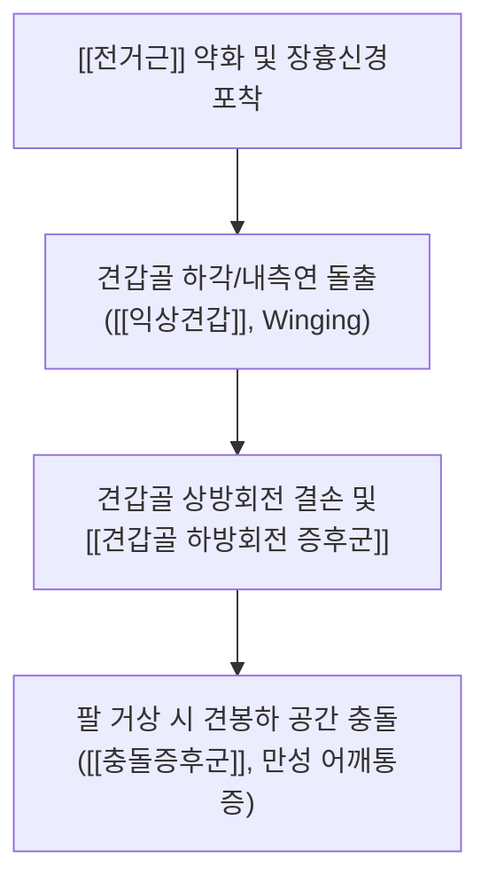
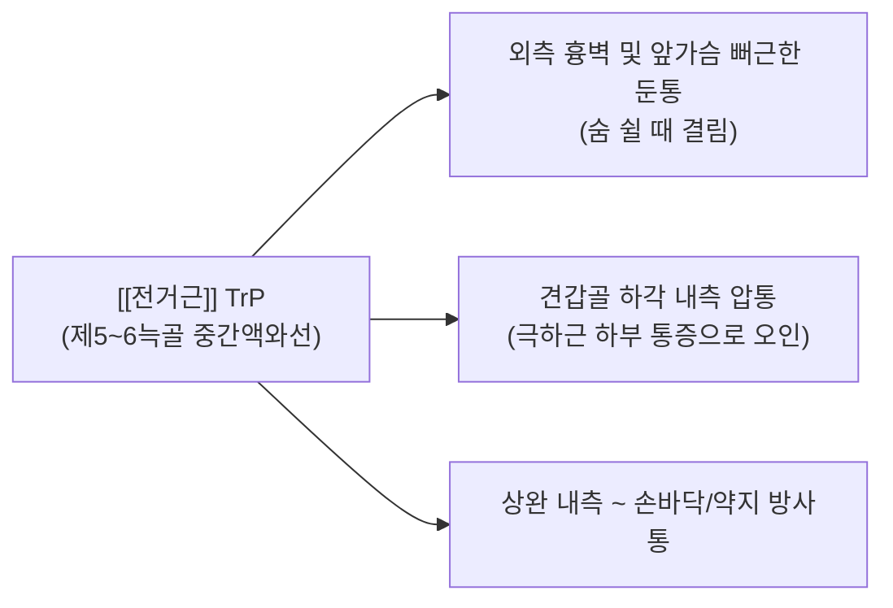

# [[전거근]](Serratus Anterior)

> **핵심 요약 (Key Summary)**:
> 늑골 외측면에서 견갑골 내측연으로 주행하여 견갑골을 흉벽에 단단히 밀착시키고 상방회전(Upward rotation) 및 전인을 주도하는 견갑흉곽 안정화의 최핵심 근육입니다.
> [[장흉신경]](C5-C7)의 지배를 받으며, 신경 포착 또는 근력 약화 시 견갑골 내측연이 들리는 [[익상견갑]](Winged Scapula) 및 [[견갑-흉곽 리듬 장애]]를 초래합니다.
> 벽 푸시업(Wall Push-up) 검사, 견갑골 하각 압통 감별, 늑골 위 흉막 안전선 초음파 확인 및 건부항·견갑흉곽 MET 가동술·플러스 푸시업이 핵심 치료 프로토콜입니다.

---
## 📌 목차
1. [해부학적 정밀 구조 및 지배 신경/혈관](#1-해부학적-정밀-구조-및-지배-신경혈관)
2. [생체역학·토크 분석 & 견갑-흉곽 리듬 (Scapulohumeral Rhythm)](#2-생체역학토크-분석--견갑-흉곽-리듬-scapulohumeral-rhythm)
3. [근막통증증후군(TP) & 연관통 패턴 (Travell & Simons)](#3-근막통증증후군tp--연관통-패턴-travell--simons)
4. [초음파 해부학(Sonoanatomy) 및 중재 시술 랜드마크](#4-초음파-해부학sonoanatomy-및-중재-시술-랜드마크)
5. [관련 임상 질환 및 운동손상 증후군 총괄](#5-관련-임상-질환-및-운동손상-증후군-총괄)
6. [추나·도수치료(MET/PIR) & 건부항·재활 프로토콜](#6-추나도수치료metpir--건부항재활-프로토콜)
7. [출처 및 학술 참고 문헌 (References)](#7-출처-및-학술-참고-문헌-references)

---
## 1. 해부학적 정밀 구조 및 지배 신경/혈관

| 항목 | 상세 내용 |
| :--- | :--- |
| **기시 (Origin)** | 제1~9 늑골의 외측면 (톱니 모양의 8~9개 근육 갈래) |
| **정지 (Insertion)** | 견갑골 늑골면(전면)의 내측연 전체 및 특히 하각(Inferior angle) 부위 |
| **신경 지배** | [[장흉신경]](Long thoracic N., C5-C7) - 중사각근을 관통한 후 전거근 표층을 따라 수직 하행 |
| **혈관 공급** | [[외측흉동맥]](Lateral thoracic A.) 및 [[흉배동맥]](Thoracodorsal A.) |
| **3개 분절 구조** | • **상부 섬유(1-2늑골)**: 견갑골 상각 부착 (전인 보조) • **중부 섬유(3-4늑골)**: 견갑골 내측연 부착 (흉벽 밀착) • **하부 섬유(5-9늑골, 가장 두껍고 강력)**: 견갑골 하각 부착 (**상방회전의 핵심**) |

### 🔬 해부학 도해 및 단면도
![[Pasted image 20250727120552.jpg|549x476]]
> [구조적 특징]: 늑골 외측면을 톱니처럼 감싸며 견갑골 안쪽면으로 들어가 하각을 외측 상방으로 회전시키는 강력한 레버를 형성합니다.

---
## 2. 생체역학·토크 분석 & 견갑-흉곽 리듬 (Scapulohumeral Rhythm)

### (1) 상방회전 짝힘 삼총사 (Force Couple for Upward Rotation)
팔을 180° 완전히 들어 올릴 때(외전/굴곡) 상완골과 견갑골은 **2:1의 비율(견갑-상완 리듬)**로 움직입니다. 이 중 견갑골의 60° 상방회전은 세 근육의 완벽한 짝힘으로 이루어집니다:
1. [[상부승모근]]: 쇄골과 견갑골 상각을 위로 당김
2. [[하부승모근]]: 견갑극 내측단을 아래로 당김
3. [[전거근]](하부): 견갑골 하각을 외측 앞쪽으로 강력하게 밀어냄 (상방회전 기여도 60% 이상)

---
## 3. 근막통증증후군(TP) & 연관통 패턴 (Travell & Simons)

### 📍 분절별 수축 형태에 따른 통증 양상 (원장님 임상 팩트)
1. **상부 섬유 등척성 수축**: 어깨 관절면 내측 후면의 허혈성 통증.
2. **중부 섬유 등척성 수축**: 외측 앞가슴의 뻐근한 통증, 겨드랑이를 조이면서 결리는 통증, 견갑골 앞면의 답답함.
3. **하부 섬유 등장성 수축**: 견갑골 하각을 잡아당겨 골막을 자극하는 날카로운 통증.
4. **호흡 시 통증**: 심호흡이나 기침 시 갈비뼈가 결리고 숨이 깊게 안 쉬어지는 통증 유발.

---
## 4. 초음파 해부학(Sonoanatomy) 및 중재 시술 랜드마크

### (1) 표준 초음파 스캔 뷰 (Serratus Plane View)
* **스캔 랜드마크**:
  * 중간액와선(Mid-axillary line) 제4~5늑골 부위에서 프로브를 위치시키면 표층의 [[광배근]], 그 아래의 [[전거근]], [[늑골(Rib)]], 그리고 가장 깊은 층의 **고에코 흉막선(Pleural line)과 폐(Lung)**가 관찰됩니다.
  * 호흡에 따른 흉막의 미끄러짐(Pleural sliding sign)을 확인합니다.

### (2) ⚠️ 기흉(Pneumothorax) 방지 절대 안전 수칙
* **원장님 치료 지침**:
  * 전거근은 늑골 바로 위에 위치하고 늑간 공간으로 잘못 진입 시 기흉 위험이 매우 높습니다.
  * 따라서 **직접 깊은 자침이나 습부항(사혈)을 지양하고, 건부항(Dry cupping)이나 근막 추나, 안전한 늑골 위 횡사자**를 위주로 치료합니다.

---
## 5. 관련 임상 질환 및 운동손상 증후군 총괄

| 임상 질환 / 증후군 | 병리적 연관 기전 | 주요 증상 및 이학적 검사 | 핵심 교정 타깃 |
| :--- | :--- | :--- | :--- |
| [[익상견갑]](Winged Scapula) | 장흉신경 마비 또는 전거근 근력 저하 | Wall Push-up Test (+): 벽 밀 때 견갑골 내측연 돌출 | 전거근 재교육 + 장흉신경 감압 |
| [[견갑골 하방회전 증후군]] | 전거근 약화 및 견갑거근/소흉근 과긴장 | 팔 굴곡 시 견갑골 하각이 액와정중선에 도달 못함 | 전거근 강화 + 견갑거근 이완 |
| [[장흉신경 포착 증후군]] | 중사각근 관통 부위 또는 늑골 외측 압박 | 겨드랑이 외측 둔통 및 견갑골 불안정 | 중사각근 도침 + 전거근 활성화 |

---
## 6. 추나·도수치료(MET/PIR) & 건부항·재활 프로토콜

### (1) 한의학 경혈 매핑 & 건부항 치료
* **경혈 매핑**: [[대포(大包)]], [[연액(淵腋)]], [[첩근(輒筋)]]
* **건부항(Dry Cupping) 요법**:
  * 액와선 아래 제4~7늑골 외측 전거근 근복 부위에 부항컵을 흡착하여 늑골과 근막 사이의 유착을 안전하게 음압으로 들어 올려 이완합니다.

![[Pasted image 20260709144034.jpg|395x389]]
> [전거근 근막 치료 포인트]: 늑골 외측면을 따라 안전하게 근막 유착을 해소하는 영역.

### (2) 견갑-흉곽 관절 추나 가동술
* **측와위 견갑골 상방회전 글라이딩**:
  * 환자를 측와위로 눕히고 시술자가 견갑골 하각을 파지한 후, 팔을 외전시키며 견갑골 하각을 외측 상방으로 부드럽게 밀어올려 견갑-흉곽 활주를 회복합니다.

### (3) 전거근 강화 재활 운동 (Plus Push-up)
![[Pasted image 20240120154612.png|381]]
* **푸시업 플러스 (Push-up Plus)**:
  * 네발기기 자세 또는 플랭크 자세에서 팔꿈치를 편 채로 날개뼈 사이를 천장 쪽으로 최대한 밀어 올려(견갑골 전인, Protraction) 전거근을 고립 강화합니다.

---
## 7. 출처 및 학술 참고 문헌 (References)

1. **Ludewig, P. M., & Cook, T. M. (2000)**. *Alterations in shoulder kinematics and associated muscle activity in people with symptoms of shoulder impingement*. **Physical Therapy**, 80(3), 276-291.
   - **[연구 요약]**: 전거근 활성 감소가 견갑골 상방회전 결손 및 견봉하 충돌증후군을 유발하는 운동형상학적 근거 증명.
2. **Martin, R. M., & Fish, D. E. (2008)**. *Scapular winging: anatomical review, diagnosis, and treatments*. **Current Reviews in Musculoskeletal Medicine**, 1(1), 1-11.
   - **[연구 요약]**: 장흉신경 마비와 전거근 부전에 의한 익상견갑의 감별 진단 및 재활 운동 프로토콜 정립.
3. **StatPearls (2023)**. *Anatomy, Thorax, Serratus Anterior Muscle and Long Thoracic Nerve*.
   - **[임상 가이드]**: 장흉신경 주행 경로, 전거근 평면 블록(SAPB) 초음파 랜드마크 및 기흉 예방 수칙.