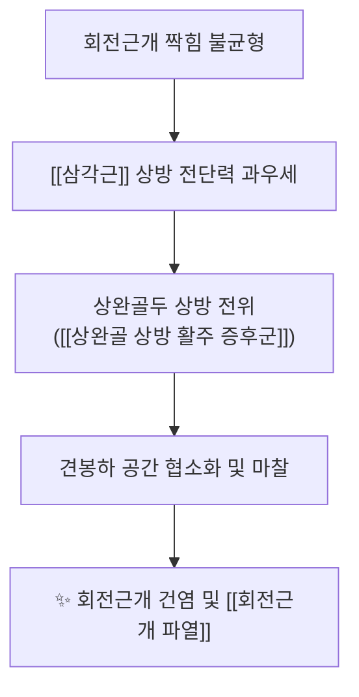

---
aliases:
  - Rotator cuff
  - 回旋筋蓋
  - SITS
  - 회전근개 복합체
---

# [[회전근개]](Rotator Cuff)

> **핵심 요약 (Key Summary)**:
> 견갑골과 상완골두를 연결하여 견관절 내 동적 안정성(Centration)을 확보하는 4대 핵심 근육군([[극상근]], [[극하근]], [[소원근]], [[견갑하근]]) 복합체입니다.
> [[삼각근]]의 상방 전단력에 대항하여 상완골두를 관절와 중심에 압박·하강시키는 짝힘(Force couple)을 형성하며 어깨 회전 운동의 회전축을 유지합니다.
> 미세혈관 희소 구역(Critical Zone)의 허혈성 퇴행으로 건염 및 파열이 호발하며, Empty-Can/Lag Sign 이학적 검사, 초음파 및 침구·약침·추나 가동술이 핵심입니다.

---
## 📌 목차
1. [해부학적 정밀 구조 및 4대 근육 복합체 (SITS Complex)](#1-해부학적-정밀-구조-및-4대-근육-복합체-sits-complex)
2. [생체역학·토크 분석 & 짝힘 기전 (Biomechanical Synergy)](#2-생체역학토크-분석--짝힘-기전-biomechanical-synergy)
3. [근막통증증후군(TP) & 연관통 패턴 (Travell & Simons)](#3-근막통증증후군tp--연관통-패턴-travell--simons)
4. [초음파 해부학(Sonoanatomy) 및 중재 시술 랜드마크](#4-초음파-해부학sonoanatomy-및-중재-시술-랜드마크)
5. [⭐ 원장님 심층 임상 고찰 및 원본 필기 (Clinical Pearls)](#5-원장님-심층-임상-고찰-및-원본-필기-clinical-pearls)
6. [관련 임상 질환 및 운동손상 증후군 총괄](#6-관련-임상-질환-및-운동손상-증후군-총괄)
7. [추나·도수치료(MET/PIR) & 침구·약침·재활 프로토콜](#7-추나도수치료metpir--침구약침재활-프로토콜)
8. [출처 및 학술 참고 문헌 (References)](#8-출처-및-학술-참고-문헌-references)

---
## 1. 해부학적 정밀 구조 및 4대 근육 복합체 (SITS Complex)

| 근육명 (약칭) | 기시부 (Origin) | 정지부 (Insertion) | 주요 기능 (Action) | 신경 지배 (Innervation) |
| :--- | :--- | :--- | :--- | :--- |
| [[극상근]] (Supraspinatus) | 견갑골 극상와 | 상완골 대결절 상면 | 외전 초기 0~15° 개시, 골두 압박 | [[견갑상신경]] (C5-C6) |
| [[극하근]] (Infraspinatus) | 견갑골 극하와 | 상완골 대결절 중간면 | 외회전, 후방 관절와순 안정화 | [[견갑상신경]] (C5-C6) |
| [[소원근]] (Teres minor) | 견갑골 외측연 상 2/3 | 상완골 대결절 하면 | 90° 외전 시 외회전, 후방 탈구 방지 | [[액와신경]] (C5-C6) |
| [[견갑하근]] (Subscapularis) | 견갑골 견갑하와 | 상완골 소결절 | 강력한 내회전, 전방 탈구 방지 | [[상견갑하신경]] 및 [[하견갑하신경]] (C5-C6) |

### 🔬 해부학 도해 및 단면도

![[Rotator_cuff_impingement.jpg|450]]
> [Wikimedia Commons 공중도메인]: 견관절을 360° 둘러싸고 상완골두를 관절와에 밀착시키는 회전근개 4대 근육(SITS)의 해부학적 배치와 견봉하 충돌 기전.

---
## 2. 생체역학·토크 분석 & 짝힘 기전 (Biomechanical Synergy)

### (1) 동적 안정자 및 관절와 중심화 (Dynamic Centration)
* 견관절(GH joint)은 얕은 관절와와 큰 상완골두로 인해 골성 안정성이 취약한 '골프공 위의 골프공' 구조입니다.
* 회전근개는 수축 시 상완골두를 관절와 방향으로 강하게 압박(Joint compression)하여 관절면 이탈을 방지합니다.

### (2) 관상면 & 수평면 짝힘 (Force Couples)
* **관상면 짝힘 ([[삼각근]] vs 회전근개)**:
  * [[삼각근]]이 상완을 외전시킬 때 발생하는 강력한 상방 전단력(Superior shear)을 회전근개([[극하근]], [[소원근]], [[견갑하근]])가 하방으로 끌어내리는 하향력(Depressor force)으로 상쇄합니다.
  * 회전근개 기능 부전 시 상완골두가 상방 전위되며 [[견관절 충돌증후군]]이 발생합니다.
* **수평면 짝힘 ([[견갑하근]] vs [[극하근]]·[[소원근]])**:
  * 전방의 [[견갑하근]]과 후방의 [[극하근]], [[소원근]]이 전후에서 균형 잡힌 텐션을 제공하여 상완골두의 전·후방 아탈구를 방지합니다.

---
## 3. 근막통증증후군(TP) & 연관통 패턴 (Travell & Simons)

* **극상근 TrP**: 삼각근 중부 및 외측 상완, 외측상과로 깊은 쑤심 방사.
* **극하근 TrP**: 견관절 전면 깊은 곳(가성 이두근 건염), 상완 전외측 및 손가락 요측 방사통.
* **소원근 TrP**: 삼각근 후부 정지부에 은동전 크기(Silver dollar)의 국소 통증.
* **견갑하근 TrP**: 견갑골 후면 전체 둔통 및 손목 배측 시계 밴드형(Wrist-band) 방사통.

---
## 4. 초음파 해부학(Sonoanatomy) 및 중재 시술 랜드마크

* **초음파 스캔 프로토콜**:
  * **전면 (견갑하근)**: 외회전 자세에서 소결절 및 이두근 장두 건 스캔.
  * **상방 (극상근)**: Modified Crass 자세에서 Footprint 및 Critical Zone 스캔.
  * **후방 (극하근/소원근)**: 손을 반대쪽 어깨에 얹고 후방 관절와순 및 스피노글레노이드 절흔 스캔.

---
## 5. ⭐ 원장님 심층 임상 고찰 및 원본 필기 (Clinical Pearls)

### (1) 회전근개 4대 근육 이학적 검사 감별 핵심 정리
* **극상근 건 평가**: [[Empty-Can Test]](Jobe 검사, 90° 외전+30° 수평내전+엄지 하향), [[Full-Can Test]].
* **극하근/소원근 외회전 건 평가**: [[External Rotation Lag Sign]], [[Hornblower's Sign]](주관절 90° 굴곡, 견관절 90° 외전 상태에서 외회전 저항).
* **견갑하근 내회전 건 평가**: [[Lift-Off Test]](열중쉬어 자세에서 손등 떼기), [[Belly-Press Test]], [[Bear-Hug Test]].
* **광범위 파열 선별**: [[Drop Arm Sign]](외전 90°에서 천천히 내리게 할 때 통증으로 팔이 뚝 떨어짐).

### (2) 코드만 임계 구역(Codman's Critical Zone)의 병태생리
* [[극상근]] 건 정지부 약 1cm 근위부는 미세혈관 문합이 희소하고 팔을 내리고 있을 때 골두 압박으로 상시 허혈 상태에 놓입니다.
* 야간통(Night pain)으로 자다 깨는 환자는 단순 근육통이 아닌 Critical Zone의 건병증 또는 파열을 1차적으로 의심해야 합니다.

### (3) 보존적 한의 치료와 수술 적응증 가이드라인
* 급성 외상성 전층 파열(Full-thickness tear)이면서 활동적인 젊은 층은 조기 정형외과 봉합술을 의뢰합니다.
* 그러나 만성 퇴행성 파열이나 부분 파열(Partial tear) 환자는 약침(신바로/봉약침/자하거)과 견관절 중심화 추나 치료를 병행했을 때 90% 이상 일상생활 복귀와 통증 소실이 가능합니다.

---
## 6. 관련 임상 질환 및 운동손상 증후군 총괄

| 임상 질환 / 증후군 | 병리적 연관 기전 | 주요 증상 및 이학적 검사 | 핵심 교정 타깃 |
| :--- | :--- | :--- | :--- |
| [[견관절 충돌증후군]] | 회전근개 하향력 부전으로 견봉하 공간 협착 | [[Neer Impingement Test]] (+) [[Hawkins-Kennedy Test]] (+) | 견봉하 공간 확보 + 상완골두 하방 글라이딩 |
| [[회전근개 파열]] | Critical Zone 허혈성 퇴행 및 만성 마모 | [[Empty-Can Test]] (+) [[Drop Arm Sign]] (+) | 건 정지부 약침 + 회전근개 중심화 재활 |
| [[상완골 상방 활주 증후군]] | 삼각근 과우세로 상완골두가 위로 돌출 | 외전 초기 찝힘 통증, 견봉하 마찰음 | 삼각근 이완 + 극상근 활성화 |

---
## 7. 추나·도수치료(MET/PIR) & 침구·약침·재활 프로토콜

### (1) 한의학 경혈 매핑 & 자침 포인트
* **경혈 매핑**: 견우(肩髃), 견료(肩髎), 견정(肩貞), 천종(天宗), 비노(臂臑), 곡지(曲池)
* **약침 처방**:
  * 급성 염증기: 봉약침, 황련해독탕약침 (견봉하 점액낭 주위 소염)
  * 만성 퇴행기: 신바로약침, 자하거약침 (건 정지부 콜라겐 재생 촉진)

### (2) 견관절 추나 관절가동술 (GH Mobilization)
* **하방/후방 글라이딩**: 상완골두를 발 쪽(하방) 및 등 쪽(후방)으로 미끄러뜨려 견봉하 공간을 물리적으로 확장하고 회전 중심을 회복시킵니다.

### (3) 단계별 재활 운동 요법
1. **1단계 (급성기)**: 통증 없는 범위 내 코드만 진자 운동(Codman pendulum exercise).
2. **2단계 (회복기)**: 세라밴드를 이용한 0°~45° 외회전·내회전 등척성/원심성 강화 훈련.
3. **3단계 (안정기)**: 견갑골 주변근([[전거근]], [[하부승모근]]) 협응력 훈련 및 스캡션 운동.

---
## 8. 출처 및 학술 참고 문헌 (References)

1. **대한정형외과학회 (2020)**. *정형외과학 제8판*. 최신의학사.
   - **[연구 요약]**: 회전근개의 해부학적 구조, 견관절 바이오메카닉스 및 관상면·수평면 짝힘의 생체역학적 상호작용 상세 기술.
2. **Keener, J. D., et al. (2015)**. *Degenerative rotator cuff tears: refining surgical indications based on natural history data*. **Journal of the American Academy of Orthopaedic Surgeons**, 23(5), 296-304.
   - **[연구 요약]**: 무증상 회전근개 파열의 자연 경과 및 보존적 재활 치료의 기능 보존 효과 입증.
3. **전국한의과대학 침구경혈학교실 (2020)**. *침구의학*. 집문당.
   - **[연구 요약]**: 견우, 견료, 천종 중심의 회전근개 질환 침치료 프로토콜 및 신경반사적 진통 기전 규명.
4. **Travell, J. G., & Simons, D. G. (1999)**. *Myofascial Pain and Dysfunction: The Trigger Point Manual*, Vol. 1 (2nd ed.). Williams & Wilkins.
   - **[연구 요약]**: 회전근개 4대 근육의 발통점 및 어깨 전·후·외측 연관통 복합 패턴 규명.
