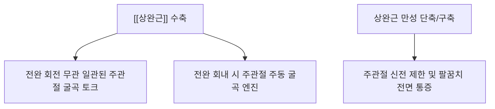

# [[상완근]](Brachialis)

> **핵심 요약 (Key Summary)**:
> 상완골 전면 원위 1/2에서 기원하여 척골 조면 및 구상돌기에 정지하는 주관절 전용 순수 굴곡 엔진입니다.
> [[근피신경]](C5-C6)의 주 지배(외측 일부는 [[요골신경]])를 받으며, 전완의 회내/회외 상태와 무관하게 강력하고 일관된 팔꿈치 굴곡력을 발생시킵니다.
> [[근피신경 포착 증후군]], 만성 주관절 굴곡 구축, 깊은 전완 통증의 핵심 원인근이며, 상완이두근을 젖히고 상완골 전면 촉진 및 심부 침구·도침 치료의 표적입니다.

---
## 📌 목차
1. [해부학적 정밀 구조 및 지배 신경/혈관](#1-해부학적-정밀-구조-및-지배-신경혈관)
2. [생체역학·토크 분석 & 순수 굴곡 엔진 (Biomechanical Synergy)](#2-생체역학토크-분석--순수-굴곡-엔진-biomechanical-synergy)
3. [근막통증증후군(TP) & 연관통 패턴 (Travell & Simons)](#3-근막통증증후군tp--연관통-패턴-travell--simons)
4. [초음파 해부학(Sonoanatomy) 및 중재 시술 랜드마크](#4-초음파-해부학sonoanatomy-및-중재-시술-랜드마크)
5. [⭐ 원장님 심층 임상 고찰 및 원본 필기 (Clinical Pearls)](#5-원장님-심층-임상-고찰-및-원본-필기-clinical-pearls)
6. [관련 임상 질환 및 운동손상 증후군 총괄](#6-관련-임상-질환-및-운동손상-증후군-총괄)
7. [추나·도수치료(MET/PIR) & 침구·약침·재활 프로토콜](#7-추나도수치료metpir--침구약침재활-프로토콜)
8. [출처 및 학술 참고 문헌 (References)](#8-출처-및-학술-참고-문헌-references)

---
## 1. 해부학적 정밀 구조 및 지배 신경/혈관

| 항목 | 상세 내용 |
| :--- | :--- |
| **기시 (Origin)** | [[상완골]](Humerus) 전면 원위 1/2 부위 및 내·외측 근간중격 |
| **정지 (Insertion)** | [[척골]](Ulna) 조면(Ulnar tuberosity) 및 구상돌기(Coronoid process) |
| **신경 지배** | [[근피신경]](Musculocutaneous N., C5-C6) (내측 70~80%) [[요골신경]](Radial N., C7) 분지 (외측 20~30% 고유수용성 감각) |
| **혈관 공급** | [[상완동맥]](Brachial A.) 분지 및 요골순환동맥 |
| **해부학적 특징** | 상완이두근 심층에 위치하여 상완골 전면을 넓게 덮으며 척골 조면으로 직하행 부착 |

### 🔬 해부학 도해 및 단면도

![[Brachialis_anatomy.png|450]]
> [Wikimedia Commons / BodyParts3D 공중도메인]: 상완골 전면 원위 1/2을 덮고 척골 조면으로 단단히 부착되는 [[상완근]]의 해부도.

![[Pasted image 20240120145357.png|450]]
> [구조적 특징]: 상완이두근 심층에 위치하여 상완골 전면을 넓게 덮으며 척골 조면으로 직하행 부착됩니다.

---
## 2. 생체역학·토크 분석 & 순수 굴곡 엔진 (Biomechanical Synergy)

### (1) 주관절 순수 굴곡의 핵심 엔진 (Workhorse of Elbow Flexion)
* **전완 회전 무관 굴곡 토크**:
  * 척골에 정지하므로 전완의 회전(회내/회외)에 영향을 받지 않고 모든 관절 각도에서 일정한 굴곡 토크를 발휘합니다.
  * 특히 손바닥이 아래를 향한 **전완 회내(Pronation) 상태에서 주동 굴곡근**으로 작용합니다 ([[상완이두근]]의 불활성화 보상).
* **주관절 관절낭 보호**:
  * 굴곡 시 초기부터 끝까지 일관된 토크를 제공하여 주관절 관절낭 전면을 보호하고 관절와 중심화를 유지합니다.

---
## 3. 근막통증증후군(TP) & 연관통 패턴 (Travell & Simons)

### 📍 발통점(TP) 및 임상 방사통 특징

![[Brachialis_TriggerPoints.jpg|450]]
> [Travell & Simons 발통점 도해]: [[상완근]] TrP와 주관절 전면, 전완 요측, 그리고 엄지손가락 기저부(모지구)로 퍼지는 방사통 분포.

![[Pasted image 20240121050301.png|397]]
> [상완근 발통점 및 주행]: 상완골 전면 심부에서 척골 조면으로 이어지는 트리거포인트 경로.

* **발통점 위치**: 상완골 외측 원위 1/3, 상완이두근 외측연 심부.
* **증상 특징**:
  * 엄지손가락 기저부(모지구)에 쑤시는 통증을 방사하여 수근관 증후군이나 드퀘르벵 병으로 오진되기 쉬움.
  * 팔을 완전히 펴려고 할 때 팔꿈치 앞쪽이 팽팽하게 당기며 통증 발생.

---
## 4. 초음파 해부학(Sonoanatomy) 및 중재 시술 랜드마크

* 프로브를 주관절 상방 전면에 위치시키면 표층의 상완이두근 건과 그 심층에 위치하여 상완골 골면에 넓게 깔려 있는 상완근 근복을 선명하게 관찰할 수 있습니다.
* 내측의 상완동맥과 정중신경 주행을 도플러로 확인하며 외측 안전 마진으로 진입합니다.

---
## 5. ⭐ 원장님 심층 임상 고찰 및 원본 필기 (Clinical Pearls)

### (1) 현대인의 굴곡 부하와 심층 타깃팅 (원장님 핵심 임상 팁)
* **임상 팩트**: 현대인은 스마트폰·키보드 사용으로 **주관절 굴곡 상태를 장시간 유지하므로 경결점과 압통점이 발생하기 극히 쉽습니다**.
* 표층의 [[상완이두근]]을 타깃팅하는 것보다 **심층에서 지속 긴장을 받는 [[상완근]], [[오훼완근]]을 타깃팅하는 것이 치료율이 훨씬 높습니다**.
* 전완을 회내(Pronation)한 상태에서 팔을 구부릴 때 힘이 빠지거나 깊은 팔꿈치 전방 통증이 있다면 상완근 병변을 1차적으로 의심해야 합니다.

### (2) 원장님 정밀 촉진법 (상완이두근 제끼기)
* 상완이두근 근복을 외측 또는 내측으로 손가락으로 밀어내어(제끼어) 젖힌 후, 안쪽 상완골 전면 골면을 향해 깊이 압박하면 단단하게 뭉친 상완근 근복과 심부 압통점을 정확히 촉진할 수 있습니다.

### (3) 곡지(曲池) 내측 및 곡택(曲澤) 외측 침도 요법
* 곡지혈 내측 상완근 건 부착부 및 상완 전면 심부 곡택혈 외측에 침도를 적용하여 상완이두근-상완근 간막 유착을 박리하면 만성 굴곡 구축이 즉각 신장됩니다.

---
## 6. 관련 임상 질환 및 운동손상 증후군 총괄

| 임상 질환 / 증후군 | 병리적 연관 기전 | 주요 증상 및 이학적 검사 | 핵심 교정 타깃 |
| :--- | :--- | :--- | :--- |
| [[주관절 굴곡 구축]] | 스마트폰/PC 사용으로 상완근 만성 단축 | 팔꿈치 180° 완전 신전 불가, 전면 당김 | 상완근 침도 박리 + 신전 가동술 |
| [[근피신경 포착 증후군]] | 상완이두근-상완근 사이 근피신경 압박 | 전완 외측 감각 저하 및 주관절 무력감 | 근막간 수력박리술 |
| [[상완이두근 보상 과긴장]] | 상완근 약화 시 이두근이 굴곡 부하 독점 | 이두근 힘줄 과부하 및 결절간구 건염 | 상완근 활성화 + 이두근 부하 분산 |

---
## 7. 추나·도수치료(MET/PIR) & 침구·약침·재활 프로토콜

### (1) 한의학 경혈 매핑 & 자침 포인트
* **경혈 매핑**: 곡지(曲池, LI11), 곡택(曲澤, PC3), 척택(尺澤, LU5)
* **자침 기법**:
  * 곡지 내측 및 척택-곡택 사이에서 상완골 골면을 향해 사자하여 심부 상완근 근복을 자극합니다.

### (2) 상완근 MET (신전 가동화)
* 전완을 회내(Pronation)시킨 상태에서 팔꿈치를 신전 제한 장벽에 두고, 5초간 굴곡 등척성 저항 후 호기 시 완전 신전으로 부드럽게 이완합니다.

---
## 8. 출처 및 학술 참고 문헌 (References)

1. **Standring, S. (2020)**. *Gray's Anatomy: The Anatomical Basis of Clinical Practice* (42nd ed.). Elsevier.
   - **[연구 요약]**: 상완근의 이중 신경 지배(근피신경 주 지배 + 요골신경 외측 분지) 및 주관절 굴곡 모멘트 암 분석.
2. **Simons, D. G., & Travell, J. G. (1999)**. *Myofascial Pain and Dysfunction: The Trigger Point Manual*, Vol. 1 (2nd ed.). Williams & Wilkins.
   - **[연구 요약]**: 상완근 발통점이 모지구(엄지손가락 기저부) 및 주관절 전면으로 방사하는 통증 패턴 제시.
3. **StatPearls (2023)**. *Anatomy, Shoulder and Upper Limb, Brachialis Muscle*.
   - **[임상 가이드]**: 근피신경 감압 랜드마크 및 상완근 초음파 스캔 프로토콜.
