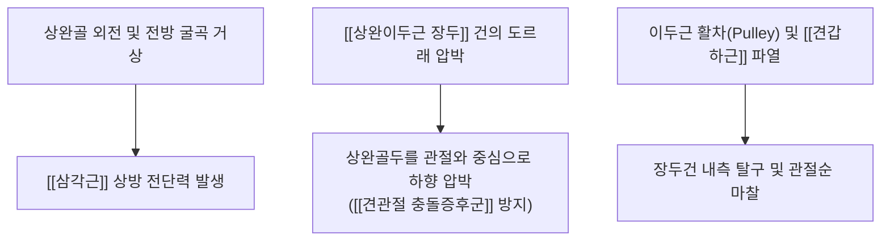
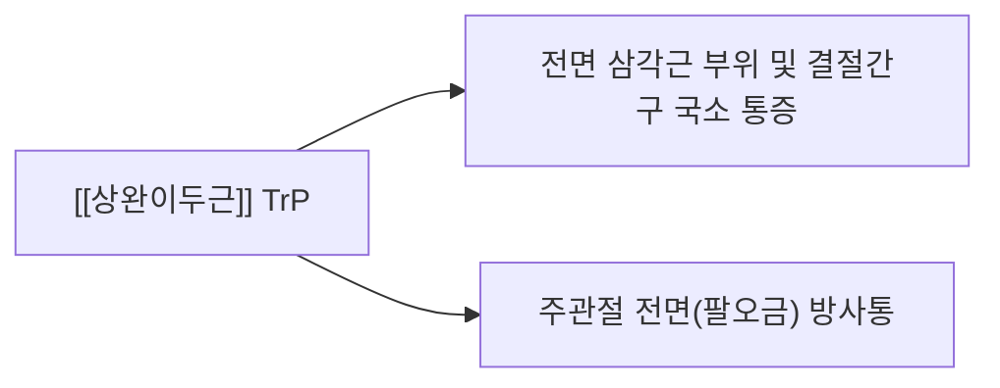

---
aliases:
  - 상완이두근 장두
  - Long head of biceps
  - Long head of biceps brachii
  - 이두근 장두
  - 상완이두근장두건
tags:
  - 해부학
  - 근육
  - 상지
  - 어깨
  - 상완이두근
  - 견관절
  - SLAP
  - 이두근건염
---

# [[상완이두근 장두]](Long Head of Biceps Brachii)

> **핵심 요약 (Key Summary)**:
> 견갑골 관절상결절에서 기시하여 견관절강 내부를 관통한 뒤 상완골 결절간구를 주행하는 핵심 힘줄이자 관절 안정자입니다.
> [[근피신경]](C5-C6)의 지배를 받으며, 전완 회외 및 주관절 굴곡을 주도하고 [[삼각근]]에 대항하여 상완골두를 관절와로 하향 압박합니다.
> [[SLAP 병변]], [[상완이두근 장두 건초염]], 건 탈구(Popeye 변형) 호발 부위로 [[Speed Test]], [[Yergason Test]], 결절간구 초음파 약침 및 후하방 글라이딩 추나가 핵심입니다.

---
## 📌 목차
1. [해부학적 정밀 구조 및 지배 신경/혈관](#1-해부학적-정밀-구조-및-지배-신경혈관)
2. [생체역학·토크 분석 & 관절와 안정화 (Biomechanical Synergy)](#2-생체역학토크-분석--관절와-안정화-biomechanical-synergy)
3. [근막통증증후군(TP) & 연관통 패턴 (Travell & Simons)](#3-근막통증증후군tp--연관통-패턴-travell--simons)
4. [초음파 해부학(Sonoanatomy) 및 중재 시술 랜드마크](#4-초음파-해부학sonoanatomy-및-중재-시술-랜드마크)
5. [⭐ 원장님 심층 임상 고찰 및 원본 필기 (Clinical Pearls)](#5-원장님-심층-임상-고찰-및-원본-필기-clinical-pearls)
6. [관련 임상 질환 및 운동손상 증후군 총괄](#6-관련-임상-질환-및-운동손상-증후군-총괄)
7. [추나·도수치료(MET/PIR) & 침구·약침·재활 프로토콜](#7-추나도수치료metpir--침구약침재활-프로토콜)
8. [출처 및 학술 참고 문헌 (References)](#8-출처-및-학술-참고-문헌-references)

---
## 1. 해부학적 정밀 구조 및 지배 신경/혈관

| 항목 | 상세 내용 |
| :--- | :--- |
| **기시 (Origin)** | 견갑골 관절상결절(Supraglenoid tubercle) 및 상부 관절와순(Superior labrum) |
| **정지 (Insertion)** | 상완이두근 근복으로 이행하여 요골조면(Radial tuberosity) 및 이두근 건막(Lacertus fibrosus)에 부착 |
| **신경 지배** | [[근피신경]](Musculocutaneous N., C5-C6) |
| **혈관 공급** | [[전상완회선동맥]](Anterior circumflex humeral A.)의 결절간구 상행 분지 |
| **특수 주행 관계** | 관절낭 내(Intra-articular)에 위치하되 활액막 밖(Extra-synovial)을 주행하며, 상완횡인대(Transverse humeral ligament) 아래 결절간구를 통과 |

### 🔬 해부학 도해 및 단면도

![[Biceps_brachii_anatomy.png|450]]
> [Wikimedia Commons / BodyParts3D 공중도메인]: 상완골 결절간구를 지나 관절상결절로 연결되는 [[상완이두근]] 및 장두 건의 주행 해부도.

![[Pasted image 20240120145001.png|332]]
> [구조적 특징]: 장두 건은 결절간구를 통과하여 관절낭 내로 진입하고, 단두는 오훼돌기에서 시작하여 결합합니다.

---
## 2. 생체역학·토크 분석 & 관절와 안정화 (Biomechanical Synergy)

### (1) 상완골두 하향 안정자 (Depressor of Humeral Head)
* **삼각근 상방 전단력 억제**:
  * 팔을 외전하거나 굴곡 거상할 때 [[삼각근]]이 상완골두를 위로 끌어올리려 합니다.
  * 이때 [[상완이두근 장두]] 건은 도르래처럼 상완골두 상면을 누르며(Depressor force), 회전근개([[극상근]], [[견갑하근]])와 협응하여 상완골두를 관절와 중심에 밀착시킵니다.

### (2) 이두근 활차(Biceps Pulley) 복합체
* 결절간구 입구에서 오훼상완인대(CHL), 상관절와상완인대(SGHL), [[견갑하근]] 건 및 [[극상근]] 건이 복합 섬유성 활차를 형성하여 장두건이 안쪽(내측)으로 이탈하는 것을 막아줍니다.

---
## 3. 근막통증증후군(TP) & 연관통 패턴 (Travell & Simons)

### 📍 발통점(TP) 및 임상 방사통 특징

![[Biceps_brachii_TriggerPoints.jpg|450]]
> [Travell & Simons 발통점 도해]: [[상완이두근]] 근복의 TrP와 어깨 전면 결절간구 부위 및 주관절 전면으로 집중되는 방사통 분포.

* **발통점 위치**: 근복 원위 1/3 부위 및 결절간구 입구.
* **증상 특징**:
  * 결절간구(Bicipital groove)를 따라 손가락으로 압박할 때 깜짝 놀랄 정도의 날카로운 압통(Jump sign) 발생.
  * 무거운 물건을 앞으로 들어 올릴 때 어깨 앞쪽이 쑤시고 찌릿함.

---
## 4. 초음파 해부학(Sonoanatomy) 및 중재 시술 랜드마크

### (1) 표준 초음파 단축 스캔 (Bicipital Groove Short-axis View)
* **스캔 랜드마크**:
  * 프로브를 상완골 상단 전면에 횡(수평)으로 위치시키면 **대결절과 소결절 사이의 오목한 결절간구 내에 위치하는 고에코의 둥근 타원형 건 섬유**가 선명하게 관찰됩니다.
  * 건 주위에 2mm 이상의 저에코성 삼출액이 차서 검은 테두리가 보이면(Halo sign) 급성 [[상완이두근 장두 건초염]]으로 확진합니다.

### (2) 초음파 유도하 약침 안전 마진
* 건 실질 내 직접 찌르지 않고, **건초(Tendon sheath) 내강**으로 약침 바늘을 접근시켜 약침액을 부드럽게 주입하여 건 섬유 손상을 방지합니다.

---
## 5. ⭐ 원장님 심층 임상 고찰 및 원본 필기 (Clinical Pearls)

### (1) Speed Test vs Yergason Test 임상 감별 팁
* **Speed 검사**([[Speed Test]]):
  * 환자가 팔꿈치를 편 상태에서 전완을 회외(손바닥 위)하고 전방으로 90° 들어 올릴 때 검사자가 아래로 저항을 줍니다.
  * 결절간구에 날카로운 통증이 유발되면 장두건염 양성입니다.
* **Yergason 검사**([[Yergason Test]]):
  * 팔꿈치를 90° 구부린 상태에서 전완을 안쪽에서 바깥쪽으로 돌리게(회외) 하면서 검사자가 강하게 저항합니다.
  * 이때 결절간구에서 '뚝' 소리가 나거나 튕기는 느낌이 있다면 이두근 활차 파열 및 건 아탈구를 의미합니다.

### (2) SLAP 병변(상부관절와순 파열)과 Popeye(뽀빠이) 변형
* 던지기 동작(Late cocking기) 시 강한 견인 부하로 인해 상부 관절와순이 뜯어지는 **[[SLAP 병변]](Superior Labrum Anterior to Posterior)**이 발생하면 팔을 거상할 때 관절 깊은 곳에서 걸리는 듯한 통증(Clicking)이 유발됩니다.
* 만성 건 마모로 장두건이 완전 파열되면 장두 근복이 상완골 아래쪽으로 뭉치며 불룩 튀어나오는 **뽀빠이 변형(Popeye sign)**이 관찰됩니다.

### (3) 결절간구 장두건 활액초 약침 치료 노하우
* 결절간구 압통점에 초음파를 대고 30G 13mm 니들로 장두건초 내강으로 진입하여 [[중성어혈약침]](0.5ml) 또는 소염약침을 주입하면 마찰성 부종과 염증이 수일 내에 빠르게 소퇴합니다.

---
## 6. 관련 임상 질환 및 운동손상 증후군 총괄

| 임상 질환 / 증후군 | 병리적 연관 기전 | 주요 증상 및 이학적 검사 | 핵심 교정 타깃 |
| :--- | :--- | :--- | :--- |
| [[상완이두근 장두 건초염]] | 결절간구 내 반복적 마찰로 인한 활액막 염증 | [[Speed Test]] (+) 결절간구 극심한 압통 | 건초 내 소염약침 + 활동 조절 |
| [[SLAP 병변]] | 장두건 기시부 상부 관절와순 견인 박리 손상 | O'Brien Test (+) Crank Test (+) 팔 거상 시 염발음 | 관절와순 안정화 + 보존 치료 |
| [[이두근 장두건 아탈구 / 파열]] | 활차 손상 및 견갑하근 파열로 건 내측 이탈 | [[Yergason Test]] 클릭음 Popeye Sign (원위부 근복 돌출) | 활차 보호 + 회전근개 복합 치료 |
| [[상완골 전방 활주 증후군]] | 장두건 약화 시 상완골두가 전방으로 돌출 | 팔 신전 시 결절간구 마찰음 및 전방 찝힘 | 하향 안정화 재활 + 대흉근 이완 |

---
## 7. 추나·도수치료(MET/PIR) & 침구·약침·재활 프로토콜

### (1) 한의학 경혈 매핑 & 자침법
* **경혈 매핑**: 견우(肩髃), 견료(肩髎), 비노(臂臑), 곡택(曲池)
* **결절간구 자침법**: 결절간구 골막을 촉지한 후 건 주행 방향과 평행하게 사자하여 건막 유착을 해소합니다.

### (2) 추나 관절 가동 (후하방 글라이딩)
* 상완골두의 전방 변위를 교정하기 위해 환자를 앙와위로 눕히고 상완골두를 후하방(Posterior-inferior)으로 부드럽게 글라이딩하여 결절간구 압박을 줄입니다.

---
## 8. 출처 및 학술 참고 문헌 (References)

1. **Neer, C. S. (1983)**. *Impingement lesions*. **Clinical Orthopaedics and Related Research**, (173), 70-77.
   - **[연구 요약]**: 견봉하 충돌증후군에서 상완이두근 장두건이 받는 해부역학적 마찰과 병리적 파열 과정을 체계화한 고전적 연구.
2. **Snyder, S. J., et al. (1990)**. *SLAP lesions of the shoulder*. **Arthroscopy**, 6(4), 274-279.
   - **[연구 요약]**: 상완이두근 장두 기시부와 상부 관절와순 파열(SLAP)의 4대 분류 체계와 관절경 진단 기준 정립.
3. **Travell, J. G., & Simons, D. G. (1999)**. *Myofascial Pain and Dysfunction: The Trigger Point Manual*, Vol. 1 (2nd ed.). Williams & Wilkins.
   - **[연구 요약]**: 상완이두근 TrP의 어깨 전면 및 주관절 방사통 양상 규명.
4. **StatPearls (2023)**. *Biceps Tendon Dislocation and Instability*.
   - **[임상 가이드]**: 결절간구 이두근 활차(Pulley) 해부학 및 초음파하 장두건 건초염 감별 랜드마크.
