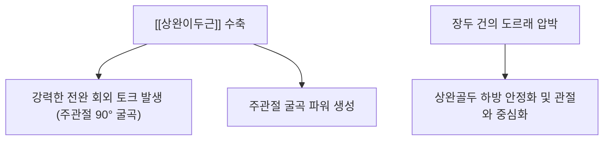
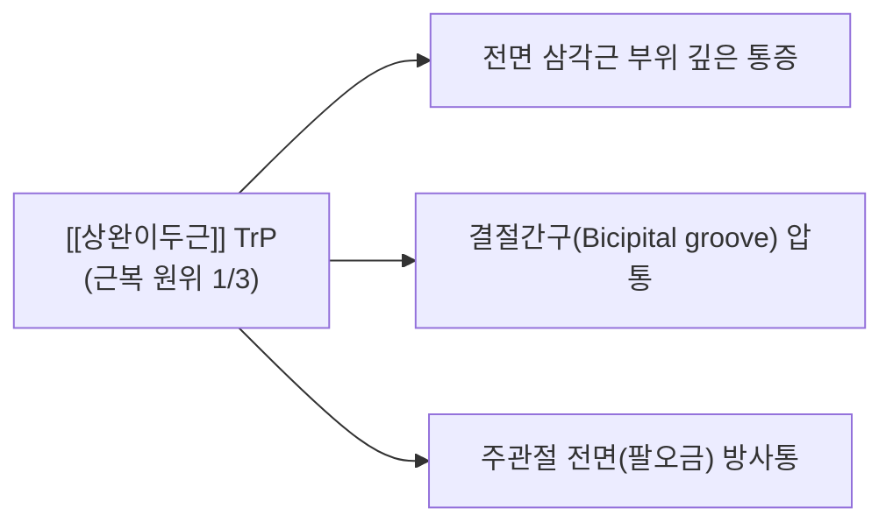

# [[상완이두근]](Biceps Brachii)

> **핵심 요약 (Key Summary)**:
> 견갑골 관절상결절(장두) 및 오훼돌기(단두)에서 기시하여 요골 조면 및 전완 근막 건막(Lacertus fibrosus)에 정지하는 2관절 근육입니다.
> [[근피신경]](C5-C6)의 지배를 받으며, 전완 회외(Supination) 및 주관절 굴곡을 주도하고 장두를 통해 상완골두 하방 안정화에 기여합니다.
> [[상완이두근 장두 건초염]], [[SLAP 병변]], 건 파열(Popeye 변형)의 핵심 근육이며, 복와위 주관절 회내 안전 자침 및 회외-굴곡 복합 재활이 표적입니다.

---
## 📌 목차
1. [해부학적 정밀 구조 및 지배 신경/혈관](#1-해부학적-정밀-구조-및-지배-신경혈관)
2. [생체역학·토크 분석 & 근막 사슬 (Biomechanical Synergy)](#2-생체역학토크-분석--근막-사슬-biomechanical-synergy)
3. [근막통증증후군(TP) & 연관통 패턴 (Travell & Simons)](#3-근막통증증후군tp--연관통-패턴-travell--simons)
4. [초음파 해부학(Sonoanatomy) 및 중재 시술 랜드마크](#4-초음파-해부학sonoanatomy-및-중재-시술-랜드마크)
5. [⭐ 원장님 심층 임상 고찰 및 원본 필기 (Clinical Pearls)](#5-원장님-심층-임상-고찰-및-원본-필기-clinical-pearls)
6. [관련 임상 질환 및 운동손상 증후군 총괄](#6-관련-임상-질환-및-운동손상-증후군-총괄)
7. [추나·도수치료(MET/PIR) & 침구·약침·재활 프로토콜](#7-추나도수치료metpir--침구약침재활-프로토콜)
8. [출처 및 학술 참고 문헌 (References)](#8-출처-및-학술-참고-문헌-references)

---
## 1. 해부학적 정밀 구조 및 지배 신경/혈관

| 항목 | 상세 내용 |
| :--- | :--- |
| **기시 (Origin)** | • **장두(Long head)**: 견갑골 관절상결절(Supraglenoid tubercle) 및 상부 관절와순 (관절강 내부 관통) • **단두(Short head)**: 견갑골 오훼돌기(Coracoid process) 외측 첨부 ([[오훼완근]]과 공통 건 형성) |
| **정지 (Insertion)** | [[요골]](Radius) 조면(Radial tuberosity) 및 전완 내측 건막(Lacertus fibrosus) |
| **신경 지배** | [[근피신경]](Musculocutaneous N., C5-C6) |
| **혈관 공급** | [[상완동맥]](Brachial A.)의 근육 분지들 |
| **해부학적 특징** | 장두 건은 결절간구(Bicipital groove)를 지나 관절낭 내부로 진입하는 특수한 활차 구조를 가짐 |

### 🔬 해부학 도해 및 단면도

![[Biceps_brachii_anatomy.png|450]]
> [Wikimedia Commons / BodyParts3D 공중도메인]: 상완 전면을 주행하여 요골 조면으로 정지하는 [[상완이두근]]의 장두와 단두 해부도.

![[Pasted image 20240120145001.png|332]]
> [구조적 특징]: 장두 건은 결절간구를 통과하여 관절낭 내로 진입하고, 단두는 오훼돌기에서 시작하여 결합합니다.

---
## 2. 생체역학·토크 분석 & 근막 사슬 (Biomechanical Synergy)

### (1) 전완 회외 및 주관절 굴곡 (Supination & Flexion)
* **회외 토크의 핵심**:
  * 팔꿈치가 90° 굴곡된 상태에서 손바닥을 위로 돌리는 **강력한 전완 회외 토크**를 생성합니다 (드라이버 조이기, 문손잡이 돌리기).
  * 굴곡과 회외가 동시에 일어날 때 최대 장력을 발휘합니다.

### (2) 견관절 전방 및 상방 안정화 (장두)
* 장두 건이 상완골두 상부를 활차처럼 누르며, 팔을 외전하거나 굴곡할 때 골두가 상방으로 튀어나오는 것을 억제하여 [[견관절 충돌증후군]]을 방지합니다.

---
## 3. 근막통증증후군(TP) & 연관통 패턴 (Travell & Simons)

### 📍 발통점(TP) 및 임상 방사통 특징

![[Biceps_brachii_TriggerPoints.jpg|450]]
> [Travell & Simons 발통점 도해]: [[상완이두근]] 근복의 TrP와 어깨 전면 결절간구 부위 및 주관절 전면으로 집중되는 방사통 분포.

* **발통점 위치**: 근복 원위 1/3 부위 및 장두 건의 결절간구 통과부.
* **증상 특징**:
  * 무거운 물건을 앞으로 들어 올릴 때 어깨 앞쪽이 쑤시고 찌릿함.
  * 결절간구 압통 및 야간 욱신거림.

---
## 4. 초음파 해부학(Sonoanatomy) 및 중재 시술 랜드마크

* **초음파 스캔 뷰**:
  * 상완골 결절간구 부위에서 횡스캔 시 고에코 원형의 장두건과 이를 둘러싼 건초를 확인합니다.
  * 주관절 전면에서 종스캔 시 요골 조면으로 파고드는 원위부 건 부착부를 확인합니다.

---
## 5. ⭐ 원장님 심층 임상 고찰 및 원본 필기 (Clinical Pearls)

### (1) 운동성 vs 지탱성 근육 감별 (원장님 핵심 임상 팁)
* **임상 팩트**: 현대인들은 운동성을 가지는 [[상완이두근]]보다 **지탱성을 가지는 [[상완근]], [[오훼완근]]의 문제가 훨씬 많습니다**.
* 환자가 팔꿈치나 어깨 앞 통증을 호소할 때 상완이두근만 만지작거리면 치료율이 떨어지며, 심층에서 지속적인 정적 부하를 받는 상완근과 오훼완근을 함께 타깃팅해야 만성 통증이 근본적으로 해결됩니다.

### (2) 안전 자침 기법 (상완동맥 손상 방지)
* 요골 조면 정지부 자침 시 상완동맥 손상을 피하기 위해 **복와위로 주관절을 회내(Pronation)시켜 안전하게 자침**합니다.
* 주관절을 회내시키면 요골 조면이 후외측으로 회전하면서 상완동맥과 정중신경이 주행하는 전내측 위험 구역에서 벗어나 안전 마진이 확보됩니다.

### (3) 상완이두근 이완기법과 관절 작용
* 상완이두근 이완기법은 팔꿈치 관절에 직접 작용하므로, 주관절 신전 제한이 동반된 테니스 엘보나 골퍼스 엘보 환자에게 필수적인 치료 단계입니다.

---
## 6. 관련 임상 질환 및 운동손상 증후군 총괄

| 임상 질환 / 증후군 | 병리적 연관 기전 | 주요 증상 및 이학적 검사 | 핵심 교정 타깃 |
| :--- | :--- | :--- | :--- |
| [[상완이두근 장두 건초염]] | 결절간구 내 반복 마찰로 활액막 염증 | [[Speed Test]] (+) 결절간구 국소 압통 | 건초 소염약침 + 활동 조절 |
| [[SLAP 병변]] | 장두건 기시부 관절와순 견인 손상 | O'Brien Test (+) 팔 거상 시 염발음 | 관절와순 안정화 + 보존 치료 |
| [[상완이두근 파열]] | 만성 건 퇴행으로 인한 급성 파열 | Popeye Sign (원위부 근복 뭉침) | 보존적 재활 또는 수술 의뢰 |
| [[근피신경 포착 증후군]] | 오훼완근/상완이두근 사이 근피신경 압박 | 전완 외측 감각 이상 및 굴곡 약화 | 근막간 침도 박리술 |

---
## 7. 추나·도수치료(MET/PIR) & 침구·약침·재활 프로토콜

### (1) 한의학 경혈 매핑 & 자침법
* **경혈 매핑**: 천부(天府, LU3), 협백(俠白, LU4), 척택(尺澤, LU5), 곡택(曲澤, PC3)
* **자침 기법**:
  * 천부혈, 협백혈 부위에서 근복을 수직 직자하여 TrP를 해소하고, 척택혈 외측에서 건 부착부를 사자합니다.

### (2) 상완이두근 MET (근에너지기법)
* 주관절 신전 및 전완 회내 상태로 제한 장벽을 설정한 후 5초간 굴곡/회외 등척성 저항을 준 뒤 호기 시 부드럽게 신장합니다.

---
## 8. 출처 및 학술 참고 문헌 (References)

1. **Simons, D. G., & Travell, J. G. (1999)**. *Myofascial Pain and Dysfunction: The Trigger Point Manual*, Vol. 1 (2nd ed.). Williams & Wilkins.
   - **[연구 요약]**: 상완이두근 발통점이 전면 삼각근 부위 및 주관절 전면으로 방사하는 통증 패턴 제시.
2. **Andrews, J. R., et al. (1985)**. *Glenoid labrum tears related to the long head of the biceps*. **The American Journal of Sports Medicine**, 13(5), 337-341.
   - **[연구 요약]**: 상완이두근 장두 견인력에 의한 상부 관절와순 전후방 병변(SLAP tear)의 병태생리 최초 규명.
3. **StatPearls (2023)**. *Anatomy, Shoulder and Upper Limb, Biceps Muscle*.
   - **[임상 가이드]**: 근피신경 주행 경로, 상완이두근 활차 복합체 및 주관절 굴곡 역학.
