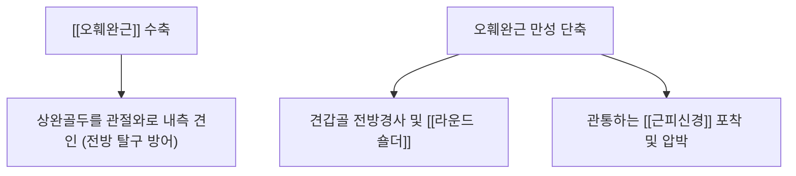
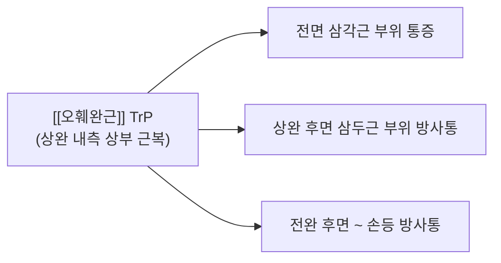

# [[오훼완근]](Coracobrachialis)

> **핵심 요약 (Key Summary)**:
> 견갑골 오훼돌기 첨부에서 기원하여 상완골 내측연 중간부에 정지하는 견관절 전내측의 핵심 굴곡·내전근입니다.
> 근복 중앙을 관통하는 [[근피신경]](C5-C7)의 지배를 받으며, 상완골두를 관절와에 밀착시키고 외전 시 전방 탈구를 방어합니다.
> [[근피신경 포착 증후군]], [[라운드 숄더]](앙와위 어깨 들림), 전방 어깨 통증의 주요 표적근이며, 액와부 신경혈관 회피 안전 촉진 및 침구 치료가 핵심입니다.

---
## 📌 목차
1. [해부학적 정밀 구조 및 지배 신경/혈관](#1-해부학적-정밀-구조-및-지배-신경혈관)
2. [생체역학·토크 분석 & 근막 사슬 (Biomechanical Synergy)](#2-생체역학토크-분석--근막-사슬-biomechanical-synergy)
3. [근막통증증후군(TP) & 연관통 패턴 (Travell & Simons)](#3-근막통증증후군tp--연관통-패턴-travell--simons)
4. [초음파 해부학(Sonoanatomy) 및 중재 시술 랜드마크](#4-초음파-해부학sonoanatomy-및-중재-시술-랜드마크)
5. [⭐ 원장님 심층 임상 고찰 및 원본 필기 (Clinical Pearls)](#5-원장님-심층-임상-고찰-및-원본-필기-clinical-pearls)
6. [관련 임상 질환 및 운동손상 증후군 총괄](#6-관련-임상-질환-및-운동손상-증후군-총괄)
7. [추나·도수치료(MET/PIR) & 침구·약침·재활 프로토콜](#7-추나도수치료metpir--침구약침재활-프로토콜)
8. [출처 및 학술 참고 문헌 (References)](#8-출처-및-학술-참고-문헌-references)

---
## 1. 해부학적 정밀 구조 및 지배 신경/혈관

| 항목 | 상세 내용 |
| :--- | :--- |
| **기시 (Origin)** | 견갑골 [[오훼돌기]](Coracoid process) 첨부 ([[상완이두근]] 단두와 공통 건 형성) |
| **정지 (Insertion)** | [[상완골]](Humerus) 체부 내측연 중간 1/3 지점 |
| **신경 지배** | [[근피신경]](Musculocutaneous N., C5-C7) - **신경이 근복을 직접 관통(Pierce)** |
| **혈관 공급** | [[상완동맥]](Brachial A.)의 근육 분지 |
| **해부학적 특징** | 액와 신경혈관 다발(상완신경총, 액와동정맥)의 바로 외측을 감싸며 주행 |

### 🔬 해부학 도해 및 단면도

![[Coracobrachialis_anatomy.png|450]]
> [Wikimedia Commons / BodyParts3D 공중도메인]: 오훼돌기 첨부에서 기시하여 상완골 내측연으로 정지하는 [[오훼완근]]의 전면 해부도.

![[Pasted image 20240120144721.png|481]]
> [구조적 특징]: 오훼돌기에서 상완골 내측으로 주행하며 근피신경이 근복을 뚫고 지나가는 모습을 보여줍니다.

![[Pasted image 20240120144902.png|563]]
> [오훼완근 주행 및 신경 관계]: 액와 신경혈관 다발과 인접하여 주행하는 오훼완근 해부도.

---
## 2. 생체역학·토크 분석 & 근막 사슬 (Biomechanical Synergy)

### (1) 견관절 굴곡 및 내전 (Flexion & Adduction)
* 팔을 앞으로 들어 올리고 몸통 안쪽으로 모으는 동작을 보조합니다 (벽 밀기, 짐 들기).

### (2) 견관절 전방 탈구 방어 기전
* 상완골을 견갑골 관절와 방향으로 강력하게 당겨주어 팔이 외전 및 외회전될 때 **상완골두의 전방 탈구를 기계적으로 방지**합니다.

---
## 3. 근막통증증후군(TP) & 연관통 패턴 (Travell & Simons)

### 📍 발통점(TP) 및 임상 방사통 특징

![[Coracobrachialis_TriggerPoints.jpg|450]]
> [Travell & Simons 발통점 도해]: [[오훼완근]] TrP와 전면 삼각근, 상완 후면, 그리고 손등으로 퍼져나가는 연관통 분포.

* **발통점 위치**: 겨드랑이 바로 아래 상완 내측 상부 근복.
* **증상 특징**:
  * 등 뒤로 손을 올리는 열중쉬어 동작 시 어깨 앞쪽과 팔 뒤쪽에 쑤시는 통증.
  * 손등과 전완 외측으로 찌릿한 저림 동반.

---
## 4. 초음파 해부학(Sonoanatomy) 및 중재 시술 랜드마크

* 액와 주름 상방에서 프로브를 위치시키면 상완이두근 단두 바로 내측에서 상완골 내측연으로 붙는 오훼완근과, **근복 중앙을 관통하는 고에코 타원형의 근피신경**을 실시간으로 식별할 수 있습니다.
* 내측의 상완동맥 및 정중신경 다발을 컬러 도플러로 확인하여 손상을 절대 회피합니다.

---
## 5. ⭐ 원장님 심층 임상 고찰 및 원본 필기 (Clinical Pearls)

### (1) [[라운드 숄더]] 진단 (앙와위 어깨 들림) (원장님 핵심 팁)
* **임상 팩트**: **오훼완근이 단축되면 어깨를 앞으로 말리게 만들어, 환자가 베개 없이 반듯하게 누웠을 때(앙와위) 어깨가 바닥에 닿지 않고 위로 붕 들뜨게 됩니다**.
* 앙와위 어깨 들림 검사 시 [[소흉근]]과 함께 [[오훼완근]]의 단축을 반드시 평가해야 합니다.

### (2) [[근피신경]] 관통과 포착 증후군
* **해부학적 위험성**: [[근피신경]]이 [[오훼완근]] 근복을 직접 관통(Pierce)하므로 근육이 경직되면 신경이 바로 조여집니다.
* 전완 외측 저림과 함께 [[상완이두근]], [[상완근]]의 근력 약화가 동반될 때 경추 디스크로 오진하기 쉬우므로 [[오훼완근]] 압통 검사가 필수적입니다.
* 미용사, 도배사, 운전기사 등 장시간 팔을 든 채 일하는 직업군에서 만성 단축이 호발합니다.

### (3) 원장님 정밀 촉진법 (신경혈관 손상 절대 회피)
* 액와부에서 시작하여 [[상완이두근]]과 [[상완삼두근]] 사이를 손가락으로 부드럽게 파고들어 오훼완근 근복을 확인합니다.
* **주의사항**: 중간에 주행하는 **상완신경총 신경 다발과 상완동맥/정맥을 절대 강하게 누르거나 찌르지 않도록 주의**하며 상완골 내측 골면을 기준으로 안전하게 촉진합니다.

---
## 6. 관련 임상 질환 및 운동손상 증후군 총괄

| 임상 질환 / 증후군 | 병리적 연관 기전 | 주요 증상 및 이학적 검사 | 핵심 교정 타깃 |
| :--- | :--- | :--- | :--- |
| [[근피신경 포착 증후군]] | 근복 관통 부위에서 근피신경 섬유성 압박 | 전완 외측 피부 저림, 팔꿈치 굴곡 무력감 | 오훼완근 침도 박리 + 신경가동술 |
| [[라운드 숄더]] | 오훼돌기를 전하방으로 당겨 견갑골 전방경사 | 앙와위 어깨 들림, 견봉하 충돌 유발 | 오훼완근 스트레칭 + 능형근 강화 |
| [[어깨 전방 불안정성]] | 오훼완근 약화 시 상완골두 전방 지지 부전 | 외전/외회전 시 전방 아탈구 불안감 | 오훼완근 협응 강화 훈련 |

---
## 7. 추나·도수치료(MET/PIR) & 침구·약침·재활 프로토콜

### (1) 한의학 경혈 매핑 & 자침 포인트
* **경혈 매핑**: 극천(極泉, HT1), 청령(靑靈, HT2), 천부(天府, LU3)
* **자침 기법**:
  * 극천혈 외하방 1촌 부위에서 상완골 내측 골면을 향해 사자하여 혈관 손상을 피하면서 오훼완근 정지부를 자극합니다.

### (2) 오훼완근 MET (근에너지기법)
* 환자의 팔을 90° 이상 외전, 신전 및 외회전시켜 오훼완근의 제한 장벽에 둡니다.
* 환자에게 "20% 힘으로 팔을 안쪽으로 모으세요(내전 저항)"라고 지시하며 5초간 등척성 수축 후 호기 시 부드럽게 신장합니다.

---
## 8. 출처 및 학술 참고 문헌 (References)

1. **Simons, D. G., & Travell, J. G. (1999)**. *Myofascial Pain and Dysfunction: The Trigger Point Manual*, Vol. 1 (2nd ed.). Williams & Wilkins.
   - **[연구 요약]**: 오훼완근 발통점이 전면 삼각근, 상완 후면 및 손등으로 방사하는 연관통 패턴 규명.
2. **Flatow, E. L., Bigliani, L. U., & April, E. W. (1989)**. An anatomic study of the musculocutaneous nerve and its relationship to the coracoid process. *Clin Orthop Relat Res*, (244), 166-171. [PMID: 2743658](https://pubmed.ncbi.nlm.nih.gov/2743658/)
   - **[연구 요약]**:  오훼돌기와 근피신경의 해부학적 관계를 사체로 규명 — 오훼완근 부착부 주변 신경차단·수술 시 신경 손상 방지의 해부학적 근거.
3. **StatPearls (2023)**. *Anatomy, Shoulder and Upper Limb, Coracobrachialis Muscle*.
   - **[임상 가이드]**: 근피신경 관통 변이 및 오훼완근 관련 전방 어깨 충돌 감별 진단.