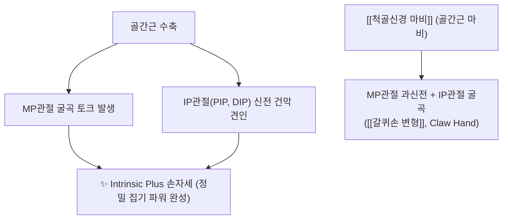
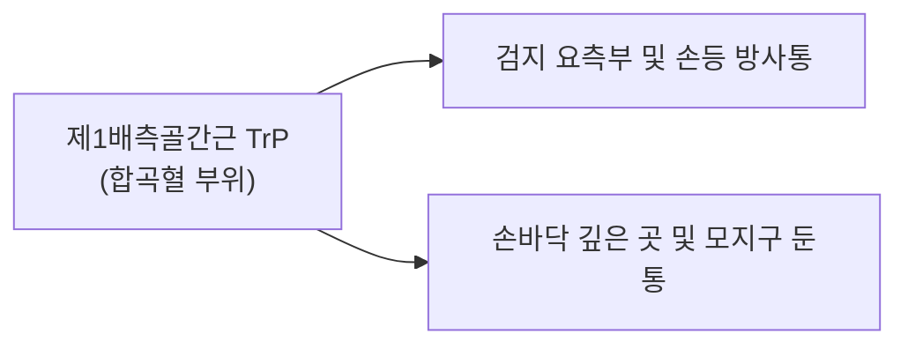

---
aliases:
  - Interossei
  - 골간근
  - 뼈사이근
  - 배측골간근
  - 장측골간근
---

# [[골간근]](Interossei Muscles)

> **핵심 요약 (Key Summary)**:
> 수부 중수골 및 족부 중족골 사이에 위치하는 심부 고유 내재근으로 배측골간근(DAB, 외전)과 장측·저측골간근(PAD, 내전)으로 구성됩니다.
> 수부는 [[척골신경]] 심지, 족부는 [[외측족저신경]] 심지의 지배를 받으며, MP관절 굴곡 및 IP관절 신전(Z-movement)으로 정밀 집기력을 완성합니다.
> [[척골신경 마비]] 시 수부 골간근 위축과 [[Froment Sign]], 갈퀴손 변형을 초래하며, 합곡·팔사혈 약침 및 중수골간 횡가동 추나가 핵심입니다.

---
## 📌 목차
1. [해부학적 분류 및 수부·족부 대비 (DAB vs PAD)](#1-해부학적-분류-및-수부족부-대비-dab-vs-pad)
2. [생체역학·토크 분석 & Z-movement (Biomechanical Synergy)](#2-생체역학토크-분석--z-movement-biomechanical-synergy)
3. [근막통증증후군(TP) & 연관통 패턴 (Travell & Simons)](#3-근막통증증후군tp--연관통-패턴-travell--simons)
4. [초음파 해부학(Sonoanatomy) 및 중재 시술 랜드마크](#4-초음파-해부학sonoanatomy-및-중재-시술-랜드마크)
5. [⭐ 원장님 심층 임상 고찰 및 원본 필기 (Clinical Pearls)](#5-원장님-심층-임상-고찰-및-원본-필기-clinical-pearls)
6. [관련 임상 질환 및 신경학적 평가 총괄](#6-관련-임상-질환-및-신경학적-평가-총괄)
7. [추나·도수치료(MET/PIR) & 침구·약침·재활 프로토콜](#7-추나도수치료metpir--침구약침재활-프로토콜)
8. [출처 및 학술 참고 문헌 (References)](#8-출처-및-학술-참고-문헌-references)

---
## 1. 해부학적 분류 및 수부·족부 대비 (DAB vs PAD)

| 구분 | 배측골간근 (Dorsal Interossei, DI) | 장측/저측골간근 (Palmar/Plantar Interossei, PI) |
| :--- | :--- | :--- |
| **기억 공식** | DAB (Dorsal = ABduction, 벌림) | PAD (Palmar/Plantar = ADduction, 모음) |
| **수부 중심축** | 제3수지(중지, Middle finger) 축 | 제3수지를 향해 모음 |
| **족부 중심축** | 제2족지(Second toe) 축 | 제2족지를 향해 모음 |
| **수부 신경 지배** | [[척골신경]] 심지 (Deep branch of ulnar N., C8-T1) | [[척골신경]] 심지 (C8-T1) |
| **족부 신경 지배** | [[외측족저신경]] 심지 (Deep branch of lateral plantar N., S1-S2) | [[외측족저신경]] 심지 (S1-S2) |

### 🔬 해부학 도해 및 단면도

![[Dorsal_interossei_hand_anatomy.png|450]]
> [Gray's Anatomy 공중도메인]: 중수골 사이에서 깃모양(Bipennate)으로 기시하여 손가락을 벌리는 배측골간근(Dorsal interossei)의 해부도.

![[Palmar_interossei_anatomy.png|450]]
> [Gray's Anatomy 공중도메인]: 제2, 4, 5중수골 장측에서 기시하여 중지를 향해 모아주는 장측골간근(Palmar interossei)의 해부도.

---
## 2. 생체역학·토크 분석 & Z-movement (Biomechanical Synergy)

### (1) 충양근과의 협동 작용 (Intrinsic Plus Position)
* 골간근의 건 섬유는 중수수지(MP) 관절의 굴곡 회전축 앞쪽(장측)을 지나고, 지간(IP) 관절의 신전 회전축 뒤쪽(배측 신근건막)으로 주행합니다.
* 따라서 수축 시 **MP관절은 굴곡(Flexion)시키고, 근위 및 원위 지간(PIP, DIP)관절은 신전(Extension)**시키는 특유의 Z자 집기 자세(Z-movement, Intrinsic Plus)를 완성합니다.

---
## 3. 근막통증증후군(TP) & 연관통 패턴 (Travell & Simons)

### 📍 발통점(TP) 및 임상 방사통 특징

![[First_dorsal_interosseus_TriggerPoints.jpg|450]]
> [Travell & Simons 발통점 도해]: 제1배측골간근(FDI) TrP와 검지 외측(요측) 및 손등, 손바닥 깊은 부위로 퍼지는 연관통 분포.

* **발통점 위치**: 제1중수골과 제2중수골 사이 근복 중앙 (합곡혈 부위).
* **특징적 증상**:
  * 펜을 쥐거나 열쇠를 돌릴 때(Key pinch) 엄지와 검지 사이에 심한 쑤심과 쥐어짜는 듯한 통증.
  * 손가락 마디마디가 뻣뻣하고 관절염으로 오진되기 쉬운 손가락 측면 통증.

---
## 4. 초음파 해부학(Sonoanatomy) 및 중재 시술 랜드마크

* **초음파 스캔 뷰**:
  * 손등에서 중수골 사이에 프로브를 횡으로 위치시키면 중수골 단면 사이에 끼여 있는 배측골간근과 심층의 장측골간근 층판을 관찰할 수 있습니다.
  * 컬러 도플러로 중수골 사이를 관통하는 장측/배측 중수동맥의 주행을 확인하고 혈관 손상을 회피합니다.

---
## 5. ⭐ 원장님 심층 임상 고찰 및 원본 필기 (Clinical Pearls)

### (1) 프로망 징후(Froment Sign) 감별 진단 노하우
* **검사 방법**: 환자에게 엄지와 검지 사이에 얇은 종이나 명함을 꽉 쥐게 하고, 검사자가 이를 강하게 빼앗으려 당깁니다.
* **병적 반응**:
  * 척골신경 마비로 제1배측골간근과 무지내전근이 약화된 환자는 종이를 놓치지 않기 위해 **정중신경 지배의 장무지굴근(FPL)을 보상 수축시켜 엄지 끝관절(IP 관절)을 갈고리처럼 굽히는 현상(Froment Sign 양성)**을 보입니다.

### (2) 중수골간 횡방향 가동술 (추나 이완 팁)
* 중수골 사이를 양손 엄지로 위아래로 잡고 전후(손등-손바닥) 방향으로 미세하게 엇갈려 활주시추면(Metacarpal shear mobilization), 만성 마우스 사용이나 타이핑으로 굳어진 골간근의 경결과 수부 횡아치 유착이 수초 만에 부드럽게 풀립니다.

### (3) 합곡(合谷)혈 및 팔사(八邪)혈 침구·약침 임상 노하우
* **합곡(LI4)**: 제1배측골간근 중심부로, 직자 시 제1배측골간근을 관통하여 심부 무지내전근까지 도달하며 수부 신경 흥분을 진정시킵니다.
* **팔사(EX-UE9)**: 손가락 사이 물갈퀴 부위에서 중수골 사이 공간을 향해 1~1.5촌 사자하면 각 골간근의 건막 유착을 신속히 박리할 수 있습니다.

---
## 6. 관련 임상 질환 및 신경학적 평가 총괄

| 임상 질환 / 증후군 | 병리적 연관 기전 | 주요 증상 및 이학적 검사 | 핵심 교정 타깃 |
| :--- | :--- | :--- | :--- |
| [[갈퀴손 변형]](Claw Hand) | 척골신경 마비로 골간근 및 충양근 마비 | 제4, 5지 MP관절 과신전 + IP관절 굴곡 | 척골신경 감압 + 골간근 재생 약침 |
| [[Froment Sign 양성]] | 제1배측골간근 및 무지내전근 근력 저하 | 종이 당길 때 엄지 IP관절 굴곡 보상 | 내재근 강화 + 정중신경 과부하 완화 |
| [[중수골간 근위축]] | 경추 신경근증 또는 흉곽출구증후군 만성화 | 손등 중수골 사이가 푹 꺼지는 위축 | 팔사혈 약침 + 신경가동술 |

---
## 7. 추나·도수치료(MET/PIR) & 침구·약침·재활 프로토콜

### (1) 한의학 경혈 매핑 & 약침 프로토콜
* **경혈 매핑**: 합곡(合谷, LI4), 팔사(八邪, EX-UE9), 태충(LR3), 팔풍(八風, EX-LE10)
* **약침 처방**:
  * 척골신경 마비 및 골간근 위축 부위에 신바로약침 또는 자하거약침을 각 골간강마다 0.2ml씩 분주하여 근위축 회복 및 신경 재생을 유도합니다.

### (2) 내재근 강화 운동 (Intrinsic Muscle Exercise)
* 수건 집기 운동, 손가락 사이에 고무줄을 끼우고 벌리는 외전 저항 운동을 통해 수부 정밀 집기력을 재교육합니다.

---
## 8. 출처 및 학술 참고 문헌 (References)

1. **Neumann, D. A. (2017)**. *Kinesiology of the Musculoskeletal System: Foundations for Rehabilitation* (3rd ed.). Elsevier.
   - **[연구 요약]**: 수부 및 족부 골간근의 DAB/PAD 생체역학, Intrinsic-plus 자세 형성 및 신근건막과의 기능적 연계 분석.
2. **Standring, S. (2020)**. *Gray's Anatomy: The Anatomical Basis of Clinical Practice* (42nd ed.). Elsevier.
   - **[연구 요약]**: 장측 및 배측 골간근의 기시·정지 해부학, 척골신경 심지 및 외측족저신경 지배 경로 총괄.
3. **Travell, J. G., & Simons, D. G. (1999)**. *Myofascial Pain and Dysfunction: The Trigger Point Manual*, Vol. 1 (2nd ed.). Williams & Wilkins.
   - **[연구 요약]**: 제1배측골간근 TrP에 의한 손등 및 검지 방사통 지도 제시.
