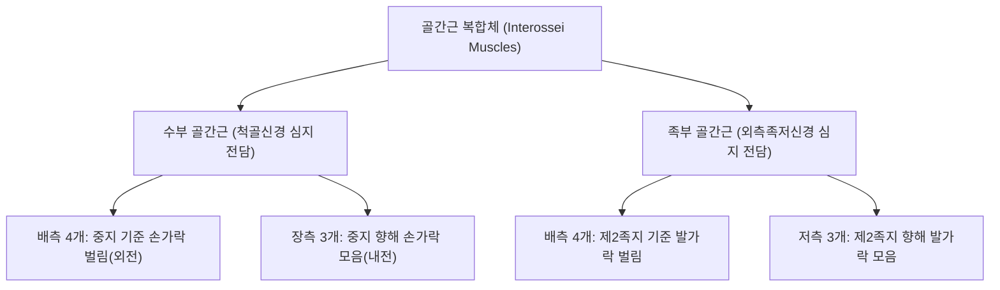

# 🫁 [[골간근]] (Interossei Muscles)

> **핵심 요약 (Key Summary)**:
> 수부 중수골 및 족부 중족골 사이에 위치하는 심부 고유 내재근으로 배측골간근과 장측(저측)골간근으로 구성.
> 수부는 척골신경 심지가 지배하고 족부는 외측족저신경 심지가 지배하며 DAB(배측 외전)과 PAD(장측 내전) 원리로 손발가락 미세 정렬을 제어.
> 척골신경 마비 시 수부 골간근 위축(갈퀴손 변형)과 프로망 징후를 유발하며 족부 횡아치 붕괴 방지를 위한 내재근 강화 재활과 약침 치료의 표적.

---
## 📌 목차
1. [해부학적 분류 및 수부·족부 대비 (DAB vs PAD)](#1-해부학적-분류-및-수부족부-대비-dab-vs-pad)
2. [수부 골간근 (Palmar & Dorsal Interossei of Hand)](#2-수부-골간근-palmar--dorsal-interossei-of-hand)
3. [족부 골간근 (Plantar & Dorsal Interossei of Foot)](#3-족부-골간근-plantar--dorsal-interossei-of-foot)
4. [생체역학적 기능: MP관절 굴곡·IP관절 신전 (Z-Movement)](#4-생체역학적-기능-mp관절-굴곡ip관절-신전-z-movement)
5. [관련 임상 질환 및 신경학적 평가 (갈퀴손 & Froment Sign)](#5-관련-임상-질환-및-신경학적-평가-갈퀴손--froment-sign)
6. [추나·도수치료(내재근 근막이완술) & 침구·약침 치료 프로토콜](#6-추나도수치료내재근-근막이완술--침구약침-치료-프로토콜)
7. [출처 및 학술 참고 문헌 (References)](#7-출처-및-학술-참고-문헌-references)

---
## 1. 해부학적 분류 및 수부·족부 대비 (DAB vs PAD)

| 구분 | 배측골간근 (Dorsal Interossei, DI) | 장측/저측골간근 (Palmar/Plantar Interossei, PI) |
| :--- | :--- | :--- |
| **기억 공식** | **DAB (Dorsal = ABduction)** | **PAD (Palmar/Plantar = ADduction)** |
| **수부 중심축** | 제3수지(중지, Middle finger) 축 | 제3수지를 향해 모음 |
| **족부 중심축** | 제2족지(Second toe) 축 | 제2족지를 향해 모음 |
| **수부 신경 지배** | [[척골신경]] 심지 (Deep branch of ulnar n., C8-T1) | 척골신경 심지 (C8-T1) |
| **족부 신경 지배** | [[외측족저신경]] 심지 (Deep branch of lateral plantar n., S1-S2) | 외측족저신경 심지 (S1-S2) |

---
## 2. 수부 골간근 (Palmar & Dorsal Interossei of Hand)

* **수부 배측골간근 (4개)**:
  * 인접한 두 중수골 사이에서 깃모양(Bipennate)으로 기시하여 기위지골 기저부 및 신근건막에 정지.
  * **제1배측골간근 (First Dorsal Interosseous, FDI)**: 엄지와 검지 사이 합곡(LI4) 부위의 가장 크고 두터운 근육으로, 열쇠 집기(Key pinch) 시 검지의 외전력을 전담.
* **수부 장측골간근 (3개)**:
  * 제2, 4, 5 중수골의 손바닥 쪽 단일 뼈 표면에서 단모양(Unipennate)으로 기시하여 중지를 향해 손가락을 모읍니다.

---
## 3. 족부 골간근 (Plantar & Dorsal Interossei of Foot)

* **족부 배측골간근 (4개)**:
  * 제2발가락을 축으로 하여 발가락을 벌리며, 보행 시 발가락이 겹치지 않도록 간격을 유지합니다.
* **족부 저측골간근 (3개)**:
  * 제3, 4, 5 중족골 내측에서 기시하여 제2발가락 쪽으로 발가락을 모으고, 족부 횡아치(Transverse arch)를 단단히 조여줍니다.

---
## 4. 생체역학적 기능: MP관절 굴곡·IP관절 신전 (Z-Movement)

* **충양근과의 협동 작용 (Intrinsic Plus Position)**:
  * 골간근의 건 섬유는 중수수지(MP) 관절의 굴곡 회전축 앞쪽(장측)을 지나고, 지간(IP) 관절의 신전 회전축 뒤쪽(배측 신근건막)으로 주행합니다.
  * 따라서 수축 시 **MP관절은 굴곡(Flexion)시키고, 근위 및 원위 지간(PIP, DIP)관절은 신전(Extension)**시키는 특유의 Z자 집기 자세(Z-movement)를 완성합니다.

---
## 5. 관련 임상 질환 및 신경학적 평가 (갈퀴손 & Froment Sign)

1. **갈퀴손 변형 (Claw Hand / Ulnar Claw)**:
   * 척골신경 마비 시 골간근과 제3, 4 충양근이 마비되어 MP관절은 과신전되고 IP관절은 굴곡되는 갈퀴손 변형 발생(제4, 5지 호발).
2. **프로망 징후 (Froment's Sign)**:
   * 종이 한 장을 엄지와 검지 사이에 끼우고 당길 때, 내전근과 제1배측골간근 근력 저하로 인해 정중신경 지배의 장무지굴근(FPL)을 과도하게 보상 수축시켜 엄지 끝관절이 굽어지는 현상.
3. **중수골간 근위축 (Interosseous Wasting)**:
   * 경추 C8-T1 신경근증, 흉곽출구증후군, 완관절 기용관 증후군 시 손등 중수골 사이가 푹 꺼지는 근위축 호발.

---
## 6. 추나·도수치료(내재근 근막이완술) & 침구·약침 치료 프로토콜

### 1) 수부 및 족부 도수 이완 기법
* **중수골간 횡방향 가동술**:
  * 중수골 사이를 양손 엄지로 잡고 전후 방향으로 미세하게 엇갈려 활주시추어 골간근의 경결과 유착을 이완.
* **내재근 강화 운동 (Intrinsic Muscle Exercise)**:
  * 수건 집기, 고무줄 손가락 벌리기 운동을 통해 척골신경 마비 후유증 및 평발 횡아치 붕괴 방지.

### 2) 침구 및 약침 치료
* **주요 혈위**:
  * 합곡(合谷, LI4): 제1배측골간근 중심부 핵심 혈위.
  * 팔사(八邪, EX-UE9): 손가락 사이 골간근 기저부 혈위.
  * 팔풍(八風, EX-LE10), 태충(LR3): 족부 골간근 이완 혈위.
* **약침 프로토콜**:
  * 척골신경 마비 또는 골간근 위축 부위에 신바로 약침 또는 자하거 약침을 각 골간강마다 0.2cc씩 분주하여 근위축 회복 및 신경 재생 유도.

---
## 7. 출처 및 학술 참고 문헌 (References)

* Neumann DA. *Kinesiology of the Musculoskeletal System: Foundations for Rehabilitation*. 3rd ed. Elsevier; 2017.
  * `[연구 요약]` 수부 및 족부 골간근의 DAB/PAD 생체역학, Intrinsic-plus 자세 형성 및 신근건막과의 기능적 연계 분석.
* Standring S. *Gray's Anatomy: The Anatomical Basis of Clinical Practice*. 42nd ed. Elsevier; 2020.
  * `[연구 요약]` 장측 및 배측 골간근의 기시·정지 해부학, 척골신경 심지 및 외측족저신경 지배 경로 총괄.
* 대한침구의학회 교재편찬위원회. *침구의학*. 집문당; 2020.
  * `[연구 요약]` 팔사혈 및 합곡혈 침구 자극이 말초성 수부 마비 및 골간근 위축 회복에 미치는 임상 효과.
