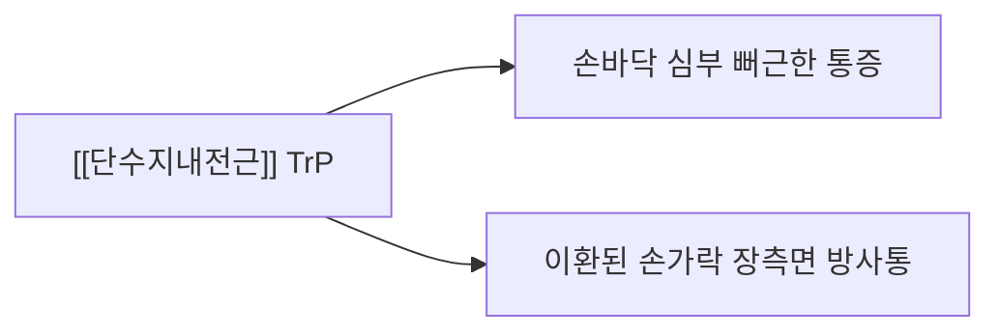

---
aliases:
  - 단수지내전근
  - 수지내전근
  - Adductor digiti
  - Palmar interossei
---

# [[단수지내전근]](Adductor Digiti / Palmar Interossei)

> **핵심 요약 (Key Summary)**:
> 제2, 4, 5중수골 장측면에서 기원하여 해당 손가락 근위지골 기저부 및 신근건막에 정지하는 손바닥 심층의 손가락 모음근군(장측골간근)입니다.
> [[척골신경]] 심부 분지(Deep branch, C8-T1)의 지배를 받으며, 중지(제3지) 중심선을 향해 손가락을 모으는 내전(PAD)을 전담합니다.
> [[척골신경 마비]], 손가락 밀착력 상실, 손바닥 횡아치 불안정의 핵심 표적근이며, Card Test, 노궁·팔사혈 침구 및 장측 근막 이완이 표적입니다.

---
## 📌 목차
1. [해부학적 정밀 구조 및 지배 신경/혈관](#1-해부학적-정밀-구조-및-지배-신경혈관)
2. [생체역학·토크 분석 & 내전 짝힘 (Biomechanical Synergy)](#2-생체역학토크-분석--내전-짝힘-biomechanical-synergy)
3. [근막통증증후군(TP) & 연관통 패턴 (Travell & Simons)](#3-근막통증증후군tp--연관통-패턴-travell--simons)
4. [초음파 해부학(Sonoanatomy) 및 중재 시술 랜드마크](#4-초음파-해부학sonoanatomy-및-중재-시술-랜드마크)
5. [⭐ 원장님 심층 임상 고찰 및 원본 필기 (Clinical Pearls)](#5-원장님-심층-임상-고찰-및-원본-필기-clinical-pearls)
6. [관련 임상 질환 및 운동손상 증후군 총괄](#6-관련-임상-질환-및-운동손상-증후군-총괄)
7. [추나·도수치료(MET/PIR) & 침구·약침·재활 프로토콜](#7-추나도수치료metpir--침구약침재활-프로토콜)
8. [출처 및 학술 참고 문헌 (References)](#8-출처-및-학술-참고-문헌-references)

---
## 1. 해부학적 정밀 구조 및 지배 신경/혈관

| 항목 | 상세 내용 |
| :--- | :--- |
| **기시 (Origin)** | 제2, 4, 5 중수골(Metacarpal bone) 체부 장측면 (각 근육 단일 뼈에서 기시) |
| **정지 (Insertion)** | 제2, 4, 5지 근위지골 기저부 및 신근건막 (제3지를 향해 모이도록 부착) |
| **신경 지배** | [[척골신경]](Ulnar N., C8-T1) 심부 분지(Deep branch) |
| **혈관 공급** | 심장측동맥궁(Deep palmar arch) 및 장측중수동맥 분지 |
| **해부학적 특징** | 손바닥 심층에서 배측골간근보다 전방에 위치하며, 3개의 독립된 근육으로 제3수지(중지) 축을 향해 손가락을 모아주는 내전 기능 전담 |

### 🔬 해부학 도해 및 단면도

![[Palmar_interossei_anatomy.png|450]]
> [Gray's Anatomy 공중도메인]: 제2, 4, 5중수골 장측에서 기시하여 중지를 향해 정지하는 장측골간근([[단수지내전근]])의 해부도.

---
## 2. 생체역학·토크 분석 & 내전 짝힘 (Biomechanical Synergy)

### (1) 손가락 내전 (PAD: Palmar interossei ADduct)
* 제3지(중지)를 기준으로 벌어진 손가락들을 손바닥 중심선으로 꽉 모아주는 주동근입니다.
* 종이나 물건을 손가락 사이에 끼우고 떨어뜨리지 않도록 유지하는 정밀 파지력을 발휘합니다.

### (2) MCP 관절 굴곡 + IP 관절 신전 (Z-movement 협동)
* [[충양근]]과 함께 작용하여 MP관절을 굴곡시키고 IP관절을 신전시켜 손가락이 꼬이지 않고 반듯하게 펴지며 쥐어지도록 안내합니다.

---
## 3. 근막통증증후군(TP) & 연관통 패턴 (Travell & Simons)

### 📍 발통점(TP) 및 임상 방사통 특징

![[Adductor_pollicis_TriggerPoints.jpg|450]]
> [Travell & Simons 발통점 도해]: 손바닥 심부 내재근군(수지내전근/무지내전근)의 TrP와 손바닥 및 손가락으로 퍼지는 연관통 분포.

* 손바닥 안쪽 깊숙이 쥐어짜는 듯한 통증을 유발하며, 물건을 꽉 쥘 때 손가락 사이가 벌어지거나 힘이 빠지는 무력감을 호소합니다.

---
## 4. 초음파 해부학(Sonoanatomy) 및 중재 시술 랜드마크

* 손바닥 면에서 중수골 사이를 스캔하여 굴곡건 심층에 위치하는 장측골간근 근복을 확인하며, 심장측동맥궁 혈관 주행을 피하여 안전하게 접근합니다.

---
## 5. ⭐ 원장님 심층 임상 고찰 및 원본 필기 (Clinical Pearls)

### (1) Card Test(카드 검사) 임상 활용법 (원장님 핵심 팁)
* 환자의 손가락(예: 검지와 중지, 또는 약지와 소지) 사이에 명함이나 카드를 끼우게 한 후 시술자가 이를 잡아당깁니다.
* 척골신경 마비 또는 단수지내전근 약화가 있을 경우, 손가락을 모으는 힘(PAD)이 떨어져 카드가 저항 없이 쑥 빠져나옵니다.

### (2) 노궁(PC8) - 팔사(八邪) 연계 침도 미세 박리술
* 손바닥 중앙 노궁혈과 손가락 사이 팔사혈 부위에서 장측 골간 근막 유착을 침도로 미세 절개하면 만성 방아쇠수지 후유증이나 수부 뻣뻣함이 극적으로 개선됩니다.

---
## 6. 관련 임상 질환 및 운동손상 증후군 총괄

| 임상 질환 / 증후군 | 병리적 연관 기전 | 주요 증상 및 이학적 검사 | 핵심 교정 타깃 |
| :--- | :--- | :--- | :--- |
| [[척골신경 마비]] | 기용관 또는 주관 증후군 압박으로 내재근 마비 | Card Test (+) 손가락 내전력 상실 | 척골신경 감압 + 장측골간근 자극 |
| [[손바닥 아치 붕괴]] | 장측골간근 약화로 횡아치 장력 저하 | 장시간 필기나 타자 시 손바닥 피로 | 내재근 강화 운동 |

---
## 7. 추나·도수치료(MET/PIR) & 침구·약침·재활 프로토콜

### (1) 한의학 경혈 매핑 & 자침 포인트
* **경혈 매핑**: 노궁(勞宮, PC8), 팔사(八邪, EX-UE9)
* **자침 기법**: 손바닥 쪽에서 중수골 골면을 따라 부드럽게 사자하여 장측골간근 경결을 해소합니다.

### (2) 수지간 내전 저항 MET
* 환자가 손가락을 모으려 할 때 검사자가 손가락 사이에 손가락을 넣어 5초간 등척성 저항을 준 후 이완시키는 수기 교정을 적용합니다.

---
## 8. 출처 및 학술 참고 문헌 (References)

1. **Standring, S. (2020)**. *Gray's Anatomy: The Anatomical Basis of Clinical Practice* (42nd ed.). Elsevier.
   - **[연구 요약]**: 장측골간근(단수지내전근)의 중수골 기시 해부학 및 척골신경 심지 지배 경로 분석.
2. **Travell, J. G., & Simons, D. G. (1999)**. *Myofascial Pain and Dysfunction: The Trigger Point Manual*, Vol. 1 (2nd ed.). Williams & Wilkins.
   - **[연구 요약]**: 수지내전근 발통점이 손가락 장측 및 수간부로 방사하는 연관통 지도 제시.
* Yi KH, Lee KW, Hwang Y, An MH, Ahn HS, et al. *Intramuscular neural distribution of the adductor pollicis muscle in a cadaver model regarding botulinum neurotoxin injection*. Yonsei Med J, 2023; 64(9): 581-585. [PMID: 37634635](https://pubmed.ncbi.nlm.nih.gov/37634635/)
   * `[연구 요약]`: 무지내전근의 근육 내 신경분포(척골신경 심지)를 해부로 매핑 — 보툴리눔 독소 주입·신경차단 시 안전한 주입 부위의 해부학적 근거.
