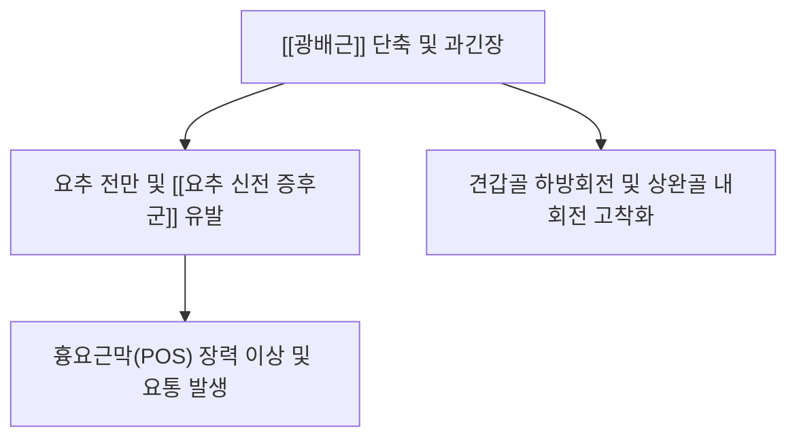

---
aliases:
  - 광배근
  - Latissimus dorsi
---
# [[광배근]](Latissimus Dorsi)

> **핵심 요약 (Key Summary)**:
> 흉추 T7~T12 극돌기, 흉요근막, 장골능, 하부 3~4개 늑골 및 견갑골 하각에서 기원하여 상완골 결절간구 바닥에 정지하는 인체 최대 면적의 광범위 등 근육입니다.
> [[흉배신경]](Thoracodorsal nerve, C6-C8)의 지배를 받으며, 상완골의 신전·내전·내회전을 주도하고 폐쇄 사슬 운동 시 체간을 거상시킵니다.
> [[요추 신전 증후군]], 견갑골 하방회전 증후군, 흉요근막 긴장성 요통의 핵심 병변근이며, 견정혈 하방 꼬임점 도침 및 흉요근막 감압이 표적입니다.

---
## 📌 목차
1. [해부학적 정밀 구조 및 지배 신경/혈관](#1-해부학적-정밀-구조-및-지배-신경혈관)
2. [생체역학·토크 분석 & 근막 사슬 (Biomechanical Synergy)](#2-생체역학토크-분석--근막-사슬-biomechanical-synergy)
3. [근막통증증후군(TP) & 연관통 패턴 (Travell & Simons)](#3-근막통증증후군tp--연관통-패턴-travell--simons)
4. [초음파 해부학(Sonoanatomy) 및 중재 시술 랜드마크](#4-초음파-해부학sonoanatomy-및-중재-시술-랜드마크)
5. [⭐ 원장님 심층 임상 고찰 및 원본 필기 (Clinical Pearls)](#5-원장님-심층-임상-고찰-및-원본-필기-clinical-pearls)
6. [관련 임상 질환 및 운동손상 증후군 총괄](#6-관련-임상-질환-및-운동손상-증후군-총괄)
7. [추나·도수치료(MET/PIR) & 침구·약침·재활 프로토콜](#7-추나도수치료metpir--침구약침재활-프로토콜)
8. [출처 및 학술 참고 문헌 (References)](#8-출처-및-학술-참고-문헌-references)

---
## 1. 해부학적 정밀 구조 및 지배 신경/혈관

| 항목 | 상세 내용 |
| :--- | :--- |
| **기시 (Origin)** | • 척추부: [[흉추]] T7~T12 극돌기 및 극간인대 • 근막·골반부: [[흉요근막]](Thoracolumbar fascia) 및 [[장골능]](Iliac crest) 외순 후방 1/3 • 늑골·견갑부: 하부 제9~12[[늑골]] 외측면 및 [[견갑골]] 하각(Inferior angle) |
| **정지 (Insertion)** | [[상완골]](Humerus) 결절간구(Intertubercular groove) 바닥 |
| **신경 지배** | [[흉배신경]](Thoracodorsal nerve, C6-C8, 상완신경총 후속 분지) |
| **혈관 공급** | [[흉배동맥]](Thoracodorsal A.) 및 [[견갑하자동맥]](Subscapular A.) |
| **근섬유 꼬임 구조** | 상부 척추 섬유는 결절간구의 하부에 붙고, 하부 골반 섬유는 결절간구의 상부에 부착되어 겨드랑이 후벽에서 **180° 나선형 꼬임(Twist)** 형성 |

### 🔬 해부학 도해 및 단면도
![[Pasted image 20240120152849.png]]
> [구조적 특징]: 등 하부와 골반에서 넓게 부채꼴로 모여 겨드랑이를 거쳐 상완골 전내측으로 꼬여 들어가는 구조입니다.

---
## 2. 생체역학·토크 분석 & 근막 사슬 (Biomechanical Synergy)

* **상지 내전, 신전, 내회전**: 팔을 몸통 쪽으로 강하게 끌어당기고 뒤로 젖히며 안쪽으로 돌리는 주동근 (수영 스트로크, 노 젓기).
* **폐쇄성 사슬 체간 거상**: 손이 고정된 상태(철봉 턱걸이, 암벽 등반, 목발 짚기)에서 골반과 체간 전체를 끌어올림.
* **호흡 보조 및 코어 안정화**: 강제 호기 및 기침 시 하부 늑골을 압박 하강시킴.

---
## 3. 근막통증증후군(TP) & 연관통 패턴 (Travell & Simons)

* **발통점 정밀 위치 (TrP Locations)**:
  * **TrP 1 (액와 후벽 외측연)**: 대원근 바로 인접부, 액와 후벽 주름을 형성하는 근복 중앙부(견정혈 하방).
  * **TrP 2 (측요부 및 흉요근막 이행부)**: 장골능 상방 외측 섬유, 갈비뼈 하연과 흉요근막이 만나는 근복 외측연.
* **연관통 패턴 (Referral Pain Pattern)**:
  * **TrP 1 방사통**: 견갑골 하각 부위에 집중되는 극심한 뻐근함과 결림, 상완 내측면 및 전완 척측을 타고 내려가 제4·5수지(약지와 새끼손가락)까지 저림 및 통증 방사.
  * **TrP 2 방사통**: 등 중하부 전체와 측요부(옆구리), 전방 복사근 부위로 묵직한 통증 투사.
* **활성화 및 악화 요인**:
  * 팔을 머리 위로 높이 뻗어 무거운 물건을 반복적으로 잡아당기기(풀다운, 암벽등반).
  * 턱걸이, 수영(자유형/접영 스트로크), 고중량 로우 운동 후 과신장성 손상.
* **임상 증상**:
  * "등 뒤 날개뼈 아래가 항상 무겁고 결려 주먹으로 두드린다"고 호소.
  * 열중쉬어 자세나 브래지어 끈을 뒤로 채우는 동작 시 어깨 앞쪽과 등 뒤가 당겨 제한됨.

![[Latissimus_dorsi_TriggerPoints.jpg|450]]
> [광배근 발통점]: 액와 후벽 및 측요부 발통점과 견갑골 하각, 상완 내측, 제4·5수지로 투사되는 Travell & Simons 연관통 패턴.

---
## 4. 초음파 해부학(Sonoanatomy) 및 중재 시술 랜드마크

* **초음파 스캔 뷰 (Posterior Axillary View)**:
  * 액와 후벽에서 대원근 표층을 감싸는 광배근 건의 두꺼운 단면 확인.
  * 흉배신경 및 흉배동맥 주행 경로상의 안전 마진 확보.

---
## 5. ⭐ 원장님 심층 임상 고찰 및 원본 필기 (Clinical Pearls)

### 1) 요추 신전 증후군 (Lumbar Extension Syndrome)
* [[요추 신전 증후군]]
* 광배근 수축 → [[흉요근막]] 수축([[요추 전만]]), [[골반 전방 경사]] 유도.
* 복와위로 팔을 머리 위로 들었을 때 허리가 붕 뜨고 통증이 발생하면 광배근이 경직된 것 (광배근이 [[복근]]보다 경직되어 있음).
* 광배근은 복근보다 뻣뻣하기에 요추 신전을 유도하는 경향성을 가짐.

### 2) 견갑 하방회전 증후군 (Scapular Downward Rotation)
* [[견갑골 하방회전 증후군]]
* 상완골 내전, 내회전, 골반 전방 경사를 유도.
* 광배근이 단축되어 있는 경우에는 어깨 굴곡 시에 요추 전만, 신전이 과하게 나타날 수 있음.
* 광배근 단축은 견갑 하방회전을 유도하기도 하며, 이때 견갑이 하강되어 있을수록 견관절 굴곡, 외전이 편해짐.

### 3) 흉요근막 역학 (Thoracolumbar Fascia)
* 흉요근막은 수축하진 않지만 광배근, [[척추기립근]], [[대둔근]] 등을 연결하고 지지하는 중요한 구조물 (후방 사선 사슬 POS 장력 유발).
* 흉요근막이 쳐지면 허리가 굽기에 광배근을 강화시키고 수축시켜야 함 (반대의 경우 요추 전만).

![[Pasted image 20240307141459.png]]
> [근막 역학]: 광배근과 반대측 대둔근이 흉요근막을 통해 X자로 교차 연결되는 후방사선사슬(POS).

### 4) 광배근 꼬임과 임상 치료 포인트
* 광배근은 경추에서 나오는 신경지배를 받기도 하고, 팔을 허리에 걸어두는 역할을 보조하기 때문에 [[추간판 탈출증]]이 있으면 등허리까지 통증이 이어질 수 있음.
* 광배근은 꼬여있어서 척추 위섬유는 아래로, 아래섬유는 위로 붙음 → **주로 꼬여있는 것으로 인해 문제가 발생함**.
* 광배근과 [[대원근]]의 꼬인 지점을 잡아서 압통점을 찾고, 자침해주면 어깨 움직임을 개선할 수 있음.
* **치료 포인트**: 앙와위에서 광배근의 꼬이는 부분을 잡아주고 수동 이완기법을 시행.

---
## 6. 관련 임상 질환 및 운동손상 증후군 총괄

| 임상 질환 / 증후군 | 병리적 연관 기전 | 주요 증상 및 이학적 검사 | 핵심 교정 타깃 |
| :--- | :--- | :--- | :--- |
| [[광배근 단축 증후군]] | 반복적인 상지 당기기 및 장기 좌위로 인한 긴장 | 팔 외전/굴곡 제한, 요추 전만 과다 | 흉요근막 감압 + 꼬임부 도침 |
| [[요추 신전 증후군]] | 광배근 과긴장으로 인한 흉요근막 견인 | 복와위 팔 거주시 요추부 붕뜸 및 통증 | 광배근 이완 및 복근 강화 |
| [[어깨충돌 증후군]] | 상완골 내회전/내전 고착화 | 견관절 굴곡 시 통증 및 견갑골 하방회전 | [[대원근]] 및 광배근 동시 이완 |

---
## 7. 추나·도수치료(MET/PIR) & 침구·약침·재활 프로토콜

* **한의학 경혈 매핑**: [[견정(肩貞)]], [[지양(至陽)]], [[신당(神堂)]]
* **임상 치료 팁**:
  * 액와 후벽 [[대원근]] 및 광배근 나선형 꼬임 부위(견정혈 하방) 압통점에 도침 또는 약침 시술.
  * 앙와위/측위에서 광배근 기시부 및 정지부 수동 이완기법(MFR) 적용.

---
## 8. 출처 및 학술 참고 문헌 (References)

1. **Standring S. (2020)**. *Gray's Anatomy: The Anatomical Basis of Clinical Practice* (42nd ed.). Elsevier, pp. 820-825.
   - **[연구 요약]**: 광배근의 광범위 기시부 해부학과 액와 후벽 180도 나선형 꼬임 구조 및 흉배신경 주행 분석.
2. **Simons DG, Travell JG. (1999)**. *Myofascial Pain and Dysfunction: The Trigger Point Manual*, Vol. 1 (2nd ed.). Williams & Wilkins, pp. 500-515.
   - **[연구 요약]**: 광배근 액와 후벽 발통점이 견갑골 하각, 등 중하부 및 상지 내측으로 방사하는 연관통 지도 제시.
* Hovsepian JM, Cartaya MA, Glaser J, et al. *Surgical anatomy, biomechanics and clinical outcomes of latissimus dorsi transfer for irreparable rotator cuff tears: a narrative review*. J Orthop Surg Res, 2026; 21(1): 516. [PMID: 42661214](https://pubmed.ncbi.nlm.nih.gov/42661214/)
   * `[연구 요약]`: 광배근의 수술 해부(혈관경·신경지배)와 생체역학 — 회전근개 파열에서 광배근 이전술의 기능적 역할 정리.
