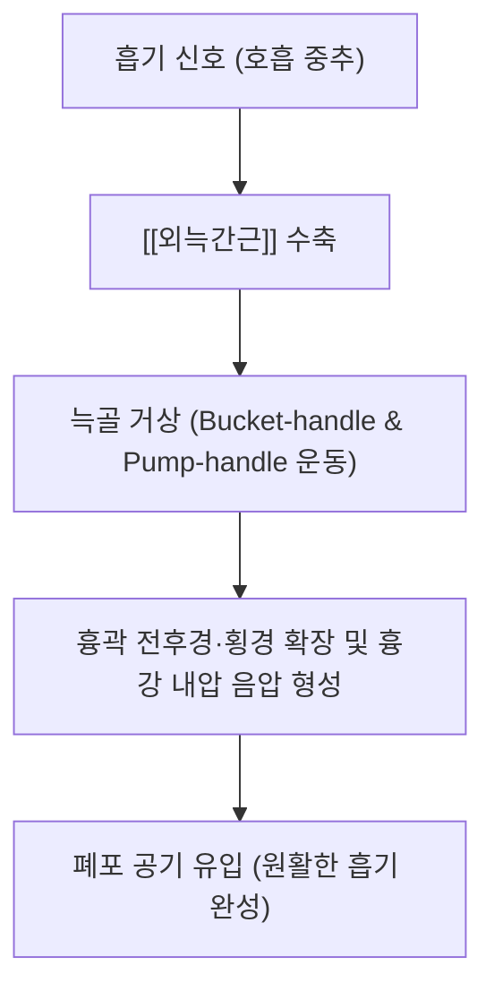

---
aliases:
  - 외늑간근
  - 바깥갈비사이근
  - External intercostal muscle
tags:
  - 근육
  - 흉부
  - 호흡근
  - 흡기
---
# 🫁 [[외늑간근]] (External Intercostal Muscle, 바깥갈비사이근)

> **핵심 요약 (Key Summary)기시 (Origin)** | 제1~11번 늑골의 하연 (외측순) |
| **정지 (Insertion)** | 바로 아래 늑골의 상연 (외측순) |
| **섬유 주행 방향** | 후상방에서 전하방으로 비스듬히 주행 ("손을 바지 주머니에 넣는 방향") |
| **해부학적 범위** | 후방 늑골결절에서 시작하여 전방 늑연골 접합부까지 존재 (흉골 부위는 외늑간막으로 지속) |
| **지배 신경** |  |
| **혈관 공급** | 후늑간동맥(대동맥 분지), 전늑간동맥(내흉동맥 분지) |

---

## 2. 생체역학·토크 분석 & 호흡 역학

* **흡기 메커니즘 (양동이 & 펌프 손잡이 운동)**:
  * **버킷 핸들 운동(Bucket-handle movement)**: 하위 늑골(제7~10늑골)을 외측 상방으로 들어 올려 흉곽의 좌우 폭(횡경)을 확장.
  * **펌프 핸들 운동(Pump-handle movement)**: 상위 늑골(제1~6늑골)을 전상방으로 당겨 흉골을 밀어 올림으로써 전후경을 확장.
* **흉벽 강성 유지**:
  * [[횡격막]]이 수축하여 하강할 때 발생하는 흉강 내 강한 음압에 의해 흉벽이 안쪽으로 빨려 들어가지 않도록 늑간 공간의 팽팽한 장력을 유지.

---

## 3. 근막통증증후군(TP) & 연관통 패턴

* **통증유발점(TP) 위치**:
  * 늑골 사이 공간(늑간극)의 중간 액와선 및 전액와선 주위 근섬유에 호발.
* **연관통 및 증상 양상**:
  * 해당 늑간을 따라 앞가슴이나 측흉부로 찌르는 듯하거나 결리는 통증 방사.
  * 깊은 숨을 들이쉬거나(흡기 시), 재채기·기침·체간 회전 시 통증이 현저히 악화.
  * 가슴 통증으로 인해 협심증, 늑골 골절, 흉막염으로 오인되기 쉬움.

---

## 4. 초음파 해부학 및 침치료 안전 마진 (기흉 주의)

* **초음파 단면 소견**:
  * 표재부터 피부 $\rightarrow$ 피하지방 $\rightarrow$ 대흉근/전거근 $\rightarrow$  $\rightarrow$ [[내늑간근]] $\rightarrow$ 최심늑간근 $\rightarrow$ 늑막(Pleural line, 고에코 활주선) 순으로 확인.
* **신경혈관속(VAN)과의 관계**:
  * 늑골 하연의 늑골구(Costal groove)를 따라 정맥-동맥-신경(VAN)이 내늑간근과 최심늑간근 사이를 주행하므로 늑골 하연 직하부는 침치료 시 피해야 함.
* **안전 자침 원칙 (기흉 예방)**:
  * **절대 직자 금지**: 흉벽에 수직으로 깊게 찌르면 벽측 흉막을 뚫어 기흉(Pneumothorax) 위험.
  * **늑골 상연 안착 사자법**: 아래쪽 늑골의 **상연 골막을 향해 15~30° 각도로 눕혀 비스듬히 자입**하여 골면에 닿게 함으로써 기흉을 100% 차단.

---

## 5. 관련 임상 질환 및 감별 진단

* **임상 질환**:
  * [[늑간신경통]](Intercostal neuralgia), 늑간근 염좌, 기능성 과호흡 증후군, 거북목/흉추 후만으로 인한 흉곽 가동성 제한.
* **감별 진단**:
  * **대상포진 초기**: 피부 발진 이전 늑간 신경 분절성 작열통(수포 발생 여부 추적 관찰 필수).
  * **늑골 골절**: 수상력, 국소 타진통 및 골재채기 검사(Squeeze test) 양성.
  * **심인성/폐인성 흉통**: 노작성 흉통, 호흡곤란 동반 여부 감별.

---

## 6. 추나·도수치료 & 침구 치료 프로토콜

* **추나 및 관절 가동 기법**:
  * **늑골 가동화 추나(Rib Mobilization)**: 호기 시 늑골 하강을 보조하고, 흡기 시 늑골의 외측 거상을 유도하는 리듬적 가동화.
  * **흉곽 확장 호흡 재교육**: 얕은 쇄골/경부 호흡 패턴을 교정하고 늑간근과 횡격막의 3차원 입체 팽창 훈련.
* **침구 및 약침 치료**:
  * 늑간극 긴장 부위에 호침 사자 및 [[오공약침]] 또는 [[중성어혈약침]]을 0.1~0.2ml씩 소량 분할 주입하여 신경 포착 및 근막 유착 박리.

---

## 7. 출처 및 학술 참고 문헌 (References)
* Standring S. *Gray's Anatomy: The Anatomical Basis of Clinical Practice*. 42nd ed. Elsevier, 2020: 950-953.
  * `[연구 요약]`: 외늑간근의 정밀 층판 해부학, 지배 신경 주행 및 흡기 시 늑골 거상 생체역학 분석.
* De Troyer A, et al. Mechanics of intercostal muscles. *Physiol Rev*. 2005;85(2):717-756.
  * `[연구 요약]`: 흡기 및 호기 시 외늑간근과 내늑간근의 기계적 토크와 호흡근 협응 생리학적 규명.
