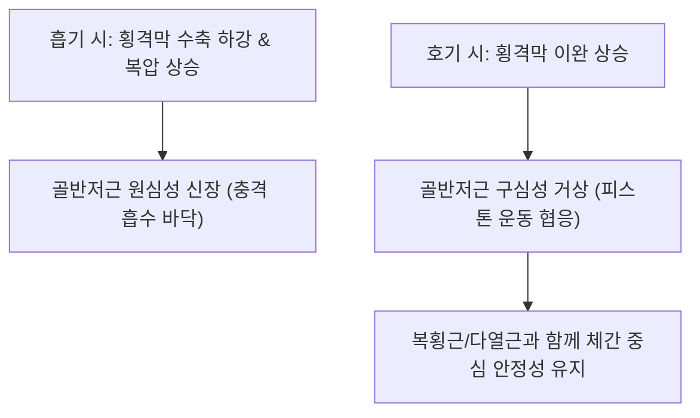

# [[골반저근]](Pelvic Floor Muscles)

> **핵심 요약 (Key Summary)**:
> [[항문거근]](치골직장근, 치골미골근, 장골미골근)과 미골근으로 구성되어 골반강 하부를 깔때기 모양으로 폐쇄하는 근육판.
> 골반 장기 지지, 요도·직장 개폐 자제, 복강 내압(IAP) 형성 기저벽 역할을 주동하며 [[음부신경]](S2-S4)의 지배를 받음.
> 요실금, 자궁하수, 만성 골반통증 증후군, 미골통을 유발하며 회음혈 배혈, 케겔 운동 및 코어 실린더 재활의 핵심 타깃임.

---
## 📌 목차
1. [해부학적 정밀 구조 및 지배 신경/혈관](#1-해부학적-정밀-구조-및-지배-신경혈관)
2. [생체역학·토크 분석 & 근막 사슬 (Biomechanical Synergy)](#2-생체역학토크-분석--근막-사슬-biomechanical-synergy)
3. [근막통증증후군(TP) & 연관통 패턴 (Travell & Simons)](#3-근막통증증후군tp--연관통-패턴-travell--simons)
4. [초음파 해부학(Sonoanatomy) 및 중재 시술 랜드마크](#4-초음파-해부학sonoanatomy-및-중재-시술-랜드마크)
5. [⭐ 원장님 심층 임상 고찰 및 원본 필기 (Clinical Pearls)](#5-원장님-심층-임상-고찰-및-원본-필기-clinical-pearls)
6. [관련 임상 질환 및 운동손상 증후군 총괄](#6-관련-임상-질환-및-운동손상-증후군-총괄)
7. [추나·도수치료(MET/PIR) & 침구·약침·재활 프로토콜](#7-추나도수치료metpir--침구약침재활-프로토콜)
8. [출처 및 학술 참고 문헌 (References)](#8-출처-및-학술-참고-문헌-references)

---
## 1. 해부학적 정밀 구조 및 지배 신경/혈관

| 근육군 | 구성 근육 | 부착부 (기시 → 정지) | 주요 기능 |
| :--- | :--- | :--- | :--- |
| [[항문거근]] (Levator Ani) | [[치골직장근]], [[치골미골근]], [[장골미골근]] | 치골 후면, 내폐쇄근막 건궁 → 회음 중심건, 항문미골체, 미골 | 골반 장기 거상, 대변/소변 자제 |
| **미골근** (Coccygeus) | 좌골극(Ischial spine) | 천골 하연 및 [[미골]] 외측연 | 골반저 후방 지지, 미골 고정 |

### 🔬 해부학 도해 및 단면도
![[Pelvic_floor_anatomy.png|450]]
> [해부학 도해]: 치골에서 미골까지 골반강 바닥을 깔때기 모양으로 덮고 있는 골반저근의 상면 및 하면 구조.

---
## 2. 생체역학·토크 분석 & 근막 사슬 (Biomechanical Synergy)

* **이너 코어 실린더의 바닥 (Base of the Cylinder)**:
  * 횡격막(천장), 복횡근(벽), 다열근(후벽)과 함께 복강 내압(IAP)을 완벽히 밀폐하는 하부 지지 기반.
* **복압 상승 시 반사적 동시 수축**: 재채기, 줄넘기, 무거운 물건 들기 시 요도와 항문을 닫으며 상방으로 거상하여 누수 차단.
* **근막 사슬 연계 (Anatomy Trains)**: 심부전방선(Deep Front Line)의 최하단 골반 플랫폼으로 내전근막(폐쇄근) 및 천골결절인대와 연속.

---
## 3. 근막통증증후군(TP) & 연관통 패턴 (Travell & Simons)

* **골반저근 과긴장 발통점**:
  * 회음부, 항문 주변, 미골 부위의 타는 듯한 뻐근한 통증.
  * 꼬리뼈가 닿아 의자에 오래 앉지 못함(미골통 Coccygodynia).
* **배뇨 및 배변 장애**:
  * 소변을 봐도 시원하지 않은 잔뇨감, 성교통(Dyspareunia), 배변 시 항문 경련.

---

![[Pelvic_floor_TriggerPoints.jpg|450]]
> [골반저근 발통점]: 회음부, 항문 주위, 꼬리뼈 및 천골 하부로 투사되는 Travell & Simons 연관통 패턴.

---
## 4. 초음파 해부학(Sonoanatomy) 및 중재 시술 랜드마크

* **경복부/경회음 초음파 스캔**:
  * 치골결합 상방에서 방광저(Bladder base) 관찰.
  * 골반저근 수축 시 방광저가 두개측(Cranial)으로 정상적으로 거상되는지 동적 평가.
* **자침 안전 마진**: 회음부 및 둔부 내측 자침 시 음부신경혈관속(Pudendal neurovascular bundle) 손상 주의.

---
## 5. ⭐ 원장님 심층 임상 고찰 및 원본 필기 (Clinical Pearls)

* **복압과 골반저근 불균형 (원장님 필기 100% 보존)**:
  * 출산 후, 복부 비만, 만성 기침 환자에서 골반저근이 늘어나며 장기 하수 및 요실금 호발.
  * 복직근, 내복사근, 요방형근 등 코어 근육군과 유기적으로 협응하여 치료해야 함.
* **이완성 약화 vs 과긴장성 단축 감별**:
  * 골반저근 질환은 단순 약화(요실금, 탈출증)뿐 아니라 과긴장(만성 골반통, 미골통, 성교통) 환자도 매우 많음.
  * 과긴장 환자에게 무리한 케겔 운동을 시키면 골반통이 악화되므로, 먼저 근막 이완과 심호흡을 처방해야 함.
* **회음혈(CV1) 및 장강혈(GV1) 침구의 자율신경 조절**:
  * 회음혈과 장강혈은 부교감신경(S2-S4 골반내장신경)을 강력하게 자극하여 방광 및 장 평활근의 연동운동과 괄약근 긴장도를 정상화함.

---
## 6. 관련 임상 질환 및 운동손상 증후군 총괄

| 임상 질환 / 증후군 | 병리적 연관 기전 | 주요 증상 및 이학적 검사 | 핵심 교정 타깃 |
| :--- | :--- | :--- | :--- |
| 복압성 [[요실금]] | 골반저근 약화로 요도 지지력 상실 | 기침, 달리기 시 소변 누수 | 골반저근 케겔 재활, 복횡근 협응 |
| 만성 골반통증 증후군 (CPPS) | 골반저근 만성 과긴장 및 TrP | 회음부 통증, 배뇨통, 비세균성 전립선염 증상 | 골반저근 내측 이완 도수, 온열요법 |
| [[미골통]](Coccygodynia) | 항문거근/미골근 편측 연축 견인 | 앉을 때 꼬리뼈 격통, 기립 시 통증 | 미골근 약침, 미골 교정 추나 |
| 자궁하수 / 골반탈출증(POP) | 항문거근 열공 확장 및 근막 파열 | 밑이 빠지는 듯한 묵직함, 보행 불편 | 골반저근 강화, 코어 호흡 훈련 |

---
## 7. 추나·도수치료(MET/PIR) & 침구·약침·재활 프로토콜

* **한의학 경혈 매핑 및 침구 프로토콜**:
  * 회음(CV1), 장강(GV1), 차료(BL32), 중료(BL33), 백회(GV20, 기함증 제고).
  * 0.25×40mm 호침으로 차료·중료혈에서 천골공을 향해 심부 사자하여 천골신경 자극.
* **추나 및 골반 교정**:
  * 천골(Sacrum)의 비틀림(Torsion)과 장골 회전 변위를 바로잡아 골반저근의 좌우 대칭 장력 회복.
* **케겔 운동 (Kegel Exercise) & 골반저 호흡**:
  * 날숨 시 회음부를 부드럽게 위로 당겨 올리고(5초 유지), 들숨 시 완전히 이완하는 횡격막-골반저 커플링 훈련.

---
## 8. 출처 및 학술 참고 문헌 (References)

1. **Bo, K.** (2004). Pelvic floor muscle training is effective in treatment of female stress urinary incontinence, but how does it work? *International Urogynecology Journal*, 15(2), 76-84.
   - `[연구 요약]`: 골반저근 훈련의 요실금 치료 기전 및 구조적 거상 효과 분석.
2. **Travell, J. G., & Simons, D. G.** (1999). *Myofascial Pain and Dysfunction*. Williams & Wilkins.
   - `[연구 요약]`: 골반저근 발통점과 미골통, 만성 골반통증 증후군의 연관통 패턴 규명.
3. **Standring, S.** (2020). *Gray's Anatomy* (42nd ed.). Elsevier.
   - `[연구 요약]`: 항문거근과 미골근의 정밀 해부학 및 음부신경 주행 경로 연구.
