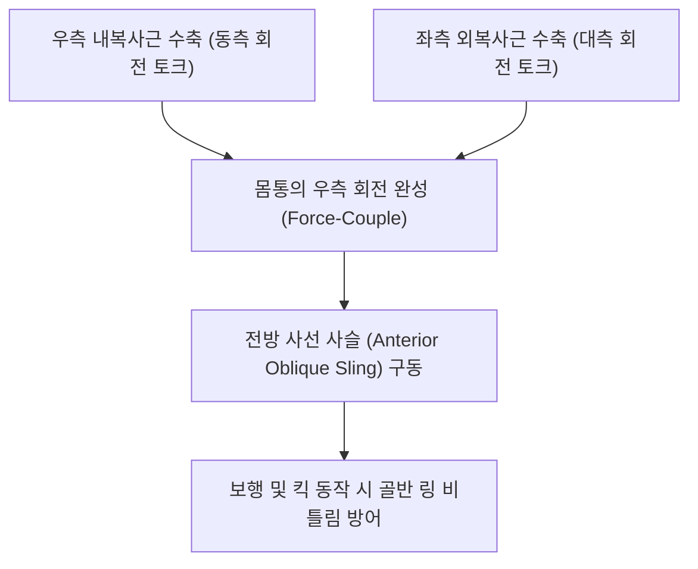

# [[내복사근]](Internal Oblique)

> **핵심 요약 (Key Summary)**:
> [[서혜인대]] 외측부, [[장골능]], [[흉요근막]]에서 기시하여 하부 제10~12[[늑골]]과 [[백선]], [[치골]]에 정지하는 복벽 중간층 사선 근육.
> 체간 동측(같은 쪽) 회전, 동측 측굴, 복압 상승 및 서혜관 천장 형성을 주동하며 하부 [[갈비사이신경]](T7-T12)과 [[장골하복신경]](L1)의 지배를 받음.
> 회전 시 서혜부 통증, 스포츠 탈장, 요추 회전 제어 실패를 유발하며 결합건 약침 및 대맥혈 자침의 핵심 타깃임.

---
## 📌 목차
1. [해부학적 정밀 구조 및 지배 신경/혈관](#1-해부학적-정밀-구조-및-지배-신경혈관)
2. [생체역학·토크 분석 & 근막 사슬 (Biomechanical Synergy)](#2-생체역학토크-분석--근막-사슬-biomechanical-synergy)
3. [근막통증증후군(TP) & 연관통 패턴 (Travell & Simons)](#3-근막통증증후군tp--연관통-패턴-travell--simons)
4. [초음파 해부학(Sonoanatomy) 및 중재 시술 랜드마크](#4-초음파-해부학sonoanatomy-및-중재-시술-랜드마크)
5. [⭐ 원장님 심층 임상 고찰 및 원본 필기 (Clinical Pearls)](#5-원장님-심층-임상-고찰-및-원본-필기-clinical-pearls)
6. [관련 임상 질환 및 운동손상 증후군 총괄](#6-관련-임상-질환-및-운동손상-증후군-총괄)
7. [추나·도수치료(MET/PIR) & 침구·약침·재활 프로토콜](#7-추나도수치료metpir--침구약침재활-프로토콜)
8. [출처 및 학술 참고 문헌 (References)](#8-출처-및-학술-참고-문헌-references)

---
## 1. 해부학적 정밀 구조 및 지배 신경/혈관

| 항목 | 상세 내용 |
| :--- | :--- |
| **기시 (Origin)** | [[서혜인대]](Inguinal ligament) 외측 2/3, [[장골능]] 전방 2/3, [[흉요근막]](TLF) 중간층 |
| **정지 (Insertion)** | 하부 제10~12[[늑골]](Ribs) 하연, [[백선]](Linea alba), [[치골]] 능선 (결합건 Conjoint tendon 형성) |
| **신경 지배** | 제7~12 [[갈비사이신경]](Intercostal nn., T7-T12), [[장골하복신경]](Iliohypogastric n., L1), [[장골서혜신경]](Ilioinguinal n., L1) |
| **혈관 공급** | 하복벽동맥, 심재장골회선동맥, 하부 늑간동맥 |

### 🔬 해부학 도해 및 단면도
![[Internal_oblique_anatomy.png|450]]
> [해부학 도해]: 외복사근 심층에서 직교하는 부채꼴 상방 주행을 보이며 늑골 하연과 백선으로 집중되는 내복사근.

![[Pasted image 20240117004423.png|450]]
> [구조적 특징]: 서혜관의 지붕을 형성하며 복횡근 건막과 함께 치골 결합건을 완성하는 해부학적 관계.

---
## 2. 생체역학·토크 분석 & 근막 사슬 (Biomechanical Synergy)

* **체간 동측 회전 주동**: 우측 내복사근 수축 시 우측 골반을 지지대로 삼아 흉곽을 **우측(같은 쪽)**으로 회전시킴.
* **복벽 격자 시스템 (Lattice System)**: 표층 외복사근과 90도로 교차하여 그물망을 형성, 복벽의 인장 강도를 배가시키고 복부 탈장 방어.
* **서혜부 밸브 기능**: 복압 상승 시 내복사근 하부 섬유가 아래로 내려앉으며 서혜관 천장을 닫아 복강 내 장기의 탈출을 물리적으로 차단.

---
## 3. 근막통증증후군(TP) & 연관통 패턴 (Travell & Simons)

* **하부 서혜부 TrP**:
  * 서혜관 및 음낭, 고환, 대퇴 내측 상부로 찌르는 듯한 날카로운 통증 방사.
  * 고환 거근(Cremaster muscle) 연축을 유발하여 고환이 위로 딸려 올라가며 당기는 통증.
* **상부 늑골 TrP**:
  * 제10~12늑골 하연을 따라 결리는 통증 및 호흡 시 늑간통 모사.

---

![[Abdominal_obliques_TriggerPoints.jpg|450]]
> [내복사근 발통점]: 서혜관 심부 및 고환 거근 연축을 유발하는 Travell & Simons 연관통 패턴.

---
## 4. 초음파 해부학(Sonoanatomy) 및 중재 시술 랜드마크

* **초음파 단축 뷰**:
  * 측복벽 3층 구조 중 중간층에 위치하며, 외복사근보다 근복이 두껍고 선명한 저에코 패턴 관찰.
  * 내복사근과 복횡근 사이의 근막면(TAP plane)을 주행하는 장골하복신경 및 장골서혜신경 확인.
* **자침 안전 마진**: 장골능 바로 상방에서 수직 자입 시 복막강 진입 위험이 있으므로 항상 층판을 확인하며 평행 사자.

---
## 5. ⭐ 원장님 심층 임상 고찰 및 원본 필기 (Clinical Pearls)

* **회전 토크의 짝힘 원리와 내복사근 (원장님 필기 100% 보존)**:
  * 몸통을 오른쪽으로 돌릴 때는 우측 내복사근과 좌측 외복사근이 한 쌍(Force-Couple)으로 작동함.
  * 만약 우측 내복사근이 약화되면 좌측 외복사근만 과도하게 당겨져 흉곽이 비틀리고 요추에 회전 전단력이 집중됨.
* **스포츠 탈장(Sports Hernia / Athletic Pubalgia)의 주범**:
  * 축구, 하키 선수들에게 다발하는 서혜부 만성 통증의 핵심은 내복사근의 결합건(Conjoint tendon) 부착부 미세 파열임.
  * 치골결절 주변 결합건 부착부에 봉약침이나 소염약침 치료 시 탁월한 호전.
* **장골서혜신경 포착과 사타구니 저림**:
  * 장골능 전방 2~3cm 안쪽에서 내복사근을 뚫고 나오는 장골서혜신경이 근육 경직으로 포착되면 사타구니와 음낭 피부 감각 저하 및 화끈거림 발생.

---
## 6. 관련 임상 질환 및 운동손상 증후군 총괄

| 임상 질환 / 증후군 | 병리적 연관 기전 | 주요 증상 및 이학적 검사 | 핵심 교정 타깃 |
| :--- | :--- | :--- | :--- |
| [[스포츠 탈장]](Athletic Pubalgia) | 결합건 부착부 과긴장 및 미세 손상 | 서혜부 심부 찌릿한 통증, 기침 시 악화 | 치골 부착부 약침, 내전근 이완 |
| [[장골서혜신경 포착]] | 내복사근 근막 비후로 신경 압박 | 서혜부 내측 및 음낭 감각 이상/저림 | ASIS 내측 신경 통로 침도 박리 |
| 체간 회전 비대칭 | 편측 내복사근 단축 | 좌우 회전 가동범위 불균형, 골반 비틀림 | 단축 측 내복사근 PIR, 흉곽 가동 추나 |
| 서혜부 탈장 (Hernia) | 내복사근 하부 섬유 지지력 상실 | 서혜부 덩어리 돌출, 복압 상승 시 통증 | 외과적 평가 및 복벽 심부 코어 강화 |

---
## 7. 추나·도수치료(MET/PIR) & 침구·약침·재활 프로토콜

* **한의학 경혈 매핑 및 침구 프로토콜**:
  * 담경 대맥(GB26), 오추(GB27), 간경 장문(LR13), 비경 복결(SP14).
  * 결합건 포인트: 치골결절 상외측 1cm 지점에서 치골 뼈면을 향해 45도 각도로 침도 및 소염약침 주입.
* **근에너지기법 (MET/PIR)**:
  * 좌위 체간 동측 회전 저항 운동(등척성 수축) 7초 유지 후, 호기와 함께 반대측 회전 스트레칭.
* **재활 훈련 (Bird-Dog with Diagonal Reach)**:
  * 대각선 사선 슬링을 강화하는 대각선 팔다리 신전 훈련.

---
## 8. 출처 및 학술 참고 문헌 (References)

1. **Meyers, C. A., et al.** (2000). Understanding sports hernia (athletic pubalgia): the anatomic and biomechanical basis. *Operative Techniques in Sports Medicine*, 8(3), 208-213.
   - `[연구 요약]`: 내복사근 결합건 손상과 스포츠 탈장의 해부생체역학적 기전 규명.
2. **Travell, J. G., & Simons, D. G.** (1999). *Myofascial Pain and Dysfunction: The Trigger Point Manual*. Williams & Wilkins.
   - `[연구 요약]`: 내복사근 발통점과 고환/음낭 및 서혜부 방사통 패턴 분석.
3. **Standring, S.** (2020). *Gray's Anatomy* (42nd ed.). Elsevier.
   - `[연구 요약]`: 내복사근의 층판 구조, 결합건 및 장골하복·장골서혜신경 주행 경로 정밀 해부.
